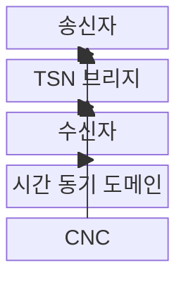
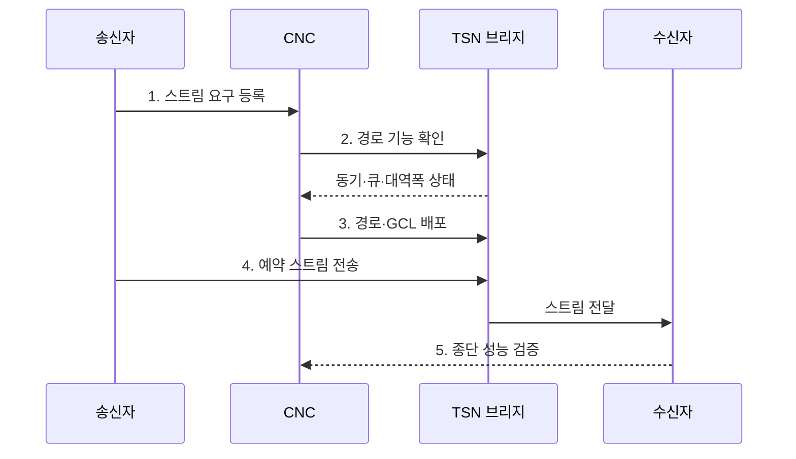

---
sidebar:
  order: 83
  label: "083. 시간 민감 네트워킹 (Time-Sensitive Networking, TSN)"
  badge:
    text: "미출제 · 50%"
    variant: note
title: "시간 민감 네트워킹 (Time-Sensitive Networking, TSN)"
date: "2026-07-31T11:04:03+09:00"
tags: ["notes-network"]
weight: 83
extra:
  question_no: "083"
  source_status: "미출제"
  source_history: ""
  priority: 50
  priority_note: "설계형: 결정론 산업 Ethernet 현재 핵심"
---

## Ⅰ. 개요

핵심 용어

- **TSN**: IEEE 802 이더넷에 시간 동기·트래픽 조정·신뢰성 기능을 적용해 지연 상한을 보장하는 결정형 네트워크 표준군이다.

- 정의/개념: IEEE 802 이더넷에 **시간 동기·트래픽 조정·신뢰성**을 적용해 지연 상한을 보장하는 **결정형 네트워크 표준군**
- 배경/필요성: 최선형 이더넷은 혼잡 시 **제어 트래픽 지연 상한 보장 불가**

#### 한줄 요약

- 중요한 제어 메시지가 일반 데이터에 밀리지 않도록 스위치들이 같은 시계와 시간표로 전송 순서를 지킨다.

## Ⅱ. 특징

핵심 용어

- **결정형 네트워크**: 정해진 조건에서 패킷의 최악 도착 시간을 계산하고 제한할 수 있는 네트워크이다.
- **IEEE 802.1AS**: TSN 참여 장비의 시각과 주파수를 공통 기준에 맞추는 시간 동기 표준이다.

- **지연 상한**: 예약 조건으로 최악 도착 시간 계산
- **트래픽 통합**: 실시간·일반 흐름을 표준 이더넷에 수용
- **IEEE 802.1AS**: 공통 시각으로 GCL 실행 정렬
- **CNC**: 스트림 요구와 토폴로지로 경로·GCL 계산

#### 한줄 요약

- 한 장비만 시간을 지켜서는 부족하고 송신자부터 모든 스위치와 수신자까지 같은 규칙을 실행해야 한다.

## Ⅲ. 구조 및 구성요소

핵심 용어

- **스트림**: 송신자에서 수신자까지 동일한 주기·지연·손실 요구로 전달되는 연속 프레임 흐름이다.
- **CNC**: 스트림 요구와 토폴로지로 경로·대역폭·게이트 시간표를 계산하는 중앙 구성 기능이다.

| 구성요소 | 책임 |
|:---|:---|
| 송신자 | 주기·크기 요구에 맞춘 스트림 생성 |
| TSN 브리지 | 큐·게이트·선점으로 전송 통제 |
| 수신자 | 스트림 수신과 지연·손실 확인 |
| 시간 동기 도메인 | 모든 장비에 공통 시각 제공 |
| CNC | 경로·대역폭·GCL 계산·배포 |

#### 한줄 요약

- CNC가 계산한 시간표를 공통 시계에 맞춘 브리지들이 실행해 스트림을 약속된 시간 안에 전달한다.

## Ⅳ. 흐름도

핵심 용어

- **GCL**: 큐별 전송 게이트를 열고 닫는 시각을 정의한 주기 시간표이다.
- **수용 제어**: 새 스트림을 추가해도 기존 스트림의 지연·대역 요구를 지킬 수 있는지 판정하는 기능이다.

1. **스트림 요구 등록**: 주기·크기·지연·손실 한계 전달
2. **경로 기능 확인**: 장비별 동기·조정·선점 지원 검사
3. **경로·GCL 배포**: 대역폭과 게이트 시각을 일괄 설정
4. **예약 스트림 전송**: 공통 시각과 큐 정책으로 전달
5. **종단 성능 검증**: 혼잡·장애 조건의 지연 상한 확인

#### 한줄 요약

- 메시지의 주기와 마감시간을 등록하면 CNC가 경로의 전송 시간을 정하고 최악 조건에서도 지키는지 확인한다.

## Ⅴ. 종류 및 비교

핵심 용어

- **TAS·ATS**: TAS는 공통 시간표로 큐 게이트를 제어하고 ATS는 시간 동기 없이 흐름별 전송률을 조정한다.
- **프레임 선점**: 긴 일반 프레임을 일시 중단하고 긴급 프레임을 먼저 전송해 차단 시간을 줄이는 기능이다.

| TSN 트래픽 제어 | 시간 인식 조정 | 비동기 트래픽 조정 | 프레임 선점 |
|:---|:---|:---|:---|
| 적용 기준 | 고정 주기·마감의 **예약 트래픽** | 비주기 **버스트 트래픽** | 긴 프레임의 **차단 시간** 축소 |
| 핵심 특징 | **IEEE 802.1Qbv** **GCL 개폐** | 흐름별 **비동기 전송 조정** | 일반 프레임의 **일시 중단** |
| 한계 | 시계 오차·**스케줄 충돌** | 매개변수별 **지연 누적** | 양단 지원·**분할 오버헤드** |

#### 한줄 요약

- 주기 제어는 시간표, 갑작스러운 밀집은 비동기 조정, 긴 일반 프레임이 막을 때는 선점을 사용한다.

## Ⅵ. 실무 고려사항 및 대책

핵심 용어

- **동기 오차 예산·가드 밴드**: 허용 시계 편차를 경로 장비에 배분하고 예약 게이트 전 보호 시간으로 오정렬을 흡수한다.
- **FRER**: 서로 다른 경로로 프레임을 복제하고 수신부에서 중복을 제거해 재전송 없이 신뢰성을 높이는 기능이다.

| 문제 | 대책 | 효과 |
|:---|:---|:---|
| 시계 편차의 **게이트 오정렬** | 동기 오차 예산과 **가드 밴드** 적용 | 충돌과 **마감 위반 감소** |
| 동시 스트림의 **GCL 충돌** | 종단 스케줄 분석과 **수용 제어** | 최악 지연의 **사전 보장** |
| 경로 장애의 **결정성 상실** | 이중 경로와 **FRER** 적용 | 무재전송 복구와 **저손실** |

#### 한줄 요약

- 공장 로봇 제어는 모든 경로의 시계 오차와 큐 점유를 계산해 전용 게이트가 열리는 시간을 예약한다.

## Ⅶ. 결론

핵심 용어

- **마감시간**: 스트림 프레임이 목적지에 도착해야 하는 최종 시각으로 트래픽 조정 방식 선택의 기준이다.

- 고정 주기·마감은 **TAS**, 비주기 버스트는 **ATS**, 차단 축소는 **선점**

#### 한줄 요약

- 평균 속도보다 최악 지연 원인을 먼저 찾고 시간표·비동기 조정·선점을 필요한 구간에 조합한다.
