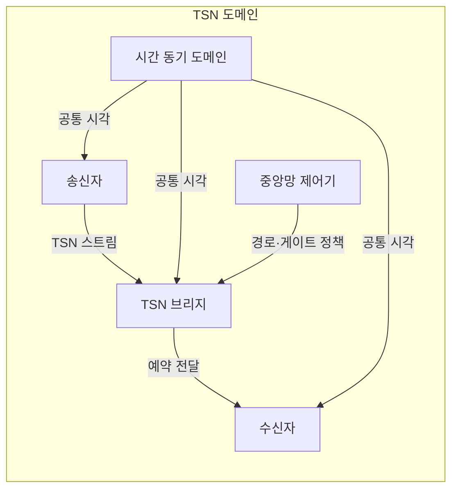
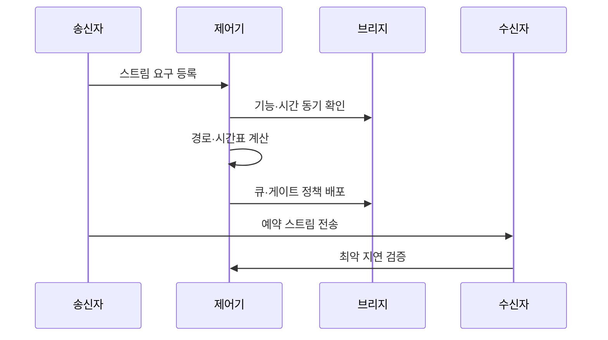

---
sidebar:
  order: 83
  label: "083. 시간 민감 네트워킹 (Time-Sensitive Networking, TSN)"
  badge:
    text: "미출제 · 50%"
    variant: note
title: "시간 민감 네트워킹 (Time-Sensitive Networking, TSN)"
date: "2026-07-25T00:55:00+09:00"
tags: ["notes-network"]
weight: 83
extra:
  question_no: "083"
  source_status: "미출제"
  source_history: ""
  priority: 50
  priority_note: "설계형: 결정론 산업 Ethernet 현재 핵심"
---

## 미리 알고가기

- **시간 민감 네트워킹(Time-Sensitive Networking, TSN)**: 표준 이더넷에 시간 동기, 전송 예약과 신뢰성 기능을 더해 지연 상한을 예측하게 하는 기술군이다.
- **결정형 네트워크**: 정해진 조건에서 패킷이 도착할 최악 시간을 계산하고 제한할 수 있는 네트워크다.
- **스트림(Stream)**: 송신자에서 수신자까지 같은 서비스 요구로 전달되는 연속 프레임 흐름이다.
- **시간 동기**: 모든 참여 장비의 시계를 공통 기준에 맞춰 같은 전송 시간표를 실행하게 하는 기능이다.
- **시간 인식 조정기(Time-Aware Shaper)**: 시간표에 따라 큐의 전송 문을 열고 닫아 중요 스트림의 전송 시간을 예약하는 기능이다.
- **비동기 트래픽 조정**: 전체 시간 동기 없이 스트림별 도착 간격과 우선순위를 조절해 갑작스러운 밀집을 제한하는 기능이다.
- **프레임 선점**: 긴 일반 프레임 전송을 잠시 끊고 긴급 프레임을 먼저 보내 대기 시간을 줄이는 기능이다.
- **중앙 집중형 네트워크 구성(Centralized Network Configuration, CNC)**: 스트림 요구와 망 구조로 경로·대역폭·전송 시간을 계산해 장비에 배포하는 제어 기능이다.
- **약어 읽기와 표기**: TSN·CNC는 티에스엔·씨엔씨로 읽고 영문 핵심 글자를 딴 표기이며, 시간 민감 이더넷 기술군과 중앙 구성 기능을 구분한다.

## Ⅰ. 개요

- 정의/개념: 이더넷 스트림의 최악 지연을 제한
- **배경/필요성**: 제어·일반 트래픽을 한 망에 예측 수용

### 쉽게 이해하기 (학습용)

- 중요한 제어 메시지가 일반 데이터에 밀리지 않도록 모든 스위치가 같은 시계와 시간표로 전송 순서를 지킨다.

## Ⅱ. 특징

- 예약 조건에서 최악 지연 상한을 계산한다.
- 표준 이더넷이 실시간 트래픽을 함께 수용한다.
- 경로 전체의 동기·큐 정책 일치가 필수이다.
- 시계 오차·잘못된 예약이 다수 스트림을 지연시킨다.

### 쉽게 이해하기 (학습용)

- 한 장비만 시간을 지켜서는 부족하고 송신자부터 모든 중간 스위치와 수신자까지 같은 규칙을 실행해야 한다.

## Ⅲ. 아키텍처 및 구성요소

| 설계 요소 | 설명 |
|:---|:---|
| 송신자 | 주기·크기 요구에 맞춰 스트림 생성 |
| TSN 브리지 | 큐·게이트·선점으로 전송 시점 통제 |
| 수신자 | 스트림 수신과 지연·손실 확인 |
| 시간 동기 도메인 | 모든 장비에 공통 시각 제공 |
| 중앙망 제어기 | 경로·대역폭·시간표 계산·배포 |

> 요약: 공통 시각과 경로별 큐 정책으로 전송 예약

### 쉽게 이해하기 (학습용)

- 제어기가 계산한 시간표를 공통 시계에 맞춘 스위치들이 실행해 송신 스트림을 약속된 시간에 수신자에게 보낸다.

## Ⅳ. 원리 및 절차 흐름도

| 절차 | 설명 |
|:---|:---|
| 스트림 요구 등록 | 주기·크기·지연·손실 한계 전달 |
| 기능·시간 동기 확인 | 경로 장비의 지원 기능을 검사 |
| 경로·시간표 계산 | 대역폭과 게이트 시간을 배정 |
| 큐·게이트 정책 배포 | 경로의 모든 브리지에 설정 |
| 예약 스트림 전송 | 공통 시각에 맞춰 프레임 전달 |
| 최악 지연 검증 | 혼잡·장애 조건의 상한을 확인 |

> 요약: 스트림 요구로 경로·시간표를 계산·검증

### 쉽게 이해하기 (학습용)

- 메시지의 주기와 마감시간을 등록하면 제어기가 모든 스위치의 전송 시간을 정하고 가장 나쁜 조건에서도 지키는지 확인한다.

## Ⅴ. 종류 및 비교

| 판단 기준 | 시간 인식 조정 | 비동기 트래픽 조정 | 프레임 선점 |
|:---|:---|:---|:---|
| 핵심 특징 | 공통 시각으로 큐 게이트 예약 | 흐름별 간격·우선순위 조절 | 긴 일반 프레임을 나눠 긴급 전송 |
| 적용 기준 | 주기와 마감시간이 고정 | 비주기 트래픽이 갑자기 밀집 | 긴 프레임이 긴급 전송을 차단 |
| 주요 위험 | 시계 오차·시간표 충돌 | 매개변수 오산·지연 누적 | 양단 미지원·분할 부담 |

> 요약: 주기성·밀집·차단 시간으로 기법 선택

### 쉽게 이해하기 (학습용)

- 주기 제어는 시간표, 갑작스러운 밀집은 간격 조절, 긴 프레임이 길을 막을 때는 프레임 선점을 사용한다.

## Ⅵ. 실무 사례

1. 로봇 제어 스트림에 큐 게이트 시간 예약
2. 차량 영상보다 제동 프레임을 선점 전송

### 쉽게 이해하기 (학습용)

- 공장 로봇의 위치 명령은 모든 스위치에서 같은 시간대의 전용 큐를 열어 마감시간을 지킨다.
- 큰 영상 프레임을 보내는 중 제동 메시지가 오면 영상 전송을 잠시 나누고 제동 프레임을 먼저 보낸다.

## Ⅶ. 결론

- 주기·밀집·차단 시간으로 TSN 기법 조합

### 쉽게 이해하기 (학습용)

- 실시간 망은 평균 속도보다 최악 지연을 만드는 원인을 찾아 시간표와 트래픽 조정, 선점을 필요한 곳에 조합해야 한다.
