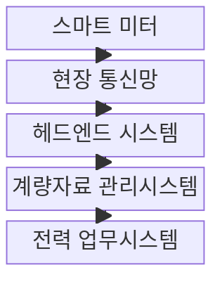
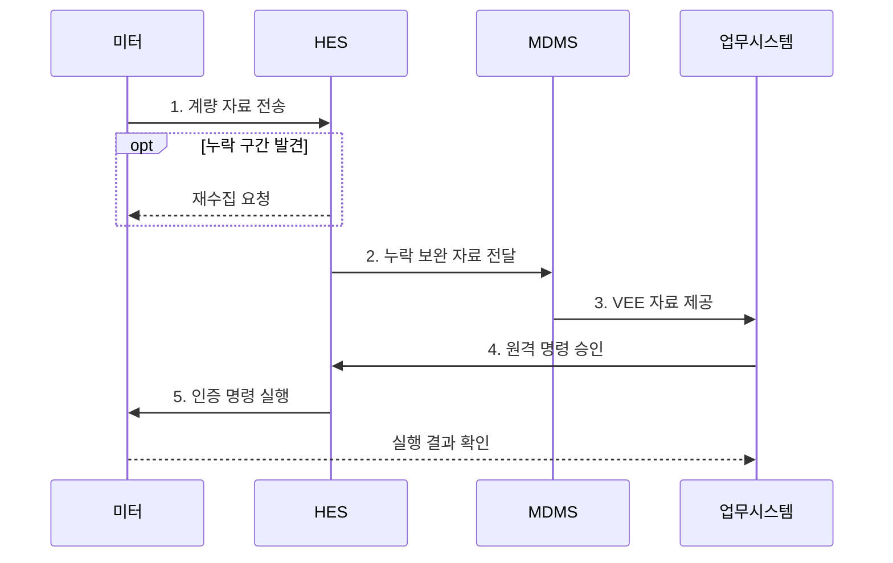

---
sidebar:
  order: 84
  label: "084. 스마트 미터 AMI (Advanced Metering Infrastructure)"
  badge:
    text: "기출 · 30%"
    variant: note
title: "스마트 미터 AMI (Advanced Metering Infrastructure)"
date: "2026-07-31T11:04:31+09:00"
tags: ["notes-network"]
weight: 84
extra:
  question_no: "084"
  source_status: "기출"
  source_history: "126회"
  priority: 30
  priority_note: "보안·설계형: 126회 AMI 구성·PKI 장문"
---

## 미리 알고가기

- **지능형 검침 인프라(Advanced Metering Infrastructure, AMI)**: 스마트 미터와 전력사를 양방향 통신으로 연결해 계량 자료 수집과 원격 명령을 수행하는 체계다.
- **자동 원격 검침(Automated Meter Reading, AMR)**: 현장 방문 없이 사용량을 단방향으로 수집하는 검침 방식이다.
- **스마트 미터**: 시간대별 사용량과 상태 이벤트를 기록하고 인증된 원격 명령을 수행하는 전자 계량기다.
- **헤드엔드 시스템(Head-End System, HES)**: 다수 계량기의 통신 세션, 자료 수집, 재시도와 명령 전달을 관리한다.
- **계량자료 관리시스템(Meter Data Management System, MDMS)**: 수집한 계량값을 장기 저장하고 검증·추정·보정해 업무 시스템에 제공한다.
- **검증·추정·보정(Validation, Estimation and Editing, VEE)**: 이상값을 판별하고 누락값을 정해진 기준으로 추정·수정하는 처리다.
- **공개키 기반구조(Public Key Infrastructure, PKI)**: 인증서와 공개키 암호로 계량기 신원과 통신 상대를 검증하는 체계다.
- **수요반응**: 전력 가격이나 감축 요청에 따라 사용자가 소비 시점이나 사용량을 조정하는 제도다.
- **현장 통신망(Field Area Network)**: 스마트 미터와 HES 사이의 계량 자료·명령을 전달하는 네트워크
- **품질 플래그(Quality Flag)**: 계량값이 원본·추정·보정 중 어떤 상태인지 나타내는 표시
- **인증서 폐기(Certificate Revocation)**: 신뢰할 수 없거나 교체된 미터 인증서를 사용하지 못하게 하는 처리
- **원격 차단(Remote Disconnect)**: 전력사가 인증된 명령으로 미터의 전력 공급을 차단하는 기능
- **이중 승인(Dual Authorization)**: 영향이 큰 명령을 서로 다른 두 승인자가 확인하는 통제

> **키워드:** 스마트 미터 AMI (Advanced Metering Infrastructure)

## Ⅰ. 개요

- 정의/개념: 계량 자료·원격 명령의 **양방향 검침 체계**
- 배경/필요성: 단방향 AMR은 **원격 제어·실행 결과 확인 불가**

### 쉽게 이해하기 (학습용)

- 전력사가 계량기를 찾아가지 않고 사용량을 받아 요금을 계산하며 필요한 경우 인증된 제어 명령도 보낸다.

## Ⅱ. 특징

- **원격 수집**: 주기 계량값·상태 이벤트 자동 전송
- **양방향 제어**: 인증 명령과 실제 실행 결과 확인
- **VEE**: 누락·이상 계량값 검증·추정·보정

### 쉽게 이해하기 (학습용)

- 편리한 원격 검침과 제어가 가능하지만 많은 계량기의 통신과 인증서, 개인 생활 패턴을 함께 보호해야 한다.

## Ⅲ. 구조 및 구성요소

| 구성요소 | 책임 |
|:---|:---|
| 스마트 미터 | 사용량·상태 기록과 명령 실행 |
| 현장 통신망 | 계량기와 전력사 간 자료 전달 |
| 헤드엔드 시스템 | 통신·수집·명령 세션 관리 |
| 계량자료 관리시스템 | 계량값 저장·VEE·업무 제공 |
| 전력 업무시스템 | 요금·정전·수요반응 업무 수행 |

### 쉽게 이해하기 (학습용)

- 스마트 미터의 자료를 헤드엔드가 모으면 계량자료 관리시스템이 이상값을 정리해 요금과 배전 업무에 전달한다.

## Ⅳ. 흐름도

1. **계량 자료 전송**: 시간대별 사용량·상태 이벤트 제공
2. **누락 보완 자료 전달**: 미터 신원·누락 구간 확인과 재수집
3. **VEE 자료 제공**: 이상·누락값 보정 후 품질 표시
4. **원격 명령 승인**: 작업자 권한·대상·정책 확인
5. **인증 명령 실행**: 미터 적용과 실제 결과까지 확정

### 쉽게 이해하기 (학습용)

- 미터 자료는 누락과 이상을 고친 뒤 업무에 쓰고 원격 제어는 장치와 권한을 확인한 후 실행 결과까지 되받는다.

## Ⅴ. 종류 및 비교

| 검침 방식 | AMI | AMR | 현장 검침 |
|:---|:---|:---|:---|
| 적용 기준 | 수요반응·정전·원격 업무 필요 | 자동 요금 검침만 필요 | 통신망 구축이 어려운 소규모 |
| 핵심 특징 | 양방향 수집·원격 제어 | 단방향 자동 사용량 수집 | 현장 수치 확인 |
| 한계 | 사이버 제어·개인정보 노출 | 실시간 제어·상태 확인 불가 | 인력 비용·지연·오입력 |

> 요약: 양방향 업무 범위와 통신 여건으로 선택

### 쉽게 이해하기 (학습용)

- 원격 제어까지 필요하면 AMI, 사용량만 자동 수집하면 AMR, 통신 구축 비용이 더 크면 현장 검침을 고려한다.

## Ⅵ. 실무 고려사항 및 대책

| 고려사항 | 대책 | 효과 |
|:---|:---|:---|
| 누락·이상값의 **과금 오류** | VEE 규칙과 **품질 플래그** 적용 | 요금 자료의 **추적성 확보** |
| 대량 미터의 **인증서 만료** | **PKI** 기반 인증서 갱신·폐기 자동화 | 계량 통신의 **연속성 유지** |
| 원격 차단의 **오대상 실행** | 이중 승인과 **결과 대조** 적용 | 제어 오용과 **복구 시간 감소** |

### 쉽게 이해하기 (학습용)

- 요금 마감 전 누락된 시간대의 사용량을 검증·추정·편집하고 보정 여부를 품질 정보로 남긴 뒤 과금에 반영한다.

## Ⅶ. 결론

- 원격 제어까지는 **AMI**, 자동 사용량만은 **AMR**, 망 구축 곤란은 **현장 검침**

### 쉽게 이해하기 (학습용)

- AMI는 자료 수집 속도만 보지 말고 요금에 쓸 값의 신뢰성과 원격 제어 권한을 서로 다른 통제로 관리해야 한다.
