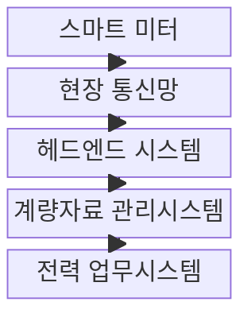
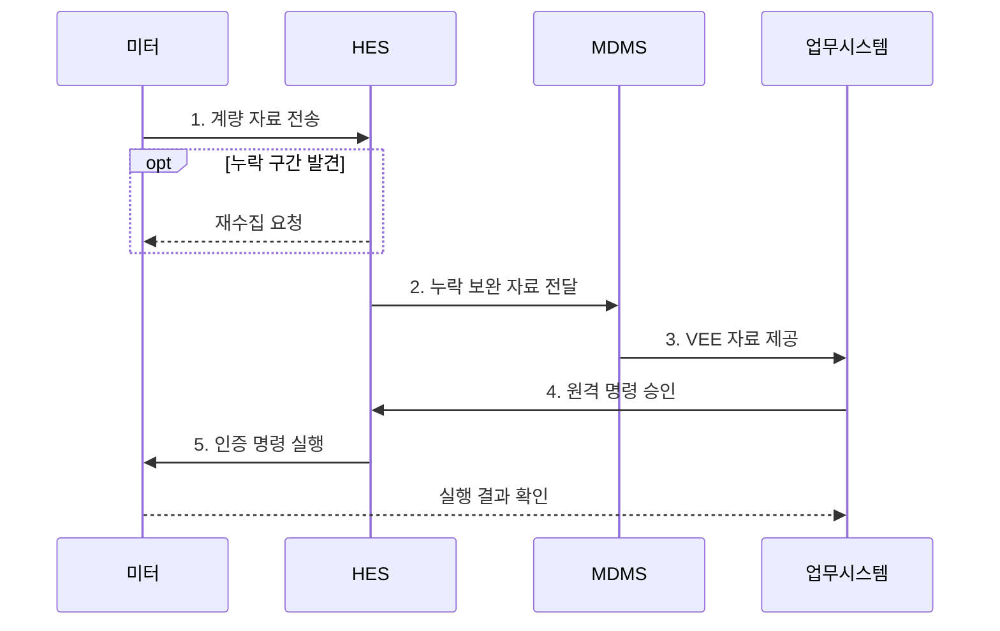

---
sidebar:
  order: 84
  label: "084. 스마트 미터 AMI (Advanced Metering Infrastructure)"
  badge:
    text: "기출 • 30%"
    variant: note
title: "스마트 미터 AMI (Advanced Metering Infrastructure)"
date: "2026-08-03T08:48:47+09:00"
tags: ["notes-network"]
weight: 84
extra:
  question_no: "084"
  source_status: "기출"
  source_history: "126회"
  priority: 30
  priority_note: "보안•설계형: 126회 AMI 구성•PKI 장문"
---

## Ⅰ. 개요

핵심 용어

- **지능형 검침 인프라(Advanced Metering Infrastructure, AMI)**: 스마트 미터와 전력사를 양방향 통신으로 연결해 계량 자료 수집과 원격 명령을 수행하는 검침 인프라이다.
- **자동 원격 검침(Automatic Meter Reading, AMR)**: 사용량을 단방향 통신으로 자동 수집하는 검침 방식이다.

- 정의/개념: 스마트 미터와 전력사를 연결해 **계량 자료 수집•원격 명령** 을 수행하는 **양방향 검침 인프라**
- 배경/필요성: 단방향 AMR은 **원격 제어•실행 결과 확인 불가**

#### 한줄 요약

- 전력사가 계량기를 찾아가지 않고 사용량을 받아 요금을 계산하며 필요한 경우 인증된 제어 명령도 보낸다.

## Ⅱ. 특징

핵심 용어

- **검증•추정•편집(Validation, Estimation and Editing, VEE)**: 이상 계량값을 검증하고 누락값을 정해진 기준으로 추정•보정하는 처리이다.
- **양방향 제어**: 전력사가 인증된 명령을 미터에 보내고 실제 실행 결과까지 되받는 기능이다.
- **지능형 검침 인프라(Advanced Metering Infrastructure, AMI)**: 원격 계량 수집과 양방향 제어를 함께 제공하는 인프라이다.

- **원격 수집**: 주기 계량값•상태 이벤트 자동 전송
- **양방향 제어**: 인증 명령과 실제 실행 결과 확인
- **VEE**: 누락•이상 계량값 검증•추정•보정

#### 한줄 요약

- 편리한 원격 검침과 제어가 가능하지만 많은 계량기의 통신과 인증서, 개인 생활 패턴을 함께 보호해야 한다.

## Ⅲ. 구조 및 구성요소

핵심 용어

- **헤드엔드 시스템(Head-End System, HES)**: 다수 스마트 미터의 통신 세션•자료 수집•재시도•명령 전달을 관리하는 시스템이다.
- **계량 데이터 관리 시스템(Meter Data Management System, MDMS)**: 계량값을 장기 저장하고 VEE를 수행해 전력 업무 시스템에 제공하는 시스템이다.
- **검증•추정•편집(Validation, Estimation and Editing, VEE)**: 이상•누락 계량값을 업무 사용 전에 검증하고 보정하는 처리이다.

| 구성요소 | 책임 |
|:---|:---|
| 스마트 미터 | 사용량•상태 기록과 명령 실행 |
| 현장 통신망 | 계량기와 전력사 간 자료 전달 |
| 헤드엔드 시스템 | 통신•수집•명령 세션 관리 |
| 계량자료 관리시스템 | 계량값 저장•VEE•업무 제공 |
| 전력 업무시스템 | 요금•정전•수요반응 업무 수행 |

#### 한줄 요약

- 스마트 미터의 자료를 헤드엔드가 모으면 계량자료 관리시스템이 이상값을 정리해 요금과 배전 업무에 전달한다.

## Ⅳ. 흐름도

핵심 용어

- **품질 플래그**: 계량값이 원본•추정•보정 중 어떤 상태인지 표시해 과금 자료의 이력을 남기는 정보이다.
- **원격 명령**: 권한 검증을 거쳐 스마트 미터의 설정•공급 상태를 변경하고 결과를 확인하는 제어 요청이다.
- **헤드엔드•계량 데이터 관리 시스템(Head-End System/Meter Data Management System, HES•MDMS)**: 미터 통신•명령과 계량값 저장•VEE를 각각 담당하는 시스템이다.
- **검증•추정•편집(Validation, Estimation and Editing, VEE)**: 계량값의 이상•누락을 보정하고 품질 상태를 표시하는 처리이다.

1. **계량 자료 전송**: 시간대별 사용량•상태 이벤트 제공
2. **누락 보완 자료 전달**: 미터 신원•누락 구간 확인과 재수집
3. **VEE 자료 제공**: 이상•누락값 보정 후 품질 표시
4. **원격 명령 승인**: 작업자 권한•대상•정책 확인
5. **인증 명령 실행**: 미터 적용과 실제 결과까지 확정

#### 한줄 요약

- 미터 자료는 누락과 이상을 고친 뒤 업무에 쓰고 원격 제어는 장치와 권한을 확인한 후 실행 결과까지 되받는다.

## Ⅴ. 종류 및 비교

핵심 용어

- **지능형 검침 인프라•자동 원격 검침(Advanced Metering Infrastructure/Automatic Meter Reading, AMI•AMR)**: AMI는 양방향 수집과 원격 제어를 제공하고 AMR은 사용량을 단방향으로 자동 수집한다.
- **현장 검침**: 통신망 없이 작업자가 계량기를 방문해 사용량을 직접 확인•입력하는 방식이다.

| 검침 방식 | AMI | AMR | 현장 검침 |
|:---|:---|:---|:---|
| 적용 기준 | 수요반응•정전•원격 업무 필요 | 자동 요금 검침만 필요 | 통신망 구축이 어려운 소규모 |
| 핵심 특징 | 양방향 수집•원격 제어 | 단방향 자동 사용량 수집 | 현장 수치 확인 |
| 한계 | 사이버 제어•개인정보 노출 | 실시간 제어•상태 확인 불가 | 인력 비용•지연•오입력 |

> 요약: 양방향 업무 범위와 통신 여건으로 선택

#### 한줄 요약

- 원격 제어까지 필요하면 AMI, 사용량만 자동 수집하면 AMR, 통신 구축 비용이 더 크면 현장 검침을 고려한다.

## Ⅵ. 실무 고려사항 및 대책

핵심 용어

- **공개키 기반구조(Public Key Infrastructure, PKI)**: 인증서와 공개키 암호로 계량기 신원과 통신 상대를 검증하는 체계이다.
- **이중 승인**: 원격 차단처럼 영향이 큰 명령을 서로 다른 두 승인자가 확인해야 실행하는 통제이다.
- **검증•추정•편집(Validation, Estimation and Editing, VEE)**: 과금 전에 계량 자료의 누락•이상을 검증하고 보정하는 처리이다.

| 문제 | 대책 | 효과 |
|:---|:---|:---|
| 누락•이상값의 **과금 오류** | VEE 규칙과 **품질 플래그** 적용 | 요금 자료의 **추적성 확보** |
| 대량 미터의 **인증서 만료** | **PKI** 기반 인증서 갱신•폐기 자동화 | 계량 통신의 **연속성 유지** |
| 원격 차단의 **오대상 실행** | 이중 승인과 **결과 대조** 적용 | 제어 오용과 **복구 시간 감소** |

#### 한줄 요약

- 요금 마감 전 누락된 시간대의 사용량을 검증•추정•편집하고 보정 여부를 품질 정보로 남긴 뒤 과금에 반영한다.

## Ⅶ. 결론

핵심 용어

- **검침 방식 선택(Metering Method Selection)**: 원격 제어 필요성•통신 여건•구축 비용을 비교해 AMI•AMR•현장 검침을 결정하는 과정이다.
- **지능형 검침 인프라•자동 원격 검침(Advanced Metering Infrastructure/Automatic Meter Reading, AMI•AMR)**: 양방향 제어 필요 여부에 따라 선택하는 자동 검침 방식이다.

- 원격 제어까지는 **AMI**, 자동 사용량만은 **AMR**, 망 구축 곤란은 **현장 검침**

#### 한줄 요약

- AMI는 자료 수집 속도만 보지 말고 요금에 쓸 값의 신뢰성과 원격 제어 권한을 서로 다른 통제로 관리해야 한다.
