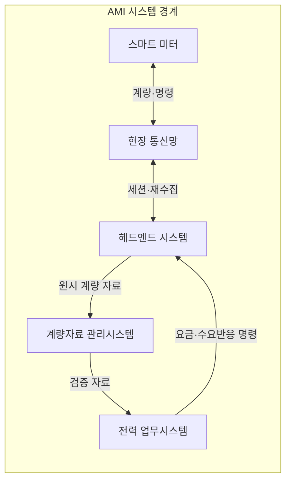
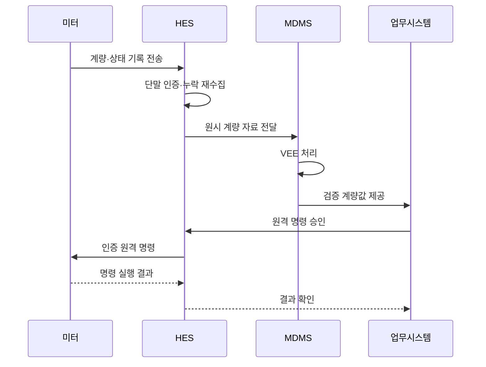

---
sidebar:
  order: 84
  label: "084. 스마트 미터 AMI (Advanced Metering Infrastructure)"
  badge:
    text: "기출 · 30%"
    variant: note
title: "스마트 미터 AMI (Advanced Metering Infrastructure)"
date: "2026-07-25T00:55:00+09:00"
tags: ["notes-network"]
weight: 84
extra:
  question_no: "084"
  source_status: "기출"
  source_history: "126회"
  priority: 30
  priority_note: "보안·설계형: 126회 AMI 구성·PKI 장문"
---

## 미리 알고가기

- **지능형 검침 인프라(Advanced Metering Infrastructure, AMI)**: 스마트 미터와 전력사를 양방향 통신으로 연결해 계량 자료 수집과 원격 명령을 수행하는 체계다.
- **자동 원격 검침(Automated Meter Reading, AMR)**: 현장 방문 없이 사용량을 단방향으로 수집하는 검침 방식이다.
- **스마트 미터**: 시간대별 사용량과 상태 이벤트를 기록하고 인증된 원격 명령을 수행하는 전자 계량기다.
- **헤드엔드 시스템(Head-End System, HES)**: 다수 계량기의 통신 세션, 자료 수집, 재시도와 명령 전달을 관리한다.
- **계량자료 관리시스템(Meter Data Management System, MDMS)**: 수집한 계량값을 장기 저장하고 검증·추정·보정해 업무 시스템에 제공한다.
- **검증·추정·보정(Validation, Estimation and Editing, VEE)**: 이상값을 판별하고 누락값을 정해진 기준으로 추정·수정하는 처리다.
- **공개키 기반구조(Public Key Infrastructure, PKI)**: 인증서와 공개키 암호로 계량기 신원과 통신 상대를 검증하는 체계다.
- **수요반응**: 전력 가격이나 감축 요청에 따라 사용자가 소비 시점이나 사용량을 조정하는 제도다.
- **약어 읽기와 표기**: AMI·AMR·HES·MDMS·VEE·PKI는 에이엠아이·에이엠알·에이치이에스·엠디엠에스·브이이이·피케이아이로 읽고 영문 핵심 글자를 딴 표기이며, 양방향 검침·자동 검침·통신 수집·자료 관리·값 정제·인증 체계를 구분한다.

## Ⅰ. 개요

- **정의/개념**: 계량 자료와 원격 명령의 양방향 전력망
- **배경/필요성**: 시간대별 요금·수요반응·정전 감지 지원

### 쉽게 이해하기 (학습용)

- 전력사가 계량기를 찾아가지 않고 사용량을 받아 요금을 계산하며 필요한 경우 인증된 제어 명령도 보낸다.

## Ⅱ. 특징

- 주기 계량과 상태 이벤트를 원격 수집한다.
- 양방향 통신이 요금 외 배전 업무를 지원한다.
- 대규모 단말이 통신·키 관리 비용을 높인다.
- 세밀한 사용량 자료가 생활 정보를 노출한다.

### 쉽게 이해하기 (학습용)

- 편리한 원격 검침과 제어가 가능하지만 많은 계량기의 통신과 인증서, 개인 생활 패턴을 함께 보호해야 한다.

## Ⅲ. 아키텍처 및 구성요소

| 설계 요소 | 설명 |
|:---|:---|
| 스마트 미터 | 사용량·상태 기록과 명령 실행 |
| 현장 통신망 | 계량기와 전력사 사이 자료 전달 |
| 헤드엔드 시스템 | 통신·인증·수집·명령 세션 관리 |
| 계량자료 관리시스템 | 계량값 저장·VEE·업무 제공 |
| 전력 업무시스템 | 요금·정전·수요반응 업무 수행 |

> 요약: HES가 통신하고 MDMS가 계량값 정제

### 쉽게 이해하기 (학습용)

- 스마트 미터의 자료를 헤드엔드가 모으면 계량자료 관리시스템이 이상값을 정리해 요금과 배전 업무에 전달한다.

## Ⅳ. 원리 및 절차 흐름도

| 절차 | 설명 |
|:---|:---|
| 계량·상태 기록 전송 | 시간대별 사용량과 이벤트 보고 |
| 단말 인증·누락 재수집 | 미터 신원과 수집 완전성 확인 |
| 원시 계량 자료 전달 | 수집값과 품질 정보를 저장 |
| VEE 처리 | 이상·누락값을 검증·추정·보정 |
| 검증 계량값 제공 | 요금·정전·수요반응에 연계 |
| 원격 명령 승인 | 작업자 권한·대상·정책 확인 |
| 인증 원격 명령 | 인증된 미터 세션으로 명령 전달 |
| 명령 실행 결과 | 미터가 실제 적용 상태를 반환 |
| 결과 확인 | 업무시스템이 명령 상태를 확정 |

> 요약: 계량값은 VEE, 원격 명령은 인증·확인

### 쉽게 이해하기 (학습용)

- 미터 자료는 누락과 이상을 고친 뒤 업무에 쓰고 원격 제어는 장치와 권한을 확인한 후 실행 결과까지 되받는다.

## Ⅴ. 종류 및 비교

| 판단 기준 | AMI | AMR | 현장 검침 |
|:---|:---|:---|:---|
| 핵심 특징 | 양방향 수집·원격 제어 | 단방향 자동 사용량 수집 | 검침원이 현장에서 수치 확인 |
| 적용 기준 | 수요반응·정전·원격 업무 필요 | 자동 요금 검침만 필요 | 통신망 구축이 어려운 소규모 |
| 주요 위험 | 사이버 제어·개인정보 노출 | 실시간 제어·상태 확인 불가 | 인력 비용·검침 지연·오입력 |

> 요약: 양방향 업무 범위와 통신 여건으로 선택

### 쉽게 이해하기 (학습용)

- 원격 제어까지 필요하면 AMI, 사용량만 자동 수집하면 AMR, 통신 구축 비용이 더 크면 현장 검침을 고려한다.

## Ⅵ. 실무 사례

1. 누락 계량값을 VEE 후 요금 마감에 반영
2. 원격 차단 명령에 이중 승인·결과 확인

### 쉽게 이해하기 (학습용)

- 요금 마감 전 비어 있는 시간대 사용량은 정해진 추정 규칙으로 보정하고 그 사실을 품질 정보로 남긴다.
- 전력 차단은 한 사람의 실수로 실행되지 않게 두 번 승인하고 실제 미터 상태가 바뀌었는지 확인한다.

## Ⅶ. 결론

- 계량값 VEE·명령 인증으로 AMI 업무 통제

### 쉽게 이해하기 (학습용)

- AMI는 자료 수집 속도만 보지 말고 요금에 쓸 값의 신뢰성과 원격 제어 권한을 서로 다른 통제로 관리해야 한다.
