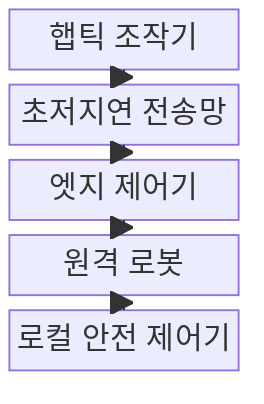
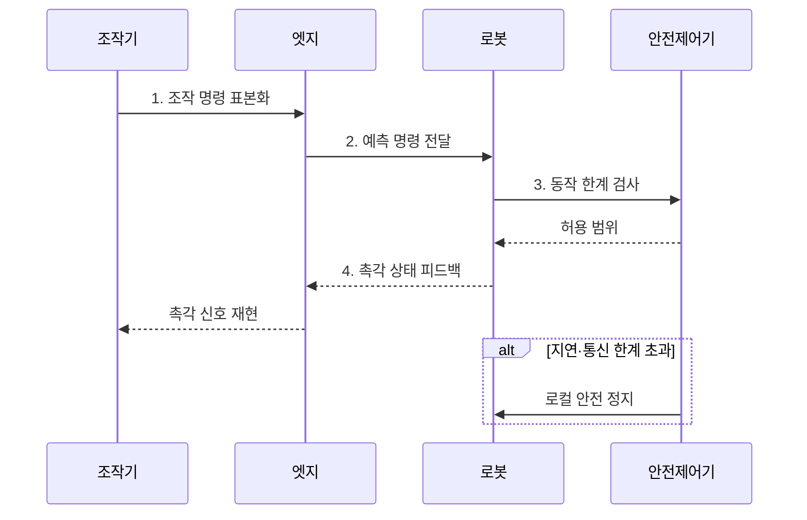

---
sidebar:
  order: 85
  label: "085. 촉각 인터넷 (Tactile Internet)"
  badge:
    text: "기출 · 30%"
    variant: note
title: "촉각 인터넷 (Tactile Internet)"
date: "2026-07-31T11:04:50+09:00"
tags: ["notes-network"]
weight: 85
extra:
  question_no: "085"
  source_status: "기출"
  source_history: "134회"
  priority: 30
  priority_note: "설명·설계형: 134회 촉각 Internet 단답"
---

## 미리 알고가기

- **촉각 인터넷(Tactile Internet)**: 사람의 조작과 원격 장치의 힘·촉감 반응을 매우 짧고 예측 가능한 지연으로 왕복 전달하는 통신 체계다.
- **햅틱(Haptic)**: 힘, 진동과 촉감 정보를 감지하거나 사용자에게 되돌려 주는 상호작용 기술이다.
- **폐루프 제어**: 명령을 실행한 결과를 다시 입력으로 받아 다음 명령을 계속 보정하는 제어 방식이다.
- **왕복 지연(Round-Trip Time)**: 명령이 원격 장치에 도착하고 그 반응이 사용자에게 돌아오기까지 걸린 시간이다.
- **지터(Jitter)**: 패킷마다 도착 시간이 달라지는 정도이며 제어 주기를 흔들 수 있다.
- **엣지 제어기**: 사용자와 원격 장치 가까이에서 예측·보간과 빠른 제어를 수행해 먼 서버 왕복을 줄이는 장치다.
- **보간**: 늦거나 빠진 표본 사이의 값을 주변 표본으로 추정해 제어 입력을 이어 주는 처리다.
- **로컬 안전 제어**: 통신이 끊기거나 지연 한계를 넘을 때 원격 장치가 자체 한계·정지 규칙을 실행하는 기능이다.
- **표본화(Sampling)**: 연속적인 위치·힘 신호를 일정 주기의 디지털 값으로 변환하는 처리
- **적응형 보간(Adaptive Interpolation)**: 지연·손실 상태에 따라 보간 방법과 계수를 바꾸는 처리
- **제어 진동(Control Oscillation)**: 늦은 피드백으로 제어 출력이 목표 주변에서 반복해서 흔들리는 현상
- **안전 자세(Safe Pose)**: 통신·제어 실패 시 물리 피해를 줄이도록 정한 로봇 위치와 상태

> **키워드:** 촉각 인터넷 (Tactile Internet)

## Ⅰ. 개요

- 정의/개념: 원격 조작·촉각 반응의 **초저지연 폐루프 통신**
- 배경/필요성: 불규칙한 지연·지터는 **제어 오차·진동** 유발

### 쉽게 이해하기 (학습용)

- 멀리 있는 로봇을 움직일 때 손의 명령과 로봇이 느낀 힘을 즉시 주고받아 현장에서 만지는 것처럼 제어한다.

## Ⅱ. 특징

- **양방향 폐루프**: 명령과 힘 피드백을 연속 교환
- **왕복 지연·지터**: 상한으로 제어 안정성 판단
- **현장 안전**: 통신 실패 시 로컬 한계·정지 적용

### 쉽게 이해하기 (학습용)

- 평소 빠른 것보다 순간적으로 늦어질 때 로봇이 흔들리지 않고 스스로 멈출 수 있는지가 더 중요하다.

## Ⅲ. 구조 및 구성요소

| 구성요소 | 책임 |
|:---|:---|
| 햅틱 조작기 | 위치·힘 명령 생성과 촉각 재현 |
| 초저지연 전송망 | 명령·피드백의 지연·지터 제한 |
| 엣지 제어기 | 지연 예측·누락 보간·상태 동기화 |
| 원격 로봇 | 명령 실행과 힘·위치 상태 반환 |
| 로컬 안전 제어기 | 통신 실패 시 한계 적용·정지 |

### 쉽게 이해하기 (학습용)

- 조작기와 로봇이 명령과 힘을 주고받고 엣지가 늦은 값을 보정하며 로컬 제어기가 통신 실패 시 로봇을 정지한다.

## Ⅳ. 흐름도

1. **조작 명령 표본화**: 손의 위치·힘을 주기 신호로 변환
2. **예측 명령 전달**: 지연 상태를 추정해 제어값 보정
3. **동작 한계 검사**: 힘·위치의 안전 범위를 현장 확인
4. **촉각 상태 피드백**: 실행 결과와 접촉 힘을 반환

### 쉽게 이해하기 (학습용)

- 손의 움직임을 로봇에 보내고 접촉한 힘을 돌려받되 값이 늦으면 엣지가 보정하고 위험하면 로봇이 스스로 멈춘다.

## Ⅴ. 종류 및 비교

| 제어 위치 | 양방향 원격 제어 | 엣지 예측 제어 | 로컬 자율 제어 |
|:---|:---|:---|:---|
| 적용 기준 | 망 지연이 매우 짧고 예측 가능 | 코어망 지연 변동을 보완 | 통신 단절에도 작업 지속 필요 |
| 핵심 특징 | 명령·촉각 직접 왕복 | 엣지의 지연 상태 예측 | 현장 상태 기반 자체 판단 |
| 한계 | 지연에 따른 진동·오조작 | 예측 오차 누적 | 사람 의도·자율 판단 충돌 |

> 요약: 지연 변동·자율성 요구로 제어 위치 선택

### 쉽게 이해하기 (학습용)

- 망이 충분히 빠르면 사람이 직접 제어하고 변동이 있으면 엣지가 보정하며 단절을 견뎌야 하면 로봇의 자율성을 높인다.

## Ⅵ. 실무 고려사항 및 대책

| 고려사항 | 대책 | 효과 |
|:---|:---|:---|
| 지터 급증의 **제어 진동** | 지연 예측과 **적응형 보간** 적용 | 폐루프의 **안정성 유지** |
| 피드백 손실의 **힘 오판** | 로컬 힘·위치 **안전 한계** 적용 | 물리 피해와 **오조작 방지** |
| 회선 단절의 **원격 제어 상실** | 안전 자세의 **현장 자동 정지** | 통신 실패의 **영향 격리** |

### 쉽게 이해하기 (학습용)

- 촉각 피드백이 지연되거나 끊겨도 수술 로봇이 힘과 위치 한계를 넘지 않고 안전 자세로 정지하도록 로컬 제어를 둔다.

## Ⅶ. 결론

- 안정 초저지연은 **원격 제어**, 지연 변동은 **엣지 예측**, 단절은 **로컬 자율**

### 쉽게 이해하기 (학습용)

- 촉각 인터넷은 최고 속도보다 최악의 왕복 지연과 통신 실패 때 어느 위치에서 보정하고 멈출지를 먼저 설계해야 한다.
