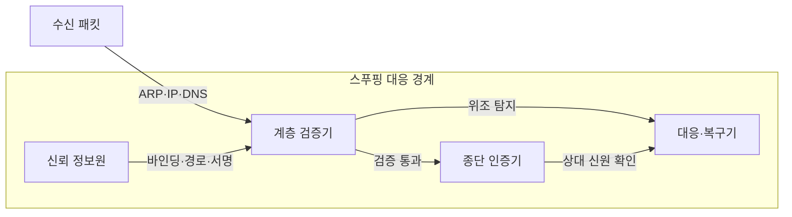
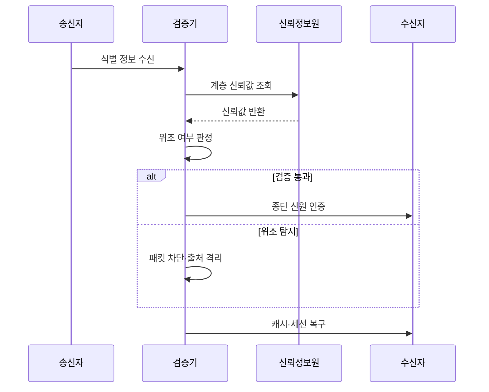

---
sidebar:
  order: 86
  label: "086. 네트워크 스푸핑 - ARP·IP·DNS (Network Spoofing)"
  badge:
    text: "기출 · 70%"
    variant: note
title: "네트워크 스푸핑 - ARP·IP·DNS (Network Spoofing)"
date: "2026-07-25T00:55:00+09:00"
tags: ["notes-network"]
weight: 86
extra:
  question_no: "086"
  source_status: "기출"
  source_history: "128회, 134회"
  priority: 70
  priority_note: "보안·문제대책형: 128·134회 Spoofing 반복"
---

## 미리 알고가기

- **스푸핑(Spoofing)**: 통신 상대가 신뢰하는 이름·주소·식별자를 공격자가 위조해 패킷 경로나 판단을 속이는 공격이다.
- **주소 결정 프로토콜(Address Resolution Protocol, ARP)**: 같은 근거리망에서 인터넷 주소를 물리 주소로 변환하는 프로토콜이다.
- **인터넷 프로토콜(Internet Protocol, IP)**: 출발지와 목적지 주소를 넣어 패킷을 여러 네트워크로 전달하는 프로토콜이다.
- **도메인 이름 시스템(Domain Name System, DNS)**: 사람이 읽는 도메인 이름을 서버의 인터넷 주소로 변환하는 분산 시스템이다.
- **동적 ARP 검사(Dynamic ARP Inspection, DAI)**: 스위치가 신뢰 바인딩과 ARP 메시지를 대조해 위조 매핑을 차단하는 기능이다.
- **역방향 경로 검사(Unicast Reverse Path Forwarding, uRPF)**: 출발지 주소로 돌아갈 경로와 수신 위치를 대조해 위조 IP 패킷을 거르는 기능이다.
- **DNS 보안 확장(DNS Security Extensions, DNSSEC)**: 전자서명으로 DNS 응답의 출처와 변조 여부를 검증하는 확장 규격이다.
- **캐시 오염**: 위조된 주소 정보를 임시 저장소에 넣어 이후 요청도 잘못된 대상으로 보내는 상태다.
- **인증서**: 공개키와 통신 상대의 신원을 전자서명으로 연결해 서버·클라이언트의 실제 신원을 검증하는 전자 문서다.
- **약어 읽기와 표기**: ARP·IP·DNS·DAI·uRPF·DNSSEC는 에이알피·아이피·디엔에스·디에이아이·유알피에프·디엔에스섹으로 읽고 영문 핵심 글자를 딴 표기이며, 주소 변환·패킷 전달·이름 해석·계층별 위조 검증을 구분한다.

## Ⅰ. 개요

- **정의/개념**: 신뢰 식별자를 위조해 경로·상대를 속이는 공격
- **배경/필요성**: 주소 변환·전달 정보의 자체 인증이 부족

### 쉽게 이해하기 (학습용)

- 공격자가 전화번호부의 주소나 발신자 표시를 바꿔 사용자의 통신을 자신이나 가짜 서버로 보내는 것과 같다.

## Ⅱ. 특징

- 신뢰 식별자 위조가 정상 패킷처럼 위장한다.
- 위조는 가로채기·우회·반사 공격으로 확장된다.
- 계층별 검증·종단 인증이 위조 연결을 막는다.
- 오염된 캐시·세션이 차단 뒤 공격을 지속한다.

### 쉽게 이해하기 (학습용)

- 위조 메시지를 막은 뒤에도 장비가 기억한 거짓 주소와 이미 열린 연결을 지우지 않으면 피해가 계속된다.

## Ⅲ. 아키텍처 및 구성요소

| 설계 요소 | 설명 |
|:---|:---|
| 신뢰 정보원 | 주소 바인딩·경로·서명을 제공 |
| 계층 검증기 | 스위치·라우터·해석기가 대조 |
| 종단 인증기 | 인증서로 실제 통신 상대 확인 |
| 대응·복구기 | 차단·격리·캐시·세션 정리 |

> 요약: 계층 신뢰 정보와 종단 신원으로 이중 검증

### 쉽게 이해하기 (학습용)

- 네트워크 장비가 주소 정보를 먼저 검사하고 서비스도 상대 인증서를 확인한 뒤 위조가 발견되면 거짓 기억과 연결을 지운다.

## Ⅳ. 원리 및 절차 흐름도

| 절차 | 설명 |
|:---|:---|
| 식별 정보 수신 | ARP·IP·DNS 정보를 추출 |
| 계층 신뢰값 조회 | 바인딩·경로·서명을 요청 |
| 신뢰값 반환 | 계층별 기준값을 검증기에 제공 |
| 위조 여부 판정 | 불일치한 식별 정보를 거부 |
| 종단 신원 인증 | 인증서로 실제 상대를 재확인 |
| 패킷 차단·출처 격리 | 위조 패킷과 공격 위치를 차단 |
| 캐시·세션 복구 | 오염 정보와 연결 상태를 제거 |

> 요약: 위조 계층을 판정하고 종단 인증·복구

### 쉽게 이해하기 (학습용)

- 받은 주소를 믿을 만한 목록과 대조하고 서비스 신원까지 확인하며 거짓이면 출처를 막고 남아 있는 잘못된 주소를 지운다.

## Ⅴ. 종류 및 비교

| 판단 기준 | ARP 스푸핑 | IP 스푸핑 | DNS 스푸핑 |
|:---|:---|:---|:---|
| 핵심 특징 | IP와 물리 주소의 매핑 위조 | 패킷의 출발지 IP 주소 위조 | 도메인 이름의 해석 결과 위조 |
| 적용 기준 | 같은 근거리망의 경로 가로채기 | 반사 공격·출발지 기반 통제 우회 | 사용자를 가짜 서버로 유도 |
| 주요 위험 | 중간자 도청·세션 탈취 | 추적 방해·대규모 반사 트래픽 | 자격정보 탈취·캐시 오염 |

> 요약: 위조 계층별 바인딩·경로·서명 검증

### 쉽게 이해하기 (학습용)

- 근거리 주소표는 ARP, 패킷 발신지는 IP, 사이트 주소록은 DNS 스푸핑이며 각각 확인할 신뢰 정보가 다르다.

## Ⅵ. 실무 사례

1. 사내 스위치에 DAI로 거짓 ARP 매핑 차단
2. 공인 DNS 응답에 DNSSEC 서명 검증

### 쉽게 이해하기 (학습용)

- 사내망 스위치는 장비에 배정된 주소표와 ARP 응답을 대조해 공격자의 거짓 매핑을 차단한다.
- 도메인 해석기는 서명을 확인해 공격자가 만든 가짜 주소 응답을 캐시에 저장하지 않는다.

## Ⅶ. 결론

- ARP·IP·DNS별 신뢰값 검증 후 캐시 복구

### 쉽게 이해하기 (학습용)

- 스푸핑 대응은 공격 이름만 구분하지 말고 위조된 계층의 기준값을 검사하고 이미 오염된 상태까지 정리해야 한다.
