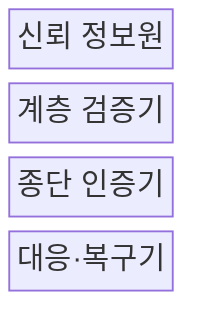
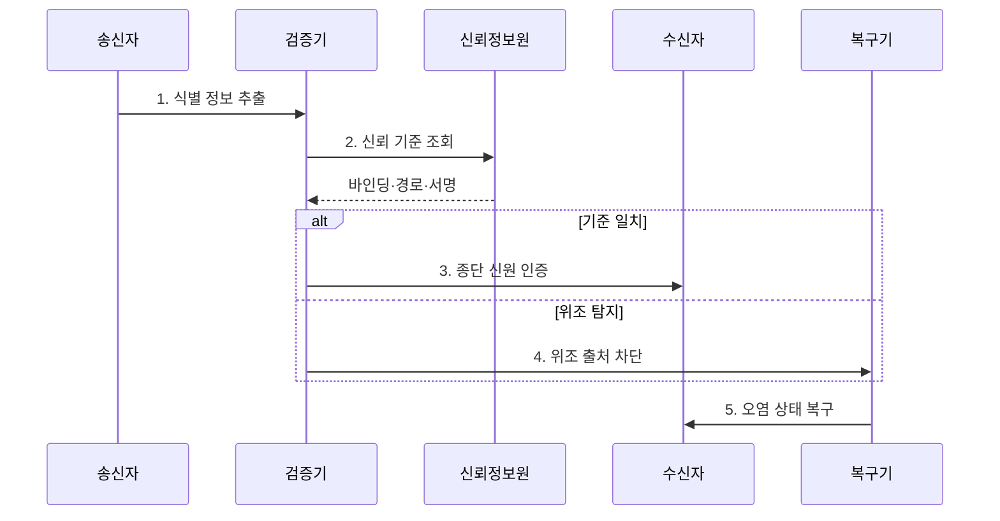

---
sidebar:
  order: 86
  label: "086. 네트워크 스푸핑 - ARP·IP·DNS (Network Spoofing)"
  badge:
    text: "기출 · 70%"
    variant: note
title: "네트워크 스푸핑 - ARP·IP·DNS (Network Spoofing)"
date: "2026-07-27T23:59:59+09:00"
tags: ["notes-network"]
weight: 86
extra:
  question_no: "086"
  source_status: "기출"
  source_history: "128회, 134회"
  priority: 70
  priority_note: "보안·문제대책형: 128·134회 Spoofing 반복"
---

## 미리 알고가기

- **스푸핑(Spoofing)**: 통신 상대가 신뢰하는 이름·주소·식별자를 공격자가 위조해 패킷 경로나 판단을 속이는 공격이다.
- **주소 결정 프로토콜(Address Resolution Protocol, ARP)**: 같은 근거리망에서 인터넷 주소를 물리 주소로 변환하는 프로토콜이다.
- **인터넷 프로토콜(Internet Protocol, IP)**: 출발지와 목적지 주소를 넣어 패킷을 여러 네트워크로 전달하는 프로토콜이다.
- **도메인 이름 시스템(Domain Name System, DNS)**: 사람이 읽는 도메인 이름을 서버의 인터넷 주소로 변환하는 분산 시스템이다.
- **동적 ARP 검사(Dynamic ARP Inspection, DAI)**: 스위치가 신뢰 바인딩과 ARP 메시지를 대조해 위조 매핑을 차단하는 기능이다.
- **역방향 경로 검사(Unicast Reverse Path Forwarding, uRPF)**: 출발지 주소로 돌아갈 경로와 수신 위치를 대조해 위조 IP 패킷을 거르는 기능이다.
- **DNS 보안 확장(DNS Security Extensions, DNSSEC)**: 전자서명으로 DNS 응답의 출처와 변조 여부를 검증하는 확장 규격이다.
- **캐시 오염**: 위조된 주소 정보를 임시 저장소에 넣어 이후 요청도 잘못된 대상으로 보내는 상태다.
- **인증서**: 공개키와 통신 상대의 신원을 전자서명으로 연결해 서버·클라이언트의 실제 신원을 검증하는 전자 문서다.
- **BCP 38**: 네트워크 경계에서 출발지 주소를 검증해 위조 패킷의 유출입을 막는 모범 운영 지침이다.

## Ⅰ. 개요

- 정의/개념: 주소·이름·식별자를 **위조해 경로·상대를 기만**
- 기존 한계: ARP·IP·DNS 정보의 **기본 출처 인증 부족**

### 쉽게 이해하기 (학습용)

- 공격자가 전화번호부의 주소나 발신자 표시를 바꿔 사용자의 통신을 자신이나 가짜 서버로 보내는 것과 같다.

## Ⅱ. 특징

- 신뢰 식별자의 **정상 패킷 위장**
- 계층별 **바인딩·경로·서명 검증**
- 오염 캐시·세션의 **차단 후 잔존**

### 쉽게 이해하기 (학습용)

- 위조 메시지를 막은 뒤에도 장비가 기억한 거짓 주소와 이미 열린 연결을 지우지 않으면 피해가 계속된다.

## Ⅲ. 구조 및 구성요소

| 구성요소 | 책임 |
|:---|:---|
| **신뢰 정보원** | 주소 바인딩·경로·서명 제공 |
| **계층 검증기** | 수신 식별자와 신뢰 기준 대조 |
| **종단 인증기** | 인증서로 실제 통신 상대 확인 |
| **대응·복구기** | 차단·격리·캐시·세션 정리 |

### 쉽게 이해하기 (학습용)

- 네트워크 장비가 주소 정보를 먼저 검사하고 서비스도 상대 인증서를 확인한 뒤 위조가 발견되면 거짓 기억과 연결을 지운다.

## Ⅳ. 흐름도

1. **식별 정보 추출**: ARP·IP·DNS 검증 필드 분리
2. **신뢰 기준 조회**: 바인딩·경로·서명 기준 확보
3. **종단 신원 인증**: 인증서로 실제 상대를 재확인
4. **위조 출처 차단**: 불일치 패킷 폐기와 위치 격리
5. **오염 상태 복구**: 캐시·세션의 위조 상태 제거

### 쉽게 이해하기 (학습용)

- 받은 주소를 믿을 만한 목록과 대조하고 서비스 신원까지 확인하며 거짓이면 출처를 막고 남아 있는 잘못된 주소를 지운다.

## Ⅴ. 종류 및 비교

| 스푸핑 대상 | ARP 스푸핑 | IP 스푸핑 | DNS 스푸핑 |
|:---|:---|:---|:---|
| 적용 기준 | 근거리망의 **경로 가로채기** | 반사 공격·**출발지 통제 우회** | 사용자의 **가짜 서버 유도** |
| 핵심 특징 | IP-MAC **바인딩 위조** | 패킷 **출발지 IP 위조** | 도메인 **해석 결과 위조** |
| 한계 | 중간자 도청·**세션 탈취** | 추적 방해·**반사 트래픽** | 자격 탈취·**캐시 오염** |

> 요약: 위조 계층별 바인딩·경로·서명 검증

### 쉽게 이해하기 (학습용)

- 근거리 주소표는 ARP, 패킷 발신지는 IP, 사이트 주소록은 DNS 스푸핑이며 각각 확인할 신뢰 정보가 다르다.

## Ⅵ. 실무 고려사항 및 대책

| 고려사항 | 대책 | 효과 |
|:---|:---|:---|
| 사내망의 **IP·MAC 위조** | DHCP 바인딩 기반 **DAI** 적용 | 중간자 경로의 **형성 차단** |
| 경계망의 **출발지 IP 위조** | **BCP 38·uRPF** 필터 적용 | 반사 공격과 **추적 회피 감소** |
| 해석기의 **DNS 캐시 오염** | **DNSSEC** 검증과 캐시 폐기 | 가짜 서버 **유도 상태 제거** |

### 쉽게 이해하기 (학습용)

- 스위치가 DHCP 스누핑 바인딩과 ARP 응답을 대조하는 DAI를 적용해 공격자의 거짓 IP·MAC 매핑을 차단한다.

## Ⅶ. 결론

- **위조 계층·신뢰 기준**별 검증기와 복구 절차 선택

### 쉽게 이해하기 (학습용)

- 스푸핑 대응은 공격 이름만 구분하지 말고 위조된 계층의 기준값을 검사하고 이미 오염된 상태까지 정리해야 한다.
