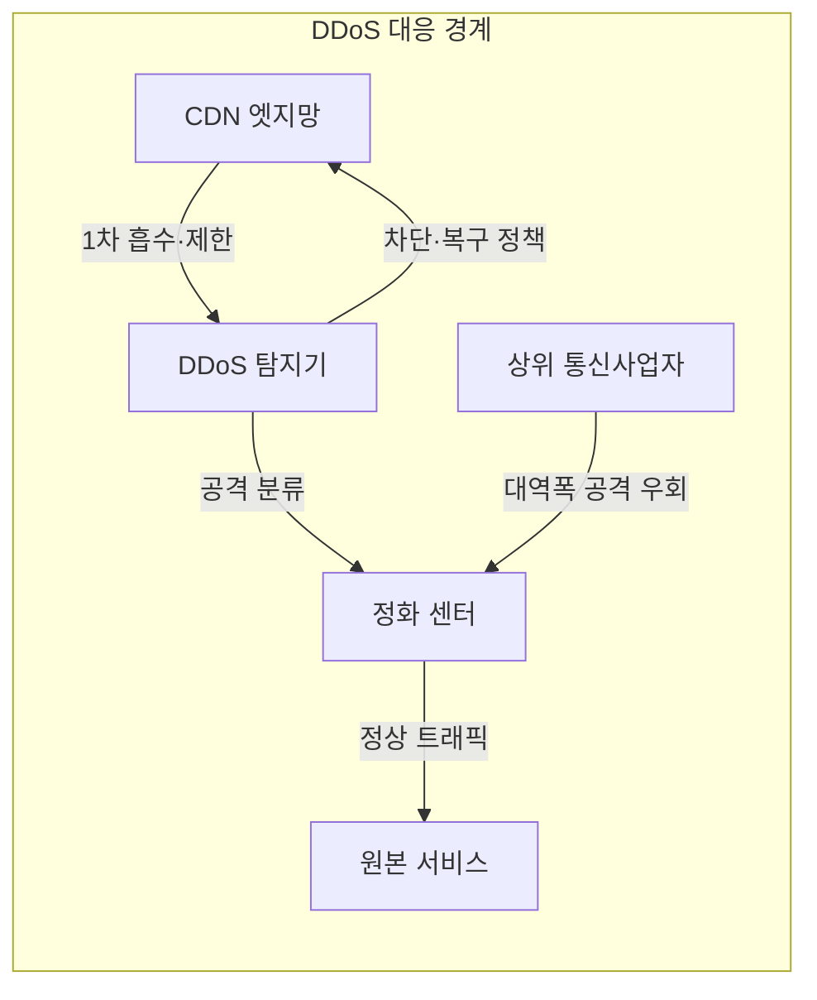
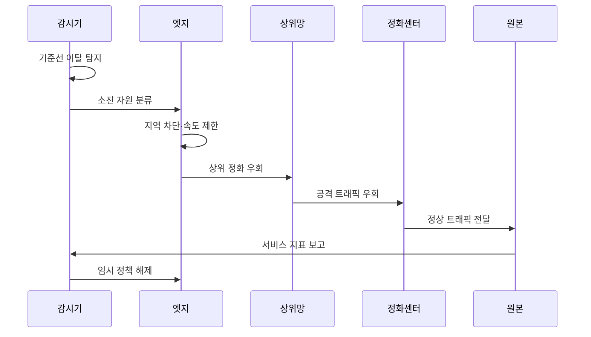

---
sidebar:
  order: 87
  label: "087. DDoS 공격 기법·대응 - SYN Flood·증폭 (DDoS Attack Mitigation)"
  badge:
    text: "기출 · 50%"
    variant: note
title: "DDoS 공격 기법·대응 - SYN Flood·증폭 (DDoS Attack Mitigation)"
date: "2026-07-27T23:59:59+09:00"
tags: ["notes-network"]
weight: 87
extra:
  question_no: "087"
  source_status: "기출"
  source_history: "125회"
  priority: 50
  priority_note: "보안·방안형: 125회 DDoS 대책 장문"
---

## 미리 알고가기

- **분산 서비스 거부(Distributed Denial of Service, DDoS)**: 다수 공격원이 회선·연결 상태·서버 자원을 소진시켜 정상 사용자의 서비스 이용을 거부하게 하는 공격이다.
- **동기화 플러드(Synchronize Flood, SYN 플러드)**: 전송 제어 프로토콜의 연결 시작 요청만 대량 전송해 서버의 반개방 연결 상태를 소진하는 공격이다.
- **반사·증폭 공격**: 위조한 피해자 주소로 공개 서버에 작은 요청을 보내 더 큰 응답이 피해자에게 집중되게 하는 공격이다.
- **응용 계층 공격**: 정상 형식의 고비용 요청을 대량 전송해 웹·데이터베이스 처리 자원을 소진하는 공격이다.
- **콘텐츠 전송망(Content Delivery Network, CDN)**: 여러 지역의 엣지 서버가 콘텐츠를 대신 제공해 트래픽을 분산하는 체계다.
- **정화 센터(Scrubbing Center)**: 대량 트래픽을 우회 수신해 악성 패킷을 제거하고 정상 패킷만 원본으로 전달하는 시설이다.
- **상위 통신사업자**: 서비스 자체 회선에 도달하기 전에 대규모 공격을 차단·우회할 수 있는 외부 망 운영자다.
- **기준선(Baseline)**: 정상 시간대의 트래픽 양·분포·연결·요청 특성을 기록한 비교 기준이다.
- **도메인 이름 시스템(Domain Name System, DNS)**: 도메인 이름을 서버 주소로 바꾸며 반사·증폭 공격에 악용될 수 있는 분산 이름 해석 체계다.
- **약어 읽기와 표기**: DDoS·SYN·CDN·DNS는 디도스·신·씨디엔·디엔에스로 읽고 영문 핵심 글자를 딴 표기이며, 분산 서비스 거부·연결 시작·콘텐츠 분산·이름 해석 역할을 구분한다.

## Ⅰ. 개요

- 정의/개념: 분산 공격 트래픽을 **탐지·흡수·정화해 가용성 유지**
- 기존 한계: 내부 차단만으로는 **상위 회선·연결 자원 고갈 방지 불가**

### 쉽게 이해하기 (학습용)

- 몰려오는 요청 중 공격만 가까운 곳이나 더 큰 상위망에서 걸러 정상 사용자의 통신 길을 남기는 대응 체계다.

## Ⅱ. 특징

- 공격 병목별 **회선·상태·응용 자원 고갈**
- 상위망·CDN·정화센터의 **단계별 완화**
- 과도 차단의 **정상 사용자 동반 거부**

### 쉽게 이해하기 (학습용)

- 서버가 아니라 인터넷 회선이 먼저 꽉 찬 공격은 서비스 안쪽에서 막아도 늦으므로 공격이 도착하기 전에 우회해야 한다.

## Ⅲ. 아키텍처 및 구성요소

| 설계 요소 | 설명 |
|:---|:---|
| CDN 엣지망 | 트래픽 분산·캐시·요청 제한 |
| DDoS 탐지기 | 기준선과 병목 자원으로 공격 분류 |
| 정화 센터 | 악성 패킷 제거 후 정상만 전달 |
| 원본 서비스 | 직접 주소 은닉·허용 경로 제한 |
| 상위 통신사업자 | 회선 포화 전 우회·출발지 차단 |

> 요약: 병목 앞단에서 분산·정화 후 원본 보호

### 쉽게 이해하기 (학습용)

- 엣지와 상위 통신망이 공격을 나누어 받고 정화 센터가 정상 트래픽만 숨겨진 원본 서비스로 보낸다.

## Ⅳ. 원리 및 절차 흐름도

| 절차 | 설명 |
|:---|:---|
| 기준선 이탈 탐지 | 양·분포·연결·요청 이상 확인 |
| 소진 자원 분류 | 회선·상태·응용 병목을 판정 |
| 지역 차단·속도 제한 | 엣지에서 명백한 공격을 완화 |
| 상위 정화 우회 | 회선 포화 전 외부 경로로 전환 |
| 공격 트래픽 우회 | 정화 센터로 공격 경로 전환 |
| 정상 트래픽 전달 | 악성 패킷 제거 후 원본 전달 |
| 서비스 지표 보고 | 원본의 지연·오류·자원 상태 확인 |
| 임시 정책 해제 | 정상 지표 유지 후 제한 완화 |

> 요약: 소진 자원을 분류해 병목 앞단에서 완화

### 쉽게 이해하기 (학습용)

- 평소와 다른 트래픽이 소진하는 자원을 판단해 가까운 엣지나 상위망에서 차단하고 정상화되면 임시 제한을 푼다.

## Ⅴ. 종류 및 비교

| DDoS 공격 유형 | 대역폭 공격 | 상태 소진 공격 | 응용 계층 공격 |
|:---|:---|:---|:---|
| 적용 기준 | 패킷량의 **회선 용량 접근** | 연결 수의 **상태표 한계 접근** | 특정 기능의 **처리 자원 급증** |
| 핵심 특징 | 증폭 트래픽의 **회선 포화** | 반개방 연결의 **상태 자원 소진** | 정상 형식의 **고비용 요청 반복** |
| 한계 | 내부 차단 전 **회선 마비** | 정상 신규 연결도 **동반 거부** | 정상·공격 요청 **구분 곤란** |

> 요약: 회선·상태·응용 병목으로 완화 위치 선택

### 쉽게 이해하기 (학습용)

- 회선이 차면 상위망, 연결표가 차면 연결 보호, 특정 기능만 느리면 요청 비용과 사용자 행동을 기준으로 제한한다.

## Ⅵ. 실무 사례

1. DNS 증폭 공격의 **상위 정화망 우회**

### 쉽게 이해하기 (학습용)

- 대량의 DNS 응답이 회선을 포화시키기 전에 BGP로 트래픽을 통신사업자 정화 센터에 우회시켜 공격 패킷만 제거한다.

## Ⅶ. 결론

- 소진 자원·회선 위치로 차단·정화 지점 결정

### 쉽게 이해하기 (학습용)

- DDoS 대응은 공격 이름보다 먼저 고갈되는 자원과 회선 위치를 찾아 그 앞단에서 정상 통신을 남기도록 설계해야 한다.
