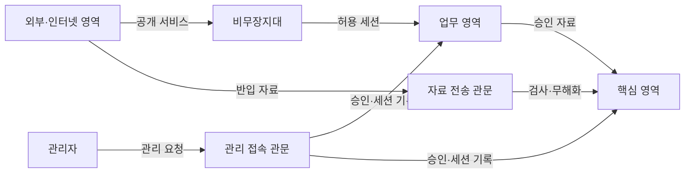
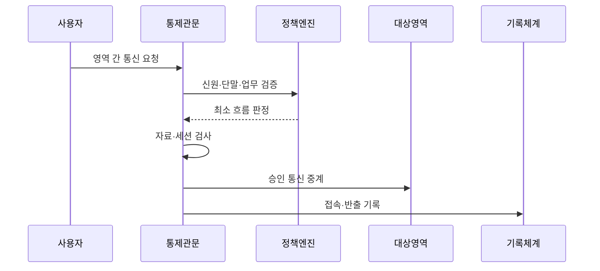

---
sidebar:
  order: 88
  label: "088. 망분리 - 물리적·논리적 (Network Separation)"
  badge:
    text: "기출 · 50%"
    variant: note
title: "망분리 - 물리적·논리적 (Network Separation)"
date: "2026-07-27T23:59:59+09:00"
tags: ["notes-network"]
weight: 88
extra:
  question_no: "088"
  source_status: "기출"
  source_history: "125회"
  priority: 50
  priority_note: "비교·보안형: 125회 물리·논리 망분리"
---

## 미리 알고가기

- **망분리(Network Separation)**: 업무 중요도와 신뢰 수준이 다른 네트워크를 분리하고 승인된 통로만 허용해 침해 확산을 제한하는 통제다.
- **물리적 망분리**: 단말·스위치·회선을 별도로 구성해 두 영역이 물리 자원을 공유하지 않게 하는 방식이다.
- **논리적 망분리**: 가상화와 네트워크 정책으로 공유 장비 안의 통신 영역과 경로를 분리하는 방식이다.
- **비무장지대(Demilitarized Zone, DMZ)**: ‘디엠지’로 읽고 영문 머리글자를 딴 약어이며, 외부 공개 서버를 내부망과 분리하는 중간 보안 영역
- **가상 근거리망(Virtual LAN, VLAN)**: ‘브이랜’으로 읽고 영문 핵심 글자를 딴 약어이며, 하나의 스위치에서 방송 영역을 논리적으로 나눔
- **가상 라우팅 전달(Virtual Routing and Forwarding, VRF)**: ‘브이알에프’로 읽고 영문 머리글자를 딴 약어이며, 한 라우터에 독립 라우팅 표를 두어 경로를 분리함
- **콘텐츠 무해화(Content Disarm and Reconstruction, CDR)**: ‘시디알’로 읽고 영문 머리글자를 딴 약어이며, 문서의 실행 코드를 제거하고 안전한 내용으로 재구성함
- **특권 접근관리(Privileged Access Management, PAM)**: ‘팸’으로 읽고 영문 머리글자를 딴 약어이며, 관리자 권한·승인·세션·명령 기록을 통제함

## Ⅰ. 개요

- 정의/개념: 신뢰 수준별 망을 **격리하고 승인 통로만 허용**
- 기존 한계: 단일 망의 **침해 횡적 확산·정보 유출**

### 쉽게 이해하기 (학습용)

- 중요한 업무망을 별도 방으로 나누고 파일과 관리자 접속은 검사받는 문으로만 오가게 한다.

## Ⅱ. 특징

- 공유 자원·우회 경로의 **실제 격리 강도 결정**
- 기본 차단·예외 승인 기반의 **최소 통신**
- 자료 전송·관리 접점의 **교차망 통제**

### 쉽게 이해하기 (학습용)

- 선을 나누는 것만으로 끝나지 않고 파일 반입과 원격 관리처럼 실제로 남겨 둔 통로를 더 엄격히 관리해야 한다.

## Ⅲ. 아키텍처 및 구성요소

| 설계 요소 | 설명 |
|:---|:---|
| 외부·인터넷 영역 | 신뢰하지 않는 사용자·서비스 위치 |
| 비무장지대 | 공개 서비스를 내부와 중계·격리 |
| 업무 영역 | 일반 업무 단말·서버를 수용 |
| 핵심 영역 | 중요 자료·제어 시스템을 격리 |
| 자료 전송 관문 | 파일 검사·무해화·반출 승인 |
| 관리 접속 관문 | 관리자 인증·승인·세션 기록 |

> 요약: 영역 사이 자료·관리 통로를 관문으로 제한

### 쉽게 이해하기 (학습용)

- 인터넷·일반 업무·핵심 업무를 나누고 파일과 관리자 접속은 각각 전용 관문에서 검사한 뒤 통과시킨다.

## Ⅳ. 원리 및 절차 흐름도

| 절차 | 설명 |
|:---|:---|
| 영역 간 통신 요청 | 출발·목적·업무 사유 제출 |
| 신원·단말·업무 검증 | 사용자·기기·권한을 대조 |
| 최소 흐름 판정 | 필요한 주소·포트·시간만 허용 |
| 자료·세션 검사 | 악성 내용·관리 명령을 확인 |
| 승인 통신 중계 | 직접 연결 없이 관문이 전달 |
| 접속·반출 기록 | 승인·행위·결과를 감사 보존 |

> 요약: 영역 간 흐름을 검증·검사·중계·기록

### 쉽게 이해하기 (학습용)

- 다른 망으로 가려는 요청은 사용자와 업무 목적을 확인하고 필요한 범위만 관문이 대신 연결하며 모든 행위를 남긴다.

## Ⅴ. 종류 및 비교

| 망분리 방식 | 물리적 망분리 | 논리적 망분리 | 혼합 망분리 |
|:---|:---|:---|:---|
| 적용 기준 | 최고 격리·**규제 요구** | 잦은 변화·**자원 효율 우선** | 중요도별 **비용·격리 균형** |
| 핵심 특징 | 장비·회선의 **완전 별도 구성** | 공유 장비의 **가상화·정책 분리** | 핵심 물리·**일반 논리 분리** |
| 한계 | 높은 비용·**자료 이동 불편** | 설정 오류·**공유 계층 취약점** | 경계 복잡·**정책 불일치** |

> 요약: 자산 중요도·공유 위험·비용으로 방식 선택

### 쉽게 이해하기 (학습용)

- 아주 중요한 망은 물리적으로 나누고 변화가 잦은 망은 논리적으로 나누며 중요도가 섞이면 두 방식을 조합한다.

## Ⅵ. 실무 사례

1. 외부 연구망 문서의 **CDR 기반 업무망 반입**

### 쉽게 이해하기 (학습용)

- 망연계 구간에서 외부 문서의 매크로·실행 코드를 제거하고 승인된 내용만 재구성해 내부 업무망으로 전달한다.

## Ⅶ. 결론

- 중요도·공유 위험으로 분리 강도와 관문 결정

### 쉽게 이해하기 (학습용)

- 망분리는 물리와 논리 중 하나를 고르는 데서 끝나지 않고 실제 자료와 관리 경로를 어떤 관문으로 통제할지 정해야 한다.
