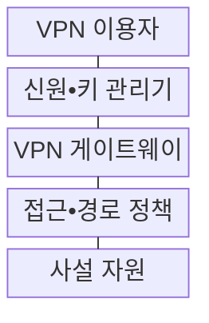
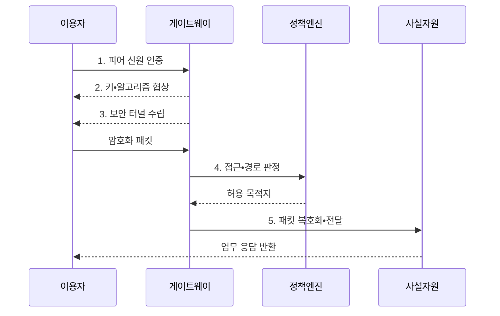

---
sidebar:
  order: 89
  label: "089. VPN - IPsec•SSL•WireGuard (VPN)"
  badge:
    text: "기출 • 50%"
    variant: note
title: "VPN - IPsec•SSL•WireGuard (VPN)"
date: "2026-08-04T18:14:00+09:00"
tags: ["notes-network"]
weight: 89
extra:
  question_no: "089"
  source_status: "기출"
  source_history: "137회"
  priority: 50
  priority_note: "비교•설계형: VPN 방식•최소 Route 판단"
---

## Ⅰ. 개요

핵심 용어

- **가상 사설망(Virtual Private Network, VPN)**: 공용망 위에 인증•암호화된 논리 터널을 구성해 사설 통신 경로를 제공하는 기술

- 정의/개념: 공용망에 인증•암호화된 논리 터널을 구성하는 **사설 통신 경로 제공 기술**
- 배경/필요성: 원격•지사 통신의 **도청•변조•비인가 접근 노출**

#### 한줄 요약

- 인터넷이라는 공용 도로 안에 신원을 확인한 사용자만 통과하는 암호화 통로를 만들어 회사 자원에 연결한다.

## Ⅱ. 특징

핵심 용어

- **터널 보호**: 피어 인증과 암호화•무결성 검증으로 공용망 구간의 패킷을 보호하는 방식이다.
- **분할 터널**: 선택한 목적지 트래픽만 VPN으로 보내고 나머지는 일반 경로로 보내는 방식

- **터널 보호**: 인증•암호화로 구간 기밀성•무결성 제공
- **접근 제한**: 경로•권한 정책으로 사설 자원 범위 결정
- **분할 터널**: 업무 외 트래픽 분리로 부하 감소•유출 위험 증가

#### 한줄 요약

- 통로를 암호화해도 감염된 단말까지 안전해지는 것은 아니며 어떤 목적지를 터널로 보낼지 엄격히 정해야 한다.

## Ⅲ. 구조 및 구성요소

핵심 용어

- **VPN 게이트웨이**: 터널을 종단해 패킷을 복호화하고 접근•경로 정책을 적용하는 장치
- **신원•키 관리**: 계정•인증서•공개키의 발급•배포•갱신•폐기를 통제하는 기능이다.

| 구성요소 | 책임 |
|:---|:---|
| VPN 이용자 | 단말•지사에서 터널 접속 시작 |
| 신원•키 관리기 | 계정•인증서•공개키 수명 관리 |
| VPN 게이트웨이 | 터널 종단•복호화•정책 적용 |
| 접근•경로 정책 | 허용 주소•응용•분할 경로 정의 |
| 사설 자원 | 인증된 터널에서만 서비스 제공 |

#### 한줄 요약

- 이용자가 인증을 통과하면 게이트웨이와 암호화 통로를 만들고 정책에 적힌 사설 자원만 접근하게 한다.

## Ⅳ. 흐름도

핵심 용어

- **피어 인증•키 협상**: 터널 양쪽의 신원을 검증하고 사용할 알고리즘과 세션 키를 합의하는 과정이다.
- **인터넷 프로토콜 보안(Internet Protocol Security, IPsec)**: IP 패킷을 인증•암호화하는 보안 프로토콜군
- **보안 연관(Security Association, SA)**: IPsec 방향별 알고리즘•키•수명•식별자를 묶은 상태

**동작 원리**

- **1. 피어 신원 인증**: 계정•인증서•공개키 검증
- **2. 키•알고리즘 협상**: 암호 방식과 세션 키 합의
- **3. 보안 터널 수립**: SA•암호화•무결성 상태 생성
- **4. 접근•경로 판정**: 허용 목적지•응용•분할 경로 대조
- **5. 패킷 복호화•전달**: 터널 헤더 제거 후 사설망 전달

#### 한줄 요약

- 양쪽 신원을 확인해 임시 암호키를 만든 뒤 허용된 목적지의 패킷만 터널로 보내고 시간이 지나면 키를 바꾼다.

## Ⅴ. 종류 및 비교

핵심 용어

- **인터넷 프로토콜(Internet Protocol, IP)**: 패킷 주소 지정과 전달을 담당하는 프로토콜
- **전송 계층 보안(Transport Layer Security, TLS)**: 통신 상대 인증과 전송 암호화를 제공하는 프로토콜
- **WireGuard**: 공개키와 단순한 암호 조합으로 IP 터널을 구성하는 경량 VPN 프로토콜
- **인터넷 키 교환 버전 2(Internet Key Exchange Version 2, IKEv2)**: IPsec 피어 인증과 보안 연관의 키•알고리즘을 협상하는 프로토콜
- **기술 표준 문서(Request for Comments, RFC)**: 인터넷 프로토콜의 규격과 운용 방법을 공개한 문서 체계

| VPN 방식 | IPsec VPN | TLS VPN | WireGuard |
|:---|:---|:---|:---|
| 적용 기준 | 지사•호스트의 **망 전체 연결** | 사용자별 **웹•응용 접근** | 단순 구성•**이동 단말 연결** |
| 핵심 특징 | **RFC 4301•IKEv2** 기반 IP 보안 | **RFC 8446** 기반 TLS 1.3 보호 | 공개키 기반 **단순 IP 터널** |
| 한계 | 복잡한 협상•**중간 장비 호환** | 응용 호환•**게이트웨이 의존** | 키 배포•**세밀한 권한 부족** |

> 요약: 보호 단위•운영 복잡도•권한으로 선택

#### 한줄 요약

- 망 전체 연결은 IPsec, 사용자별 응용은 TLS, 단순하고 빠른 IP 터널은 WireGuard가 알맞다.

## Ⅵ. 실무 고려사항 및 대책

핵심 용어

- **경로 최대 전송 단위(Path Maximum Transmission Unit, Path MTU)**: 경로에서 분할 없이 보낼 수 있는 최대 패킷 크기
- **최대 세그먼트 크기(Maximum Segment Size, MSS)**: TCP 세그먼트에 담을 수 있는 최대 데이터 크기
- **전송 제어 프로토콜(Transmission Control Protocol, TCP)**: 연결형 신뢰 전송 프로토콜
- **재키잉**: 기존 터널이 동작하는 동안 새 세션 키로 교체해 키 노출 시간을 줄이는 절차이다.

| 문제 | 대책 | 효과 |
|:---|:---|:---|
| 분할 터널의 **우회 유출** | 업무 목적지만 **최소 경로 선언** | 노출 범위와 **불필요 전송 감소** |
| 캡슐화의 **MTU 초과** | 경로 MTU 탐색•**MSS 조정** | 단편화와 **연결 실패 감소** |
| 장기 키의 **노출 영향 확대** | SA 수명•**재키잉 주기** 설정 | 탈취 키의 **유효 시간 축소** |

#### 한줄 요약

- 본사와 지사의 내부 주소 대역을 IPsec 터널로 암호화해 연결하고 일반 인터넷 트래픽은 별도 경로로 분리한다.

## Ⅶ. 결론

핵심 용어

- **VPN 방식 선택**: 보호 범위•운영 복잡도•이동성으로 IPsec•TLS•WireGuard를 결정하는 과정

- 망 전체 연결은 **IPsec**, 사용자별 응용은 **TLS**, 단순 IP 터널은 **WireGuard**

#### 한줄 요약

- VPN은 암호 방식만 고르지 말고 누가 어떤 주소와 응용에 접근하는지와 키를 어떻게 갱신할지를 함께 설계해야 한다.
