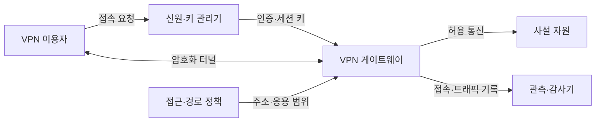
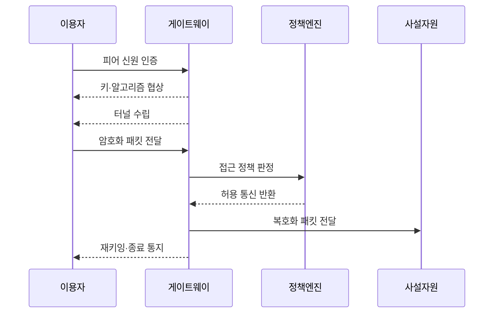

---
sidebar:
  order: 89
  label: "089. VPN - IPsec·SSL·WireGuard (VPN)"
  badge:
    text: "기출 · 50%"
    variant: note
title: "VPN - IPsec·SSL·WireGuard (VPN)"
date: "2026-07-27T23:59:59+09:00"
tags: ["notes-network"]
weight: 89
extra:
  question_no: "089"
  source_status: "기출"
  source_history: "137회"
  priority: 50
  priority_note: "비교·설계형: VPN 방식·최소 Route 판단"
---

## 미리 알고가기

- **가상 사설망(Virtual Private Network, VPN)**: ‘브이피엔’으로 읽고 영문 머리글자를 딴 약어이며, 공용망 위에 인증·암호화된 논리 터널을 구성함
- **인터넷 프로토콜 보안(IP Security, IPsec)**: ‘아이피섹’으로 읽고 IP와 security를 결합한 표기이며, IP 패킷의 기밀성·무결성·송신자 인증을 제공함
- **전송 계층 보안(Transport Layer Security, TLS)**: ‘티엘에스’로 읽고 영문 머리글자를 딴 약어이며, 통신 상대를 인증하고 전송 내용을 암호화함
- **WireGuard**: 공개키와 단순한 암호 조합으로 IP 터널을 구성하는 경량 가상 사설망 프로토콜이다.
- **보안 연관(Security Association, SA)**: IPsec 통신 방향별 알고리즘, 키, 수명과 식별자를 묶은 보안 상태다.
- **인터넷 키 교환 버전 2(Internet Key Exchange v2, IKEv2)**: IPsec 상대 인증과 보안 연관·세션 키를 협상하는 프로토콜이다.
- **분할 터널(Split Tunneling)**: 선택한 목적지 트래픽만 VPN으로 보내고 나머지는 일반 인터넷 경로로 보내는 방식이다.
- **캡슐화(Encapsulation)**: 원래 패킷에 터널용 보안 헤더를 덧붙여 공용망에서 전달할 새 패킷으로 감싸는 처리다.
- **최대 전송 단위(Maximum Transmission Unit, MTU)**: 한 번에 보낼 수 있는 패킷 크기이며 터널 헤더만큼 실제 자료 크기가 줄어든다.

## Ⅰ. 개요

- 정의/개념: 공용망에 **인증·암호화된 사설 통신 경로 구성**
- 기존 한계: 원격·지사 통신의 **도청·변조·비인가 접근 노출**

### 쉽게 이해하기 (학습용)

- 인터넷이라는 공용 도로 안에 신원을 확인한 사용자만 통과하는 암호화 통로를 만들어 회사 자원에 연결한다.

## Ⅱ. 특징

- 인증·암호화의 **터널 구간 기밀성·무결성**
- 경로·권한 정책의 **사설 자원 접근 범위 결정**
- 캡슐화·분할 터널의 **성능·유출 위험 절충**

### 쉽게 이해하기 (학습용)

- 통로를 암호화해도 감염된 단말까지 안전해지는 것은 아니며 어떤 목적지를 터널로 보낼지 엄격히 정해야 한다.

## Ⅲ. 아키텍처 및 구성요소

| 설계 요소 | 설명 |
|:---|:---|
| VPN 이용자 | 단말·지사에서 터널 접속 시작 |
| 신원·키 관리기 | 계정·인증서·공개키와 수명 관리 |
| VPN 게이트웨이 | 터널 종단·복호화·정책 적용 |
| 접근·경로 정책 | 허용 주소·응용·분할 경로 정의 |
| 사설 자원 | 인증된 터널에서만 서비스 제공 |
| 관측·감사기 | 접속·정책·트래픽 이상 기록 |

> 요약: 인증된 터널에 최소 경로 정책을 적용

### 쉽게 이해하기 (학습용)

- 이용자가 인증을 통과하면 게이트웨이와 암호화 통로를 만들고 정책에 적힌 사설 자원만 접근하게 한다.

## Ⅳ. 원리 및 절차 흐름도

| 절차 | 설명 |
|:---|:---|
| 피어 신원 인증 | 계정·인증서·공개키를 검증 |
| 키·알고리즘 협상 | 암호 방식과 세션 키를 합의 |
| 터널 수립 | 암호화·무결성 상태를 생성 |
| 암호화 패킷 전달 | 캡슐화해 공용망으로 전송 |
| 접근 정책 판정 | 허용 목적지·응용 범위를 대조 |
| 허용 통신 반환 | 정책을 통과한 흐름만 승인 |
| 복호화 패킷 전달 | 터널 헤더를 제거해 사설망 전달 |
| 재키잉·종료 통지 | 수명 만료 시 새 키 협상·상태 삭제 |

> 요약: 피어 인증·키 협상 후 최소 경로만 터널링

### 쉽게 이해하기 (학습용)

- 양쪽 신원을 확인해 임시 암호키를 만든 뒤 허용된 목적지의 패킷만 터널로 보내고 시간이 지나면 키를 바꾼다.

## Ⅴ. 종류 및 비교

| VPN 방식 | IPsec VPN | TLS VPN | WireGuard |
|:---|:---|:---|:---|
| 적용 기준 | 지사·호스트의 **망 전체 연결** | 사용자별 **웹·응용 접근** | 단순 구성·**이동 단말 연결** |
| 핵심 특징 | IP 패킷의 **범용 보안 터널** | TLS 기반 **응용 세션 중계** | 공개키 기반 **단순 IP 터널** |
| 한계 | 복잡한 협상·**중간 장비 호환** | 응용 호환·**게이트웨이 의존** | 키 배포·**세밀한 권한 부족** |

> 요약: 보호 단위·운영 복잡도·권한으로 선택

### 쉽게 이해하기 (학습용)

- 망 전체 연결은 IPsec, 사용자별 응용은 TLS, 단순하고 빠른 IP 터널은 WireGuard가 알맞다.

## Ⅵ. 실무 사례

1. 본사와 지사의 **IPsec 사이트 간 VPN**

### 쉽게 이해하기 (학습용)

- 본사와 지사의 내부 주소 대역을 IPsec 터널로 암호화해 연결하고 일반 인터넷 트래픽은 별도 경로로 분리한다.

## Ⅶ. 결론

- 신뢰할 수 없는 망에서 원격 구간을 보호하기 위해 사용자·사이트·보호 주소·분할 터널·암호·키 수명을 검토하여, 요구에 맞는 원격 접속 또는 사이트 간 VPN을 선택해야 한다.

### 쉽게 이해하기 (학습용)

- VPN은 암호 방식만 고르지 말고 누가 어떤 주소와 응용에 접근하는지와 키를 어떻게 갱신할지를 함께 설계해야 한다.
