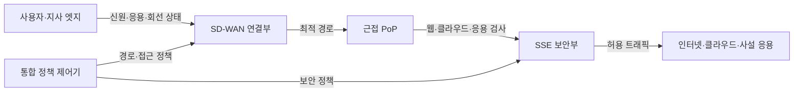
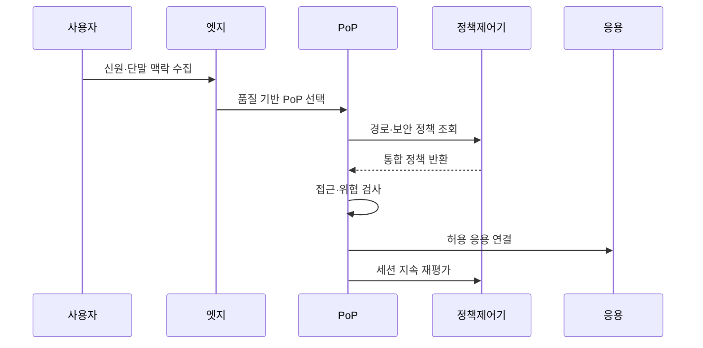

---
sidebar:
  order: 90
  label: "090. SASE - SD-WAN·CASB·SWG·ZTNA (SASE)"
  badge:
    text: "기출 · 50%"
    variant: note
title: "SASE - SD-WAN·CASB·SWG·ZTNA (SASE)"
date: "2026-07-25T00:45:00+09:00"
tags: ["notes-network"]
weight: 90
extra:
  question_no: "090"
  source_status: "기출"
  source_history: "135회"
  priority: 50
  priority_note: "설계형: 135회 Zero Trust의 SASE 구성"
---

## 미리 알고가기

- **보안 접근 서비스 엣지(Secure Access Service Edge, SASE)**: 광역망 연결과 클라우드 보안을 가까운 접속 거점에서 하나의 정책으로 제공하는 구조다.
- **소프트웨어 정의 광역망(Software-Defined WAN, SD-WAN)**: 응용 정책과 회선 품질에 따라 여러 광역망 경로를 자동 선택하는 기술이다.
- **보안 서비스 엣지(Security Service Edge, SSE)**: 웹·클라우드·사설 응용 접근 보안을 클라우드 거점에서 통합 제공하는 SASE의 보안 부분이다.
- **클라우드 접근 보안 중개(Cloud Access Security Broker, CASB)**: 클라우드 서비스 사용을 식별하고 사용자·자료 정책을 적용하는 기능이다.
- **보안 웹 게이트웨이(Secure Web Gateway, SWG)**: 웹 요청의 주소·내용·악성 행위를 검사해 허용하거나 차단하는 기능이다.
- **제로 트러스트 네트워크 접근(Zero Trust Network Access, ZTNA)**: 사용자·단말 상태를 검증해 허가된 응용에만 연결하는 방식이다.
- **접속 거점(Point of Presence, PoP)**: 사용자와 가까운 위치에서 트래픽을 받아 연결·보안 기능을 수행하는 사업자 거점이다.
- **본사 우회(Backhaul)**: 지사나 원격 사용자의 인터넷 트래픽을 보안 검사를 위해 본사 데이터센터까지 돌아가게 하는 경로다.

## Ⅰ. 개요

- **정의/개념**: 근접 PoP에서 광역망 연결·보안을 통합하는 구조
- **배경/필요성**: 본사 우회 없는 지사·원격·클라우드 연결

### 쉽게 이해하기 (학습용)

- 사용자가 어디에 있든 가까운 거점으로 연결해 빠른 경로와 같은 보안 규칙을 한 번에 적용한다.

## Ⅱ. 특징

- 사용자·단말·응용 맥락으로 경로·접근 결정한다.
- 근접 PoP가 본사 우회 지연을 감소한다.
- 클라우드 정책 통합으로 지사별 편차 축소한다.
- PoP 품질·사업자 장애가 다수 접속에 영향을 준다.

### 쉽게 이해하기 (학습용)

- 지사마다 장비를 따로 관리하지 않아도 되지만 가까운 거점의 용량과 장애 대비가 실제 사용자 품질을 좌우한다.

## Ⅲ. 아키텍처 및 구성요소

| 설계 요소 | 설명 |
|:---|:---|
| 사용자·지사 엣지 | 신원·단말·회선·응용 정보를 수집 |
| SD-WAN 연결부 | 품질·응용 정책으로 경로 선택 |
| 근접 PoP | 연결 종단과 보안 처리 위치 제공 |
| SSE 보안부 | SWG·CASB·ZTNA 정책을 실행 |
| 인터넷·클라우드·사설 응용 | 정책 통과 사용자의 목적 자원 |
| 통합 정책 제어기 | 연결·보안 규칙을 일관 배포 |

> 요약: SD-WAN 경로와 SSE 검사를 PoP에서 결합

### 쉽게 이해하기 (학습용)

- 엣지가 가까운 거점을 골라 트래픽을 보내면 그곳에서 웹과 클라우드, 사설 앱 정책을 검사한 뒤 목적지로 전달한다.

## Ⅳ. 원리 및 절차 흐름도

| 절차 | 설명 |
|:---|:---|
| 신원·단말 맥락 수집 | 사용자·기기·위치·응용 확인 |
| 품질 기반 PoP 선택 | 지연·손실·용량으로 거점 선택 |
| 경로·보안 정책 조회 | 사용자·응용에 맞는 정책 요청 |
| 통합 정책 반환 | 연결·접근·자료 규칙을 결합 |
| 접근·위협 검사 | ZTNA·SWG·CASB 정책 적용 |
| 허용 응용 연결 | 검사된 트래픽만 목적지 전달 |
| 세션 지속 재평가 | 맥락·위험 변화 시 권한 조정 |

> 요약: 근접 거점에서 경로 선택·보안 검사 통합

### 쉽게 이해하기 (학습용)

- 사용자와 단말을 확인해 가장 좋은 거점으로 보내고 같은 곳에서 보안 검사를 마친 뒤 허용된 응용에만 연결한다.

## Ⅴ. 종류 및 비교

| 판단 기준 | SASE | SSE | 본사 중심 보안 |
|:---|:---|:---|:---|
| 핵심 특징 | SD-WAN 연결과 클라우드 보안 통합 | 클라우드 보안 기능만 통합 | 본사 장비로 트래픽을 우회 검사 |
| 적용 기준 | 지사·원격·클라우드 연결까지 통합 | 기존 광역망을 유지하며 보안 전환 | 데이터센터 중심·지점 수가 적음 |
| 주요 위험 | 단일 사업자·PoP 품질 의존 | 연결 정책과 보안 정책의 분리 | 우회 지연·본사 회선 병목 |

> 요약: 연결 통합 범위·PoP 의존성으로 방식 선택

### 쉽게 이해하기 (학습용)

- 연결과 보안을 함께 바꾸면 SASE, 보안만 클라우드화하면 SSE, 본사 중심 업무가 작으면 기존 우회 방식을 고려한다.

## Ⅵ. 실무 사례

1. 해외 지사를 최저 지연 PoP로 자동 연결
2. 원격 개발자에게 ZTNA로 저장소만 허용

### 쉽게 이해하기 (학습용)

- 해외 지사는 회선 상태를 계속 측정해 지연이 가장 낮고 용량이 남은 거점으로 업무 트래픽을 보낸다.
- 원격 개발자는 사내망 전체가 아니라 신원과 단말 검사를 통과한 뒤 소스 저장소에만 연결된다.

## Ⅶ. 결론

- 사용자 맥락·회선 품질·응용 위험으로 PoP·정책 결정

### 쉽게 이해하기 (학습용)

- SASE는 기능 목록보다 사용자가 실제로 거치는 거점의 품질과 그곳에서 연결·보안 정책이 함께 적용되는지를 검증해야 한다.
