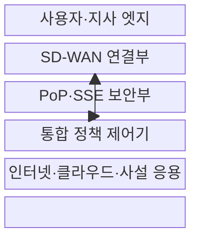
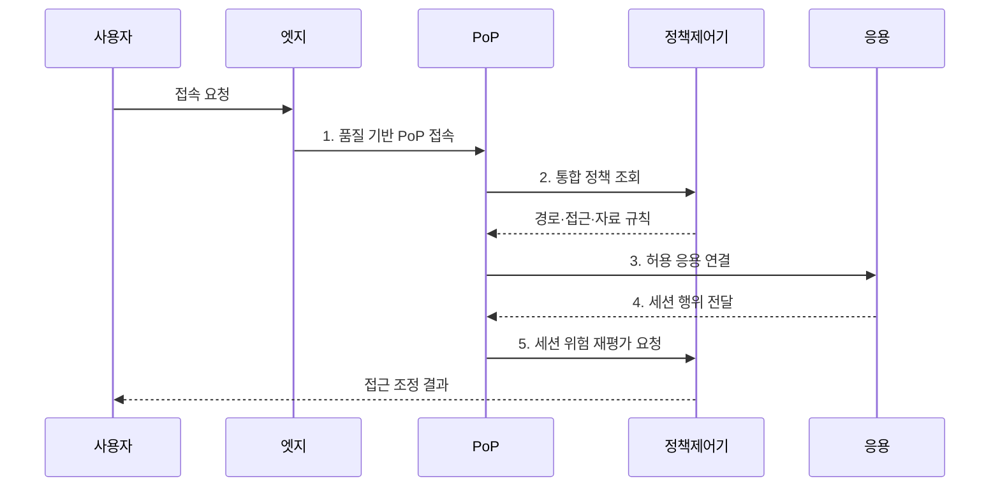

---
sidebar:
  order: 90
  label: "090. SASE - SD-WAN·CASB·SWG·ZTNA (SASE)"
  badge:
    text: "기출 · 50%"
    variant: note
title: "SASE - SD-WAN·CASB·SWG·ZTNA (SASE)"
date: "2026-07-31T11:06:48+09:00"
tags: ["notes-network"]
weight: 90
extra:
  question_no: "090"
  source_status: "기출"
  source_history: "135회"
  priority: 50
  priority_note: "설계형: 135회 Zero Trust의 SASE 구성"
---

## Ⅰ. 개요

핵심 용어

- **SASE**: SD-WAN 연결과 SSE 보안을 사용자 인접 PoP에서 하나의 정책으로 제공하는 클라우드 네트워크 구조이다.

- 정의/개념: SD-WAN 연결과 SSE 보안을 PoP에서 결합한 **클라우드 네트워크 구조**
- 배경/필요성: 본사 우회 구조의 **지연·회선 병목·정책 편차**

### 쉽게 이해하기 (학습용)

- 사용자가 어디에 있든 가까운 거점으로 연결해 빠른 경로와 같은 보안 규칙을 한 번에 적용한다.

## Ⅱ. 특징

핵심 용어

- **PoP**: 사용자와 가까운 위치에서 트래픽을 받아 연결·보안 기능을 수행하는 사업자 접속 거점이다.
- **통합 정책**: 신원·단말·응용 맥락을 바탕으로 경로 선택과 접근·자료 보안을 함께 결정하는 규칙이다.

- **신원·단말·응용 맥락**: 경로·접근 정책 통합
- **근접 PoP**: 보안 정책을 적용해 본사 우회 지연 제거
- **SD-WAN·SSE 단일 운영**: 연결·보안 정책 통합

### 쉽게 이해하기 (학습용)

- 지사마다 장비를 따로 관리하지 않아도 되지만 가까운 거점의 용량과 장애 대비가 실제 사용자 품질을 좌우한다.

## Ⅲ. 구조 및 구성요소

핵심 용어

- **SD-WAN·SSE**: SD-WAN은 응용·회선 품질로 경로를 선택하고 SSE는 웹·클라우드·사설 응용 접근 보안을 제공한다.
- **CASB·SWG·ZTNA**: 각각 클라우드 사용 통제, 웹 검사, 신원·단말 기반 응용 접근을 수행하는 SSE 기능이다.

| 구성요소 | 책임 |
|:---|:---|
| 사용자·지사 엣지 | 신원·단말·회선·응용 정보 수집 |
| SD-WAN 연결부 | 품질·응용 정책으로 경로 선택 |
| PoP·SSE 보안부 | SWG·CASB·ZTNA 정책 실행 |
| 통합 정책 제어기 | 연결·보안 규칙의 일관 배포 |
| 인터넷·클라우드·사설 응용 | 정책 통과 사용자의 목적 자원 |

### 쉽게 이해하기 (학습용)

- 엣지가 가까운 거점을 골라 트래픽을 보내면 그곳에서 웹과 클라우드, 사설 앱 정책을 검사한 뒤 목적지로 전달한다.

## Ⅳ. 흐름도

핵심 용어

- **품질 기반 PoP 접속**: 지연·손실·용량을 측정해 사용자 트래픽을 처리할 근접 거점을 선택하는 과정이다.
- **세션 위험 재평가**: 접속 중 행위와 맥락 변화를 반영해 기존 허용 수준을 다시 판단하는 절차이다.

**동작 원리**

- **1. 품질 기반 PoP 접속**: 지연·손실·용량으로 거점 선택
- **2. 통합 정책 조회**: 경로·접근·자료 규칙 결합
- **3. 허용 응용 연결**: ZTNA·SWG·CASB 검사 후 전달
- **4. 세션 행위 전달**: 응용 이용 행위를 PoP에 지속 제공
- **5. 세션 위험 재평가 요청**: 맥락 변화에 따른 권한 재판단

### 쉽게 이해하기 (학습용)

- 사용자와 단말을 확인해 가장 좋은 거점으로 보내고 같은 곳에서 보안 검사를 마친 뒤 허용된 응용에만 연결한다.

## Ⅴ. 종류 및 비교

핵심 용어

- **SASE·SSE**: SASE는 연결과 보안을 함께 전환하고 SSE는 기존 WAN을 유지하면서 보안 기능만 클라우드화한다.
- **본사 중심 보안**: 지사·원격 트래픽을 보안 검사를 위해 본사 데이터센터까지 우회시키는 구조이다.

| 접속 보안 구조 | SASE | SSE | 본사 중심 보안 |
|:---|:---|:---|:---|
| 적용 기준 | 지사·원격의 **연결·보안 통합** | 기존 WAN 유지·**보안만 전환** | 소수 지점·**본사 중심 서비스** |
| 핵심 특징 | SD-WAN·SSE의 **단일 정책** | 클라우드 **보안 기능 통합** | 본사 장비의 **우회 검사** |
| 한계 | 사업자·**PoP 품질 의존** | 연결·보안 **정책 분리** | 우회 지연·**본사 회선 병목** |

> 요약: 연결 통합 범위·PoP 의존성으로 방식 선택

### 쉽게 이해하기 (학습용)

- 연결과 보안을 함께 바꾸면 SASE, 보안만 클라우드화하면 SSE, 본사 중심 업무가 작으면 기존 우회 방식을 고려한다.

## Ⅵ. 실무 고려사항 및 대책

핵심 용어

- **자동 경로 전환**: 현재 PoP 장애나 품질 저하를 감지해 다른 거점으로 접속 경로를 바꾸는 기능이다.
- **응용 단위 권한**: 내부 네트워크 전체가 아니라 검증된 사용자에게 허용한 개별 응용만 연결하는 권한이다.

| 문제 | 대책 | 효과 |
|:---|:---|:---|
| PoP 장애의 **접속 품질 급락** | 다중 PoP와 **자동 경로 전환** | 지연과 **서비스 중단 감소** |
| 연결·보안의 **정책 불일치** | 단일 정책 모델·**배포 검증** | 우회 허용과 **운영 편차 축소** |
| 원격 사용자의 **과도한 망 접근** | **ZTNA**로 **응용 단위 권한** 적용 | 횡적 이동과 **노출 범위 감소** |

### 쉽게 이해하기 (학습용)

- 원격 개발자가 SASE PoP에서 신원과 단말 보안 상태를 검증받은 뒤 사내망 전체가 아닌 소스 저장소에만 접속하게 한다.

## Ⅶ. 결론

핵심 용어

- **전환 범위**: WAN 연결과 보안을 동시에 SASE로 바꿀지, 기존 WAN을 유지하고 SSE만 도입할지 정하는 범위이다.

- 연결·보안 동시 전환은 **SASE**, WAN 유지·보안 전환은 **SSE** 선택

### 쉽게 이해하기 (학습용)

- SASE는 기능 목록보다 사용자가 실제로 거치는 거점의 품질과 그곳에서 연결·보안 정책이 함께 적용되는지를 검증해야 한다.
