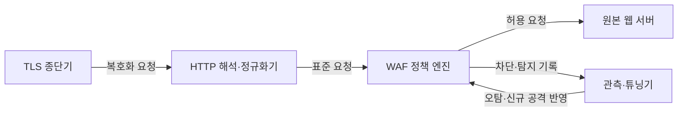
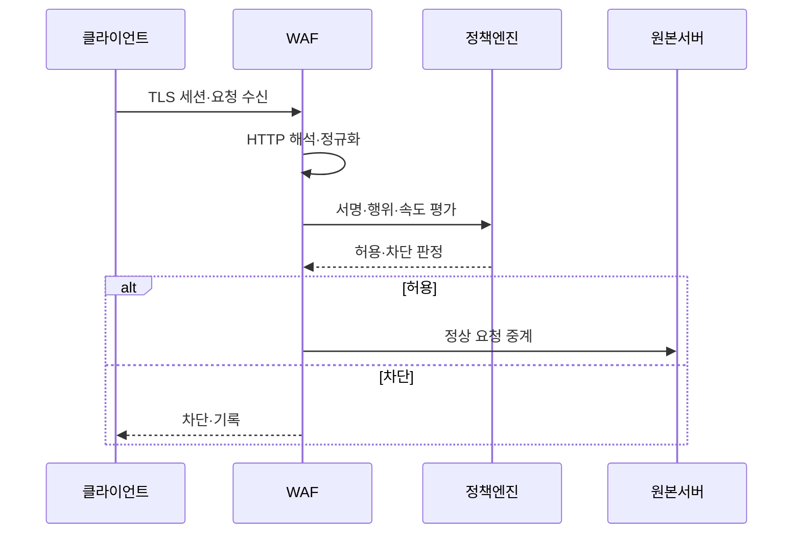

---
sidebar:
  order: 91
  label: "091. WAF 웹 애플리케이션 방화벽 (Web Application Firewall)"
  badge:
    text: "기출 · 70%"
    variant: note
title: "WAF 웹 애플리케이션 방화벽 (Web Application Firewall)"
date: "2026-07-27T23:59:59+09:00"
tags: ["notes-network"]
weight: 91
extra:
  question_no: "091"
  source_status: "기출"
  source_history: "129회, 137회"
  priority: 70
  priority_note: "비교·보안형: 129·137회 WAF 반복"
---

## 미리 알고가기

- **웹 애플리케이션 방화벽(Web Application Firewall, WAF)**: ‘와프’로 읽고 영문 머리글자를 딴 약어이며, 웹 요청·응답 문맥을 해석해 응용 공격을 탐지·차단함
- **하이퍼텍스트 전송 프로토콜(Hypertext Transfer Protocol, HTTP)**: ‘에이치티티피’로 읽고 영문 머리글자를 딴 약어이며, URL·헤더·본문으로 웹 요청·응답을 교환함
- **전송 계층 보안(Transport Layer Security, TLS)**: ‘티엘에스’로 읽고 영문 머리글자를 딴 약어이며, 상대 인증과 전송 내용 암호화를 제공함
- **정규화(Normalization)**: 여러 인코딩과 표기법을 동일한 의미의 표준 형태로 바꿔 우회 표현을 제거하는 처리다.
- **공격 서명**: 알려진 공격의 문자열·구조·동작 특징을 탐지 규칙으로 표현한 패턴이다.
- **가상 패치(Virtual Patch)**: 응용 코드를 즉시 수정하기 어려울 때 취약점 악용 요청을 WAF 규칙으로 임시 차단하는 조치다.
- **오탐(False Positive)**: 정상 요청을 공격으로 잘못 판단해 차단하는 오류다.
- **역방향 대리자(Reverse Proxy)**: 클라이언트 요청을 대신 받아 검사한 뒤 내부 원본 서버로 전달하는 중계 서버다.

## Ⅰ. 개요

- 정의/개념: HTTP 요청·응답 문맥으로 **웹 공격을 판정·차단**
- 기존 한계: 주소·포트 통제의 **응용 입력·업무 공격 미식별**

### 쉽게 이해하기 (학습용)

- 주소와 포트만 보지 않고 웹 요청의 실제 내용을 읽어 정상 사용과 공격 입력을 구분한다.

## Ⅱ. 특징

- URL·헤더·본문의 **HTTP 문맥 분석**
- 정규화의 **인코딩 우회 제거**
- 가상 패치의 **코드 수정 전 공격 차단**

### 쉽게 이해하기 (학습용)

- 공격자가 글자를 여러 방식으로 숨겨도 같은 형태로 풀어 검사하지만 규칙이 너무 넓으면 정상 요청도 막는다.

## Ⅲ. 아키텍처 및 구성요소

| 설계 요소 | 설명 |
|:---|:---|
| TLS 종단기 | 암호 세션을 종료해 요청을 복호화 |
| HTTP 해석·정규화기 | 주소·헤더·본문과 인코딩 해석 |
| WAF 정책 엔진 | 서명·행위·속도 규칙으로 판정 |
| 원본 웹 서버 | WAF가 허용한 요청만 수신 |
| 관측·튜닝기 | 오탐·누락 분석과 규칙 수명 관리 |

> 요약: 복호·정규화한 요청을 정책으로 판정

### 쉽게 이해하기 (학습용)

- 암호화된 요청을 풀어 같은 형태로 정리한 뒤 정책 엔진이 검사하고 허용된 요청만 숨겨진 원본 서버에 보낸다.

## Ⅳ. 원리 및 절차 흐름도

| 절차 | 설명 |
|:---|:---|
| TLS 세션·요청 수신 | 암호 세션 종료 후 요청 추출 |
| HTTP 해석·정규화 | 우회 인코딩을 표준 형태로 변환 |
| 서명·행위·속도 평가 | 공격 패턴과 요청 맥락을 검사 |
| 허용·차단 판정 | 규칙 결과와 예외 정책을 결합 |
| 정상 요청 중계 | 허용 요청만 원본 서버로 전달 |
| 차단·기록 | 공격 요청 거부와 근거 보존 |

> 요약: 요청 정규화 후 공격 문맥을 판정·집행

### 쉽게 이해하기 (학습용)

- WAF가 암호를 풀고 숨은 표현을 정리한 뒤 공격 규칙에 맞으면 막고 아니면 원본 서버로 넘긴다.

## Ⅴ. 종류 및 비교

| 웹 보안 통제 | WAF | 네트워크 방화벽 | 응용 코드 검증 |
|:---|:---|:---|:---|
| 적용 기준 | 다수 웹의 **공통 공격 차단** | 망 경계의 **허용 서비스 제한** | 개별 기능의 **업무 규칙 검증** |
| 핵심 특징 | HTTP 문맥의 **중앙 요청 검사** | 주소·포트·**연결 상태 제어** | 입력·권한의 **업무 의미 검증** |
| 한계 | 오탐·**TLS 복호화 병목** | 허용 포트의 **응용 공격 통과** | 구현 누락·**응용별 편차** |

> 요약: 연결·HTTP 문맥·업무 의미별 통제 조합

### 쉽게 이해하기 (학습용)

- 방화벽은 웹 연결을 열지 결정하고 WAF는 요청 내용을 검사하며 코드는 실제 업무 규칙과 권한을 최종 확인한다.

## Ⅵ. 실무 사례

1. 공개 웹 취약점의 **WAF 가상 패치**

### 쉽게 이해하기 (학습용)

- 애플리케이션 코드 수정 전에는 취약점 악용 요청을 WAF 규칙으로 차단하고 정식 패치가 배포되면 임시 규칙을 제거한다.

## Ⅶ. 결론

- 웹 취약점의 긴급 악용을 완화하기 위해 HTTP 문맥·규칙 오탐·응용 변경·업무 권한을 검토하여, 공통 공격과 가상 패치는 WAF로 차단하고 세부 인가는 코드에서 검증해야 한다.

### 쉽게 이해하기 (학습용)

- WAF는 공통 웹 공격을 줄이는 앞단 통제이며 실제 사용자의 권한과 업무 규칙은 응용 코드에서 반드시 확인해야 한다.
