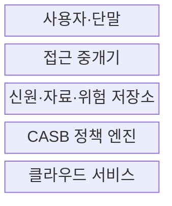
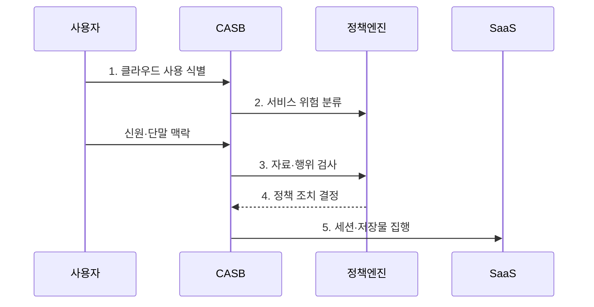

---
sidebar:
  order: 92
  label: "092. CASB 클라우드 접근 보안 브로커 (CASB)"
  badge:
    text: "기출 · 70%"
    variant: note
title: "CASB 클라우드 접근 보안 브로커 (CASB)"
date: "2026-07-27T23:59:59+09:00"
tags: ["notes-network"]
weight: 92
extra:
  question_no: "092"
  source_status: "기출"
  source_history: "122회, 137회"
  priority: 70
  priority_note: "설계·비교형: 122·137회 CASB 반복"
---

## 미리 알고가기

- **클라우드 접근 보안 중개(Cloud Access Security Broker, CASB)**: 클라우드 사용·위험·자료 이동을 가시화하고 정책을 집행하는 보안 체계
- **서비스형 소프트웨어(Software as a Service, SaaS)**: 사업자가 운영하는 응용 기능을 인터넷으로 제공하는 클라우드 모델
- **정보기술(Information Technology, IT)**: 업무 정보를 처리·저장·전송하는 컴퓨터·소프트웨어·네트워크 기술 전체를 뜻한다.
- **섀도 IT(Shadow IT)**: 조직의 승인과 관리 없이 사용자가 업무 자료를 처리하는 클라우드 서비스나 기술이다.
- **데이터 유출 방지(Data Loss Prevention, DLP)**: 자료의 내용과 등급을 식별해 허가되지 않은 전송·공유를 차단하는 기술이다.
- **순방향 프록시**: 사용자에서 클라우드로 나가는 통신을 중계해 접속과 업로드를 실시간 검사하는 방식이다.
- **역방향 프록시**: 클라우드 서비스로 들어가는 세션 앞에서 접속을 중계해 관리·비관리 단말의 행위를 통제하는 방식이다.
- **응용 프로그래밍 인터페이스(Application Programming Interface, API)**: CASB가 클라우드 서비스에 연결해 저장 자료·공유 설정·계정 상태를 검사하는 통로다.
- **클라우드 위험 카탈로그**: 서비스별 보안 기능, 법적 위치와 사고 이력 등을 평가해 승인 판단에 쓰는 목록이다.

## Ⅰ. 개요

- 정의/개념: 클라우드 사용·자료 이동을 **가시화·정책 통제**
- 기존 한계: 미승인 SaaS의 **계정·자료 유출 비가시성**

### 쉽게 이해하기 (학습용)

- 직원이 어떤 클라우드에 어떤 자료를 올리고 공유하는지 찾아 조직 규칙에 맞게 허용·차단·회수한다.

## Ⅱ. 특징

- 사용자·단말·서비스·자료의 **행위별 정책**
- 프록시의 **실시간 세션 통제**
- API 연동의 **저장 자료·공유 설정 점검**

### 쉽게 이해하기 (학습용)

- 같은 클라우드라도 회사 단말의 일반 문서는 허용하고 개인 단말의 중요 자료 내려받기는 막을 수 있다.

## Ⅲ. 구조 및 구성요소

| 구성요소 | 책임 |
|:---|:---|
| **사용자·단말** | 클라우드 접속과 자료 행위 생성 |
| **접근 중개기** | 프록시·API로 세션·저장물 검사 |
| **신원·자료·위험 저장소** | 계정·등급·서비스 위험 근거 제공 |
| **CASB 정책 엔진** | 맥락별 허용·차단·격리 결정 |
| **클라우드 서비스** | 응용·저장·공유 기능 제공 |

### 쉽게 이해하기 (학습용)

- 중개기가 클라우드 사용을 관찰하면 정책 엔진이 사용자와 단말, 자료 등급과 서비스 위험을 함께 보고 조치한다.

## Ⅳ. 흐름도

| 단계 | 동작 원리 |
|:---|:---|
| **1. 클라우드 사용 식별** | 로그·트래픽·API로 SaaS 발견 |
| **2. 서비스 위험 분류** | 승인 여부·보안 기능·위치 평가 |
| **3. 자료·행위 검사** | 신원·단말·등급별 이동 분석 |
| **4. 정책 조치 결정** | 허용·차단·격리·공유 회수 선택 |
| **5. 세션·저장물 집행** | 실시간 중계와 사후 API 조치 |

### 쉽게 이해하기 (학습용)

- 사용하는 클라우드를 찾고 서비스와 사용자, 자료의 위험을 차례로 확인해 접속을 막거나 저장된 공유를 회수한다.

## Ⅴ. 종류 및 비교

| CASB 연동 방식 | 순방향 프록시 | 역방향 프록시 | API 연동 |
|:---|:---|:---|:---|
| 적용 기준 | 관리 단말의 **업로드·웹 통제** | 비관리 단말의 **제한 접속** | 기존 저장물·**외부 공유 점검** |
| 핵심 특징 | 발신 세션의 **실시간 중계** | SaaS 로그인 뒤 **세션 중계** | 저장 자료·설정의 **사후 점검** |
| 한계 | 경로 우회·**복호화 병목** | 지원 SaaS·**인증 연계 제한** | API 지연·**실시간 차단 불가** |

> 요약: 세션 방향·실시간성·저장물로 방식 선택

### 쉽게 이해하기 (학습용)

- 회사 단말의 나가는 통신은 순방향, 외부 단말의 로그인은 역방향, 이미 저장된 자료는 API 방식으로 점검한다.

## Ⅵ. 실무 고려사항 및 대책

| 고려사항 | 대책 | 효과 |
|:---|:---|:---|
| 개인 SaaS의 **중요 자료 업로드** | 순방향 프록시와 **DLP** 적용 | 이동 중 **자료 유출 차단** |
| 기존 공유의 **사후 노출** | API 기반 **공유·권한 회수** | 저장 자료의 **노출 시간 감소** |
| 비관리 단말의 **과도한 다운로드** | 역방향 프록시로 **행위 제한** | 단말 위험별 **접근 범위 축소** |

### 쉽게 이해하기 (학습용)

- CASB가 프록시 구간에서 문서의 중요 정보와 사용자 계정을 검사해 업무 문서가 개인 클라우드로 업로드되는 것을 차단한다.

## Ⅶ. 결론

- **행위 시점·단말 관리성**으로 프록시·API 조합

### 쉽게 이해하기 (학습용)

- CASB는 클라우드 목록만 보여 주는 도구가 아니라 이동 중 자료와 이미 저장된 공유를 각각 맞는 방식으로 바꿔야 한다.
