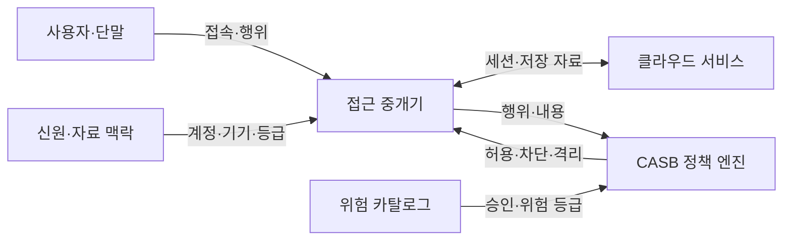
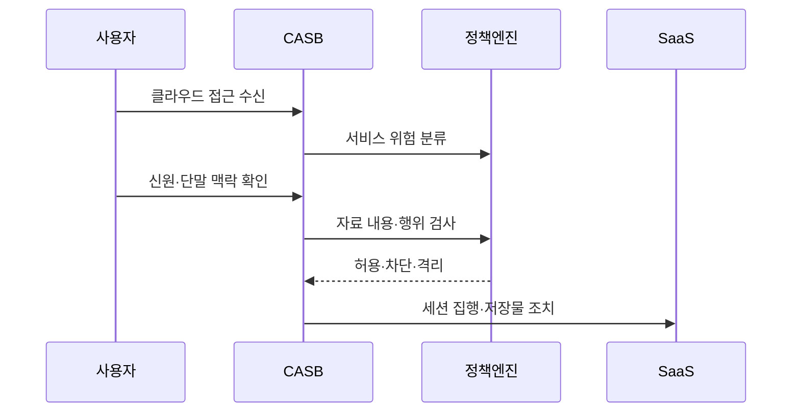

---
sidebar:
  order: 92
  label: "092. CASB 클라우드 접근 보안 브로커 (CASB)"
  badge:
    text: "기출 · 70%"
    variant: note
title: "CASB 클라우드 접근 보안 브로커 (CASB)"
date: "2026-07-25T00:45:00+09:00"
tags: ["notes-network"]
weight: 92
extra:
  question_no: "092"
  source_status: "기출"
  source_history: "122회, 137회"
  priority: 70
  priority_note: "설계·비교형: 122·137회 CASB 반복"
---

## 미리 알고가기

- **클라우드 접근 보안 중개(Cloud Access Security Broker, CASB)**: 사용자와 클라우드 서비스 사이에서 사용 현황·위험·자료 이동을 가시화하고 정책을 집행하는 보안 체계다.
- **서비스형 소프트웨어(Software as a Service, SaaS)**: 사용자가 인터넷으로 응용 기능을 이용하고 사업자가 운영하는 클라우드 서비스다.
- **정보기술(Information Technology, IT)**: 업무 정보를 처리·저장·전송하는 컴퓨터·소프트웨어·네트워크 기술 전체를 뜻한다.
- **섀도 IT(Shadow IT)**: 조직의 승인과 관리 없이 사용자가 업무 자료를 처리하는 클라우드 서비스나 기술이다.
- **데이터 유출 방지(Data Loss Prevention, DLP)**: 자료의 내용과 등급을 식별해 허가되지 않은 전송·공유를 차단하는 기술이다.
- **순방향 프록시**: 사용자에서 클라우드로 나가는 통신을 중계해 접속과 업로드를 실시간 검사하는 방식이다.
- **역방향 프록시**: 클라우드 서비스로 들어가는 세션 앞에서 접속을 중계해 관리·비관리 단말의 행위를 통제하는 방식이다.
- **응용 프로그래밍 인터페이스(Application Programming Interface, API)**: CASB가 클라우드 서비스에 연결해 저장 자료·공유 설정·계정 상태를 검사하는 통로다.
- **클라우드 위험 카탈로그**: 서비스별 보안 기능, 법적 위치와 사고 이력 등을 평가해 승인 판단에 쓰는 목록이다.

## Ⅰ. 개요

- **정의/개념**: 클라우드 사용·자료 이동을 가시화·통제하는 보안 중개
- **배경/필요성**: 미승인 SaaS·외부 공유를 통한 자료 유출

### 쉽게 이해하기 (학습용)

- 직원이 어떤 클라우드에 어떤 자료를 올리고 공유하는지 찾아 조직 규칙에 맞게 허용·차단·회수한다.

## Ⅱ. 특징

- 사용자·단말·서비스·자료 맥락으로 행위별 정책 결정한다.
- 승인 서비스도 행위별로 세밀하게 통제한다.
- 서비스 지원 API에 따라 사후 통제 범위 차이가 난다.
- 암호화 트래픽 복호화가 성능·사생활과 상충한다.

### 쉽게 이해하기 (학습용)

- 같은 클라우드라도 회사 단말의 일반 문서는 허용하고 개인 단말의 중요 자료 내려받기는 막을 수 있다.

## Ⅲ. 아키텍처 및 구성요소

| 설계 요소 | 설명 |
|:---|:---|
| 사용자·단말 | 클라우드 접속과 자료 행위 생성 |
| 접근 중개기 | 프록시·API로 세션·저장물 검사 |
| 신원·자료 맥락 | 계정·기기·위치·자료 등급 제공 |
| 클라우드 서비스 | 응용·저장·공유 기능 제공 |
| 위험 카탈로그 | 서비스의 승인·위험 근거 관리 |
| CASB 정책 엔진 | 맥락별 허용·차단·격리 결정 |

> 요약: 서비스 위험과 자료 맥락으로 행위 통제

### 쉽게 이해하기 (학습용)

- 중개기가 클라우드 사용을 관찰하면 정책 엔진이 사용자와 단말, 자료 등급과 서비스 위험을 함께 보고 조치한다.

## Ⅳ. 원리 및 절차 흐름도

| 절차 | 설명 |
|:---|:---|
| 클라우드 접근 수신 | 로그·트래픽·API로 SaaS 식별 |
| 서비스 위험 분류 | 승인 여부와 위험 등급을 결정 |
| 신원·단말 맥락 확인 | 계정·기기·위치·세션 확인 |
| 자료 내용·행위 검사 | 업로드·다운로드·공유를 분석 |
| 허용·차단·격리 | 위험과 정책에 맞는 조치 결정 |
| 세션 집행·저장물 조치 | 실시간 차단·공유 해제 수행 |

> 요약: 서비스·신원·자료 위험으로 행위 집행

### 쉽게 이해하기 (학습용)

- 사용하는 클라우드를 찾고 서비스와 사용자, 자료의 위험을 차례로 확인해 접속을 막거나 저장된 공유를 회수한다.

## Ⅴ. 종류 및 비교

| 판단 기준 | 순방향 프록시 | 역방향 프록시 | API 연동 |
|:---|:---|:---|:---|
| 핵심 특징 | 사용자 발신 세션을 실시간 중계 | SaaS 로그인 뒤 세션을 중계 | 저장 자료·설정을 사후 점검 |
| 적용 기준 | 관리 단말의 업로드·웹 통제 | 비관리 단말의 제한 접속 | 기존 저장물·외부 공유 점검 |
| 주요 위험 | 경로 우회·복호화 병목 | 지원 SaaS·인증 연계 제한 | API 지연·실시간 차단 불가 |

> 요약: 세션 방향·실시간성·저장물로 방식 선택

### 쉽게 이해하기 (학습용)

- 회사 단말의 나가는 통신은 순방향, 외부 단말의 로그인은 역방향, 이미 저장된 자료는 API 방식으로 점검한다.

## Ⅵ. 실무 사례

1. 협업 SaaS의 중요 문서 업로드를 DLP 차단
2. 공개 링크를 API로 찾아 조직 내부 공유로 회수

### 쉽게 이해하기 (학습용)

- 중요 표시가 있는 문서를 개인 클라우드에 올리려 하면 프록시가 내용을 검사해 전송을 막는다.
- 클라우드에 공개된 문서를 API로 주기 검사해 외부 링크를 끄고 조직 계정만 보도록 바꾼다.

## Ⅶ. 결론

- 서비스 위험·자료 등급·행위 시점으로 CASB 배치

### 쉽게 이해하기 (학습용)

- CASB는 클라우드 목록만 보여 주는 도구가 아니라 이동 중 자료와 이미 저장된 공유를 각각 맞는 방식으로 바꿔야 한다.
