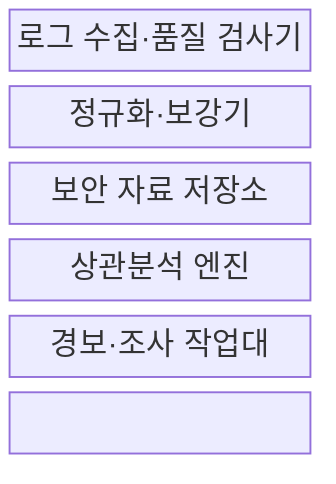
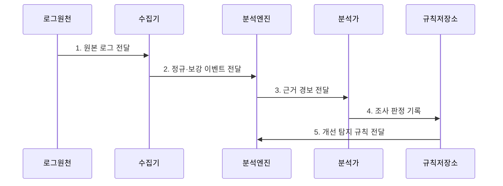

---
sidebar:
  order: 93
  label: "093. 융합 보안 관제 SIEM (Security Information and Event Management)"
  badge:
    text: "기출 · 70%"
    variant: note
title: "융합 보안 관제 SIEM (Security Information and Event Management)"
date: "2026-07-31T05:20:00+09:00"
tags: ["notes-network"]
weight: 93
extra:
  question_no: "093"
  source_status: "기출"
  source_history: "128회, 129회, 138회"
  priority: 70
  priority_note: "설계·운영형: 128·129·138회 SIEM 반복"
---

## 미리 알고가기

- **보안 정보·이벤트 관리(Security Information and Event Management, SIEM)**: 이종 로그를 정규화·상관분석해 조사 가능한 경보를 만드는 관제 체계
- **로그**: 시스템에서 발생한 접속, 변경, 오류와 통신 행위를 시간·주체·대상과 함께 남긴 기록이다.
- **로그 정규화**: 서로 다른 로그의 시간, 사용자, 주소와 행위 필드를 공통 구조와 값으로 변환하는 처리다.
- **맥락 보강(Context Enrichment)**: 이벤트에 자산 중요도, 사용자 부서, 위치와 위협 정보를 추가해 의미를 높이는 처리다.
- **상관분석**: 시간·사용자·자산·주소가 연결된 여러 이벤트를 하나의 공격 흐름으로 묶는 분석이다.
- **탐지 규칙**: 공격 조건과 시간 범위, 임계값을 논리로 표현해 이벤트가 맞으면 경보를 생성하는 기준이다.
- **오탐·미탐**: 정상 행위를 공격으로 잘못 알리는 오류와 실제 공격을 놓치는 오류다.
- **사용 사례(Use Case)**: 탐지할 공격 시나리오, 필요한 로그, 분석 조건과 대응 절차를 묶은 관제 단위다.
- **위협 정보(Threat Intelligence)**: 악성 주소·파일·공격 기법과 관련 근거를 수집·분석해 탐지와 대응 판단에 쓰는 정보다.
- **사건 시간선(Incident Timeline)**: 보안 사건의 행위를 발생 시각 순서로 연결해 공격 경로와 영향을 조사하는 기록이다.
- **로그 품질 검사**: 누락·중복·지연·시각 오류를 확인하는 절차다.
- **보안 자료 저장소**: 원본과 정규 로그를 검색·감사 목적으로 보존하는 저장소다.
- **상관분석 엔진**: 규칙과 행위 분석으로 공격 흐름과 위험을 계산하는 구성요소다.
- **조사 작업대**: 경보 근거·시간선·사건 상태를 분석가에게 제공하는 화면이다.
- **위험 점수**: 자산 중요도와 공격 가능성을 결합한 경보 우선순위 수치다.
- **시간창**: 여러 이벤트를 하나의 흐름으로 연결하는 시간 범위다.

## Ⅰ. 개요

- 정의/개념: 이종 로그를 정규화·상관분석하는 **통합 보안 관제 체계**
- 배경/필요성: 개별 로그만으로는 **공격 흐름·영향 범위 추적 곤란**

### 쉽게 이해하기 (학습용)

- 여러 장비의 기록을 시간과 사용자 기준으로 이어 붙여 따로 보면 평범한 행동을 하나의 공격 흐름으로 찾는다.

## Ⅱ. 특징

- **이종 로그 정규화**: 공통 필드와 값으로 변환
- **이벤트 맥락 보강**: 자산·신원·위협 정보 결합
- **다단계 공격 상관분석**: 시간·사용자·자산 연결

### 쉽게 이해하기 (학습용)

- 로그 양보다 공격 흐름을 잇는 사용자와 시간, 자산 정보가 빠지지 않고 정확한지가 더 중요하다.

## Ⅲ. 구조 및 구성요소

| 구성요소 | 책임 |
|:---|:---|
| 로그 수집·품질 검사기 | 누락·중복·지연·시각 오류 확인 |
| 정규화·보강기 | 공통 필드와 자산·신원 맥락 결합 |
| 보안 자료 저장소 | 원본·정규 로그의 검색·감사 보존 |
| 상관분석 엔진 | 규칙·행위로 공격 흐름·위험 계산 |
| 경보·조사 작업대 | 근거·시간선·사건 상태 제공 |

### 쉽게 이해하기 (학습용)

- 수집한 기록을 같은 형식으로 바꾸고 과거 기록과 연결해 분석한 뒤 조사자가 근거를 바로 볼 수 있는 경보로 만든다.

## Ⅳ. 흐름도

**동작 원리**

- **1. 원본 로그 전달**: 수집 대상의 접속·변경·통신 기록 제공
- **2. 정규·보강 이벤트 전달**: 공통 구조와 자산·신원 맥락 결합
- **3. 근거 경보 전달**: 흐름 상관·위험 점수로 우선순위화
- **4. 조사 판정 기록**: 원본 시간선으로 오탐·영향 확인
- **5. 개선 탐지 규칙 전달**: 판정을 조건·임계값에 반영

### 쉽게 이해하기 (학습용)

- 로그를 정리해 공격 흐름을 찾고 경보의 원본 기록을 조사한 결과로 잘못 울리거나 놓친 규칙을 고친다.

## Ⅴ. 종류 및 비교

| SIEM 분석 방식 | 규칙 기반 분석 | 행위 기반 분석 | 위협 정보 대조 |
|:---|:---|:---|:---|
| 적용 기준 | 공격 절차·**필수 로그 명확** | 미지의 **계정·단말 이상 탐지** | 외부 **위협 흔적 확인** |
| 핵심 특징 | 조건·시간창의 **이벤트 연결** | 정상 기준의 **행위 편차 탐지** | 악성 주소·파일의 **지표 대조** |
| 한계 | 변형 공격·**규칙 폭증** | 기준 오염·**설명 어려움** | 오래된 정보·**단순 일치 오탐** |

> 요약: 알려진 절차·행위 편차·위협 흔적으로 분석

### 쉽게 이해하기 (학습용)

- 정해진 공격 순서는 규칙, 평소와 다른 행동은 행위 분석, 알려진 공격자 흔적은 위협 정보 대조로 찾는다.

## Ⅵ. 실무 고려사항 및 대책

| 고려사항 | 대책 | 효과 |
|:---|:---|:---|
| 시각 불일치의 **공격 순서 왜곡** | 시간 동기와 **수집 지연 보정** | 사건 시간선의 **정확성 향상** |
| 로그 누락의 **탐지 규칙 무력화** | 사용 사례별 **필수 필드 계약** | 규칙 실행의 **완전성 확보** |
| 경보 폭증의 **분석가 과부하** | 자산 위험·근거 기반 **우선순위** | 조사 시간과 **오탐 소모 감소** |

### 쉽게 이해하기 (학습용)

- 낯선 위치의 로그인, 추가 인증 실패, 관리자 권한 변경 로그가 연속되면 SIEM이 하나의 계정 탈취 경보로 상관분석한다.

## Ⅶ. 결론

- 알려진 절차는 **규칙**, 미지 이상은 **행위**, 악성 흔적은 위협 정보 분석

### 쉽게 이해하기 (학습용)

- SIEM은 로그를 많이 모으기보다 공격 사용 사례마다 필요한 필드와 경보를 설명할 원본 근거를 먼저 확보해야 한다.
