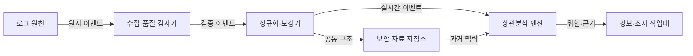
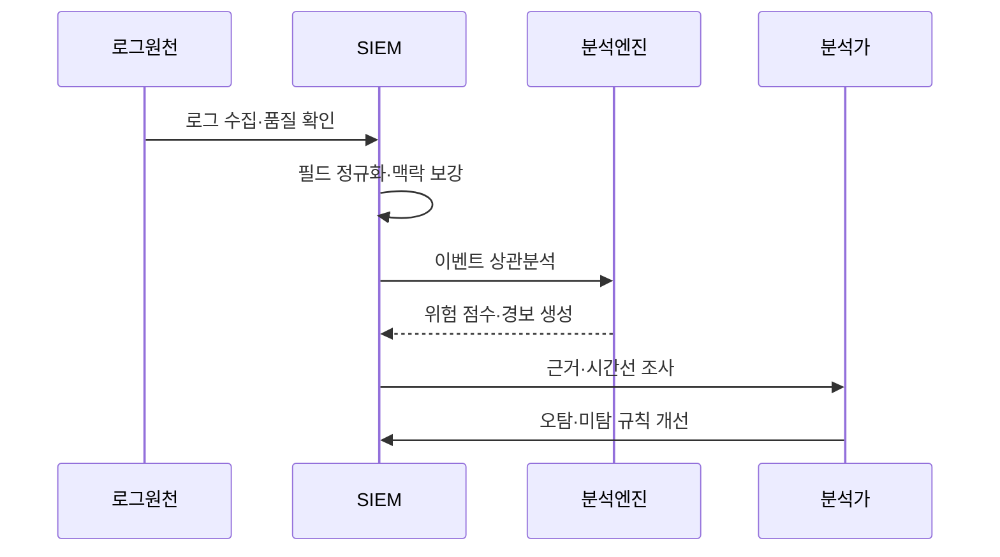

---
sidebar:
  order: 93
  label: "093. 융합 보안 관제 SIEM (Security Information and Event Management)"
  badge:
    text: "기출 · 70%"
    variant: note
title: "융합 보안 관제 SIEM (Security Information and Event Management)"
date: "2026-07-27T23:59:59+09:00"
tags: ["notes-network"]
weight: 93
extra:
  question_no: "093"
  source_status: "기출"
  source_history: "128회, 129회, 138회"
  priority: 70
  priority_note: "설계·운영형: 128·129·138회 SIEM 반복"
---

## 미리 알고가기

- **보안 정보·이벤트 관리(Security Information and Event Management, SIEM)**: ‘심’으로 읽고 영문 머리글자를 딴 약어이며, 이종 로그를 정규화·연관 분석해 조사 가능한 경보를 만듦
- **로그**: 시스템에서 발생한 접속, 변경, 오류와 통신 행위를 시간·주체·대상과 함께 남긴 기록이다.
- **로그 정규화**: 서로 다른 로그의 시간, 사용자, 주소와 행위 필드를 공통 구조와 값으로 변환하는 처리다.
- **맥락 보강(Context Enrichment)**: 이벤트에 자산 중요도, 사용자 부서, 위치와 위협 정보를 추가해 의미를 높이는 처리다.
- **상관분석**: 시간·사용자·자산·주소가 연결된 여러 이벤트를 하나의 공격 흐름으로 묶는 분석이다.
- **탐지 규칙**: 공격 조건과 시간 범위, 임계값을 논리로 표현해 이벤트가 맞으면 경보를 생성하는 기준이다.
- **오탐·미탐**: 정상 행위를 공격으로 잘못 알리는 오류와 실제 공격을 놓치는 오류다.
- **사용 사례(Use Case)**: 탐지할 공격 시나리오, 필요한 로그, 분석 조건과 대응 절차를 묶은 관제 단위다.
- **위협 정보(Threat Intelligence)**: 악성 주소·파일·공격 기법과 관련 근거를 수집·분석해 탐지와 대응 판단에 쓰는 정보다.
- **사건 시간선(Incident Timeline)**: 보안 사건의 행위를 발생 시각 순서로 연결해 공격 경로와 영향을 조사하는 기록이다.

## Ⅰ. 개요

- 정의/개념: 이종 로그를 **정규화·상관분석해 보안 경보 생성**
- 기존 한계: 개별 로그만으로는 **공격 흐름·영향 범위 추적 곤란**

### 쉽게 이해하기 (학습용)

- 여러 장비의 기록을 시간과 사용자 기준으로 이어 붙여 따로 보면 평범한 행동을 하나의 공격 흐름으로 찾는다.

## Ⅱ. 특징

- 공통 필드의 **이종 로그 정규화**
- 자산·신원·위협의 **이벤트 맥락 보강**
- 시간·사용자·자산의 **다단계 공격 상관분석**

### 쉽게 이해하기 (학습용)

- 로그 양보다 공격 흐름을 잇는 사용자와 시간, 자산 정보가 빠지지 않고 정확한지가 더 중요하다.

## Ⅲ. 아키텍처 및 구성요소

| 설계 요소 | 설명 |
|:---|:---|
| 로그 원천 | 인증·단말·망·응용 이벤트 생성 |
| 수집·품질 검사기 | 누락·중복·지연·시각 오류 확인 |
| 정규화·보강기 | 공통 필드와 자산·신원 맥락 결합 |
| 보안 자료 저장소 | 검색·감사할 원본·정규 로그 보존 |
| 상관분석 엔진 | 규칙·행위로 공격 흐름과 위험 계산 |
| 경보·조사 작업대 | 근거·시간선·사건 상태 제공 |

> 요약: 공통 맥락의 현재·과거 로그로 공격 연결

### 쉽게 이해하기 (학습용)

- 수집한 기록을 같은 형식으로 바꾸고 과거 기록과 연결해 분석한 뒤 조사자가 근거를 바로 볼 수 있는 경보로 만든다.

## Ⅳ. 원리 및 절차 흐름도

| 절차 | 설명 |
|:---|:---|
| 로그 수집·품질 확인 | 누락·중복·지연·시각을 검사 |
| 필드 정규화·맥락 보강 | 공통 구조와 자산·신원 결합 |
| 이벤트 상관분석 | 시간·주체·대상으로 흐름 연결 |
| 위험 점수·경보 생성 | 중요도·위협 근거로 우선순위화 |
| 근거·시간선 조사 | 원본 이벤트와 영향 범위 확인 |
| 오탐·미탐 규칙 개선 | 조사 결과를 조건·임계값에 반영 |

> 요약: 로그 품질부터 경보 근거·규칙 개선까지 연결

### 쉽게 이해하기 (학습용)

- 로그를 정리해 공격 흐름을 찾고 경보의 원본 기록을 조사한 결과로 잘못 울리거나 놓친 규칙을 고친다.

## Ⅴ. 종류 및 비교

| SIEM 분석 방식 | 규칙 기반 분석 | 행위 기반 분석 | 위협 정보 대조 |
|:---|:---|:---|:---|
| 적용 기준 | 공격 절차·**필수 로그 명확** | 미지의 **계정·단말 이상 탐지** | 외부 **위협 흔적 확인** |
| 핵심 특징 | 조건·시간창의 **이벤트 연결** | 정상 기준의 **행위 편차 탐지** | 악성 주소·파일의 **지표 대조** |
| 한계 | 변형 공격·**규칙 폭증** | 기준 오염·**설명 어려움** | 오래된 정보·**단순 일치 오탐** |

> 요약: 알려진 절차·행위 편차·위협 흔적으로 분석

### 쉽게 이해하기 (학습용)

- 정해진 공격 순서는 규칙, 평소와 다른 행동은 행위 분석, 알려진 공격자 흔적은 위협 정보 대조로 찾는다.

## Ⅵ. 실무 사례

1. 로그인·추가 인증·권한 로그로 계정 탈취 탐지
2. 방화벽·서버 로그로 내부 이동 시간선 구성

### 쉽게 이해하기 (학습용)

- 낯선 위치 로그인 뒤 추가 인증 실패와 관리자 권한 변경이 이어지면 하나의 계정 탈취 경보로 묶는다.
- 한 서버 침해 뒤 여러 내부 서버로 접속한 기록을 시간순으로 연결해 이동 경로와 영향을 찾는다.

## Ⅶ. 결론

- 필수 로그·공통 맥락·조사 근거로 SIEM 설계

### 쉽게 이해하기 (학습용)

- SIEM은 로그를 많이 모으기보다 공격 사용 사례마다 필요한 필드와 경보를 설명할 원본 근거를 먼저 확보해야 한다.
