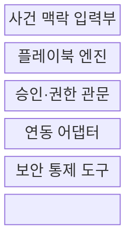
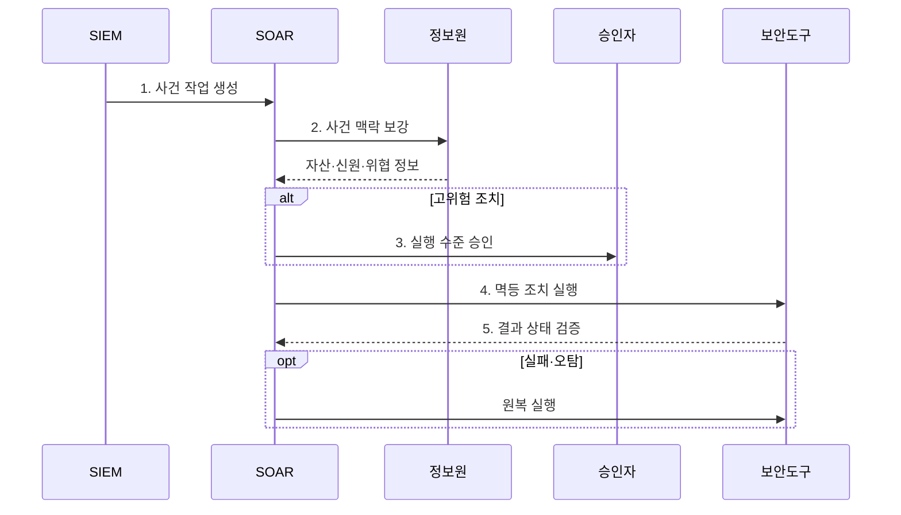

---
sidebar:
  order: 94
  label: "094. SOAR 보안 오케스트레이션·자동화·대응 (Security Orchestration, Automation, and Response)"
  badge:
    text: "기출 · 50%"
    variant: note
title: "SOAR 보안 오케스트레이션·자동화·대응 (Security Orchestration, Automation, and Response)"
date: "2026-07-30T18:30:00+09:00"
tags: ["notes-network"]
weight: 94
extra:
  question_no: "094"
  source_status: "기출"
  source_history: "138회"
  priority: 50
  priority_note: "운영·방안형: 138회 SOAR 직접 비교"
---

## 미리 알고가기

- **보안 오케스트레이션·자동화·대응(Security Orchestration, Automation, and Response, SOAR)**: 보안 도구를 연결하고 반복 사건 대응을 플레이북으로 자동·승인 실행하는 플랫폼이다.
- **보안 정보·이벤트 관리(Security Information and Event Management, SIEM)**: 여러 로그를 상관분석해 조사할 보안 경보를 만드는 플랫폼이다.
- **오케스트레이션**: 서로 다른 보안 도구의 조회·판단·조치 호출을 하나의 사건 흐름으로 연결하는 기능이다.
- **플레이북(Playbook)**: 사건 조건, 정보 수집, 분기, 승인, 조치와 원복 순서를 실행 가능한 절차로 정의한 문서다.
- **연동 어댑터**: SOAR가 보안 제품의 응용 프로그래밍 인터페이스를 공통 방식으로 호출하게 하는 연결 모듈이다.
- **응용 프로그래밍 인터페이스(Application Programming Interface, API)**: 다른 소프트웨어의 기능과 데이터를 정해진 요청 형식으로 호출하는 연결 규약이다.
- **정보 보강**: 경보에 자산 중요도, 사용자, 위협 평판과 과거 사건 정보를 자동 추가하는 처리다.
- **원복(Rollback)**: 자동 조치가 잘못됐을 때 차단·격리·계정 상태를 조치 전으로 되돌리는 기능이다.
- **멱등성(Idempotency)**: 같은 조치를 여러 번 호출해도 결과가 한 번 실행한 것과 같게 유지되는 성질이다.

## Ⅰ. 개요

- 정의/개념: **플레이북 기반 보안 대응 자동화** 플랫폼
- 배경/필요성: 수동 대응의 **지연·절차 누락**

### 쉽게 이해하기 (학습용)

- 경보가 오면 여러 보안 도구를 사람이 옮겨 다니지 않고 정해진 순서로 조사하고 필요한 조치를 실행한다.

## Ⅱ. 특징

- 이종 보안 도구의 **오케스트레이션**
- 반복 대응 절차의 **플레이북 자동화**
- 영향도 기반 **자동·승인·수동 분기**

### 쉽게 이해하기 (학습용)

- 안전한 조회는 자동화하고 계정 잠금처럼 영향이 큰 조치는 사람이 승인하도록 나눠야 한다.

## Ⅲ. 구조 및 구성요소

| 구성요소 | 책임 |
|:---|:---|
| **사건 맥락 입력부** | 경보 중복 제거와 자산·위협 보강 |
| **플레이북 엔진** | 조건·분기·승인·조치 순서 실행 |
| **승인·권한 관문** | 영향도별 승인과 최소 권한 적용 |
| **연동 어댑터** | 제품별 API 호출·오류 변환 |
| **보안 통제 도구** | 메일·단말·계정·망 조치 수행 |

### 쉽게 이해하기 (학습용)

- 경보에 필요한 정보를 붙이면 플레이북이 승인 조건을 확인하고 어댑터로 각 보안 도구의 조치를 호출한다.

## Ⅳ. 흐름도

**동작 원리**

- **1. 사건 작업 생성**: 중복 경보를 묶어 단일 사건 구성
- **2. 사건 맥락 보강**: 자산 중요도·신원·위협 평판 결합
- **3. 실행 수준 승인**: 신뢰도·영향·가역성으로 분기
- **4. 멱등 조치 실행**: 최소 API 권한으로 반복 안전 호출
- **5. 결과 상태 검증**: 의도 상태 대조 후 실패 시 원복

### 쉽게 이해하기 (학습용)

- 경보를 정리하고 위험을 판단해 큰 조치는 승인받은 뒤 실행하며 도구가 실제로 바뀌었는지 확인하고 실패하면 되돌린다.

## Ⅴ. 종류 및 비교

| SOAR 실행 방식 | 완전 자동 대응 | 승인 기반 대응 | 수동 예외 대응 |
|:---|:---|:---|:---|
| 적용 기준 | 반복·가역적 **고신뢰 조치** | 영향 큰 **표준 조치** | 신규·모호한 **복합 사건** |
| 핵심 특징 | 조건 충족 시 **즉시 자동 조치** | 자동 조사 후 **사람 승인** | 분석가의 **직접 조사·조치** |
| 한계 | 오탐의 **조치 확산** | 승인 대기의 **대응 지연** | 수동 편차·**단계 누락** |

> 요약: 탐지 신뢰도·조치 영향·가역성으로 자동화

### 쉽게 이해하기 (학습용)

- 쉽게 되돌릴 반복 조치는 자동, 영향이 큰 조치는 승인, 처음 보는 복잡한 사건은 사람이 직접 처리한다.

## Ⅵ. 실무 고려사항 및 대책

| 고려사항 | 대책 | 효과 |
|:---|:---|:---|
| 오탐 조치의 **업무 중단** | 영향도별 **승인·자동화 분기** | 자동화 속도와 **업무 안전 균형** |
| API 재시도의 **중복 차단** | 멱등 키·상태 확인 **선행 호출** | 이중 조치와 **복구 부담 감소** |
| 제품 오류의 **플레이북 중단** | 보상 단계·타임아웃·**원복** 설계 | 부분 실패의 **영향 격리** |

### 쉽게 이해하기 (학습용)

- SOAR가 피싱 메일과 악성 주소를 자동 차단하고 업무 중단 영향이 큰 계정 잠금은 담당자 승인 후 실행한다.

## Ⅶ. 결론

- **신뢰도·영향·가역성**으로 SOAR 자동화 수준 결정

### 쉽게 이해하기 (학습용)

- SOAR는 사람을 없애는 도구가 아니라 반복 작업을 맡기고 위험한 판단은 승인과 원복 장치로 통제하는 플랫폼이다.
