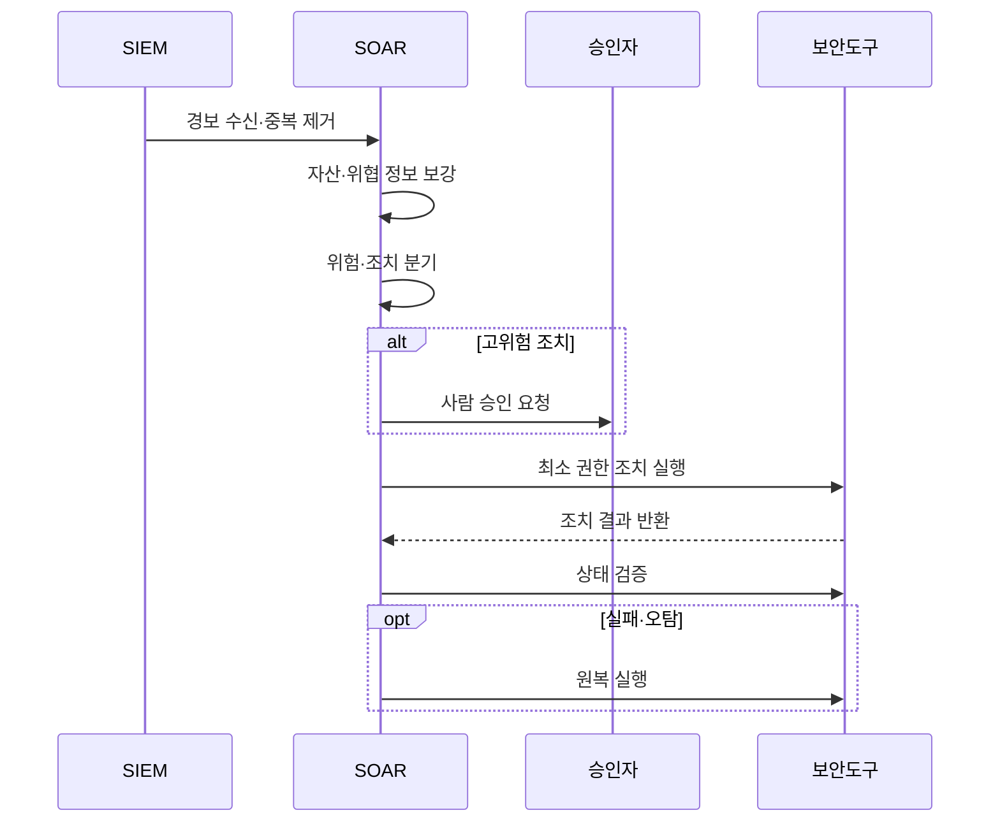

---
sidebar:
  order: 94
  label: "094. SOAR 보안 오케스트레이션·자동화·대응 (Security Orchestration, Automation, and Response)"
  badge:
    text: "기출 · 50%"
    variant: note
title: "SOAR 보안 오케스트레이션·자동화·대응 (Security Orchestration, Automation, and Response)"
date: "2026-07-27T23:59:59+09:00"
tags: ["notes-network"]
weight: 94
extra:
  question_no: "094"
  source_status: "기출"
  source_history: "138회"
  priority: 50
  priority_note: "운영·방안형: 138회 SOAR 직접 비교"
---

## 미리 알고가기

- **보안 오케스트레이션·자동화·대응(Security Orchestration, Automation, and Response, SOAR)**: 보안 도구를 연결하고 반복 사건 대응을 플레이북으로 자동·승인 실행하는 플랫폼이다.
- **보안 정보·이벤트 관리(Security Information and Event Management, SIEM)**: 여러 로그를 상관분석해 조사할 보안 경보를 만드는 플랫폼이다.
- **오케스트레이션**: 서로 다른 보안 도구의 조회·판단·조치 호출을 하나의 사건 흐름으로 연결하는 기능이다.
- **플레이북(Playbook)**: 사건 조건, 정보 수집, 분기, 승인, 조치와 원복 순서를 실행 가능한 절차로 정의한 문서다.
- **연동 어댑터**: SOAR가 보안 제품의 응용 프로그래밍 인터페이스를 공통 방식으로 호출하게 하는 연결 모듈이다.
- **응용 프로그래밍 인터페이스(Application Programming Interface, API)**: 다른 소프트웨어의 기능과 데이터를 정해진 요청 형식으로 호출하는 연결 규약이다.
- **정보 보강**: 경보에 자산 중요도, 사용자, 위협 평판과 과거 사건 정보를 자동 추가하는 처리다.
- **원복(Rollback)**: 자동 조치가 잘못됐을 때 차단·격리·계정 상태를 조치 전으로 되돌리는 기능이다.
- **멱등성(Idempotency)**: 같은 조치를 여러 번 호출해도 결과가 한 번 실행한 것과 같게 유지되는 성질이다.
- **핵심 약어 읽기와 표기**: SOAR·SIEM·API는 소어·심·에이피아이로 읽고 영문 머리글자를 딴 표기이며, 각각 대응 자동화·보안 이벤트 분석·도구 연동을 뜻한다.

## Ⅰ. 개요

- 정의: **플레이북 기반 보안 대응 자동화** 플랫폼
- 기존 한계: 수동 대응의 **지연·절차 누락**

### 쉽게 이해하기 (학습용)

- 경보가 오면 여러 보안 도구를 사람이 옮겨 다니지 않고 정해진 순서로 조사하고 필요한 조치를 실행한다.

## Ⅱ. 특징

- 이종 보안 도구의 **오케스트레이션**
- 반복 대응 절차의 **플레이북 자동화**
- 영향도 기반 **자동·승인·수동 분기**

### 쉽게 이해하기 (학습용)

- 안전한 조회는 자동화하고 계정 잠금처럼 영향이 큰 조치는 사람이 승인하도록 나눠야 한다.

## Ⅲ. 아키텍처 및 구성요소

| 설계 요소 | 설명 |
|:---|:---|
| 경보·사건 입력부 | 경보 수신·중복 제거·사건 생성 |
| 정보 보강기 | 자산·신원·위협·과거 이력 결합 |
| 플레이북 엔진 | 조건·분기·승인·조치 순서 실행 |
| 승인·권한 관문 | 영향도별 승인과 최소 권한 적용 |
| 연동 어댑터 | 제품별 API 호출·오류 변환 |
| 보안 통제 도구 | 메일·단말·계정·망 조치 수행 |

> 요약: 사건 맥락과 승인으로 도구 조치를 실행

### 쉽게 이해하기 (학습용)

- 경보에 필요한 정보를 붙이면 플레이북이 승인 조건을 확인하고 어댑터로 각 보안 도구의 조치를 호출한다.

## Ⅳ. 원리 및 절차 흐름도

| 절차 | 설명 |
|:---|:---|
| 경보 수신·중복 제거 | 같은 사건을 묶어 단일 작업 생성 |
| 자산·위협 정보 보강 | 대상 중요도와 평판을 자동 조회 |
| 위험·조치 분기 | 신뢰도·영향도로 실행 수준 결정 |
| 사람 승인 요청 | 잠금·차단 등 고영향 조치 확인 |
| 최소 권한 조치 실행 | 필요한 도구 권한만 사용해 호출 |
| 조치 결과 반환 | 도구가 실행 성공·실패 상태 보고 |
| 상태 검증 | 실제 대상 상태가 의도와 같은지 확인 |
| 원복 실행 | 실패·오탐이면 조치 전 상태로 복구 |

> 요약: 위험별 승인 후 조치 결과·원복까지 검증

### 쉽게 이해하기 (학습용)

- 경보를 정리하고 위험을 판단해 큰 조치는 승인받은 뒤 실행하며 도구가 실제로 바뀌었는지 확인하고 실패하면 되돌린다.

## Ⅴ. 종류 및 비교

| SOAR 실행 방식 | 완전 자동 대응 | 승인 기반 대응 | 수동 예외 대응 |
|:---|:---|:---|:---|
| 적용 기준 | 반복적·가역적·신뢰도 높은 조치 | 영향은 크지만 절차가 표준화 | 새 공격·모호한 영향·복합 사건 |
| 핵심 특징 | 조건 충족 시 즉시 조치 | 자동 조사 후 사람 승인 | 분석가 직접 조사·조치 |
| 한계 | 오탐 조치 확산 | 승인 지연 | 대응 지연·단계 누락 |

> 요약: 탐지 신뢰도·조치 영향·가역성으로 자동화

### 쉽게 이해하기 (학습용)

- 쉽게 되돌릴 반복 조치는 자동, 영향이 큰 조치는 승인, 처음 보는 복잡한 사건은 사람이 직접 처리한다.

## Ⅵ. 실무 사례

1. 피싱 사고의 **메일 격리·계정 잠금 자동화**

### 쉽게 이해하기 (학습용)

- SOAR가 피싱 메일과 악성 주소를 자동 차단하고 업무 중단 영향이 큰 계정 잠금은 담당자 승인 후 실행한다.

## Ⅶ. 결론

- **신뢰도·영향·가역성**에 따른 자동화 결정

### 쉽게 이해하기 (학습용)

- SOAR는 사람을 없애는 도구가 아니라 반복 작업을 맡기고 위험한 판단은 승인과 원복 장치로 통제하는 플랫폼이다.
