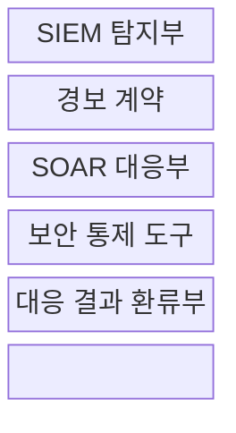
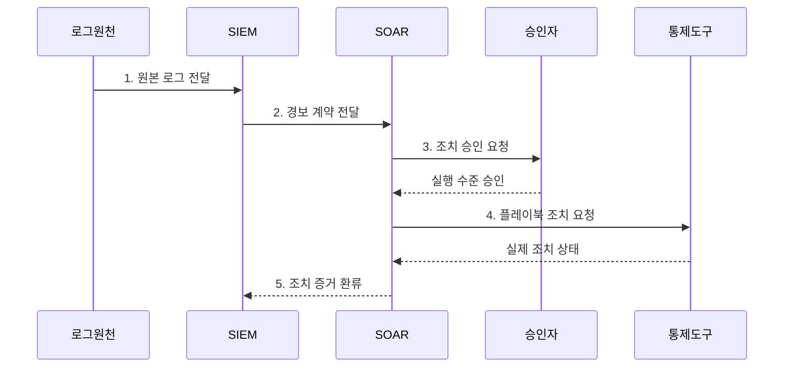

---
sidebar:
  order: 95
  label: "095. SIEM vs SOAR 비교 (SIEM vs SOAR Comparison)"
  badge:
    text: "기출 · 50%"
    variant: note
title: "SIEM vs SOAR 비교 (SIEM vs SOAR Comparison)"
date: "2026-08-02T15:05:00+09:00"
tags: ["notes-network"]
weight: 95
extra:
  question_no: "095"
  source_status: "기출"
  source_history: "138회"
  priority: 50
  priority_note: "비교형: 138회 SIEM·SOAR 직접 출제"
---

## Ⅰ. 개요

핵심 용어

- **보안 정보·이벤트 관리(Security Information and Event Management, SIEM)**: 이종 로그를 정규화·상관분석해 근거가 있는 보안 경보를 생성하는 플랫폼이다.
- **보안 오케스트레이션·자동화·대응(Security Orchestration, Automation, and Response, SOAR)**: 경보를 보강하고 승인·조치·원복 절차를 플레이북으로 실행하는 플랫폼이다.

- 정의/개념: 탐지 SIEM과 대응 SOAR를 연결한 **폐루프 보안 관제 구조**
- 배경/필요성: 탐지·조치 분리의 **대응 지연**

### 쉽게 이해하기 (학습용)

- SIEM이 여러 기록에서 사건과 이유를 찾으면 SOAR가 그 사건을 조사·조치하고 결과를 다시 SIEM 개선에 돌려준다.

## Ⅱ. 특징

핵심 용어

- **상관분석**: 시간·사용자·자산·주소가 연결된 여러 이벤트를 하나의 공격 흐름으로 묶는 분석이다.
- **플레이북**: 사건 조건, 정보 조회, 승인, 조치와 결과 검증을 실행 가능한 순서로 정의한 절차다.
- **폐루프 관제**: 탐지 근거가 대응을 만들고 대응 결과가 다시 탐지 규칙과 플레이북을 개선하는 순환 체계다.

- **SIEM 탐지**: 로그 상관분석과 근거 경보 생성
- **SOAR 대응**: 정보 보강과 플레이북 실행
- **결과 환류**: 조치 증거를 탐지 규칙에 반영

### 쉽게 이해하기 (학습용)

- 틀린 경보를 자동화하면 더 빨리 잘못 막으므로 조치 전 신뢰도와 영향도를 다시 확인해야 한다.

## Ⅲ. 구조 및 구성요소

핵심 용어

- **경보 계약**: SIEM이 SOAR에 전달할 사건 식별자, 신뢰도, 근거, 자산과 권장 조치를 정한 자료 규격이다.
- **탐지 규칙**: 공격 조건과 임계값을 논리로 표현한 경보 생성 기준이다.
- **보안 통제 도구**: 계정·단말·메일·네트워크 상태를 바꾸는 제품이다.

| 구성요소 | 책임 |
|:---|:---|
| SIEM 탐지부 | 정규화·상관분석·경보 생성 |
| 경보 계약 | 사건 ID·근거·신뢰도·자산 전달 |
| SOAR 대응부 | 보강·승인·플레이북 실행 |
| 보안 통제 도구 | 계정·단말·메일·망 상태 변경 |
| 대응 결과 환류부 | 조치 증거로 규칙·절차 개선 |

### 쉽게 이해하기 (학습용)

- SIEM 경보가 공통 규격으로 SOAR에 넘어가고 보안 도구의 실제 조치 결과가 다시 탐지와 대응 절차를 고친다.

## Ⅳ. 흐름도

핵심 용어

- **조치 증거**: SOAR가 어떤 권한으로 무엇을 실행했고 실제 상태가 어떻게 바뀌었는지 남긴 기록이다.
- **대상 상태 재조회**: 조치 뒤 실제 자원 상태를 다시 확인하는 검증이다.
- **정보 보강**: 경보에 자산·신원·위협 정보를 추가하는 처리다.

**동작 원리**

- **1. 원본 로그 전달**: 접속·변경·통신 기록을 SIEM에 제공
- **2. 경보 계약 전달**: 사건 ID·자산·신뢰도·근거 제공
- **3. 조치 승인 요청**: 중요도·가역성으로 실행 수준 판단
- **4. 플레이북 조치 요청**: 승인 수준에 맞춘 도구 호출
- **5. 조치 증거 환류**: 실제 상태로 규칙·절차 개선

### 쉽게 이해하기 (학습용)

- SIEM이 사건 근거를 보내면 SOAR가 영향도를 보고 조치하며 실제 결과가 맞는지 확인해 다음 탐지와 대응을 고친다.

## Ⅴ. 종류 및 비교

핵심 용어

- **보안 정보·이벤트 관리(Security Information and Event Management, SIEM)**: 이종 로그를 정규화·상관분석해 근거가 있는 보안 경보를 생성하는 플랫폼이다.
- **보안 오케스트레이션·자동화·대응(Security Orchestration, Automation, and Response, SOAR)**: 경보를 보강하고 승인·조치·원복 절차를 플레이북으로 실행하는 플랫폼이다.
- **폐루프 관제**: 탐지 근거가 대응을 만들고 대응 결과가 다시 탐지 규칙과 플레이북을 개선하는 순환 체계다.

| 보안 관제 플랫폼 | SIEM | SOAR |
|:---|:---|:---|
| 적용 기준 | 이종 로그의 **공격 근거 탐지** | 반복 사건의 **조사·조치 표준화** |
| 핵심 특징 | **상관분석·경보 생성** | **플레이북 기반 대응 실행** |
| 한계 | 로그 품질 저하·**오탐** | 오탐 자동화·**권한 집중** |

> 요약: SIEM은 탐지 근거, SOAR는 조치 결과

### 쉽게 이해하기 (학습용)

- 공격인지 판단할 기록이 필요하면 SIEM, 확인된 사건을 빠르고 같은 절차로 처리하려면 SOAR가 필요하다.

## Ⅵ. 실무 고려사항 및 대책

핵심 용어

- **신뢰도**: 경보가 실제 공격일 가능성을 나타내는 판단 값이다.
- **권한 집중**: 대응 플랫폼에 여러 통제 도구의 강한 권한이 모이는 위험이다.
- **대상 상태 재조회**: 조치 뒤 실제 자원 상태를 다시 확인하는 검증이다.

| 문제 | 대책 | 효과 |
|:---|:---|:---|
| 경보의 **근거·신뢰도 누락** | 필수 필드의 **경보 계약** 정의 | 오탐 자동화의 **확산 방지** |
| 도구 응답과 **실제 상태 불일치** | 조치 후 **대상 상태 재조회** | 부분 실패와 **미조치 식별** |
| 환류 없는 **규칙 성능 저하** | 오탐·실패의 **폐루프 반영** | 탐지·대응의 **지속 개선** |

### 쉽게 이해하기 (학습용)

- SIEM이 낯선 로그인과 권한 변경을 상관분석해 경보를 만들면 SOAR가 영향도를 확인하고 승인 후 계정을 잠근다.

## Ⅶ. 결론

핵심 용어

- **폐루프 관제**: 탐지 근거가 대응을 만들고 대응 결과가 다시 탐지 규칙과 플레이북을 개선하는 순환 체계다.
- **조치 증거**: SOAR가 어떤 권한으로 무엇을 실행했고 실제 상태가 어떻게 바뀌었는지 남긴 기록이다.

- 공격 근거는 **SIEM**, 반복 조치는 **SOAR**, 결과는 폐루프 환류

### 쉽게 이해하기 (학습용)

- SIEM과 SOAR는 앞뒤 제품을 붙이는 데서 끝나지 않고 탐지 이유와 조치 결과가 서로 개선되는 순환으로 운영해야 한다.
