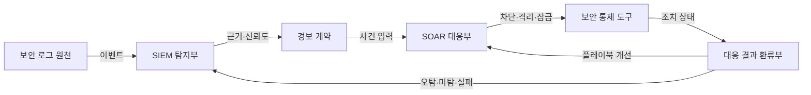
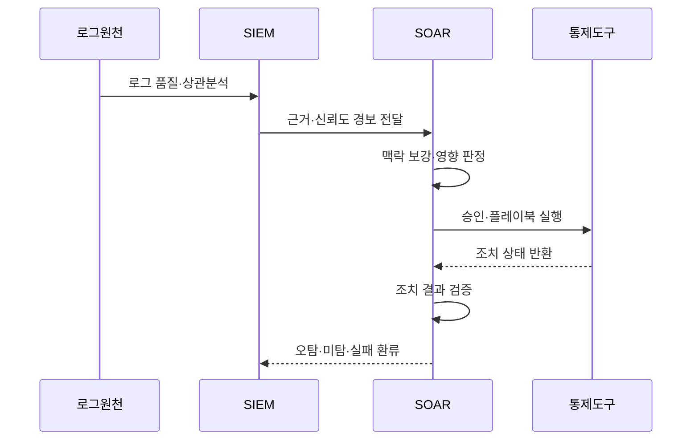

---
sidebar:
  order: 95
  label: "095. SIEM vs SOAR 비교 (SIEM vs SOAR Comparison)"
  badge:
    text: "기출 · 50%"
    variant: note
title: "SIEM vs SOAR 비교 (SIEM vs SOAR Comparison)"
date: "2026-07-27T23:59:59+09:00"
tags: ["notes-network"]
weight: 95
extra:
  question_no: "095"
  source_status: "기출"
  source_history: "138회"
  priority: 50
  priority_note: "비교형: 138회 SIEM·SOAR 직접 출제"
---

## 미리 알고가기

- **보안 정보·이벤트 관리(Security Information and Event Management, SIEM)**: 이종 로그를 정규화·상관분석해 근거가 있는 보안 경보를 생성하는 플랫폼이다.
- **보안 오케스트레이션·자동화·대응(Security Orchestration, Automation, and Response, SOAR)**: 경보를 보강하고 승인·조치·원복 절차를 플레이북으로 실행하는 플랫폼이다.
- **상관분석**: 시간·사용자·자산·주소가 연결된 여러 이벤트를 하나의 공격 흐름으로 묶는 분석이다.
- **플레이북**: 사건 조건, 정보 조회, 승인, 조치와 결과 검증을 실행 가능한 순서로 정의한 절차다.
- **경보 계약**: SIEM이 SOAR에 전달할 사건 식별자, 신뢰도, 근거, 자산과 권장 조치를 정한 자료 규격이다.
- **조치 증거**: SOAR가 어떤 권한으로 무엇을 실행했고 실제 상태가 어떻게 바뀌었는지 남긴 기록이다.
- **폐루프 관제**: 탐지 근거가 대응을 만들고 대응 결과가 다시 탐지 규칙과 플레이북을 개선하는 순환 체계다.
- **약어 읽기와 표기**: SIEM·SOAR는 심·소어로 읽고 영문 머리글자를 딴 표기이며, SIEM은 탐지 근거 생성, SOAR는 대응 절차 실행을 맡는다.

## Ⅰ. 개요

- 정의: SIEM **탐지**와 SOAR **대응**의 연계
- 기존 한계: 탐지·조치 분리의 **대응 지연**

### 쉽게 이해하기 (학습용)

- SIEM이 여러 기록에서 사건과 이유를 찾으면 SOAR가 그 사건을 조사·조치하고 결과를 다시 SIEM 개선에 돌려준다.

## Ⅱ. 특징

- SIEM의 **로그 상관분석·경보 생성**
- SOAR의 **정보 보강·플레이북 실행**
- 조치 결과의 **탐지 규칙 환류**

### 쉽게 이해하기 (학습용)

- 틀린 경보를 자동화하면 더 빨리 잘못 막으므로 조치 전 신뢰도와 영향도를 다시 확인해야 한다.

## Ⅲ. 아키텍처 및 구성요소

| 설계 요소 | 설명 |
|:---|:---|
| 보안 로그 원천 | 탐지에 필요한 이종 이벤트 생성 |
| SIEM 탐지부 | 정규화·상관분석·경보 생성 |
| 경보 계약 | 사건 식별자·근거·신뢰도·자산 전달 |
| SOAR 대응부 | 보강·승인·플레이북 실행 |
| 보안 통제 도구 | 계정·단말·메일·망 상태 변경 |
| 대응 결과 환류부 | 조치 증거로 규칙·절차 개선 |

> 요약: 경보 계약과 조치 증거로 폐루프 관제

### 쉽게 이해하기 (학습용)

- SIEM 경보가 공통 규격으로 SOAR에 넘어가고 보안 도구의 실제 조치 결과가 다시 탐지와 대응 절차를 고친다.

## Ⅳ. 원리 및 절차 흐름도

| 절차 | 설명 |
|:---|:---|
| 로그 품질·상관분석 | 필수 로그를 연결해 공격 판정 |
| 근거·신뢰도 경보 전달 | 사건 식별자·자산·원본 근거 제공 |
| 맥락 보강·영향 판정 | 대상 중요도와 조치 위험 확인 |
| 승인·플레이북 실행 | 수준에 맞춰 자동·승인 조치 |
| 조치 상태 반환 | 통제 도구가 실행 결과를 보고 |
| 조치 결과 검증 | 도구 응답과 실제 상태를 대조 |
| 오탐·미탐·실패 환류 | 규칙·임계값·플레이북 개선 |

> 요약: 탐지 근거로 조치하고 결과로 규칙 개선

### 쉽게 이해하기 (학습용)

- SIEM이 사건 근거를 보내면 SOAR가 영향도를 보고 조치하며 실제 결과가 맞는지 확인해 다음 탐지와 대응을 고친다.

## Ⅴ. 종류 및 비교

| 보안 관제 플랫폼 | SIEM | SOAR |
|:---|:---|:---|
| 적용 기준 | 이종 로그에서 공격 근거 탐지 | 반복 사건의 조사·조치 표준화 |
| 핵심 특징 | 로그 상관분석·경보 생성 | 플레이북 기반 대응 실행 |
| 한계 | 로그 품질 저하·오탐 | 오탐 자동화·권한 집중 |

> 요약: SIEM은 탐지 근거, SOAR는 조치 결과

### 쉽게 이해하기 (학습용)

- 공격인지 판단할 기록이 필요하면 SIEM, 확인된 사건을 빠르고 같은 절차로 처리하려면 SOAR가 필요하다.

## Ⅵ. 실무 사례

1. 계정 탈취의 **SIEM 탐지·SOAR 대응 연계**

### 쉽게 이해하기 (학습용)

- SIEM이 낯선 로그인과 권한 변경을 상관분석해 경보를 만들면 SOAR가 영향도를 확인하고 승인 후 계정을 잠근다.

## Ⅶ. 결론

- **경보 근거·조치 결과**를 연결해 폐루프 구성

### 쉽게 이해하기 (학습용)

- SIEM과 SOAR는 앞뒤 제품을 붙이는 데서 끝나지 않고 탐지 이유와 조치 결과가 서로 개선되는 순환으로 운영해야 한다.
