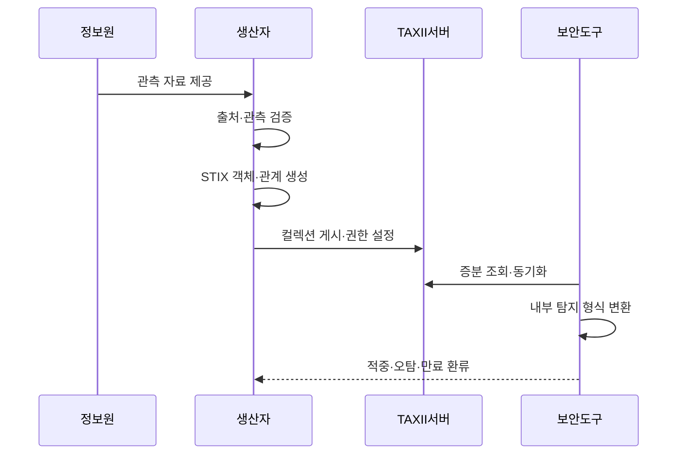

---
sidebar:
  order: 96
  label: "096. 위협 인텔리전스 - STIX·TAXII (Threat Intelligence STIX TAXII)"
  badge:
    text: "기출 · 70%"
    variant: note
title: "위협 인텔리전스 - STIX·TAXII (Threat Intelligence STIX TAXII)"
date: "2026-07-27T23:59:59+09:00"
tags: ["notes-network"]
weight: 96
extra:
  question_no: "096"
  source_status: "기출"
  source_history: "123회, 138회"
  priority: 70
  priority_note: "설계·운영형: 123·138회 CTI 반복"
---

## 미리 알고가기

- **사이버 위협 인텔리전스(Cyber Threat Intelligence, CTI)**: 공격자·기법·대상·흔적을 근거와 맥락으로 분석해 방어 판단에 쓰는 정보다.
- **구조화된 위협 정보 표현(Structured Threat Information eXpression, STIX)**: 위협 개체와 관계를 기계가 읽을 수 있게 표현하는 표준 자료 모델이다.
- **신뢰 가능한 위협 정보 자동 교환(Trusted Automated eXchange of Intelligence Information, TAXII)**: STIX 자료를 조직과 도구 사이에서 조회·게시하는 표준 전송 규약이다.
- **위협 지표(Indicator)**: 악성 주소·파일값처럼 특정 공격 활동을 탐지할 수 있는 조건과 유효 기간을 가진 정보다.
- **관측 자료(Observed Data)**: 네트워크나 시스템에서 실제로 발견한 주소·파일·행위와 관측 시각을 기록한 사실이다.
- **STIX 관계 객체**: 공격자·캠페인·기법·지표가 어떤 의미로 연결되는지 표현하는 객체다.
- **TAXII 컬렉션**: 접근 권한과 공유 목적에 따라 STIX 객체를 묶어 게시·조회하는 저장 단위다.
- **트래픽 라이트 프로토콜(Traffic Light Protocol, TLP)**: 위협 정보를 누구에게 어디까지 재공유할 수 있는지 색상 등급으로 표시하는 규약이다.
- **신뢰도·유효 기간**: 정보 출처를 믿을 정도와 탐지·차단에 사용할 수 있는 기간이다.
- **CTI·STIX·TAXII·TLP**: 위협 정보를 분석하고 표준 객체로 표현·교환하며 수신자의 재공유 범위를 통제하는 체계

## Ⅰ. 개요

- 정의: STIX **위협 표현**과 TAXII **정보 교환**
- 기존 한계: 비정형 문서의 **자동 연계 불가**

### 쉽게 이해하기 (학습용)

- STIX가 공격 정보의 공통 양식과 관계를 정하고 TAXII가 그 정보를 조직과 보안 도구 사이에 배달한다.

## Ⅱ. 특징

- STIX 객체·관계 기반 **위협 맥락 표현**
- TAXII 컬렉션 기반 **자동 교환**
- 신뢰도·TLP·유효 기간 기반 **집행 통제**

### 쉽게 이해하기 (학습용)

- 악성 주소 하나만 보내지 않고 왜 위험한지와 언제까지 누구에게 쓸 수 있는지를 함께 전달해야 한다.

## Ⅲ. 아키텍처 및 구성요소

| 설계 요소 | 설명 |
|:---|:---|
| 위협 정보 원천 | 내부 관측·외부 분석 정보를 제공 |
| 검증·보강기 | 출처·신뢰도·수명·관계를 확인 |
| STIX 객체 저장소 | 개체·관계·공유 표시를 보존 |
| TAXII 교환 서버 | 컬렉션별 조회·게시·권한 제공 |
| 보안 도구 소비자 | 내부 형식으로 변환해 탐지·차단 |
| 품질 환류기 | 적중·오탐 결과로 갱신·폐기 |

> 요약: 검증된 STIX를 TAXII로 배포·회수

### 쉽게 이해하기 (학습용)

- 여러 출처의 위협을 검증해 STIX로 저장하고 TAXII가 권한별로 나눠 주면 보안 도구의 결과가 다시 품질 개선에 쓰인다.

## Ⅳ. 원리 및 절차 흐름도

| 절차 | 설명 |
|:---|:---|
| 관측 자료 제공 | 내부 탐지·외부 분석 근거 전달 |
| 출처·관측 검증 | 근거·시각·중복·신뢰도를 확인 |
| STIX 객체·관계 생성 | 지표·기법·공격자 맥락을 연결 |
| 컬렉션 게시·권한 설정 | TLP와 조직 범위로 공유 제한 |
| 증분 조회·동기화 | 새 객체와 변경분만 수신 |
| 내부 탐지 형식 변환 | 방화벽·보안 관제 규칙으로 변환 |
| 적중·오탐·만료 환류 | 결과에 따라 객체 갱신·폐기 |

> 요약: 검증·구조화·배포·집행·회수의 순환

### 쉽게 이해하기 (학습용)

- 출처를 확인한 위협을 공통 양식으로 만들고 권한 있는 도구에 새 내용만 보내며 잘못되거나 낡으면 빠르게 거둔다.

## Ⅴ. 종류 및 비교

| 위협 정보 표준 | STIX | TAXII |
|:---|:---|:---|
| 적용 기준 | 위협 의미를 기계 판독 구조로 표현 | 조직·도구 사이 객체를 자동 교환 |
| 핵심 특징 | 위협 개체·관계 표현 | 컬렉션 조회·게시·동기화 |
| 한계 | 관계·수명 누락 시 맥락 상실 | 권한 오류·중복·동기화 지연 |

> 요약: STIX는 의미 구조, TAXII는 교환 경로

### 쉽게 이해하기 (학습용)

- 공격 정보를 어떤 항목과 관계로 쓸지는 STIX, 그 묶음을 어디에 누구에게 전달할지는 TAXII가 맡는다.

## Ⅵ. 실무 사례

1. 악성 주소의 **STIX·TAXII 기반 탐지 배포**

### 쉽게 이해하기 (학습용)

- 악성 IP의 출처·유효 기간·관련 공격 기법을 STIX로 표현하고 TAXII로 관제 시스템에 배포해 탐지 규칙에 반영한다.

## Ⅶ. 결론

- 조직 간 위협 정보의 비표준 공유와 오차단을 줄이기 위해 출처·신뢰도·수명·맥락·공유 범위를 검토하여, STIX로 표현하고 TAXII로 교환한 정보만 방어에 활용해야 한다.

### 쉽게 이해하기 (학습용)

- 위협 정보는 많이 자동 배포하는 것보다 근거와 유효 기간을 확인해 필요한 방어에 쓰고 틀리면 즉시 회수해야 한다.
