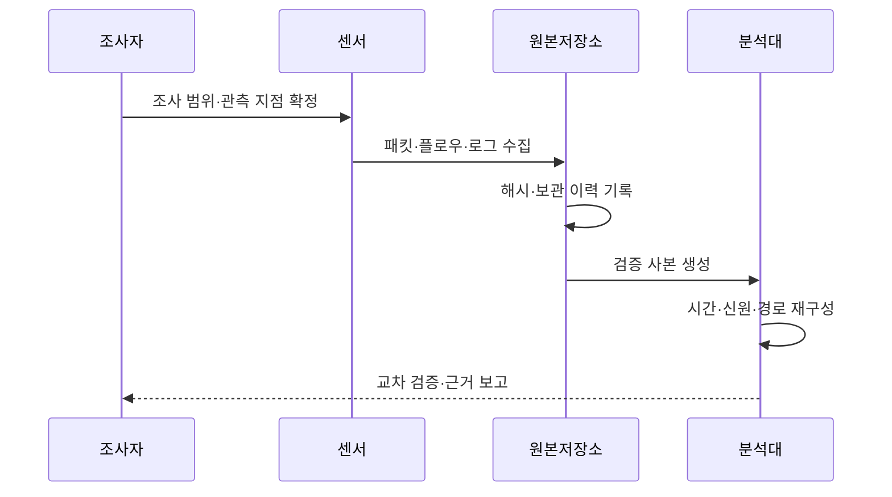

---
sidebar:
  order: 97
  label: "097. 네트워크 포렌식 증거 수집 (Network Forensics)"
  badge:
    text: "기출 · 50%"
    variant: note
title: "네트워크 포렌식 증거 수집 (Network Forensics)"
date: "2026-07-27T23:59:59+09:00"
tags: ["notes-network"]
weight: 97
extra:
  question_no: "097"
  source_status: "기출"
  source_history: "128회, 129회"
  priority: 50
  priority_note: "보안·운영형: 128·129회 증거수집 연계"
---

## 미리 알고가기

- **네트워크 포렌식(Network Forensics)**: 패킷·흐름·통신 로그를 보전·분석해 침해의 시간·주체·경로와 행위를 재구성하는 조사 활동이다.
- **전체 패킷 수집**: 통신 헤더와 가능한 본문을 원본 그대로 저장해 세션 내용을 상세 분석하는 방식이다.
- **플로우(Flow)**: 출발지·목적지·포트·프로토콜·시간·전송량으로 통신 관계를 요약한 기록이다.
- **네트워크 시간 프로토콜(Network Time Protocol, NTP)**: 여러 장비의 시계를 공통 시간 서버에 맞추는 프로토콜이다.
- **주소 변환(Network Address Translation, NAT)**: 내부 사설 주소와 외부 공인 주소·포트를 변환하는 기능이다.
- **동적 호스트 설정 프로토콜(Dynamic Host Configuration Protocol, DHCP)**: 단말에 주소를 임대하고 주소·단말·시간의 대응을 기록하는 프로토콜이다.
- **해시(Hash)**: 자료 내용으로 고정 길이 값을 계산해 수집 후 변경 여부를 확인하는 함수와 결과값이다.
- **증거 연계보관성(Chain of Custody)**: 증거를 누가 언제 수집·이관·분석했는지 기록해 무결성과 관리 책임을 입증하는 절차다.
- **서버 이름 표시(Server Name Indication, SNI)**: 암호 통신을 시작할 때 접속할 서버 이름을 전달하는 확장 필드다.
- **약어 읽기와 표기**: NTP·NAT·DHCP·SNI는 엔티피·엔에이티·디에이치씨피·에스엔아이로 읽고 영문 머리글자를 딴 표기이며, 시간·주소·단말·서버명을 연결한다.

## Ⅰ. 개요

- 정의: 통신 증거로 **침해 시간·주체·경로** 재구성
- 기존 한계: 호스트 로그만으로 **망 경로 복원 곤란**

### 쉽게 이해하기 (학습용)

- 여러 길목에 남은 통신 기록의 시간을 맞춰 공격자가 어디서 들어와 어떤 서버로 이동했는지 다시 그린다.

## Ⅱ. 특징

- **패킷·플로우·로그**의 상호 보완 수집
- **NTP·NAT·DHCP** 기반 시간·신원 연결
- **해시·연계보관성** 기반 증거 무결성 입증

### 쉽게 이해하기 (학습용)

- 사고 뒤에는 지나간 패킷을 만들 수 없으므로 중요한 길목과 보존 기간을 평소에 정해 두어야 한다.

## Ⅲ. 아키텍처 및 구성요소

| 설계 요소 | 설명 |
|:---|:---|
| 관측 센서 | 중요 구간의 패킷·플로우 복제 |
| 공통 시간 기준 | 장비 시각과 오차 근거를 제공 |
| 불변 원본 저장소 | 원본·해시·보존 정책을 유지 |
| 포렌식 분석대 | 사본으로 세션·시간 순서 재구성 |
| 신원·주소 기록 | NAT·DHCP·인증 이력을 연결 |
| 증거 관리대장 | 수집·이관·분석·보고 이력 보존 |

> 요약: 불변 원본과 신원·주소 기록으로 경로 복원

### 쉽게 이해하기 (학습용)

- 센서가 모은 원본을 바꾸지 않고 보관하며 분석 사본에 주소 임대와 로그인 기록을 붙여 실제 사용자와 경로를 찾는다.

## Ⅳ. 원리 및 절차 흐름도

| 절차 | 설명 |
|:---|:---|
| 조사 범위·관측 지점 확정 | 질문·기간·대상 구간을 지정 |
| 패킷·플로우·로그 수집 | 원본과 수집 조건을 함께 확보 |
| 해시·보관 이력 기록 | 변경 여부와 취급자를 추적 |
| 검증 사본 생성 | 원본을 보존하고 분석용 복제 |
| 시간·신원·경로 재구성 | 시각 보정 후 NAT·DHCP 연결 |
| 교차 검증·근거 보고 | 서로 다른 증거로 결론 확인 |

> 요약: 범위 확정 후 원본 보전·사본 분석

### 쉽게 이해하기 (학습용)

- 조사 질문을 먼저 정하고 원본의 변경 여부를 기록한 뒤 복사본에서 시간을 맞추고 여러 기록으로 결론을 확인한다.

## Ⅴ. 종류 및 비교

| 네트워크 증거 | 전체 패킷 | 플로우 | 장비·서비스 로그 |
|:---|:---|:---|:---|
| 적용 기준 | 공격 내용·명령 상세 복원 | 장기간·광범위 경로 추적 | 사용자·정책 결과 확인 |
| 핵심 특징 | 헤더·본문 상세 보존 | 통신 관계·전송량 요약 | 인증·정책·장비 행위 기록 |
| 한계 | 저장량·민감 정보·암호화 | 본문 부재·요약 손실 | 형식 불일치·조작·누락 |

> 요약: 내용·관계·신원 질문에 맞춰 증거 선택

### 쉽게 이해하기 (학습용)

- 무슨 내용이 오갔는지는 패킷, 누가 어디와 통신했는지는 플로우, 로그인과 정책 결과는 장비 로그가 잘 보여 준다.

## Ⅵ. 실무 사례

1. 공격 통신의 **NAT·DHCP 신원 연결**
2. TLS 세션의 **SNI·전송량 추적**

### 쉽게 이해하기 (학습용)

- 외부에 보인 공인 주소와 포트를 NAT 기록에서 찾고 DHCP와 로그인 기록을 이어 실제 단말과 사용자를 확인한다.
- 암호화돼 본문을 못 봐도 접속 서버 이름과 시간대별 전송량을 연결해 의심스러운 유출 목적지를 좁힌다.

## Ⅶ. 결론

- **조사 질문·보존 기간**에 따른 증거 수집 설계

### 쉽게 이해하기 (학습용)

- 네트워크 포렌식은 사고 뒤 도구를 고르는 일이 아니라 평소 어떤 질문에 답할 증거를 어디서 얼마나 보관할지 정하는 일이다.
