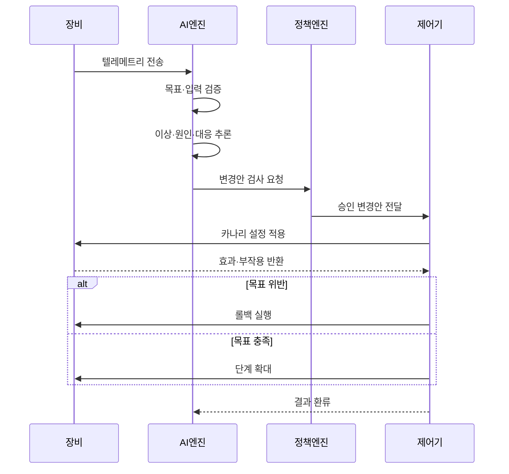

---
sidebar:
  order: 98
  label: "098. AI 네이티브 네트워킹 (AI-Native Networking)"
  badge:
    text: "미출제 · 50%"
    variant: note
title: "AI 네이티브 네트워킹 (AI-Native Networking)"
date: "2026-07-25T00:45:00+09:00"
tags: ["notes-network"]
weight: 98
extra:
  question_no: "098"
  source_status: "미출제"
  source_history: ""
  priority: 50
  priority_note: "설계·운영형: AI 폐루프·Guardrail 전망"
---

## 미리 알고가기

- **인공지능(Artificial Intelligence, AI)**: 데이터에서 패턴을 학습해 분류·예측·추론 같은 판단을 수행하는 소프트웨어 기술이다.
- **인공지능 네이티브 네트워킹(AI-Native Networking)**: 망 관측·추론·정책·설정·검증을 학습 모델과 폐루프로 연결해 운영 판단을 보조·자동화하는 구조다.
- **텔레메트리(Telemetry)**: 장비와 서비스의 상태·성능·이벤트를 원격 수집 지점으로 지속 전송하는 자료다.
- **의도(Intent)**: 서비스가 달성해야 할 연결성·지연·가용성·보안 목표를 선언한 정책이다.
- **폐루프 제어**: 관측한 결과로 판단·설정을 수행하고 실제 효과를 다시 관측해 다음 판단을 보정하는 방식이다.
- **드리프트(Drift)**: 운영 환경이나 입력 분포가 학습 때와 달라져 모델의 판단 성능이 변하는 현상이다.
- **정책 가드레일**: 모델이 바꿀 수 있는 대상·범위·속도와 금지 조건을 강제하는 안전 규칙이다.
- **카나리 적용(Canary Deployment)**: 전체가 아닌 일부 장비·트래픽에 먼저 변경해 효과와 부작용을 확인하는 방식이다.
- **롤백(Rollback)**: 변경이 목표를 위반하면 이전에 검증된 망 설정으로 되돌리는 조치다.

## Ⅰ. 개요

- 정의/개념: AI 추론과 망 제어를 검증 폐루프로 연결하는 구조
- **배경/필요성**: 다변량 장애·수요 변화에 고정 규칙 대응 한계

### 쉽게 이해하기 (학습용)

- 망의 많은 신호를 인공지능이 함께 보고 대응안을 내며 작은 범위에서 시험한 실제 결과로 다음 판단을 고친다.

## Ⅱ. 특징

- 성능·구성·장애 맥락을 결합해 원인 추론한다.
- 변화 패턴을 학습해 고정 임계값 한계 보완한다.
- 설명하기 어려운 오판이 설정 변경으로 확산 가능하다.
- 자동화 수준을 위험·신뢰도에 따라 제한한다.

### 쉽게 이해하기 (학습용)

- 인공지능의 예측 능력과 실제 장비를 바꿀 권한은 분리하고 위험할수록 사람 승인과 작은 시험을 거쳐야 한다.

## Ⅲ. 아키텍처 및 구성요소

| 설계 요소 | 설명 |
|:---|:---|
| 망 텔레메트리 계층 | 장비·서비스 상태와 구성 수집 |
| 데이터·맥락 계층 | 시각·연결 구조·자산 정보를 결합 |
| AI 추론 계층 | 이상·수요·원인·대응안을 추론 |
| 정책 가드레일 | 권한·범위·변경 속도·금지 조건 검사 |
| 망 제어·집행기 | 승인·카나리·롤백으로 설정 적용 |
| 네트워크 장비 | 변경 실행과 실제 결과 반환 |

> 요약: AI 권고를 가드레일·카나리로 폐루프 집행

### 쉽게 이해하기 (학습용)

- 망 자료를 정리해 인공지능이 대응안을 내면 안전 규칙이 권한을 제한하고 일부 장비에 먼저 적용한 결과를 다시 학습에 보낸다.

## Ⅳ. 원리 및 절차 흐름도

| 절차 | 설명 |
|:---|:---|
| 텔레메트리 전송 | 장비 상태·성능·구성 자료 제공 |
| 목표·입력 검증 | 의도와 입력 품질·분포를 확인 |
| 이상·원인·대응 추론 | 모델이 원인과 변경 후보를 생성 |
| 변경안 검사 요청 | 변경 후보와 모델 신뢰도 전달 |
| 승인 변경안 전달 | 금지 대상·범위·속도 검사 후 승인 |
| 카나리 설정 적용 | 승인 범위의 일부 장비에 먼저 적용 |
| 효과·부작용 반환 | 목표·인접 서비스 영향 보고 |
| 롤백 실행 | 목표 위반 시 이전 설정 복구 |
| 단계 확대 | 목표 충족 시 적용 범위 확대 |
| 결과 환류 | 성공·실패 결과를 다음 추론에 반영 |

> 요약: 추론을 제한 적용하고 결과로 확대·복구

### 쉽게 이해하기 (학습용)

- 인공지능의 변경안을 안전 범위에서 일부 시험해 좋아지면 넓히고 나빠지면 즉시 되돌린 뒤 그 결과를 다음 판단에 사용한다.

## Ⅴ. 종류 및 비교

| 판단 기준 | AI 네이티브 운영 | 규칙 자동화 | 수동 운영 |
|:---|:---|:---|:---|
| 핵심 특징 | 다변량 신호로 원인·대응 추론 | 명시 조건과 고정 조치 실행 | 운영자가 자료를 보고 직접 변경 |
| 적용 기준 | 변화가 많고 맥락 결합이 필요 | 반복 조건·조치가 명확 | 고위험·희귀·설명 어려운 상황 |
| 주요 위험 | 드리프트·오판의 설정 확산 | 규칙 폭증·새 상황 미대응 | 판단 지연·개인 의존·누락 |

> 요약: 불확실성·반복성·변경 위험으로 운영 선택

### 쉽게 이해하기 (학습용)

- 복잡한 변화 예측은 AI, 반복 조건은 규칙, 드물고 영향이 큰 변경은 사람이 직접 판단하는 것이 알맞다.

## Ⅵ. 실무 사례

1. 인공지능이 예측한 **혼잡 회피 경로의 단계적 적용**

### 쉽게 이해하기 (학습용)

- 예측 모델이 제안한 우회 경로를 일부 트래픽에 먼저 적용해 지연과 서비스 영향을 검증한 뒤 전체로 확대한다.

## Ⅶ. 결론

- 네트워크 운영의 탐지와 최적화를 자동화하면서 잘못된 변경을 방지하기 위해 **모델 신뢰도·변경 영향·가역성·드리프트·사람 승인**을 검토하고, 저위험 조치는 자동화하고 고위험 조치는 카나리와 승인을 거쳐야 한다.

### 쉽게 이해하기 (학습용)

- AI 네이티브 망은 예측 정확도만 보지 말고 모델이 바꿀 권한과 실패 시 되돌릴 범위를 먼저 설계해야 한다.
