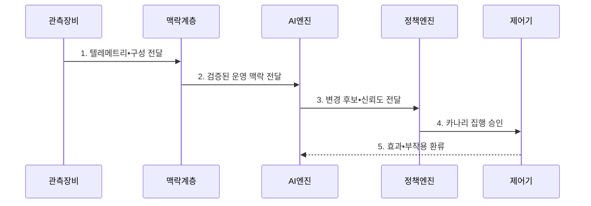

---
sidebar:
  order: 98
  label: "098. AI 네이티브 네트워킹 (AI-Native Networking)"
  badge:
    text: "미출제 • 50%"
    variant: note
title: "AI 네이티브 네트워킹 (AI-Native Networking)"
date: "2026-08-04T18:32:00+09:00"
tags: ["notes-network"]
weight: 98
extra:
  question_no: "098"
  source_status: "미출제"
  source_history: ""
  priority: 50
  priority_note: "설계•운영형: AI 폐루프•Guardrail 전망"
---

## Ⅰ. 개요

핵심 용어

- **인공지능 네이티브 네트워킹(AI-Native Networking)**: 망 관측•추론•정책•설정•검증을 학습 모델과 폐루프로 연결해 운영 판단을 보조•자동화하는 구조다.
- **인공지능(Artificial Intelligence, AI)**: 데이터에서 패턴을 학습해 분류•예측•추론 같은 판단을 수행하는 소프트웨어 기술이다.

- 정의/개념: AI 추론과 망 제어를 연결한 **AI 네이티브 폐루프 운영 구조**
- 배경/필요성: 다변량 장애•수요 변화의 **고정 규칙 대응 한계**

#### 한줄 요약

- 망의 많은 신호를 인공지능이 함께 보고 대응안을 내며 작은 범위에서 시험한 실제 결과로 다음 판단을 고친다.

## Ⅱ. 특징

핵심 용어

- **폐루프 제어**: 관측한 결과로 판단•설정을 수행하고 실제 효과를 다시 관측해 다음 판단을 보정하는 방식이다.
- **드리프트(Drift)**: 운영 환경이나 입력 분포가 학습 때와 달라져 모델의 판단 성능이 변하는 현상이다.
- **정책 가드레일**: 모델이 바꿀 수 있는 대상•범위•속도와 금지 조건을 강제하는 안전 규칙이다.

- **원인 추론**: 성능•구성•장애 맥락의 다변량 분석
- **변화 학습**: 환경 변화에 따른 고정 임계값 보완
- **드리프트 대응**: 입력 분포와 모델 성능 변화를 감시해 재학습 시점 판단
- **자동화 권한 제한**: 위험•신뢰도별 집행 범위 통제

#### 한줄 요약

- 인공지능의 예측 능력과 실제 장비를 바꿀 권한은 분리하고 위험할수록 사람 승인과 작은 시험을 거쳐야 한다.

## Ⅲ. 구조 및 구성요소

핵심 용어

- **관측•맥락 계층**: 텔레메트리•구성•의도를 시간 기준으로 결합하는 계층이다.
- **AI 추론 계층**: AI 모델로 이상•수요•원인과 대응 후보를 계산하는 계층이다.
- **망 제어•집행기**: 승인된 설정을 장비에 적용하고 결과를 검증하는 구성요소다.
- **카나리 적용(Canary Deployment)**: 일부 장비에 먼저 변경해 효과를 확인하는 방식
- **롤백(Rollback)**: 목표 위반 시 이전 설정으로 되돌리는 조치

| 구성요소 | 책임 |
|:---|:---|
| 관측•맥락 계층 | 상태•구성•시각•연결 정보를 결합 |
| AI 추론 계층 | 이상•수요•원인•대응안을 추론 |
| 정책 가드레일 | 권한•범위•변경 속도•금지 조건 검사 |
| 망 제어•집행기 | 승인•카나리•롤백으로 설정 적용 |
| 네트워크 장비 | 변경 실행과 실제 결과 반환 |

#### 한줄 요약

- 망 자료를 정리해 인공지능이 대응안을 내면 안전 규칙이 권한을 제한하고 일부 장비에 먼저 적용한 결과를 다시 학습에 보낸다.

## Ⅳ. 흐름도

핵심 용어

- **텔레메트리(Telemetry)**: 장비와 서비스의 상태•성능•이벤트를 원격 수집 지점으로 지속 전송하는 자료다. AI 엔진의 운영 입력으로 사용된다.
- **의도(Intent)**: 서비스가 달성해야 할 연결성•지연•가용성•보안 목표를 선언한 정책이다.

**동작 원리**

- **1. 텔레메트리•구성 전달**: 상태•구성•시각 자료 제공
- **2. 검증된 운영 맥락 전달**: 의도와 입력 품질을 검증해 제공
- **3. 변경 후보•신뢰도 전달**: 원인과 대응 후보를 함께 제공
- **4. 카나리 집행 승인**: 일부 적용 후 확대•롤백을 통제
- **5. 효과•부작용 환류**: 실제 결과를 다음 추론에 반영
#### 한줄 요약

- 인공지능의 변경안을 안전 범위에서 일부 시험해 좋아지면 넓히고 나빠지면 즉시 되돌린 뒤 그 결과를 다음 판단에 사용한다.

## Ⅴ. 종류 및 비교

핵심 용어

- **규칙 자동화(Rule-based Automation)**: 미리 정한 조건과 임계값이 충족되면 고정된 운영 조치를 실행하는 방식이다.
- **수동 운영(Manual Operation)**: 운영자가 상황의 맥락과 위험을 직접 판단해 변경과 복구를 수행하는 방식이다.

| 운영 방식 | AI 네이티브 운영 | 규칙 자동화 | 수동 운영 |
|:---|:---|:---|:---|
| 적용 기준 | 변화가 많고 맥락 결합이 필요 | 반복 조건•조치가 명확 | 고위험•희귀•설명 어려운 상황 |
| 핵심 특징 | **다변량 원인•대응 추론** | **명시 조건•고정 조치** | **운영자 직접 판단** |
| 한계 | 드리프트•오판의 설정 확산 | 규칙 폭증•새 상황 미대응 | 판단 지연•개인 의존•누락 |

> 요약: 불확실성•반복성•변경 위험으로 운영 선택

#### 한줄 요약

- 복잡한 변화 예측은 AI, 반복 조건은 규칙, 드물고 영향이 큰 변경은 사람이 직접 판단하는 것이 알맞다.

## Ⅵ. 실무 고려사항 및 대책

핵심 용어

- **입력 품질**: AI 모델에 수집되는 자료의 누락•지연•오류•시간 일관성을 나타내는 수준이다.
- **감사 기록**: 누가 어떤 근거로 변경을 승인•실행했는지 남긴 기록이다.

| 문제 | 대책 | 효과 |
|:---|:---|:---|
| 모델 오판의 전역 확산 | **카나리•변경 범위 제한** | 장애 영향 최소화 |
| 입력•성능 드리프트 | **분포•정확도 지속 감시** | 재학습 시점 식별 |
| 고위험 변경의 책임성 | **사람 승인•감사 기록** | 통제 근거 확보 |

#### 한줄 요약

- 인공지능이 제안한 대체 경로를 일부 트래픽에 먼저 적용하고 목표 위반 시 검증된 설정으로 되돌린다.

## Ⅶ. 결론

핵심 용어

- 다변량 변화는 AI로 판단하되 **카나리 적용과 롤백**, 반복 조건은 **규칙**, 고위험•희귀 변경은 수동 적용

#### 한줄 요약

- AI 네이티브 망은 예측 정확도만 보지 말고 모델이 바꿀 권한과 실패 시 되돌릴 범위를 먼저 설계해야 한다.
