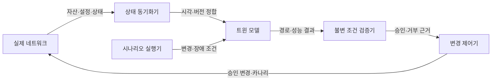
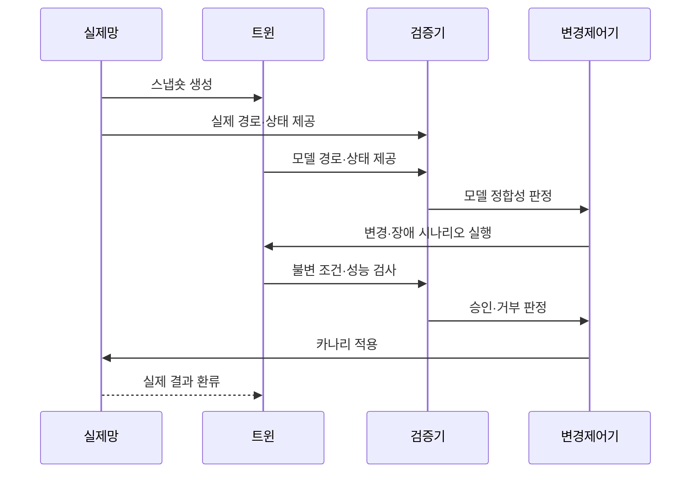

---
sidebar:
  order: 99
  label: "099. 네트워크 디지털 트윈 (Network Digital Twin)"
  badge:
    text: "미출제 · 50%"
    variant: note
title: "네트워크 디지털 트윈 (Network Digital Twin)"
date: "2026-07-25T00:45:00+09:00"
tags: ["notes-network"]
weight: 99
extra:
  question_no: "099"
  source_status: "미출제"
  source_history: ""
  priority: 50
  priority_note: "설계·운영형: 변경 전 Twin 검증 현재성"
---

## 미리 알고가기

- **네트워크 디지털 트윈(Network Digital Twin)**: 실제 망의 토폴로지·설정·상태·트래픽을 동기화한 가상 모델에서 변경과 장애 영향을 예측하는 체계다.
- **토폴로지(Topology)**: 장비·링크와 연결 관계를 나타낸 네트워크 구조다.
- **스냅숏(Snapshot)**: 특정 시점의 장비 목록·설정·상태를 버전으로 고정한 자료다.
- **모델 정합성**: 트윈의 경로·상태·동작이 같은 시점의 실제 망과 얼마나 일치하는지 나타내는 성질이다.
- **시뮬레이션(Simulation)**: 실제 망을 바꾸지 않고 가상 모델에서 변경·장애 조건과 결과를 계산하는 실행이다.
- **불변 조건(Invariant)**: 변경 뒤에도 반드시 유지돼야 하는 도달성·격리·용량 같은 망 제약이다.
- **카나리 변경**: 검증된 변경을 일부 장비나 트래픽에 먼저 적용해 실제 효과를 확인하는 방식이다.
- **테스트 랩(Test Lab)**: 대표 장비와 축소된 구성을 별도 환경에 만들어 기능을 시험하는 시설이다.

## Ⅰ. 개요

- 정의/개념: 실제망 동기 모델로 변경·장애 영향을 예측하는 체계
- **배경/필요성**: 운영망 변경 전 경로·성능·격리 위험 검증

### 쉽게 이해하기 (학습용)

- 실제 네트워크를 바꾸기 전에 같은 구조의 가상 복제본에서 변경안을 실행해 끊김과 혼잡을 미리 찾는다.

## Ⅱ. 특징

- 같은 스냅숏으로 변경안별 결과를 반복 비교한다.
- 실제망 전체 경로·정책의 연쇄 영향을 예측한다.
- 미수집 장비·오래된 상태가 거짓 안전을 유발한다.
- 모델 계산과 실제 장비 동작의 오차가 존재한다.

### 쉽게 이해하기 (학습용)

- 모형이 정교해도 실제망 정보가 늦거나 빠진 장비가 있으면 안전하다는 예측을 믿을 수 없다.

## Ⅲ. 아키텍처 및 구성요소

| 설계 요소 | 설명 |
|:---|:---|
| 실제 네트워크 | 자산·설정·상태·트래픽 원천 |
| 상태 동기화기 | 수집 시각·버전·누락을 정합 |
| 트윈 모델 | 토폴로지·정책·트래픽 동작 표현 |
| 시나리오 실행기 | 변경안·장애 조건을 반복 실행 |
| 불변 조건 검증기 | 도달성·격리·용량·지연 검사 |
| 변경 제어기 | 승인·카나리·실제 결과 환류 |

> 요약: 실제 상태를 동기화해 변경 불변 조건 검증

### 쉽게 이해하기 (학습용)

- 실제망 자료를 같은 시점으로 맞춘 트윈에서 변경안을 실행하고 필수 조건을 통과한 것만 일부 장비에 먼저 적용한다.

## Ⅳ. 원리 및 절차 흐름도

| 절차 | 설명 |
|:---|:---|
| 스냅숏 생성 | 자산·설정·상태를 시점별 고정 |
| 실제 경로·상태 제공 | 같은 시점의 운영망 관측값 전달 |
| 모델 경로·상태 제공 | 스냅숏 기반 예측값 전달 |
| 모델 정합성 판정 | 실제 관측값과 모델 예측값 대조 |
| 변경·장애 시나리오 실행 | 후보별 경로·정책 변화를 계산 |
| 불변 조건·성능 검사 | 도달성·격리·용량·지연 확인 |
| 승인·거부 판정 | 오차와 위반 근거로 변경 결정 |
| 카나리 적용 | 승인 변경을 일부 장비에 먼저 적용 |
| 실제 결과 환류 | 적용 결과로 모델 오차 갱신 |

> 요약: 모델 정합성 확인 후 변경 영향을 검증

### 쉽게 이해하기 (학습용)

- 복제본이 실제와 같은지 먼저 확인하고 변경 뒤 연결과 용량을 검사한 다음 일부 실제 장비에서 결과를 비교한다.

## Ⅴ. 종류 및 비교

| 판단 기준 | 네트워크 디지털 트윈 | 테스트 랩 | 정적 설계 모델 |
|:---|:---|:---|:---|
| 핵심 특징 | 실제 상태를 지속 동기화해 영향 예측 | 대표 장비·축소망에서 기능 시험 | 문서·도면으로 구조와 정책 표현 |
| 적용 기준 | 전체망 변경의 연쇄 영향 분석 | 장비 기능·호환성 실증 | 초기 구조 검토·의사소통 |
| 주요 위험 | 모델 오차·상태 지연·계산 비용 | 규모 차이·구성 갱신 부담 | 운영 상태·동적 경로 미반영 |

> 요약: 영향 예측·기능 실증·구조 검토로 선택

### 쉽게 이해하기 (학습용)

- 전체망 영향은 트윈, 실제 장비 기능은 테스트 랩, 초기 구조 설명은 정적 모델이 알맞다.

## Ⅵ. 실무 사례

1. 라우팅 변경 전 단절·링크 과부하를 트윈 검증
2. 방화벽 정책 변경 전 격리 불변 조건 검사

### 쉽게 이해하기 (학습용)

- 새 라우팅 정책을 트윈에 넣어 목적지 단절과 특정 링크의 용량 초과가 생기는지 확인한다.
- 방화벽 규칙을 바꾸기 전에 외부망과 핵심망이 계속 분리되는지 모든 경로에서 검사한다.

## Ⅶ. 결론

- 상태 신선도·모델 정합성 확인 후 변경 승인

### 쉽게 이해하기 (학습용)

- 트윈 결과는 복제본이 실제망과 같은 시점과 동작을 반영한다는 증거가 있을 때만 변경 승인에 사용해야 한다.
