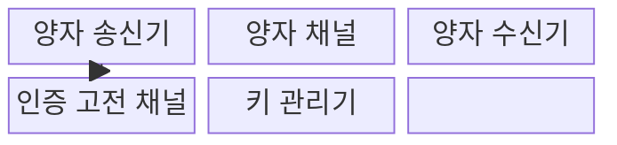
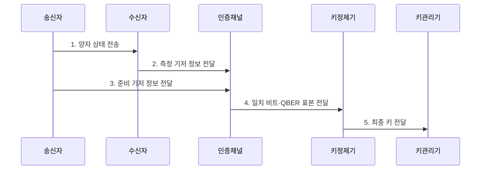

---
sidebar:
  order: 100
  label: "100. QKD 양자 키 분배 (Quantum Key Distribution)"
  badge:
    text: "기출 · 50%"
    variant: note
title: "QKD 양자 키 분배 (Quantum Key Distribution)"
date: "2026-08-02T15:10:00+09:00"
tags: ["notes-network"]
weight: 100
extra:
  question_no: "100"
  source_status: "기출"
  source_history: "126회"
  priority: 50
  priority_note: "설명·비교형: 126회 QKD 직접 출제"
---

## Ⅰ. 개요

핵심 용어

- **양자 키 분배(Quantum Key Distribution, QKD)**: 양자 상태의 측정 교란을 이용해 두 종단이 키 후보를 만들고 오류율로 안전한 키 생성 여부를 판정하는 기술이다.
- **BB84**: Bennett와 Brassard가 1984년에 제안해 이름에 두 성의 첫 글자와 연도를 썼으며, 두 기저로 양자 비트를 보내 일치한 측정만 키 후보로 쓰는 규약이다.

- 정의/개념: **양자 측정 교란** 을 이용한 비밀키 분배
- 배경/필요성: 공개키 암호의 **양자 공격 취약성**

#### 한줄 요약

- 아주 약한 빛으로 키 재료를 보내 도청자가 측정하면 흔적이 남는 성질을 이용해 쓸 수 있는 키인지 판단한다.

## Ⅱ. 특징

핵심 용어

- **양자 비트 오류율(Quantum Bit Error Rate, QBER)**: 선별한 양자 비트 중 송수신 결과가 다른 비율이며 잡음·도청 가능성을 함께 반영한다.
- **기저(Basis)**: 양자 상태를 준비하거나 측정할 때 선택하는 기준이며 송수신 기저가 같아야 결과를 키 후보로 쓴다.
- **오류 정정**: 송수신 키 후보의 다른 비트를 고전 채널에서 맞추되 실제 키 값을 노출하지 않도록 처리하는 단계다.
- **비밀성 증폭(Privacy Amplification)**: 공격자가 일부 정보를 알 가능성을 줄이기 위해 정정된 키를 더 짧은 최종 키로 압축하는 단계다.
- **BB84**: Bennett와 Brassard가 1984년에 제안했으며 두 기저로 양자 비트를 보내 일치한 측정만 키 후보로 사용하는 규약

> 파란 선은 이상적 BB84와 단방향 후처리를 가정한 `1-2h₂(Q)` 하한으로 QBER 약 11%에서 비밀키 비율이 소진되며, 실제 임계값은 장비·프로토콜·보안 증명에 따라 달라진다.

- **BB84**: 기저 불일치와 측정 교란으로 도청 흔적 검출
- **QBER 임계값**: 키 정제 진행·폐기 판단
- **키 정제**: 오류 정정과 비밀성 증폭으로 최종 키 생성

#### 한줄 요약

- 양자 채널이 키를 직접 안전하게 보장하는 것이 아니라 오류가 너무 크면 버리고 통과한 키로 별도 암호를 사용한다.

## Ⅲ. 구조 및 구성요소

핵심 용어

- **양자 송신기·수신기**: 임의 기저로 양자 상태를 만들고 측정하는 장치다.
- **양자 채널**: 광자의 양자 상태를 송신기에서 수신기로 전달하는 경로다.
- **키 관리기**: 최종 키의 저장·공급·수명·폐기를 관리하는 구성요소다.

| 구성요소 | 책임 |
|:---|:---|
| 양자 송신기 | 임의 비트·기저로 양자 상태 생성 |
| 양자 채널 | 광자로 키 후보의 양자 상태 전달 |
| 양자 수신기 | 임의 기저로 상태를 측정 |
| 인증 고전 채널 | 기저 선별·오류 정정 정보를 교환 |
| 키 관리기 | 최종 키 저장·공급·폐기 수행 |

#### 한줄 요약

- 양자 채널에서 측정값을 만들고 인증된 일반 채널에서 기저와 오류를 확인한 뒤 양쪽 키 관리기에 같은 최종 키를 넣는다.

## Ⅳ. 흐름도

핵심 용어

- **인증된 고전 채널**: 기저·오류 정정 정보를 변조 없이 교환하도록 기존 인증키나 전자서명으로 상대를 확인한 채널이다.
- **중간자 공격(Man-in-the-Middle Attack)**: 공격자가 두 통신자 사이에서 각각 상대인 것처럼 가장해 메시지를 엿보거나 바꾸는 공격이다.
- **양자 비트 오류율(Quantum Bit Error Rate, QBER)**: 선별한 양자 비트 중 송수신 결과가 다른 비율로 키 정제·폐기를 판단하는 지표

**동작 원리**

- **0. 고전 채널 상호 인증**: 기존 인증키나 전자서명으로 상대를 확인해 중간자 공격 차단
- **1. 양자 상태 전송**: 임의 비트·기저의 광자를 보냄
- **2. 측정 기저 정보 전달**: 수신 측정에 사용한 기저 제공
- **3. 준비 기저 정보 전달**: 송신 준비에 사용한 기저 제공
- **4. 일치 비트·QBER 표본 전달**: 후보 비트와 양자 비트 오류율(Quantum Bit Error Rate, QBER) 표본 제공
- **5. 최종 키 전달**: 정정·증폭을 마친 대칭키 제공
#### 한줄 요약

- 서로 같은 측정 기준을 쓴 비트만 남기고 일부 오류율이 높으면 전부 버리며 통과하면 더 짧고 안전한 키로 정제한다.

## Ⅴ. 종류 및 비교

핵심 용어

- **양자 키 분배(Quantum Key Distribution, QKD)**: 양자 상태의 측정 교란을 이용해 안전한 키 생성 여부를 판정하는 기술이다.
- **BB84**: Bennett와 Brassard가 1984년에 제안해 이름에 두 성의 첫 글자와 연도를 썼으며, 두 기저로 양자 비트를 보내 일치한 측정만 키 후보로 쓰는 규약이다.
- **신뢰 중계 노드(Trusted Relay Node)**: 장거리 양자 키 분배 구간을 이어 주며 중간에서 키를 복원하므로 운영자를 신뢰해야 하는 장비다.
- **양자내성암호(Post-Quantum Cryptography, PQC)**: 양자컴퓨터 공격에도 안전할 것으로 평가된 수학 문제를 이용하는 소프트웨어 암호다.

| 양자 위협 대응 | QKD | 양자내성암호 | 기존 공개키 암호 |
|:---|:---|:---|:---|
| 적용 기준 | 전용 광 구간의 고가치 키 공급 | 기존망·응용의 범용 양자 전환 | 현재 호환성과 검증된 운영 우선 |
| 핵심 특징 | **측정 교란 기반 키 분배** | **양자내성 키·서명** | **기존 수학 기반 키·서명** |
| 한계 | 거리·장비·인증 채널 의존 | 성능·구현 검증 부담 | 양자 공격에 장기 기밀 노출 |

#### 한줄 요약

- 전용 광 구간은 QKD, 기존 인터넷과 소프트웨어는 양자내성암호가 현실적이며 기존 방식은 기밀 수명을 따져 단계 전환한다.

## Ⅵ. 실무 고려사항 및 대책

핵심 용어

- **키 생성률**: 양자 비트 오류율(Quantum Bit Error Rate, QBER)을 반영해 단위 시간에 응용에 공급할 수 있는 안전한 키의 양이다.
- **키 수명 관리**: 키의 생성·사용·교체·폐기 시점을 통제하는 절차다.
- **상호운용성**: 서로 다른 장비와 계층이 같은 규격으로 연동되는 성질이다.

| 문제 | 대책 | 효과 |
|:---|:---|:---|
| 거리 증가의 **키 생성률 저하** | **손실·QBER 사전 실측** | 응용에 공급할 **키 용량 산정** |
| 고전 채널 중간자 공격 | **상호 인증·키 수명 관리** | 키 교환 무결성 확보 |
| 장비·망 간 연동 한계 | **국제전기통신연합 전기통신표준화부문(International Telecommunication Union Telecommunication Standardization Sector, ITU-T) Y.3800 구조 적용** | 계층별 상호운용 확보 |

#### 한줄 요약

- 전용 광 구간의 손실과 오류율을 실측하고 인증된 고전 채널과 키 수명 정책을 함께 운영해야 한다.

## Ⅶ. 결론

핵심 용어

- **ITU-T Y.3800**: 국제전기통신연합 전기통신표준화부문(International Telecommunication Union Telecommunication Standardization Sector, ITU-T)이 양자 키 분배 네트워크의 개념 구조와 기본 기능을 규정한 국제 권고다.
- **양자내성암호(Post-Quantum Cryptography, PQC)**: 양자컴퓨터 공격에도 안전할 것으로 평가된 수학 문제를 이용하는 소프트웨어 암호다.
- **양자 키 분배(Quantum Key Distribution, QKD)**: 양자 상태의 측정 교란을 이용해 두 종단이 키 후보를 만들고 오류율로 안전한 키 생성 여부를 판정하는 기술이다.

- ITU-T Y.3800 구조의 상호운용성을 확인하고 전용 광 고가치 구간은 **QKD**, 범용 기존망은 **PQC**, 장기 기밀은 우선 전환

#### 한줄 요약

- QKD는 양자라는 이름보다 실제 거리에서 필요한 키가 나오는지와 고전 채널 인증부터 폐기까지 안전한지를 확인해야 한다.
