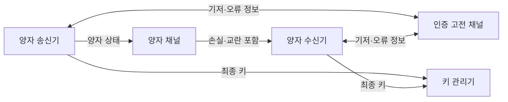
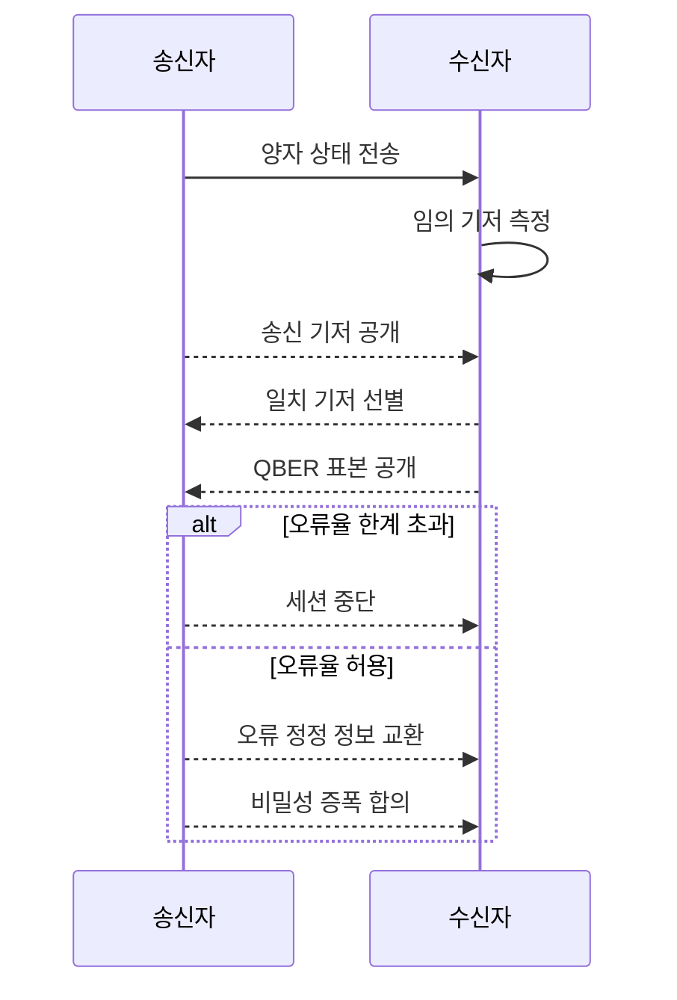

---
sidebar:
  order: 100
  label: "100. QKD 양자 키 분배 (Quantum Key Distribution)"
  badge:
    text: "기출 · 50%"
    variant: note
title: "QKD 양자 키 분배 (Quantum Key Distribution)"
date: "2026-07-25T00:45:00+09:00"
tags: ["notes-network"]
weight: 100
extra:
  question_no: "100"
  source_status: "기출"
  source_history: "126회"
  priority: 50
  priority_note: "설명·비교형: 126회 QKD 직접 출제"
---

## 미리 알고가기

- **양자 키 분배(Quantum Key Distribution, QKD)**: 양자 상태의 측정 교란을 이용해 두 종단이 키 후보를 만들고 오류율로 안전한 키 생성 여부를 판정하는 기술이다.
- **BB84**: Bennett와 Brassard가 1984년에 제안해 이름에 두 성의 첫 글자와 연도를 썼으며, 두 기저로 양자 비트를 보내 일치한 측정만 키 후보로 쓰는 규약이다.
- **양자 비트 오류율(Quantum Bit Error Rate, QBER)**: 선별한 양자 비트 중 송수신 결과가 다른 비율이며 잡음·도청 가능성을 함께 반영한다.
- **기저(Basis)**: 양자 상태를 준비하거나 측정할 때 선택하는 기준이며 송수신 기저가 같아야 결과를 키 후보로 쓴다.
- **오류 정정**: 송수신 키 후보의 다른 비트를 고전 채널에서 맞추되 실제 키 값을 노출하지 않도록 처리하는 단계다.
- **비밀성 증폭(Privacy Amplification)**: 공격자가 일부 정보를 알 가능성을 줄이기 위해 정정된 키를 더 짧은 최종 키로 압축하는 단계다.
- **인증된 고전 채널**: 기저·오류 정정 정보를 변조 없이 교환하도록 기존 인증키나 전자서명으로 상대를 확인한 채널이다.
- **중간자 공격(Man-in-the-Middle Attack)**: 공격자가 두 통신자 사이에서 각각 상대인 것처럼 가장해 메시지를 엿보거나 바꾸는 공격이다.
- **신뢰 중계 노드(Trusted Relay Node)**: 장거리 양자 키 분배 구간을 이어 주며 중간에서 키를 복원하므로 운영자를 신뢰해야 하는 장비다.
- **양자내성암호(Post-Quantum Cryptography, PQC)**: 양자컴퓨터 공격에도 안전할 것으로 평가된 수학 문제를 이용하는 소프트웨어 암호다.

## Ⅰ. 개요

- **정의/개념**: 양자 측정 교란과 QBER로 비밀키를 분배하는 기술
- **배경/필요성**: 장기 기밀 구간의 양자 공격 대비

### 쉽게 이해하기 (학습용)

- 아주 약한 빛으로 키 재료를 보내 도청자가 측정하면 흔적이 남는 성질을 이용해 쓸 수 있는 키인지 판단한다.

## Ⅱ. 특징

- 키 분배만 제공하며 데이터 암호화는 별도이다.
- 인증된 고전 채널 없이는 중간자 공격에 취약하다.
- 도청·잡음은 QBER에 함께 나타나 원인 구분 곤란하다.
- 거리·광손실 증가로 비밀키 생성률 감소한다.

### 쉽게 이해하기 (학습용)

- 양자 채널이 키를 직접 안전하게 보장하는 것이 아니라 오류가 너무 크면 버리고 통과한 키로 별도 암호를 사용한다.

## Ⅲ. 아키텍처 및 구성요소

| 설계 요소 | 설명 |
|:---|:---|
| 양자 송신기 | 임의 비트·기저로 양자 상태 생성 |
| 양자 채널 | 광자로 키 후보의 양자 상태 전달 |
| 양자 수신기 | 임의 기저로 상태를 측정 |
| 인증 고전 채널 | 기저 선별·오류 정정 정보를 교환 |
| 키 관리기 | 최종 키 저장·공급·폐기 수행 |

> 요약: 양자 상태와 인증 고전 후처리로 키 생성

### 쉽게 이해하기 (학습용)

- 양자 채널에서 측정값을 만들고 인증된 일반 채널에서 기저와 오류를 확인한 뒤 양쪽 키 관리기에 같은 최종 키를 넣는다.

## Ⅳ. 원리 및 절차 흐름도

| 절차 | 설명 |
|:---|:---|
| 양자 상태 전송 | 임의 비트·기저의 광자를 보냄 |
| 임의 기저 측정 | 수신자가 무작위 기준으로 측정 |
| 송신 기저 공개 | 인증 채널로 각 비트의 기저 전달 |
| 일치 기저 선별 | 같은 기저의 비트만 후보로 유지 |
| QBER 표본 공개 | 후보 일부를 비교해 오류율 추정 |
| 세션 중단 | 오류율 한계 초과 시 키 후보 폐기 |
| 오류 정정 정보 교환 | 후보 키의 불일치를 맞춤 |
| 비밀성 증폭 합의 | 노출 가능성만큼 최종 키를 축소 |

> 요약: 기저 선별·QBER 판정 후 키를 정제

### 쉽게 이해하기 (학습용)

- 서로 같은 측정 기준을 쓴 비트만 남기고 일부 오류율이 높으면 전부 버리며 통과하면 더 짧고 안전한 키로 정제한다.

## Ⅴ. 종류 및 비교

| 판단 기준 | QKD | 양자내성암호 | 기존 공개키 암호 |
|:---|:---|:---|:---|
| 핵심 특징 | 양자 측정 교란으로 키 분배 | 양자 내성 수학 문제로 키·서명 | 기존 수학 문제로 키·서명 |
| 적용 기준 | 전용 광 구간의 고가치 키 공급 | 기존망·응용의 범용 양자 전환 | 현재 호환성과 검증된 운영 우선 |
| 주요 위험 | 장비·거리·인증·신뢰 중계 노드 의존 | 새 알고리즘의 성능·구현 결함 | 미래 양자 공격에 장기 기밀 노출 |

> 요약: 전용 구간·범용 전환·기밀 수명으로 선택

### 쉽게 이해하기 (학습용)

- 전용 광 구간은 QKD, 기존 인터넷과 소프트웨어는 양자내성암호가 현실적이며 기존 방식은 기밀 수명을 따져 단계 전환한다.

## Ⅵ. 실무 사례

1. 데이터센터 광 구간에 QKD 키를 암호기에 공급
2. 장거리 구간은 PQC와 QKD를 혼합 적용

### 쉽게 이해하기 (학습용)

- 두 데이터센터의 전용 광선에서 만든 양자 키를 실제 데이터 암호 장비의 대칭키로 공급한다.
- 광손실이 큰 장거리나 신뢰 중계가 어려운 구간은 양자내성암호를 함께 사용해 한 방식의 한계를 보완한다.

## Ⅶ. 결론

- 거리·키 생성률·인증·기밀 수명으로 QKD 선택

### 쉽게 이해하기 (학습용)

- QKD는 양자라는 이름보다 실제 거리에서 필요한 키가 나오는지와 고전 채널 인증부터 폐기까지 안전한지를 확인해야 한다.
