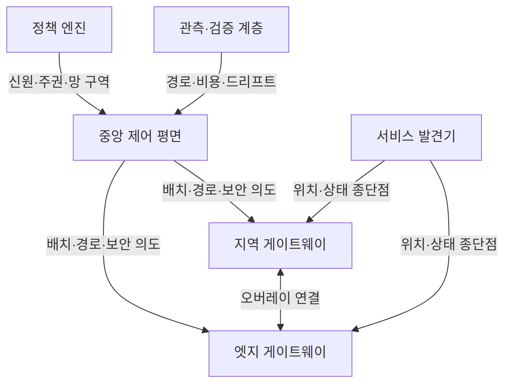
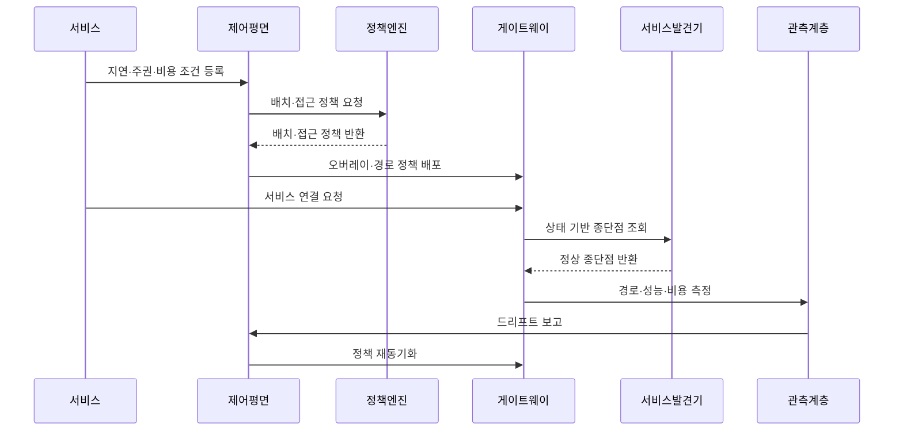

---
sidebar:
  order: 101
  label: "101. 분산 클라우드 네트워킹 (Distributed Cloud Networking)"
  badge:
    text: "미출제 · 30%"
    variant: note
title: "분산 클라우드 네트워킹 (Distributed Cloud Networking)"
date: "2026-07-25T00:45:00+09:00"
tags: ["notes-network"]
weight: 101
extra:
  question_no: "101"
  source_status: "미출제"
  source_history: ""
  priority: 30
  priority_note: "설계형: 분산 Cloud 경로·정책 정합성"
---

## 미리 알고가기

- **분산 클라우드(Distributed Cloud)**: 중앙 클라우드 사업자가 여러 지역·엣지의 자원을 하나의 제어 체계로 운영하는 배치 모델이다.
- **분산 클라우드 네트워킹**: 중앙·지역·엣지에 흩어진 서비스의 연결·경로·보안 정책을 공통 제어하고 지역별로 집행하는 구조다.
- **오버레이 네트워크(Overlay Network)**: 물리망 위에서 캡슐화 터널과 논리 주소로 독립된 가상 연결을 만드는 네트워크다.
- **제어 평면(Control Plane)**: 배치·경로·보안 의도를 계산하고 각 위치의 게이트웨이에 정책을 배포하는 계층이다.
- **서비스 발견(Service Discovery)**: 서비스 이름과 현재 위치·상태를 연결해 요청을 보낼 종단점을 찾는 기능이다.
- **데이터 주권(Data Sovereignty)**: 자료를 저장·처리하는 국가나 지역의 법과 통제를 따라야 하는 요구다.
- **외부 전송 비용(Egress Cost)**: 클라우드나 지역 경계 밖으로 자료를 보낼 때 부과되는 비용이다.
- **정책 드리프트(Policy Drift)**: 중앙에서 선언한 정책과 위치별 실제 설정·동작이 달라진 상태다.

## Ⅰ. 개요

- 정의/개념: 분산 클라우드의 연결·정책을 공통 제어하는 구조
- **배경/필요성**: 지연·주권·비용별 배치·경로의 일관 관리

### 쉽게 이해하기 (학습용)

- 여러 지역의 클라우드와 엣지를 하나의 망처럼 연결하면서 서비스는 사용자와 규제 조건에 맞는 위치에서 실행한다.

## Ⅱ. 특징

- 중앙 의도를 지역 게이트웨이가 분산 집행한다.
- 위치 기반 처리로 지연·전송 비용을 조절한다.
- 공통 신원·세그먼트가 환경 간 정책 편차 축소한다.
- 드리프트·부분 장애가 경로·보안 불일치 유발한다.

### 쉽게 이해하기 (학습용)

- 중앙에서 같은 규칙을 내려도 지역 장비가 늦게 반영하거나 실패하면 실제 통신 정책이 달라질 수 있다.

## Ⅲ. 아키텍처 및 구성요소

| 설계 요소 | 설명 |
|:---|:---|
| 중앙 제어 평면 | 배치·경로·보안 의도를 계산·배포 |
| 지역 게이트웨이 | 지역 클라우드의 오버레이 종단·집행 |
| 엣지 게이트웨이 | 현장 엣지의 연결·정책을 집행 |
| 서비스 발견기 | 위치·상태에 맞는 종단점 제공 |
| 정책 엔진 | 신원·주권·망 구역 조건 판정 |
| 관측·검증 계층 | 경로·비용·정책 드리프트 확인 |

> 요약: 중앙 의도를 지역 게이트웨이가 분산 집행

### 쉽게 이해하기 (학습용)

- 중앙 제어기가 위치와 보안 규칙을 정하면 지역·엣지 게이트웨이가 실행하고 관측 계층이 실제 상태가 같은지 확인한다.

## Ⅳ. 원리 및 절차 흐름도

| 절차 | 설명 |
|:---|:---|
| 지연·주권·비용 조건 등록 | 배치와 통신의 필수 조건 정의 |
| 배치·접근 정책 요청 | 서비스 조건의 정책 판정 의뢰 |
| 배치·접근 정책 반환 | 위치·신원·자료 조건을 판정 |
| 오버레이·경로 정책 배포 | 지역별 연결·장애 경로 설정 |
| 서비스 연결 요청 | 목적 서비스와 접근 맥락 전달 |
| 상태 기반 종단점 조회 | 가까운 정상 서비스 위치 검색 |
| 정상 종단점 반환 | 조건을 충족한 서비스 주소 제공 |
| 경로·성능·비용 측정 | 실제 지연·손실·전송량 확인 |
| 드리프트 보고 | 선언 정책과 실제 상태 차이 전달 |
| 정책 재동기화 | 불일치 게이트웨이에 정책 재배포 |

> 요약: 위치 조건으로 배치·경로를 정하고 정합화

### 쉽게 이해하기 (학습용)

- 서비스의 지연과 규제 조건을 입력하면 알맞은 위치와 경로를 고르고 실제 상태가 중앙 규칙과 달라지면 바로잡는다.

## Ⅴ. 종류 및 비교

| 판단 기준 | 분산 클라우드 | 다중 클라우드 | 중앙 클라우드 |
|:---|:---|:---|:---|
| 핵심 특징 | 한 운영 주체가 지역·엣지를 통합 제어 | 여러 사업자 환경을 조직이 조합 | 중앙 지역에 자원·제어 집중 |
| 적용 기준 | 엣지 지연·지역 주권을 함께 충족 | 사업자 종속 완화·기능 선택 | 규모 단순·중앙 처리 허용 |
| 주요 위험 | 지역 드리프트·복잡한 경로 | 사업자별 정책·도구 불일치 | 지역 장애·장거리 지연 |

> 요약: 운영 주체·지역성·사업자 수로 배치 선택

### 쉽게 이해하기 (학습용)

- 같은 사업자의 지역·엣지를 묶으면 분산, 여러 사업자를 조합하면 다중, 한 지역에 모으면 중앙 클라우드다.

## Ⅵ. 실무 사례

1. 스마트 공장 영상의 **현장 엣지 처리**

### 쉽게 이해하기 (학습용)

- 대용량 영상 원본은 공장 엣지에서 실시간 분석하고 이상 판정 결과만 중앙 클라우드로 보내 지연과 회선 사용량을 줄인다.

## Ⅶ. 결론

- 지연·주권·전송 비용으로 배치·경로 결정

### 쉽게 이해하기 (학습용)

- 분산 클라우드는 가까운 곳에 두는 것만이 아니라 자료 위치와 경로 비용, 지역별 정책 일치를 함께 확인해야 한다.
