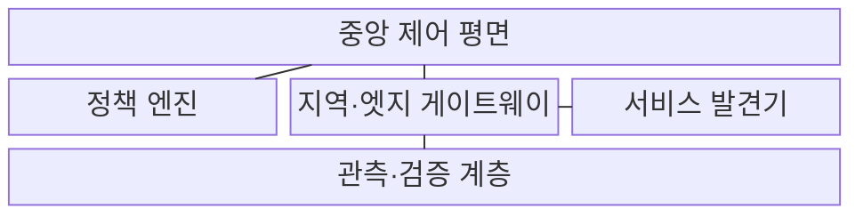
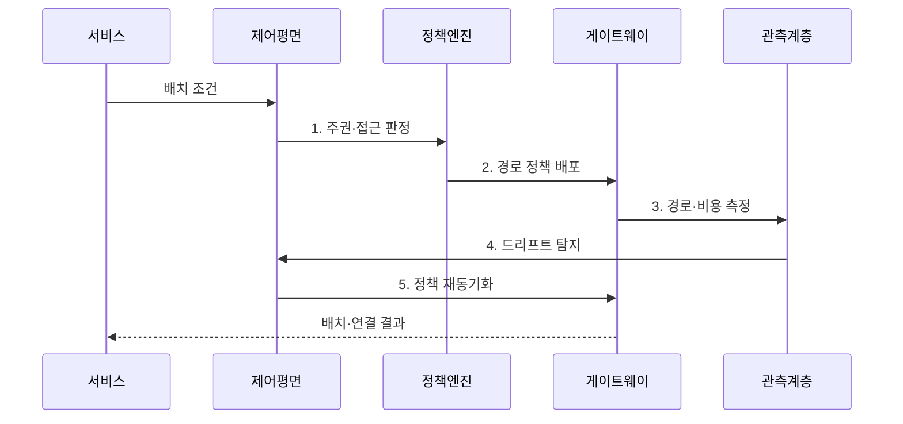

---
sidebar:
  order: 101
  label: "101. 분산 클라우드 네트워킹 (Distributed Cloud Networking)"
  badge:
    text: "미출제 · 30%"
    variant: note
title: "분산 클라우드 네트워킹 (Distributed Cloud Networking)"
date: "2026-08-02T12:00:00+09:00"
tags: ["notes-network"]
weight: 101
extra:
  question_no: "101"
  source_status: "미출제"
  source_history: ""
  priority: 30
  priority_note: "설계형: 분산 Cloud 경로·정책 정합성"
---

## Ⅰ. 개요

핵심 용어

- **분산 네트워크 운영 구조**: 분산 클라우드 네트워킹은 중앙의 연결·경로·보안 의도를 여러 지역과 엣지에서 일관되게 집행하는 분산 네트워크 운영 구조다.

- 정의/개념: **분산 클라우드 네트워킹**은 중앙의 연결·경로·보안 의도를 지역·엣지 게이트웨이에서 집행하는 **분산 네트워크 운영 구조**
- 배경/필요성: 중앙 단일 지역은 **엣지 지연·데이터 주권 충족 불가**

#### 한줄 요약

- 여러 지역의 클라우드와 엣지를 하나의 망처럼 연결하면서 서비스는 사용자와 규제 조건에 맞는 위치에서 실행한다.

## Ⅱ. 특징

핵심 용어

- **지역별 분산 집행**: 지역별 분산 집행은 중앙 제어 평면이 계산한 정책을 각 지역 게이트웨이가 자체 데이터 경로에서 실행하는 방식이다.

- 중앙 의도의 **지역별 분산 집행**
- 위치 기반 처리의 **지연·비용 최적화**
- 드리프트·부분 장애의 **정책 불일치 위험**

#### 한줄 요약

- 중앙에서 같은 규칙을 내려도 지역 장비가 늦게 반영하거나 실패하면 실제 통신 정책이 달라질 수 있다.

## Ⅲ. 구조 및 구성요소

핵심 용어

- **관측·검증 계층**: 관측·검증 계층은 실제 경로·지연·전송 비용과 지역 정책 상태를 중앙 선언 의도와 대조한다.

| 구성요소 | 책임 |
|:---|:---|
| 중앙 제어 평면 | **배치·경로·보안 의도** 계산·배포 |
| 지역·엣지 게이트웨이 | **오버레이 종단·지역 정책** 집행 |
| 서비스 발견기 | **위치·상태 기반 종단점** 제공 |
| 정책 엔진 | **신원·주권·망 구역** 조건 판정 |
| 관측·검증 계층 | **경로·비용·정책 드리프트** 확인 |

> 요약: 중앙 의도를 지역 게이트웨이가 분산 집행

#### 한줄 요약

- 중앙 제어기가 위치와 보안 규칙을 정하면 지역·엣지 게이트웨이가 실행하고 관측 계층이 실제 상태가 같은지 확인한다.

## Ⅳ. 흐름도

핵심 용어

- **4. 드리프트 탐지**: 관측 계층은 지역 게이트웨이의 실제 경로와 보안 설정이 중앙 선언 정책에서 벗어났는지 확인한다.

**동작 원리**

1. **주권·접근 판정**: 위치·신원·자료 조건 판정
2. **경로 정책 배포**: 지역별 오버레이·장애 경로 설정
3. **경로·비용 측정**: 실제 지연·손실·전송량 확인
4. **드리프트 탐지**: 선언 정책과 실제 상태 대조
5. **정책 재동기화**: 불일치 정책 재배포
> 요약: 위치 조건으로 배치·경로를 정하고 정합화

#### 한줄 요약

- 서비스의 지연과 규제 조건을 입력하면 알맞은 위치와 경로를 고르고 실제 상태가 중앙 규칙과 달라지면 바로잡는다.

## Ⅴ. 종류 및 비교

핵심 용어

- **분산 클라우드**: 분산 클라우드는 한 운영 주체가 여러 지역·엣지 자원을 공통 제어해 지연과 데이터 주권 요구를 함께 충족한다.

| 배치 방식 | 분산 클라우드 | 다중 클라우드 | 중앙 클라우드 |
|:---|:---|:---|:---|
| 적용 기준 | **엣지 지연·지역 주권** 동시 충족 | **사업자 종속 완화·기능 선택** | **운영 단순성·중앙 처리** 허용 |
| 핵심 특징 | **지역·엣지 통합 제어** | **여러 사업자 환경 조합** | **중앙 지역 자원 집중** |
| 한계 | **지역 드리프트·경로 복잡성** | 사업자별 **정책·도구 불일치** | **지역 장애·장거리 지연** |

> 요약: 운영 주체·지역성·사업자 수로 배치 선택

#### 한줄 요약

- 같은 사업자의 지역·엣지를 묶으면 분산, 여러 사업자를 조합하면 다중, 한 지역에 모으면 중앙 클라우드다.

## Ⅵ. 실무 고려사항 및 대책

핵심 용어

- **데이터 주권 위반 경로**: 데이터 주권 위반 경로는 저장·처리가 허용된 지역을 벗어나 원본이나 중간 트래픽이 다른 관할로 전달되는 문제다.

| 문제 | 대책 | 효과 |
|:---|:---|:---|
| 지역별 **정책 드리프트** | **선언 정책·실제 상태 대조** | **보안 정책 일관성** 확보 |
| **데이터 주권 위반 경로** | **지역 고정·경로 제약** | **규제 준수** |
| 지역·중앙 **전송비 급증** | **현지 처리·결과 집약** | **지연·비용 절감** |

#### 한줄 요약

- 원본은 허용 지역의 엣지에서 처리하고 결과만 중앙으로 보내며 실제 경로가 정책과 같은지 지속 검증한다.

## Ⅶ. 결론

핵심 용어

- **중앙 클라우드**: 중앙 클라우드는 지역 지연과 주권 제약이 낮고 운영 단순성과 자원 집중의 효율을 우선할 때 적합하다.

- 지연·주권 제약은 **분산**, 운영 단순성 우선은 **중앙 클라우드** 선택

#### 한줄 요약

- 분산 클라우드는 가까운 곳에 두는 것만이 아니라 자료 위치와 경로 비용, 지역별 정책 일치를 함께 확인해야 한다.
