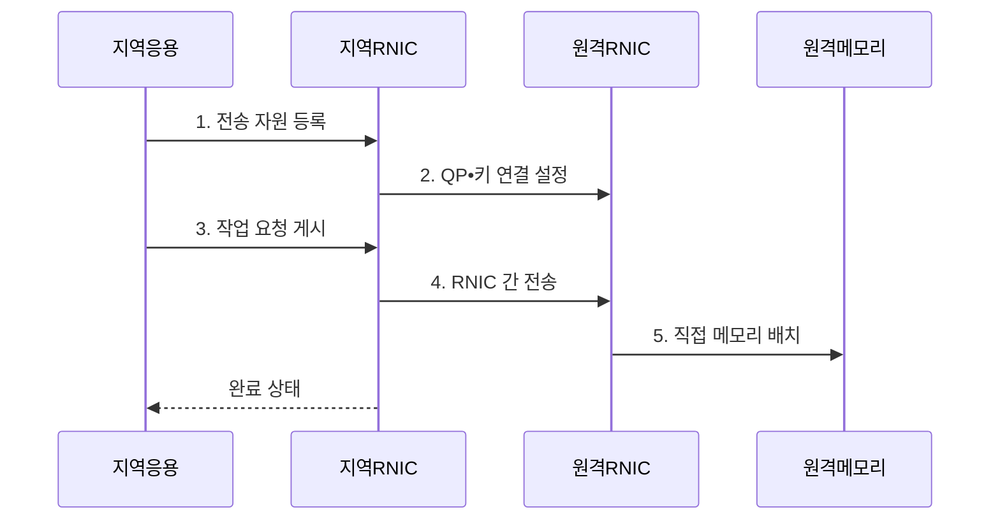

---
sidebar:
  order: 102
  label: "102. RDMA 원격 직접 메모리 접근 (RDMA)"
  badge:
    text: "기출 • 50%"
    variant: note
title: "RDMA 원격 직접 메모리 접근 (RDMA)"
date: "2026-08-05T01:33:51+09:00"
tags: ["notes-network"]
weight: 102
extra:
  question_no: "102"
  source_status: "기출"
  source_history: "138회"
  priority: 50
  priority_note: "설명•설계형: 138회 AI HPC RDMA 핵심"
---

## Ⅰ. 개요

<details>
<summary>핵심 용어</summary>

- **원격 직접 메모리 접근(Remote Direct Memory Access, RDMA)**: 두 호스트의 등록 메모리를 직접 연결하는 전송 기술
- **RDMA 네트워크 인터페이스 카드(RDMA Network Interface Card, RNIC)**: RDMA 전송과 메모리 접근을 처리하는 장치
- **중앙처리장치(Central Processing Unit, CPU)**: 명령 실행과 연산을 담당하는 범용 처리장치

</details>

- 정의/개념: RNIC가 호스트 간 등록 메모리를 잇는 **직접 전송 기술**
- 배경/필요성: 반복 복사와 커널 처리로 인한 **CPU 부하**

#### 한줄 요약

- 응용 자료를 운영체제 통로로 여러 번 복사하지 않고 네트워크 장치가 상대 서버의 허용된 메모리로 직접 옮긴다.

## Ⅱ. 특징

<details>
<summary>핵심 용어</summary>

- **단방향 동작**: 원격 응용의 수신 호출 없이 RNIC가 등록 메모리를 직접 읽거나 쓰는 방식
- **제로 카피(Zero Copy)**: 중간 버퍼 복사를 없애는 전송 방식
- **커널 우회(Kernel Bypass)**: 커널 데이터 경로 처리를 줄이는 전송 방식
- **등록 메모리**: RNIC 접근을 허용한 주소 범위와 수명의 버퍼
- **접근 키**: RNIC의 등록 메모리 접근 권한을 검증하는 값

</details>

- **제로 카피•커널 우회** 기반 저지연 전송
- 원격 응용 호출 없는 **단방향 동작**
- 등록 메모리•접근 키 기반 **권한 제어**

#### 한줄 요약

- 빠른 통로를 얻는 대신 응용이 어느 메모리를 언제까지 노출하고 완료 뒤 재사용할지를 직접 관리해야 한다.

## Ⅲ. 구조 및 구성요소

<details>
<summary>핵심 용어</summary>

- **보호•등록 메모리**: RNIC 접근 버퍼의 권한•주소•키•수명을 정의한 메모리
- **큐 페어(Queue Pair, QP)**: 송신•수신 작업 요청을 RNIC에 게시하는 큐 쌍
- **완료 큐(Completion Queue, CQ)**: 전송 작업의 완료•실패 상태를 응용에 전달하는 큐

</details>

```text
[응용 처리기]---[큐 페어]---[RNIC]
                              |
                  +-----------+-----------+
                  |                       |
         [보호•등록 메모리]           [완료 큐]
```

선의 의미: 응용 처리기와 큐 페어는 작업 요청 관리 관계이고, RNIC는 보호•등록 메모리의 권한•접근 범위 및 완료 큐의 작업 상태와 결속되는 직접 메모리 전송 관계이다.

| 구성요소 | 책임 |
|:---|:---|
| 응용 처리기 | **버퍼•작업•완료 수명주기** 관리 |
| 큐 페어 | **송수신 작업 요청**을 RNIC에 게시 |
| RNIC | **등록 메모리 간 전송** 실행 |
| 보호•등록 메모리 | **권한 경계•접근 범위•키** 제공 |
| 완료 큐 | **작업 완료•실패 상태** 전달 |

#### 한줄 요약

- 응용이 허용한 메모리와 작업을 같은 권한 영역에 묶으면 RNIC가 직접 전송하고 완료 큐로 끝난 시점을 알려 준다.

## Ⅳ. 흐름도

<details>
<summary>핵심 용어</summary>

- **직접 메모리 배치**: RNIC가 주소•길이•접근 키를 검증해 등록된 원격 버퍼에 기록하는 처리
- **보호 도메인(Protection Domain, PD)**: 메모리와 큐 자원의 권한 경계를 묶는 RDMA 자원

</details>



**동작 원리**

1. **전송 자원 등록**: PD•QP•CQ와 메모리 키 생성
2. **QP•키 연결 설정**: 원격 주소•권한•연결 확인
3. **작업 요청 게시**: 전송 동작•주소•길이를 큐에 등록
4. **RNIC 간 전송**: 커널 복사 없이 자료 전달
5. **직접 메모리 배치**: 원격 RNIC가 등록 버퍼에 기록
#### 한줄 요약

- 양쪽이 허용할 메모리 주소와 키를 나눈 뒤 전송 작업을 큐에 넣고 완료 통지를 받은 후에만 버퍼를 다시 쓴다.

## Ⅴ. 종류 및 비교

<details>
<summary>핵심 용어</summary>

- **TCP**: 전송 제어 프로토콜(Transmission Control Protocol, TCP)은 범용 커널 소켓에서 신뢰성 있는 바이트 흐름을 제공한다.

</details>

| 데이터 전달 방식 | RDMA | TCP 소켓 | 공유 메모리 |
|:---|:---|:---|:---|
| 적용 기준 | 서버 간 **고속•저지연 대량 통신** | **범용 호환•복잡한 망** 운영 | 같은 호스트의 **처리기 간 통신** |
| 핵심 특징 | **RNIC 직접 메모리 전송** | **커널 바이트 흐름** | **호스트 메모리 공유** |
| 한계 | **키•버퍼•완료 수명 오류** | **복사•문맥 전환•CPU 부하** | **동기화 오류•호스트 한정** |

#### 한줄 요약

- 서버 간 최고 성능은 RDMA, 범용 통신은 TCP, 같은 서버 안의 빠른 교환은 공유 메모리가 알맞다.

## Ⅵ. 실무 고려사항 및 대책

<details>
<summary>핵심 용어</summary>

- **버퍼 재사용**: 완료 전 RNIC가 처리 중인 메모리를 응용이 덮어쓰는 문제
- **원격 키**: 원격 메모리 접근 범위를 제한하는 보호 정보
- **국제인터넷표준화기구(Internet Engineering Task Force, IETF)**: 인터넷 기술 표준을 개발하는 국제 공동체
- **의견 요청 문서(Request for Comments, RFC)**: 인터넷 기술 규격을 공개하는 문서 체계
- **RFC 5040**: RDMA 프로토콜 동작을 규정한 IETF 표준

</details>

| 문제 | 대책 | 효과 |
|:---|:---|:---|
| 원격 키의 **과도한 권한** | **보호 도메인•최소 범위 등록** | **메모리 침범 방지** |
| 완료 전 **버퍼 재사용** | **CQ 기반 수명주기 통제** | **자료 훼손 방지** |
| 구현 간 **동작 불일치** | **IETF RFC 5040 준수 시험** | **프로토콜 상호운용** 확보 |

#### 한줄 요약

- 통신 버퍼의 최소 범위만 등록하고 완료 큐 확인 뒤 재사용해야 고속 전송과 메모리 안전을 함께 확보한다.

## Ⅶ. 결론

- 메모리 수명 통제 가능 시 **RDMA**, 범용 호환 우선 시 **TCP** 선택

#### 한줄 요약

- RDMA는 빠른 장비만으로 완성되지 않으며 응용이 메모리 권한과 완료 시점을 안전하게 관리할 수 있을 때 사용해야 한다.
