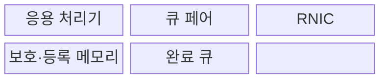
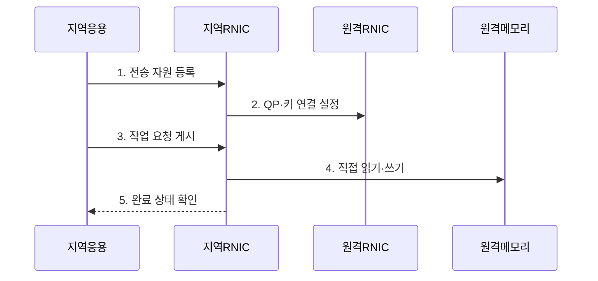

---
sidebar:
  order: 102
  label: "102. RDMA 원격 직접 메모리 접근 (RDMA)"
  badge:
    text: "기출 · 50%"
    variant: note
title: "RDMA 원격 직접 메모리 접근 (RDMA)"
date: "2026-07-30T18:30:00+09:00"
tags: ["notes-network"]
weight: 102
extra:
  question_no: "102"
  source_status: "기출"
  source_history: "138회"
  priority: 50
  priority_note: "설명·설계형: 138회 AI HPC RDMA 핵심"
---

## 미리 알고가기

- **원격 직접 메모리 접근(Remote Direct Memory Access, RDMA)**: 두 호스트의 등록 메모리 사이를 운영체제 복사와 원격 응용 개입을 줄여 직접 전송하는 기술이다.
- **RDMA 망 인터페이스 제어기(RDMA Network Interface Controller, RNIC)**: 등록 메모리 접근과 전송 작업을 하드웨어로 실행하는 네트워크 장치다.
- **메모리 등록**: 응용 버퍼를 RNIC가 접근할 수 있게 고정하고 로컬·원격 접근 키와 범위를 만드는 작업이다.
- **보호 도메인(Protection Domain, PD)**: 큐와 메모리 영역을 같은 권한 경계 안에 묶어 다른 자원의 접근을 격리하는 단위다.
- **큐 페어(Queue Pair, QP)**: 응용이 RNIC에 송신·수신 작업을 게시하는 두 작업 큐다.
- **완료 큐(Completion Queue, CQ)**: RNIC가 전송의 성공·실패와 완료된 작업 식별자를 기록하는 큐다.
- **제로 카피(Zero-Copy)**: 응용 자료를 커널과 중간 버퍼로 반복 복사하지 않고 전송하는 방식이다.
- **단방향 동작(One-Sided Operation)**: 원격 응용의 수신 호출 없이 RNIC가 원격 등록 메모리를 읽거나 쓰는 동작이다.
- **전송 제어 프로토콜(Transmission Control Protocol, TCP)**: 운영체제 네트워크 스택이 신뢰성 있는 바이트 흐름을 제공하는 범용 전송 프로토콜이다.
- **중앙처리장치(Central Processing Unit, CPU)**: 명령을 실행하는 처리 장치이며 RDMA는 자료 복사와 통신 처리에 드는 CPU 개입을 줄인다.
- **IETF RFC 5040**: 직접 자료 배치 위에서 읽기·쓰기를 제공하는 원격 직접 메모리 접근 프로토콜 규격이다.

## Ⅰ. 개요

- 정의/개념: RNIC의 **원격 등록 메모리 직접 전송**
- 배경/필요성: 소켓 통신의 **복사·커널·CPU 부하**

### 쉽게 이해하기 (학습용)

- 응용 자료를 운영체제 통로로 여러 번 복사하지 않고 네트워크 장치가 상대 서버의 허용된 메모리로 직접 옮긴다.

## Ⅱ. 특징

- **제로 카피·커널 우회** 기반 저지연 전송
- 원격 응용 호출 없는 **단방향 동작**
- 등록 메모리·접근 키 기반 **권한 제어**

### 쉽게 이해하기 (학습용)

- 빠른 통로를 얻는 대신 응용이 어느 메모리를 언제까지 노출하고 완료 뒤 재사용할지를 직접 관리해야 한다.

## Ⅲ. 구조 및 구성요소

| 구성요소 | 책임 |
|:---|:---|
| 응용 처리기 | 버퍼·작업·완료 수명주기를 관리 |
| 큐 페어 | 송수신 작업 요청을 RNIC에 게시 |
| RNIC | 등록 메모리 간 전송을 실행 |
| 보호·등록 메모리 | 권한 경계·접근 범위·키를 제공 |
| 완료 큐 | 작업 완료·실패 상태를 전달 |

> 요약: 보호 도메인의 큐·메모리를 RNIC가 직접 연결

### 쉽게 이해하기 (학습용)

- 응용이 허용한 메모리와 작업을 같은 권한 영역에 묶으면 RNIC가 직접 전송하고 완료 큐로 끝난 시점을 알려 준다.

## Ⅳ. 흐름도

**동작 원리**

- **1. 전송 자원 등록**: PD·QP·CQ와 메모리 키를 생성
- **2. QP·키 연결 설정**: 원격 주소·권한·연결을 확인
- **3. 작업 요청 게시**: 전송 동작·주소·길이를 큐에 등록
- **4. 직접 읽기·쓰기**: RNIC가 원격 메모리에 전송
- **5. 완료 상태 확인**: 성공·실패 뒤 버퍼를 재사용
> 요약: 메모리·키 교환 후 작업 게시·완료 확인

### 쉽게 이해하기 (학습용)

- 양쪽이 허용할 메모리 주소와 키를 나눈 뒤 전송 작업을 큐에 넣고 완료 통지를 받은 후에만 버퍼를 다시 쓴다.

## Ⅴ. 종류 및 비교

| 데이터 전달 방식 | RDMA | TCP 소켓 | 공유 메모리 |
|:---|:---|:---|:---|
| 적용 기준 | 고속·저지연 서버 간 대량 통신 | 범용 호환·복잡한 망·쉬운 운영 | 같은 호스트의 처리기 간 통신 |
| 핵심 특징 | **RNIC 직접 메모리 전송** | **커널 바이트 흐름** | **호스트 메모리 공유** |
| 한계 | 키·버퍼·완료 수명 오류 | 복사·문맥 전환·CPU 부하 | 동기화 오류·호스트 한정 |

> 요약: 호스트 경계·지연·메모리 책임으로 선택

### 쉽게 이해하기 (학습용)

- 서버 간 최고 성능은 RDMA, 범용 통신은 TCP, 같은 서버 안의 빠른 교환은 공유 메모리가 알맞다.

## Ⅵ. 실무 고려사항 및 대책

| 고려사항 | 대책 | 효과 |
|:---|:---|:---|
| 원격 키의 과도한 권한 | **보호 도메인·최소 범위 등록** | 메모리 침범 방지 |
| 완료 전 버퍼 재사용 | **CQ 기반 수명주기 통제** | 자료 훼손 방지 |
| 구현 간 동작 불일치 | **IETF RFC 5040 준수 시험** | 프로토콜 상호운용 확보 |

### 쉽게 이해하기 (학습용)

- 기울기 버퍼의 최소 범위만 등록하고 완료 큐 확인 뒤 재사용해야 고속 전송과 메모리 안전을 함께 확보한다.

## Ⅶ. 결론

- **지연 이득·메모리 책임·망 품질**로 RDMA 적용 결정

### 쉽게 이해하기 (학습용)

- RDMA는 빠른 장비만으로 완성되지 않으며 응용이 메모리 권한과 완료 시점을 안전하게 관리할 수 있을 때 사용해야 한다.
