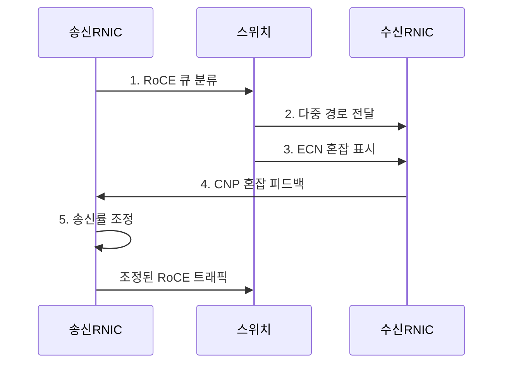

---
sidebar:
  order: 103
  label: "103. RoCE — RDMA over Converged Ethernet (RoCE)"
  badge:
    text: "미출제 · 50%"
    variant: note
title: "RoCE — RDMA over Converged Ethernet (RoCE)"
date: "2026-07-31T01:53:00+09:00"
tags: ["notes-network"]
weight: 103
extra:
  question_no: "103"
  source_status: "미출제"
  source_history: ""
  priority: 50
  priority_note: "설계·운영형: AI Ethernet Fabric 유력"
---

## 미리 알고가기

- **통합 이더넷 기반 RDMA(RDMA over Converged Ethernet, RoCE)**: 이더넷에서 원격 직접 메모리 접근 패킷을 전송해 낮은 지연과 적은 CPU 복사를 제공하는 기술이다.
- **원격 직접 메모리 접근(Remote Direct Memory Access, RDMA)**: 원격 호스트의 메모리에 운영체제 복사를 줄여 직접 데이터를 전송하는 기술이다.
- **RDMA 네트워크 인터페이스 제어기(RDMA Network Interface Controller, RNIC)**: 메모리 등록·전송·완료 처리를 하드웨어로 수행한다.
- **사용자 데이터그램 프로토콜·인터넷 프로토콜(User Datagram Protocol·Internet Protocol, UDP·IP)**: RoCEv2 패킷을 3계층 라우팅망으로 전달한다.
- **전송 제어 프로토콜(Transmission Control Protocol, TCP)**: iWARP의 신뢰성·혼잡 제어 기반이다.
- **인터넷 광역 RDMA 프로토콜(Internet Wide Area RDMA Protocol, iWARP)**: TCP 연결 위에서 RDMA를 제공한다.
- **중앙처리장치(Central Processing Unit, CPU)**: RoCE가 자료 복사 개입을 줄이는 호스트 연산 장치다.
- **RoCE 버전 1**: RDMA 패킷을 이더넷 계층에 직접 넣어 같은 2계층 방송 영역에서 전달하는 규격이다.
- **RoCE 버전 2**: RDMA 패킷을 UDP/IP에 넣어 3계층 라우팅망까지 전달하는 규격이다.
- **명시적 혼잡 알림(Explicit Congestion Notification, ECN)**: 스위치가 패킷을 버리기 전에 혼잡 표시를 넣어 수신 측에 알리는 기능이다.
- **혼잡 알림 패킷(Congestion Notification Packet, CNP)**: 수신 RNIC가 ECN 표시를 보고 송신 RNIC에 속도 감소를 요구하는 패킷이다.
- **데이터센터 양자화 혼잡 알림(Data Center Quantized Congestion Notification, DCQCN)**: ECN·CNP 신호로 RoCE 송신률을 조절하는 혼잡 제어 방식이다.
- **우선순위 흐름 제어(Priority Flow Control, PFC)**: 혼잡한 우선순위 큐의 송신만 잠시 멈춰 패킷 손실을 억제하는 이더넷 기능이다.
- **인캐스트(Incast)**: 여러 송신자가 한 수신자에게 동시에 전송해 수신 연결부의 큐가 순간적으로 몰리는 현상이다.
- **IEEE 802.1Q PFC**: 트래픽 등급별 흐름 제어를 규정한 이더넷 표준 기능이다.
- **IETF RFC 3168**: 인터넷 프로토콜의 명시적 혼잡 알림 표시를 규정한 표준 문서다.

> **키워드:** RoCE — RDMA over Converged Ethernet (RoCE)

## Ⅰ. 개요

- 정의/개념: 이더넷 패브릭으로 RDMA를 제공하는 **저지연 전송 기술**
- 배경/필요성: TCP 소켓의 복사·커널 처리로 **CPU 부하·지연 증가**

### 쉽게 이해하기 (학습용)

- 기존 이더넷 장비를 활용해 서버 메모리 사이를 빠르게 전송하되 혼잡으로 패킷이 버려지지 않게 별도 제어한다.

## Ⅱ. 특징

- RNIC 기반 **제로 카피·CPU 개입 감소**
- RoCEv2 기반 **IP 라우팅 확장**
- 손실 민감성 기반 **혼잡 조기 통제**

### 쉽게 이해하기 (학습용)

- 패킷이 버려진 뒤 멈추기보다 ECN으로 혼잡을 일찍 알려 속도를 낮추고 PFC는 순간 폭주를 막는 마지막 장치로 쓴다.

## Ⅲ. 구조 및 구성요소

| 구성요소 | 책임 |
|:---|:---|
| 송신 RoCE RNIC | 작업 전송과 **DCQCN 송신률** 조정 |
| 이더넷 패브릭 | **경로·버퍼·ECN 표시** 제공 |
| 수신 RoCE RNIC | 패킷 수신과 **CNP 피드백** 생성 |
| 혼잡·PFC 제어기 | **큐 분류·ECN·순간 정지** 통제 |
| 패브릭 관측기 | **큐·ECN·PFC·손실·지연** 측정 |

> 요약: ECN·CNP로 속도 조정하고 PFC는 보조

### 쉽게 이해하기 (학습용)

- 스위치가 혼잡을 표시하면 수신 장치가 송신 장치에 속도를 낮추라고 알리고 순간 폭주는 PFC가 잠시 멈춘다.

## Ⅳ. 흐름도

**동작 원리**

1. **RoCE 큐 분류**: 트래픽을 지정 우선순위에 매핑
2. **다중 경로 전달**: 경로 해시로 흐름 분산
3. **ECN 혼잡 표시**: 큐 임계값에서 패킷에 표시
4. **CNP 혼잡 피드백**: 수신 RNIC가 송신자에게 혼잡 통지
5. **송신률 조정**: 혼잡 정도에 맞춰 전송 속도 감소
> 요약: 혼잡 표시·피드백으로 손실 전 송신률 조정

### 쉽게 이해하기 (학습용)

- 스위치 큐가 차기 시작하면 패킷에 표시하고 수신 서버가 송신 서버에 알려 속도를 줄여 버려지는 패킷을 예방한다.

## Ⅴ. 종류 및 비교

| RDMA 전송 방식 | RoCEv1 | RoCEv2 | iWARP |
|:---|:---|:---|:---|
| 적용 기준 | 단일 2계층의 **소규모 무손실망** | **대규모 라우팅 데이터센터** | 손실망의 **TCP 혼잡 제어** 활용 |
| 핵심 특징 | **2계층 RDMA 직접 전달** | **UDP/IP 라우팅 RDMA** | **TCP 기반 RDMA** |
| 한계 | **방송 영역·확장성 제한** | **ECN·PFC 복잡성·패킷 손실** | **TCP 처리 지연·장비 지원** |

> 요약: 라우팅 범위·손실 모델·혼잡 제어로 선택

### 쉽게 이해하기 (학습용)

- 한 2계층 안이면 RoCEv1, 라우팅 규모면 RoCEv2, 일반 손실망의 TCP 동작을 원하면 iWARP를 고려한다.

## Ⅵ. 실무 고려사항 및 대책

| 고려사항 | 대책 | 효과 |
|:---|:---|:---|
| 인캐스트의 **버퍼 손실** | **RFC 3168 ECN 조기 표시** | **송신률 선제 조정** |
| **PFC 멈춤의 경로 전파** | **IEEE 802.1Q 우선순위 제한** | **교착·머리막힘 완화** |
| 경로별 **큐 설정 불일치** | **전 구간 큐 매핑 검증** | **무손실 동작 일관성** |

### 쉽게 이해하기 (학습용)

- 혼잡 임계값을 실측해 ECN을 먼저 사용하고 PFC는 지정 우선순위의 순간 손실 방지에만 제한한다.

## Ⅶ. 결론

- 단일 2계층은 **RoCEv1**, 라우팅 패브릭은 **RoCEv2** 선택

### 쉽게 이해하기 (학습용)

- RoCE 성능은 빠른 RNIC보다 모든 경로의 큐 분류와 혼잡 표시, PFC 멈춤을 함께 조정할 때 나온다.
