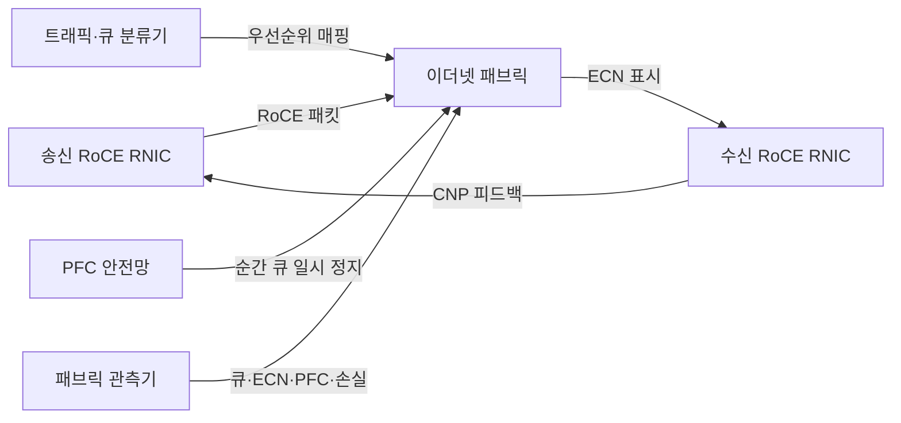
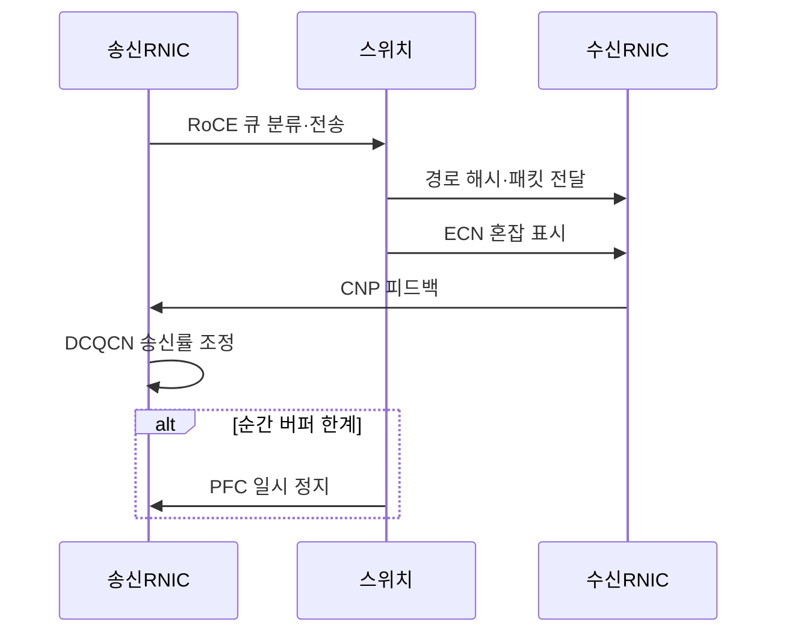

---
sidebar:
  order: 103
  label: "103. RoCE — RDMA over Converged Ethernet (RoCE)"
  badge:
    text: "미출제 · 50%"
    variant: note
title: "RoCE — RDMA over Converged Ethernet (RoCE)"
date: "2026-07-25T00:45:00+09:00"
tags: ["notes-network"]
weight: 103
extra:
  question_no: "103"
  source_status: "미출제"
  source_history: ""
  priority: 50
  priority_note: "설계·운영형: AI Ethernet Fabric 유력"
---

## 미리 알고가기

- **통합 이더넷 기반 RDMA(RDMA over Converged Ethernet, RoCE)**: 이더넷에서 원격 직접 메모리 접근 패킷을 전송해 낮은 지연과 적은 CPU 복사를 제공하는 기술이다.
- **원격 직접 메모리 접근(Remote Direct Memory Access, RDMA)**: ‘알디엠에이’로 읽고 네 영문 단어의 머리글자를 딴 표기이며 원격 호스트의 메모리에 운영체제 복사를 줄여 직접 데이터를 전송한다.
- **RDMA 네트워크 인터페이스 제어기(RDMA Network Interface Controller, RNIC)**: ‘알닉’으로 읽고 RDMA와 세 영문 단어의 머리글자를 결합한 표기이며 메모리 등록·전송·완료 처리를 하드웨어로 수행한다.
- **사용자 데이터그램 프로토콜·인터넷 프로토콜(User Datagram Protocol·Internet Protocol, UDP·IP)**: 각각 ‘유디피·아이피’로 읽고 영문 머리글자를 딴 표기이며 RoCEv2 패킷을 3계층 라우팅망으로 전달한다.
- **전송 제어 프로토콜(Transmission Control Protocol, TCP)**: ‘티시피’로 읽고 세 영문 단어의 머리글자를 딴 표기이며 iWARP의 신뢰성·혼잡 제어 기반이다.
- **인터넷 광역 RDMA 프로토콜(Internet Wide Area RDMA Protocol, iWARP)**: ‘아이워프’로 읽는 공식 프로토콜 이름이며 TCP 연결 위에서 RDMA를 제공한다.
- **중앙처리장치(Central Processing Unit, CPU)**: ‘시피유’로 읽고 세 영문 단어의 머리글자를 딴 표기이며 RoCE가 데이터 복사 개입을 줄이는 호스트 연산 장치다.
- **RoCE 버전 1**: RDMA 패킷을 이더넷 계층에 직접 넣어 같은 2계층 방송 영역에서 전달하는 규격이다.
- **RoCE 버전 2**: RDMA 패킷을 UDP/IP에 넣어 3계층 라우팅망까지 전달하는 규격이다.
- **명시적 혼잡 알림(Explicit Congestion Notification, ECN)**: 스위치가 패킷을 버리기 전에 혼잡 표시를 넣어 수신 측에 알리는 기능이다.
- **혼잡 알림 패킷(Congestion Notification Packet, CNP)**: 수신 RNIC가 ECN 표시를 보고 송신 RNIC에 속도 감소를 요구하는 패킷이다.
- **데이터센터 양자화 혼잡 알림(Data Center Quantized Congestion Notification, DCQCN)**: ECN·CNP 신호로 RoCE 송신률을 조절하는 혼잡 제어 방식이다.
- **우선순위 흐름 제어(Priority Flow Control, PFC)**: 혼잡한 우선순위 큐의 송신만 잠시 멈춰 패킷 손실을 억제하는 이더넷 기능이다.
- **인캐스트(Incast)**: 여러 송신자가 한 수신자에게 동시에 전송해 수신 연결부의 큐가 순간적으로 몰리는 현상이다.

## Ⅰ. 개요

- 정의/개념: 이더넷에서 RDMA 패킷을 전달하는 기술
- **배경/필요성**: 범용 이더넷의 연산·저장 통신 지연 감소

### 쉽게 이해하기 (학습용)

- 기존 이더넷 장비를 활용해 서버 메모리 사이를 빠르게 전송하되 혼잡으로 패킷이 버려지지 않게 별도 제어한다.

## Ⅱ. 특징

- 이더넷 생태계에서 RNIC 저지연 전송 활용한다.
- RoCEv2는 IP 라우팅으로 대규모 패브릭 확장한다.
- 손실 민감성 때문에 혼잡 조기 표시가 중요하다.
- 과도한 PFC는 멈춤 전파·큐 막힘을 유발한다.

### 쉽게 이해하기 (학습용)

- 패킷이 버려진 뒤 멈추기보다 ECN으로 혼잡을 일찍 알려 속도를 낮추고 PFC는 순간 폭주를 막는 마지막 장치로 쓴다.

## Ⅲ. 아키텍처 및 구성요소

| 설계 요소 | 설명 |
|:---|:---|
| 송신 RoCE RNIC | 작업 전송과 DCQCN 송신률 조정 |
| 이더넷 패브릭 | 경로·버퍼·ECN 표시를 제공 |
| 수신 RoCE RNIC | 패킷 수신과 CNP 피드백 생성 |
| 트래픽·큐 분류기 | RoCE 우선순위·큐를 일관 매핑 |
| PFC 안전망 | 순간 버퍼 고갈 시 큐를 일시 정지 |
| 패브릭 관측기 | 큐·ECN·PFC·손실·지연 측정 |

> 요약: ECN·CNP로 속도 조정하고 PFC는 보조

### 쉽게 이해하기 (학습용)

- 스위치가 혼잡을 표시하면 수신 장치가 송신 장치에 속도를 낮추라고 알리고 순간 폭주는 PFC가 잠시 멈춘다.

## Ⅳ. 원리 및 절차 흐름도

| 절차 | 설명 |
|:---|:---|
| RoCE 큐 분류·전송 | 트래픽을 지정 우선순위에 매핑 |
| 경로 해시·패킷 전달 | 다중 경로로 흐름을 분산 |
| ECN 혼잡 표시 | 큐 임계값에서 패킷에 표시 |
| CNP 피드백 | 수신 RNIC가 혼잡을 송신자에 알림 |
| DCQCN 송신률 조정 | 혼잡 정도에 맞춰 속도를 낮춤 |
| PFC 일시 정지 | 순간 큐 고갈 시 해당 등급 중단 |

> 요약: 혼잡 표시·피드백으로 손실 전 송신률 조정

### 쉽게 이해하기 (학습용)

- 스위치 큐가 차기 시작하면 패킷에 표시하고 수신 서버가 송신 서버에 알려 속도를 줄여 버려지는 패킷을 예방한다.

## Ⅴ. 종류 및 비교

| 판단 기준 | RoCEv1 | RoCEv2 | iWARP |
|:---|:---|:---|:---|
| 핵심 특징 | 이더넷 2계층에 RDMA 직접 전달 | UDP/IP로 라우팅 가능한 RDMA | TCP 위에서 RDMA 제공 |
| 적용 기준 | 단일 2계층의 작은 무손실망 | 대규모 라우팅 데이터센터 | 손실망·TCP 혼잡 제어 활용 |
| 주요 위험 | 방송 영역·확장성 제한 | ECN·PFC 복잡성·패킷 손실 | TCP 처리 지연·장비 지원 |

> 요약: 라우팅 범위·손실 모델·혼잡 제어로 선택

### 쉽게 이해하기 (학습용)

- 한 2계층 안이면 RoCEv1, 라우팅 규모면 RoCEv2, 일반 손실망의 TCP 동작을 원하면 iWARP를 고려한다.

## Ⅵ. 실무 사례

1. 인공지능 학습 패브릭에 RoCEv2·ECN 임계값 적용
2. 저장망 인캐스트를 송신률 제한으로 완화

### 쉽게 이해하기 (학습용)

- 다수 학습 서버가 통신하는 IP 패브릭은 RoCEv2를 쓰고 스위치 버퍼가 넘기 전 ECN 표시가 발생하게 조정한다.
- 여러 저장 서버가 한 서버로 동시에 보낼 때 각 송신률을 낮춰 수신 연결부의 순간 큐 폭주를 줄인다.

## Ⅶ. 결론

- 라우팅 규모·ECN 조정·PFC 위험으로 RoCE 설계

### 쉽게 이해하기 (학습용)

- RoCE 성능은 빠른 RNIC보다 모든 경로의 큐 분류와 혼잡 표시, PFC 멈춤을 함께 조정할 때 나온다.
