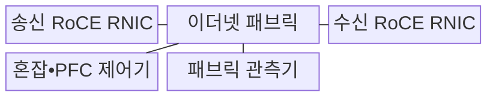
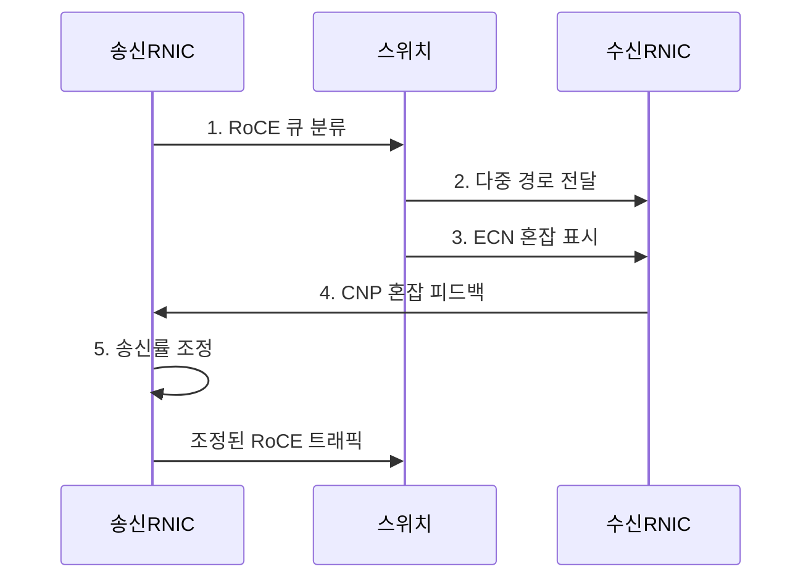

---
sidebar:
  order: 103
  label: "103. RoCE — RDMA over Converged Ethernet (RoCE)"
  badge:
    text: "미출제 • 50%"
    variant: note
title: "RoCE — RDMA over Converged Ethernet (RoCE)"
date: "2026-08-04T19:01:00+09:00"
tags: ["notes-network"]
weight: 103
extra:
  question_no: "103"
  source_status: "미출제"
  source_history: ""
  priority: 50
  priority_note: "설계•운영형: AI Ethernet Fabric 유력"
---

## Ⅰ. 개요

핵심 용어

- **통합 이더넷 기반 원격 직접 메모리 접근(RDMA over Converged Ethernet, RoCE)**: 이더넷 패브릭에서 RDMA를 제공하는 전송 기술
- **원격 직접 메모리 접근(Remote Direct Memory Access, RDMA)**: 호스트 간 등록 메모리를 직접 연결하는 전송 기술
- **RDMA 네트워크 인터페이스 카드(RDMA Network Interface Card, RNIC)**: RDMA 전송과 혼잡 제어를 처리하는 장치
- **전송 제어 프로토콜(Transmission Control Protocol, TCP)**: 신뢰성 있는 바이트 흐름을 제공하는 전송 프로토콜
- **중앙처리장치(Central Processing Unit, CPU)**: 범용 명령 실행과 연산을 담당하는 처리장치

- 정의/개념: **RoCE**는 이더넷 패브릭에서 RNIC 간 직접 전송을 제공하는 기술
- 배경/필요성: TCP 소켓의 복사•커널 처리로 **CPU 부하•지연 증가**

#### 한줄 요약

- 기존 이더넷 장비를 활용해 서버 메모리 사이를 빠르게 전송하되 혼잡으로 패킷이 버려지지 않게 별도 제어한다.

## Ⅱ. 특징

핵심 용어

- **명시적 혼잡 알림(Explicit Congestion Notification, ECN)**: 혼잡을 패킷 표시에 담아 송신률 감소를 유도하는 기능
- **혼잡 알림 패킷(Congestion Notification Packet, CNP)**: 수신 RNIC가 송신 RNIC에 혼잡을 알리는 패킷
- **우선순위 흐름 제어(Priority Flow Control, PFC)**: 지정 우선순위의 링크 전송을 일시 정지하는 기능
- **RoCEv2(RDMA over Converged Ethernet version 2)**: IP 라우팅을 지원하는 RoCE 버전
- **인터넷 프로토콜(Internet Protocol, IP)**: 주소 기반 패킷 라우팅을 제공하는 네트워크 프로토콜
- **데이터센터 정량화 혼잡 알림(Data Center Quantized Congestion Notification, DCQCN)**: CNP 피드백으로 RoCE 송신률을 조정하는 방식

- RNIC 기반 **제로 카피•CPU 개입 감소**
- RoCEv2 기반 **IP 라우팅 확장**
- 손실 민감성 기반 **혼잡 조기 통제**

#### 한줄 요약

- 패킷이 버려진 뒤 멈추기보다 ECN으로 혼잡을 일찍 알려 속도를 낮추고 PFC는 순간 폭주를 막는 마지막 장치로 쓴다.

## Ⅲ. 구조 및 구성요소

핵심 용어

- **송신 RoCE RNIC**: 작업 전송과 DCQCN 송신률을 조정하는 장치
- **이더넷 패브릭**: 경로•버퍼•ECN 표시를 제공하는 전송망
- **수신 RoCE RNIC**: 패킷을 수신하고 CNP 피드백을 생성하는 장치
- **혼잡•PFC 제어기**: 큐 분류•ECN•순간 정지를 통제하는 구성요소
- **패브릭 관측기**: 경로별 ECN•PFC•손실•지연을 측정하는 구성요소

| 구성요소 | 책임 |
|:---|:---|
| 송신 RoCE RNIC | 작업 전송과 **DCQCN 송신률** 조정 |
| 이더넷 패브릭 | **경로•버퍼•ECN 표시** 제공 |
| 수신 RoCE RNIC | 패킷 수신과 **CNP 피드백** 생성 |
| 혼잡•PFC 제어기 | **큐 분류•ECN•순간 정지** 통제 |
| 패브릭 관측기 | **큐•ECN•PFC•손실•지연** 측정 |

#### 한줄 요약

- 스위치가 혼잡을 표시하면 수신 장치가 송신 장치에 속도를 낮추라고 알리고 순간 폭주는 PFC가 잠시 멈춘다.

## Ⅳ. 흐름도

핵심 용어

- **CNP 혼잡 피드백**: 수신 RNIC가 ECN을 확인해 송신 RNIC에 속도 감소를 요청하는 절차

**동작 원리**

1. **RoCE 큐 분류**: 트래픽을 지정 우선순위에 매핑
2. **다중 경로 전달**: 경로 해시로 흐름 분산
3. **ECN 혼잡 표시**: 큐 임계값에서 패킷에 표시
4. **CNP 혼잡 피드백**: 수신 RNIC가 송신자에게 혼잡 통지
5. **송신률 조정**: 혼잡 정도에 맞춰 전송 속도 감소
#### 한줄 요약

- 스위치 큐가 차기 시작하면 패킷에 표시하고 수신 서버가 송신 서버에 알려 속도를 줄여 버려지는 패킷을 예방한다.

## Ⅴ. 종류 및 비교

핵심 용어

- **iWARP**: 인터넷 광역 원격 직접 메모리 접근 프로토콜(Internet Wide Area RDMA Protocol, iWARP)은 TCP의 신뢰 전송과 혼잡 제어를 이용한다.
- **RoCEv1**: 통합 이더넷 기반 원격 직접 메모리 접근 버전 1(RDMA over Converged Ethernet version 1, RoCEv1)은 RDMA 프레임을 계층 2에서 직접 전달하는 방식
- **사용자 데이터그램 프로토콜(User Datagram Protocol, UDP)**: 비연결형 데이터그램을 전달하는 전송 프로토콜

| RDMA 전송 방식 | RoCEv1 | RoCEv2 | iWARP |
|:---|:---|:---|:---|
| 적용 기준 | 단일 2계층의 **소규모 무손실망** | **대규모 라우팅 데이터센터** | 손실망의 **TCP 혼잡 제어** 활용 |
| 핵심 특징 | **2계층 RDMA 직접 전달** | **UDP/IP 라우팅 RDMA** | **TCP 기반 RDMA** |
| 한계 | **방송 영역•확장성 제한** | **ECN•PFC 복잡성•패킷 손실** | **TCP 처리 지연•장비 지원** |

#### 한줄 요약

- 한 2계층 안이면 RoCEv1, 라우팅 규모면 RoCEv2, 일반 손실망의 TCP 동작을 원하면 iWARP를 고려한다.

## Ⅵ. 실무 고려사항 및 대책

핵심 용어

- **PFC 멈춤의 경로 전파**: 한 우선순위 큐의 정지가 상류로 확산돼 무관한 흐름까지 막는 문제
- **의견 요청 문서(Request for Comments, RFC)**: 인터넷 기술 규격을 공개하는 문서 체계
- **RFC 3168**: ECN 동작을 규정한 인터넷 표준
- **전기전자공학자협회(Institute of Electrical and Electronics Engineers, IEEE)**: 전기•전자•통신 표준을 개발하는 전문 기구
- **IEEE 802.1Qbb**: PFC 동작을 규정한 이더넷 표준

| 문제 | 대책 | 효과 |
|:---|:---|:---|
| 인캐스트의 **버퍼 손실** | **RFC 3168 ECN 조기 표시** | **송신률 선제 조정** |
| **PFC 멈춤의 경로 전파** | **IEEE 802.1Qbb 우선순위 제한** | **교착•머리막힘 완화** |
| 경로별 **큐 설정 불일치** | **전 구간 큐 매핑 검증** | **무손실 동작 일관성** |

#### 한줄 요약

- 혼잡 임계값을 실측해 ECN을 먼저 사용하고 PFC는 지정 우선순위의 순간 손실 방지에만 제한한다.

## Ⅶ. 결론

- 단일 2계층은 **RoCEv1**, 라우팅 패브릭은 **RoCEv2** 선택

#### 한줄 요약

- RoCE 성능은 빠른 RNIC보다 모든 경로의 큐 분류와 혼잡 표시, PFC 멈춤을 함께 조정할 때 나온다.
