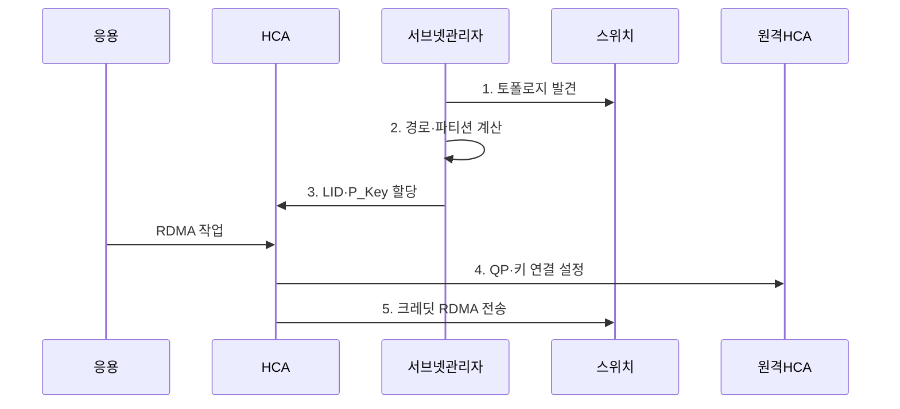

---
sidebar:
  order: 104
  label: "104. InfiniBand 클러스터 인터커넥트 (InfiniBand Cluster)"
  badge:
    text: "기출 · 50%"
    variant: note
title: "InfiniBand 클러스터 인터커넥트 (InfiniBand Cluster)"
date: "2026-08-02T12:00:00+09:00"
tags: ["notes-network"]
weight: 104
extra:
  question_no: "104"
  source_status: "기출"
  source_history: "138회"
  priority: 50
  priority_note: "비교·설계형: 138회 InfiniBand 직접 요구"
---

## Ⅰ. 개요

핵심 용어

- **RDMA·크레딧 제어 패브릭**: InfiniBand는 HCA와 스위치를 연결해 RDMA와 수신 버퍼 크레딧 기반 무손실 전송을 제공하는 패브릭이다.

- 정의/개념: HCA와 스위치를 잇는 **RDMA·크레딧 제어 패브릭**
- 배경/필요성: 범용망의 복사와 손실로 인한 **지연 변동**

#### 한줄 요약

- 서버 사이 대량 자료를 빠르게 보내도록 주소와 경로, 버퍼 여유를 패브릭 전체에서 함께 관리하는 전용망이다.

## Ⅱ. 특징

핵심 용어

- **링크 무손실 흐름 제어**: 링크 무손실 흐름 제어는 수신 버퍼의 여유 크레딧을 가진 송신자만 전송하게 해 링크 손실을 방지한다.

- HCA 기반 **RDMA 전송**
- 크레딧 기반 **링크 무손실 흐름 제어**
- 서브넷 관리자 기반 **주소·경로 관리**

#### 한줄 요약

- 각 링크는 받을 공간이 있다는 신호만큼 보내 패킷을 잃지 않지만 중앙 경로 관리가 잘못되면 많은 서버가 함께 영향을 받는다.

## Ⅲ. 구조 및 구성요소

핵심 용어

- **서브넷 관리자**: 서브넷 관리자는 패브릭 토폴로지를 발견하고 LID·경로·P_Key를 계산·배포하는 중앙 제어 기능이다.

| 구성요소 | 책임 |
|:---|:---|
| 컴퓨트 HCA | 서버 메모리의 **RDMA 작업** 실행 |
| InfiniBand 스위치 패브릭 | **LID·VL 경로**로 무손실 패킷 전달 |
| 저장 HCA | 저장 장치의 **RDMA 종단** 제공 |
| 서브넷 관리자 | **LID·경로·P_Key** 관리 |
| 패브릭 관측기 | **포트·링크·오류·혼잡 상태** 수집 |

> 요약: 서브넷 관리자가 HCA·스위치 경로를 제어

#### 한줄 요약

- 서버와 저장장치의 HCA를 스위치들이 연결하고 서브넷 관리자가 모든 포트의 주소와 경로, 격리 그룹을 정한다.

## Ⅳ. 흐름도

핵심 용어

- **5. 크레딧 RDMA 전송**: HCA와 스위치는 다음 홉의 수신 버퍼 크레딧 범위에서만 RDMA 패킷을 보내 손실을 억제한다.

**동작 원리**

1. **토폴로지 발견**: 링크·스위치·HCA 상태 수집
2. **경로·파티션 계산**: 목적지 경로와 통신 그룹 결정
3. **LID·P_Key 할당**: 주소와 접근 식별자 배포
4. **QP·키 연결 설정**: 작업 큐와 원격 메모리 정보 공유
5. **크레딧 RDMA 전송**: 수신 버퍼 여유 안에서 전달
> 요약: 주소·경로 할당 후 크레딧 기반 RDMA

#### 한줄 요약

- 관리자가 주소와 길을 정하면 서버들이 작업 큐를 연결하고 각 링크가 받을 공간만큼만 자료를 보낸다.

## Ⅴ. 종류 및 비교

핵심 용어

- **InfiniBand**: InfiniBand는 최고 성능 연산 클러스터에 전용 RDMA·크레딧 흐름 제어를 제공하지만 전용 장비와 관리가 필요하다.

| 클러스터 인터커넥트 | InfiniBand | RoCEv2 | TCP 이더넷 |
|:---|:---|:---|:---|
| 적용 기준 | **최고 성능 연산 클러스터** | 기존 이더넷 기반 **대규모 RDMA** | **범용 호환·운영 단순성** 우선 |
| 핵심 특징 | **전용 RDMA·크레딧 제어** | **IP 이더넷 기반 RDMA** | **커널 기반 신뢰 전송** |
| 한계 | **전용 장비·관리자 의존** | **혼잡·무손실 조정 복잡성** | **복사·CPU·지연 부담** |

> 요약: 전용성·이더넷 재사용·운영 복잡도로 선택

#### 한줄 요약

- 최고 성능 전용망은 InfiniBand, 이더넷 RDMA는 RoCEv2, 범용성과 쉬운 운영은 TCP 이더넷이 알맞다.

## Ⅵ. 실무 고려사항 및 대책

핵심 용어

- **단일 장애**: 서브넷 관리자의 단일 장애는 토폴로지·주소·경로·파티션 변경 제어를 멈춰 패브릭 전체 운영에 영향을 줄 수 있다.

| 문제 | 대책 | 효과 |
|:---|:---|:---|
| 집단 통신의 **상위 링크 병목** | **비차단 용량·경로 분산** | **반복 시간 단축** |
| 서브넷 관리자의 **단일 장애** | **관리자 이중화·상태 동기화** | **제어 가용성** 확보 |
| 장비 간 **상호운용 차이** | **IBTA IBA 2.0 준수 시험** | **패브릭 호환성** 확보 |

#### 한줄 요약

- 집단 통신 부하로 비차단 용량을 산정하고 서브넷 관리자 장애 전환과 장비 상호운용을 사전 검증한다.

## Ⅶ. 결론

핵심 용어

- **RoCEv2**: RoCEv2는 기존 이더넷 장비를 재사용해 라우팅 가능한 RDMA망을 구성할 때 InfiniBand의 대안이 된다.

- 전용 최고 성능은 **InfiniBand**, 이더넷 재사용은 **RoCEv2** 선택

#### 한줄 요약

- InfiniBand는 링크 속도뿐 아니라 서브넷 관리 이중화와 경로 용량, 파티션 격리를 함께 운영할 수 있을 때 선택해야 한다.
