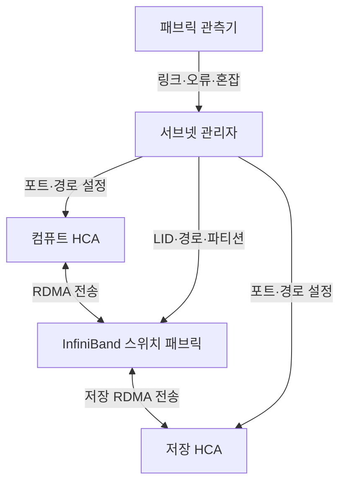
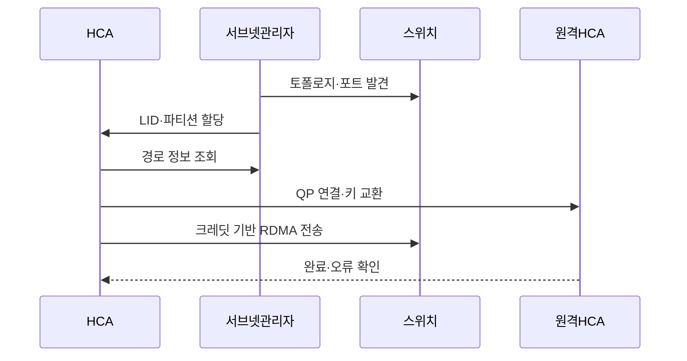

---
sidebar:
  order: 104
  label: "104. InfiniBand 클러스터 인터커넥트 (InfiniBand Cluster)"
  badge:
    text: "기출 · 50%"
    variant: note
title: "InfiniBand 클러스터 인터커넥트 (InfiniBand Cluster)"
date: "2026-07-27T23:59:59+09:00"
tags: ["notes-network"]
weight: 104
extra:
  question_no: "104"
  source_status: "기출"
  source_history: "138회"
  priority: 50
  priority_note: "비교·설계형: 138회 InfiniBand 직접 요구"
---

## 미리 알고가기

- **InfiniBand**: 서버·저장장치 사이에 RDMA와 손실 없는 낮은 지연 전송을 제공하도록 설계된 스위치 패브릭 기술이다.
- **원격 직접 메모리 접근(Remote Direct Memory Access, RDMA)**: ‘알디엠에이’로 읽고 네 영문 단어의 머리글자를 딴 표기이며 원격 서버 메모리에 운영체제 복사를 줄여 직접 데이터를 전송한다.
- **통합 이더넷 기반 RDMA 버전 2(RDMA over Converged Ethernet Version 2, RoCEv2)**: ‘로시 브이투’로 읽고 RoCE와 버전 숫자를 결합한 표기이며 RDMA 패킷을 인터넷 프로토콜 라우팅망으로 전달한다.
- **전송 제어 프로토콜(Transmission Control Protocol, TCP)**: ‘티시피’로 읽고 세 영문 단어의 머리글자를 딴 표기이며 범용 이더넷에서 신뢰성·혼잡 제어를 제공한다.
- **호스트 채널 어댑터(Host Channel Adapter, HCA)**: 서버 메모리와 InfiniBand 링크 사이에서 RDMA 작업을 실행하는 장치다.
- **서브넷 관리자(Subnet Manager, SM)**: 패브릭 토폴로지를 발견하고 주소·경로·파티션을 계산·배포하는 제어 기능이다.
- **로컬 식별자(Local Identifier, LID)**: 한 InfiniBand 서브넷 안에서 스위치가 패킷 전달에 사용하는 짧은 주소다.
- **큐 페어(Queue Pair, QP)**: 응용이 HCA에 송신·수신 RDMA 작업을 게시하는 두 큐다.
- **가상 레인(Virtual Lane, VL)**: 하나의 물리 링크에서 트래픽을 논리 큐로 분리해 서비스 품질과 교착 방지를 지원하는 채널이다.
- **크레딧 기반 흐름 제어**: 수신 버퍼의 여유량만큼 크레딧을 받은 송신자만 보내 링크 손실을 방지하는 방식이다.
- **파티션 키(Partition Key, P_Key)**: 같은 물리 패브릭에서 통신 가능한 논리 그룹을 구분하는 접근 식별자다.
- **핵심 약어 읽기와 표기**: HCA·SM·LID·QP·VL은 에이치씨에이·에스엠·엘아이디·큐피·브이엘로 읽고 영문 머리글자를 딴 표기이며, 장치·관리·주소·작업·가상 채널을 뜻한다.

## Ⅰ. 개요

- 정의: **RDMA·크레딧 제어** 전용 패브릭
- 기존 한계: 범용망의 **복사·손실·지연 변동**

### 쉽게 이해하기 (학습용)

- 서버 사이 대량 자료를 빠르게 보내도록 주소와 경로, 버퍼 여유를 패브릭 전체에서 함께 관리하는 전용망이다.

## Ⅱ. 특징

- HCA 기반 **RDMA 전송**
- 크레딧 기반 **링크 무손실 흐름 제어**
- 서브넷 관리자 기반 **주소·경로 관리**

### 쉽게 이해하기 (학습용)

- 각 링크는 받을 공간이 있다는 신호만큼 보내 패킷을 잃지 않지만 중앙 경로 관리가 잘못되면 많은 서버가 함께 영향을 받는다.

## Ⅲ. 아키텍처 및 구성요소

| 설계 요소 | 설명 |
|:---|:---|
| 컴퓨트 HCA | 서버 메모리의 RDMA 작업 실행 |
| InfiniBand 스위치 패브릭 | LID 경로로 무손실 패킷 전달 |
| 저장 HCA | 저장 장치의 RDMA 종단 제공 |
| 서브넷 관리자 | 주소·경로·파티션·서비스 품질 관리 |
| 패브릭 관측기 | 포트·링크·오류·혼잡 상태 수집 |

> 요약: 서브넷 관리자가 HCA·스위치 경로를 제어

### 쉽게 이해하기 (학습용)

- 서버와 저장장치의 HCA를 스위치들이 연결하고 서브넷 관리자가 모든 포트의 주소와 경로, 격리 그룹을 정한다.

## Ⅳ. 원리 및 절차 흐름도

| 절차 | 설명 |
|:---|:---|
| 토폴로지·포트 발견 | 링크·스위치·HCA 상태 수집 |
| LID·파티션 할당 | 주소와 논리 통신 그룹 배포 |
| 경로 정보 조회 | 목적지까지 전달 경로를 획득 |
| QP 연결·키 교환 | 작업 큐와 원격 메모리 정보 공유 |
| 크레딧 기반 RDMA 전송 | 버퍼 여유 안에서 손실 없이 전달 |
| 완료·오류 확인 | 작업 결과와 링크 오류 처리 |

> 요약: 주소·경로 할당 후 크레딧 기반 RDMA

### 쉽게 이해하기 (학습용)

- 관리자가 주소와 길을 정하면 서버들이 작업 큐를 연결하고 각 링크가 받을 공간만큼만 자료를 보낸다.

## Ⅴ. 종류 및 비교

| 클러스터 인터커넥트 | InfiniBand | RoCEv2 | TCP 이더넷 |
|:---|:---|:---|:---|
| 적용 기준 | 최고 성능 연산 클러스터 | 기존 이더넷 기반 대규모 RDMA | 범용 호환·운영 단순성 우선 |
| 핵심 특징 | 전용 RDMA·크레딧 제어 | IP 이더넷 기반 RDMA | 커널 기반 신뢰 전송 |
| 한계 | 전용 장비·관리자 의존 | 혼잡·무손실 조정 복잡성 | 복사·CPU·지연 부담 |

> 요약: 전용성·이더넷 재사용·운영 복잡도로 선택

### 쉽게 이해하기 (학습용)

- 최고 성능 전용망은 InfiniBand, 이더넷 RDMA는 RoCEv2, 범용성과 쉬운 운영은 TCP 이더넷이 알맞다.

## Ⅵ. 실무 사례

1. 대규모 학습 클러스터의 **비차단 InfiniBand 패브릭**

### 쉽게 이해하기 (학습용)

- 다수의 학습 서버가 동시에 기울기를 교환해도 상위 스위치 링크가 병목이 되지 않도록 리프와 스파인 간 용량을 설계한다.

## Ⅶ. 결론

- 대규모 HPC·AI 집단 통신의 병목을 줄이기 위해 통신 규모·비차단 용량·서브넷 관리·경로·파티션 격리를 검토하여, 운영 역량이 확보된 클러스터에 InfiniBand를 선택해야 한다.

### 쉽게 이해하기 (학습용)

- InfiniBand는 링크 속도뿐 아니라 서브넷 관리 이중화와 경로 용량, 파티션 격리를 함께 운영할 수 있을 때 선택해야 한다.
