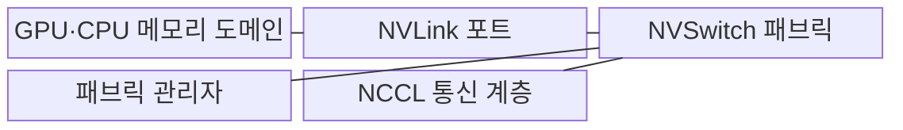
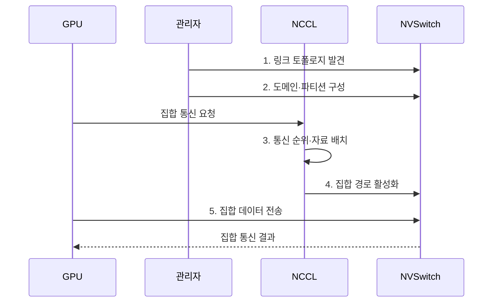

---
sidebar:
  order: 105
  label: "105. NVLink 고대역폭 인터커넥트 (NVLink)"
  badge:
    text: "기출 · 50%"
    variant: note
title: "NVLink 고대역폭 인터커넥트 (NVLink)"
date: "2026-08-02T12:00:00+09:00"
tags: ["notes-network"]
weight: 105
extra:
  question_no: "105"
  source_status: "기출"
  source_history: "138회"
  priority: 50
  priority_note: "비교형: 138회 NVLink Scale-up 구성"
---

## Ⅰ. 개요

핵심 용어

- **고대역폭 스케일업 연결**: NVLink는 한 고속 도메인 안의 GPU·CPU 메모리 사이에 높은 대역폭의 접근과 전송을 제공하는 스케일업 연결이다.

- 정의/개념: GPU·CPU 메모리 도메인을 잇는 **고대역폭 스케일업 연결**
- 배경/필요성: PCIe의 **GPU 간 대역폭 병목**

### 쉽게 이해하기 (학습용)

- 한 서버 안의 여러 GPU가 CPU 메모리를 돌아가지 않고 전용 고속 통로로 서로의 자료를 주고받게 한다.

## Ⅱ. 특징

핵심 용어

- **토폴로지 인식 집합 통신**: 토폴로지 인식 집합 통신은 GPU·NVSwitch 연결과 링크 상태에 따라 NCCL이 링·트리 경로를 선택한다.

- GPU·CPU 간 **상호 메모리 접근**
- NVSwitch 기반 **다중 GPU 교차 연결**
- NCCL 기반 **토폴로지 인식 집합 통신**

### 쉽게 이해하기 (학습용)

- 빠른 링크가 있어도 자주 통신하는 GPU가 멀리 배치되면 여러 스위치와 외부망을 거쳐 대기 시간이 커진다.

## Ⅲ. 구조 및 구성요소

핵심 용어

- **NVSwitch 패브릭**: NVSwitch 패브릭은 여러 NVLink 포트를 교차 연결해 다수 GPU가 동시에 통신할 고대역폭 경로를 제공한다.

| 구성요소 | 책임 |
|:---|:---|
| GPU·CPU 메모리 도메인 | **자료 저장·상호 접근 경계** 제공 |
| NVLink 포트 | 처리기 사이 **고속 링크** 제공 |
| NVSwitch 패브릭 | 여러 포트의 **동시 교차 경로** 제공 |
| 패브릭 관리자 | **링크·파티션·접근 상태** 관리 |
| NCCL 통신 계층 | 토폴로지별 **집합 통신 경로** 선택 |

> 요약: NVSwitch 도메인에서 GPU 메모리 경로 최적화

### 쉽게 이해하기 (학습용)

- GPU 포트를 NVSwitch가 교차 연결하고 관리자가 접근 영역을 정하면 NCCL이 집합 통신 경로를 선택한다.

## Ⅳ. 흐름도

핵심 용어

- **3. 통신 순위·자료 배치**: NCCL은 자주 데이터를 교환하는 GPU 순위를 같은 NVSwitch 도메인과 가까운 링크에 배치한다.

**동작 원리**

1. **링크 토폴로지 발견**: GPU·포트·스위치 연결 수집
2. **도메인·파티션 구성**: 상호 접근 경계와 권한 설정
3. **통신 순위·자료 배치**: 자주 교환할 GPU를 가까이 배치
4. **집합 경로 활성화**: 연산별 링·트리 경로 설정
5. **집합 데이터 전송**: 선택 경로로 GPU 자료 교환
> 요약: 토폴로지에 맞춰 GPU 배치·집합 경로 선택

### 쉽게 이해하기 (학습용)

- 연결 구조를 먼저 확인해 자주 통신하는 GPU를 가깝게 놓고 NCCL이 연산에 맞는 링이나 트리 경로를 사용한다.

## Ⅴ. 종류 및 비교

핵심 용어

- **InfiniBand·RoCE**: InfiniBand·RoCE는 서버와 랙 경계를 넘어 GPU 집합 통신을 확장하는 스케일아웃 RDMA망이다.

| 가속기 연결 방식 | NVLink | PCIe | InfiniBand·RoCE |
|:---|:---|:---|:---|
| 적용 기준 | 한 도메인의 **모델·텐서 병렬** | 저장·망 장치의 **범용 연결** | 랙·클러스터 간 **집합 통신** |
| 핵심 특징 | **스케일업 메모리 연결** | **범용 호스트·장치 버스** | **스케일아웃 RDMA망** |
| 한계 | **전용 생태계·토폴로지 제약** | **GPU 간 대역폭·공유 병목** | **망 혼잡·외부 경로 지연** |

> 요약: 장치 범위·통신 거리·확장 방식으로 선택

### 쉽게 이해하기 (학습용)

- 한 시스템의 GPU 통신은 NVLink, 범용 장치는 PCIe, 서버 밖 클러스터 통신은 InfiniBand나 RoCE가 맡는다.

## Ⅵ. 실무 고려사항 및 대책

핵심 용어

- **사용률 편중**: 일부 링크의 사용률 편중은 집합 통신 경로가 같은 NVLink·NVSwitch 포트에 집중돼 유효 대역폭을 제한하는 문제다.

| 문제 | 대책 | 효과 |
|:---|:---|:---|
| 통신 GPU의 **도메인 분리** | **토폴로지 인식 순위 배치** | **외부망 경유 트래픽 감소** |
| 일부 링크의 **사용률 편중** | **링·트리 경로 분산** | **유효 대역폭 향상** |
| 링크 장애의 **성능 급락** | **오류 감시·경로 재구성** | **집합 통신 지속성** 확보 |

### 쉽게 이해하기 (학습용)

- 텐서 통신량이 큰 GPU를 같은 NVSwitch 도메인에 배치하고 링크 편중과 장애 링크의 대체 경로를 확인한다.

## Ⅶ. 결론

핵심 용어

- **RDMA망**: RDMA망은 서버 밖으로 확장하는 GPU 통신을 담당하고 한 NVSwitch 도메인의 스케일업 통신은 NVLink가 담당한다.

- 한 도메인 스케일업은 **NVLink**, 서버 간 확장은 **RDMA망** 선택

### 쉽게 이해하기 (학습용)

- NVLink 설계는 최고 링크 속도보다 자주 통신하는 GPU를 같은 도메인에 두고 외부망으로 나가는 경계를 줄이는 것이 중요하다.
