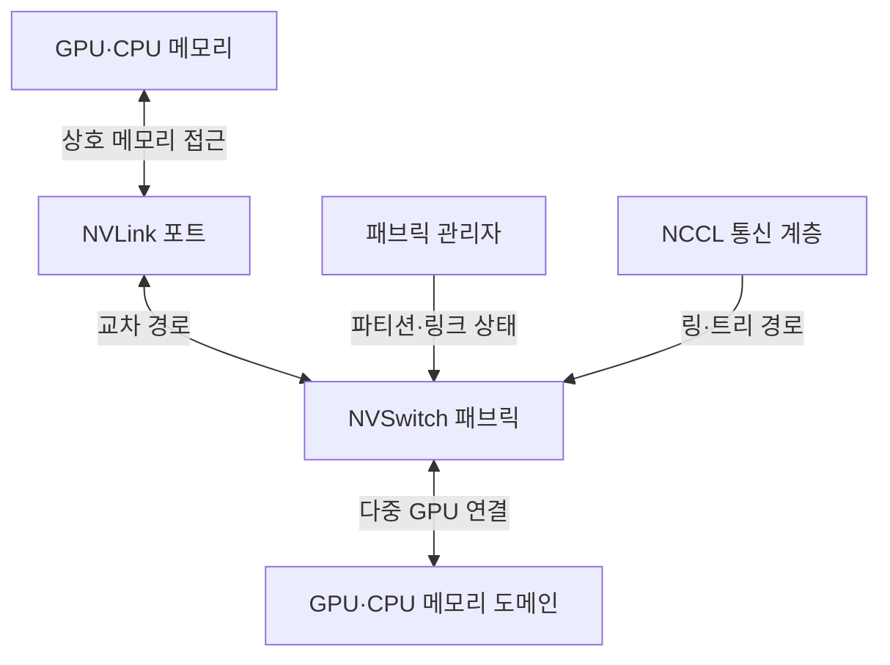
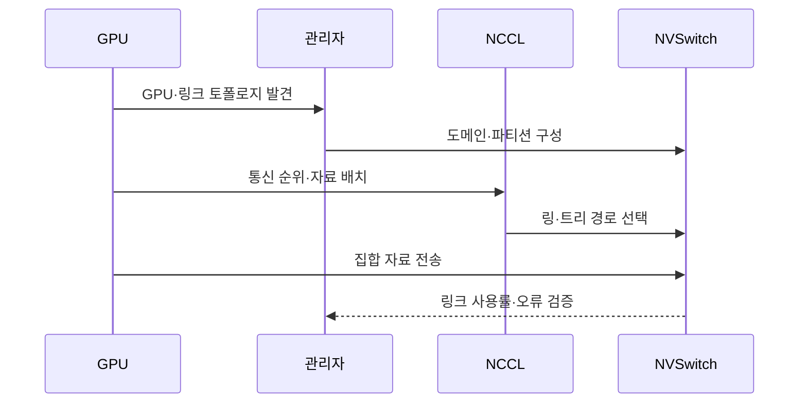

---
sidebar:
  order: 105
  label: "105. NVLink 고대역폭 인터커넥트 (NVLink)"
  badge:
    text: "기출 · 50%"
    variant: note
title: "NVLink 고대역폭 인터커넥트 (NVLink)"
date: "2026-07-27T23:59:59+09:00"
tags: ["notes-network"]
weight: 105
extra:
  question_no: "105"
  source_status: "기출"
  source_history: "138회"
  priority: 50
  priority_note: "비교형: 138회 NVLink Scale-up 구성"
---

## 미리 알고가기

- **그래픽 처리장치(Graphics Processing Unit, GPU)**: 많은 연산을 병렬 실행해 인공지능 학습·추론과 과학 계산을 가속하는 장치다.
- **중앙처리장치(Central Processing Unit, CPU)**: ‘시피유’로 읽고 세 영문 단어의 머리글자를 딴 표기이며 운영체제와 범용 연산을 실행하는 호스트 처리기다.
- **원격 직접 메모리 접근(Remote Direct Memory Access, RDMA)**: ‘알디엠에이’로 읽고 네 영문 단어의 머리글자를 딴 표기이며 원격 서버 메모리에 운영체제 복사를 줄여 직접 데이터를 전송한다.
- **NVLink**: GPU·CPU 사이에 높은 대역폭의 메모리 접근과 자료 전송을 제공하는 스케일업 인터커넥트다.
- **NVSwitch**: 여러 NVLink 포트를 교차 연결해 다수 GPU가 동시에 통신할 경로를 제공하는 스위치다.
- **스케일업(Scale-Up)**: 한 시스템이나 고속 도메인 안에서 처리기·메모리 연결을 확대하는 방식이다.
- **스케일아웃(Scale-Out)**: 여러 서버 노드를 네트워크로 연결해 전체 처리 능력을 확대하는 방식이다.
- **집합 통신(Collective Communication)**: 여러 처리기가 자료를 전체 합산·배포·수집하는 통신 연산이다.
- **엔비디아 집합 통신 라이브러리(NVIDIA Collective Communications Library, NCCL)**: ‘엔씨씨엘’로 읽고 영문 핵심어의 머리글자를 딴 표기이며 GPU 토폴로지와 링크 상태에 따라 집합 통신의 링·트리 경로를 선택한다.
- **주변기기 구성요소 고속 연결(Peripheral Component Interconnect Express, PCIe)**: ‘피시아이 익스프레스’로 읽고 공식 명칭의 약어에 고속 규격을 뜻하는 e를 붙인 표기이며 호스트와 가속기·저장·망 장치를 연결하는 범용 버스다.
- **InfiniBand·통합 이더넷 기반 RDMA(InfiniBand·RDMA over Converged Ethernet, RoCE)**: 각각 ‘인피니밴드·로시’로 읽으며 서버 노드 사이의 스케일아웃 RDMA 전송망이다.
- **패브릭 관리자(Fabric Manager)**: NVSwitch 도메인의 링크·파티션·접근 상태를 구성하고 감시하는 관리 기능이다.
- **제품명 읽기와 표기**: NVLink·NVSwitch는 엔브이링크·엔브이스위치로 읽는 NVIDIA 인터커넥트 제품명이며, 각각 처리기 링크와 다중 링크 교차 연결을 맡는다.

## Ⅰ. 개요

- 정의: GPU·CPU의 **고대역폭 스케일업 연결**
- 기존 한계: PCIe의 **GPU 간 대역폭 병목**

### 쉽게 이해하기 (학습용)

- 한 서버 안의 여러 GPU가 CPU 메모리를 돌아가지 않고 전용 고속 통로로 서로의 자료를 주고받게 한다.

## Ⅱ. 특징

- GPU·CPU 간 **상호 메모리 접근**
- NVSwitch 기반 **다중 GPU 교차 연결**
- NCCL 기반 **토폴로지 인식 집합 통신**

### 쉽게 이해하기 (학습용)

- 빠른 링크가 있어도 자주 통신하는 GPU가 멀리 배치되면 여러 스위치와 외부망을 거쳐 대기 시간이 커진다.

## Ⅲ. 아키텍처 및 구성요소

| 설계 요소 | 설명 |
|:---|:---|
| GPU·CPU 메모리 | 모델·활성값·기울기 자료 저장 |
| NVLink 포트 | 처리기 사이 고속 링크 제공 |
| NVSwitch 패브릭 | 여러 포트의 동시 교차 경로 제공 |
| GPU·CPU 메모리 도메인 | 상호 접근 가능한 처리기 경계 |
| 패브릭 관리자 | 링크·파티션·접근 상태 관리 |
| NCCL 통신 계층 | 토폴로지별 집합 통신 경로 선택 |

> 요약: NVSwitch 도메인에서 GPU 메모리 경로 최적화

### 쉽게 이해하기 (학습용)

- GPU 포트를 NVSwitch가 교차 연결하고 관리자가 접근 영역을 정하면 NCCL이 집합 통신 경로를 선택한다.

## Ⅳ. 원리 및 절차 흐름도

| 절차 | 설명 |
|:---|:---|
| GPU·링크 토폴로지 발견 | GPU·포트·스위치 연결을 수집 |
| 도메인·파티션 구성 | 상호 접근 경계와 권한 설정 |
| 통신 순위·자료 배치 | 자주 교환할 GPU를 가까이 배치 |
| 링·트리 경로 선택 | 집합 연산별 통신 경로를 결정 |
| 집합 자료 전송 | NVLink·NVSwitch로 자료 교환 |
| 링크 사용률·오류 검증 | 우회·불균형·오류 링크 확인 |

> 요약: 토폴로지에 맞춰 GPU 배치·집합 경로 선택

### 쉽게 이해하기 (학습용)

- 연결 구조를 먼저 확인해 자주 통신하는 GPU를 가깝게 놓고 NCCL이 연산에 맞는 링이나 트리 경로를 사용한다.

## Ⅴ. 종류 및 비교

| 가속기 연결 방식 | NVLink | PCIe | InfiniBand·RoCE |
|:---|:---|:---|:---|
| 적용 기준 | 한 도메인의 모델·텐서 병렬 | 저장·망 장치 등 범용 연결 | 랙·클러스터 간 집합 통신 |
| 핵심 특징 | 스케일업 메모리 연결 | 범용 호스트·장치 버스 | 스케일아웃 RDMA망 |
| 한계 | 전용 생태계·토폴로지 제약 | GPU 간 대역폭·공유 병목 | 망 혼잡·외부 경로 지연 |

> 요약: 장치 범위·통신 거리·확장 방식으로 선택

### 쉽게 이해하기 (학습용)

- 한 시스템의 GPU 통신은 NVLink, 범용 장치는 PCIe, 서버 밖 클러스터 통신은 InfiniBand나 RoCE가 맡는다.

## Ⅵ. 실무 사례

1. 텐서 병렬 GPU의 **동일 NVLink 도메인 배치**

### 쉽게 이해하기 (학습용)

- 모델 조각과 중간 결과를 자주 교환하는 GPU를 같은 NVSwitch 아래 배치해 서버 외부 네트워크 우회를 줄인다.

## Ⅶ. 결론

- GPU 간 빈번한 데이터 교환의 PCIe 병목을 줄이기 위해 텐서 통신량·NVLink 도메인·NVSwitch 경로·외부망 경계를 검토하여, 통신 집약 GPU를 같은 도메인에 배치해야 한다.

### 쉽게 이해하기 (학습용)

- NVLink 설계는 최고 링크 속도보다 자주 통신하는 GPU를 같은 도메인에 두고 외부망으로 나가는 경계를 줄이는 것이 중요하다.
