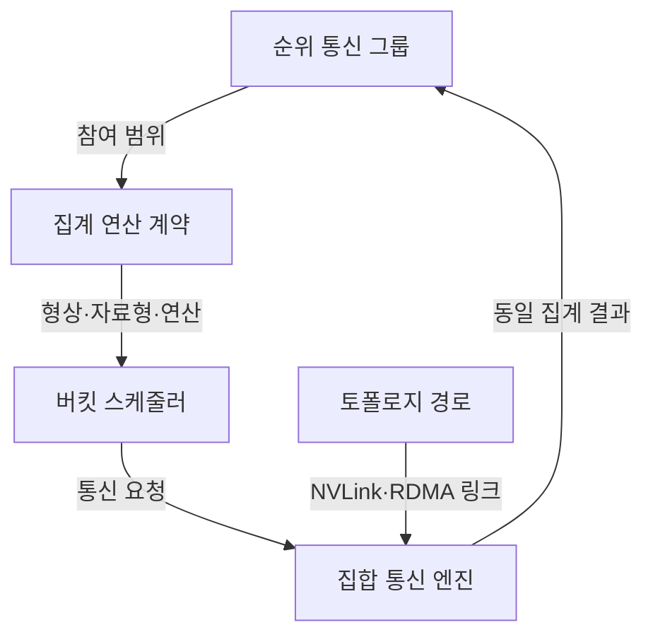
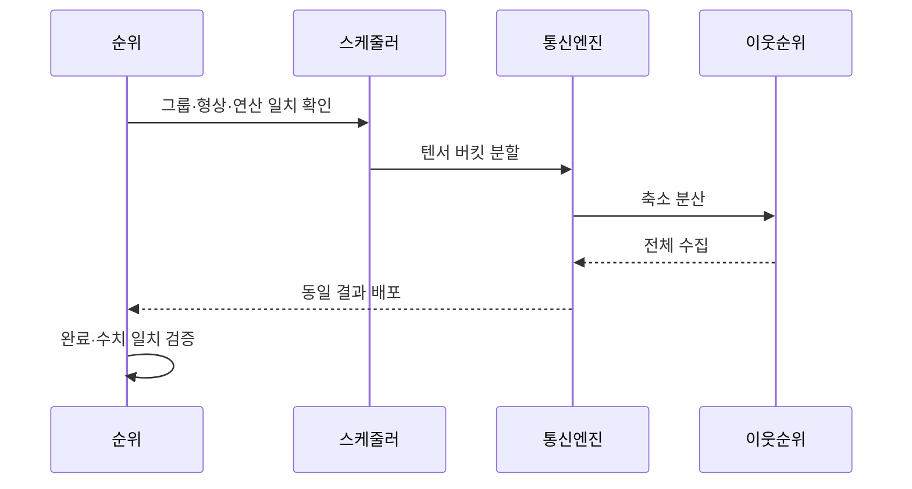

---
sidebar:
  order: 106
  label: "106. 집합 통신 All-Reduce (All-Reduce Collective Communication)"
  badge:
    text: "기출 · 50%"
    variant: note
title: "집합 통신 All-Reduce (All-Reduce Collective Communication)"
date: "2026-07-25T00:45:00+09:00"
tags: ["notes-network"]
weight: 106
extra:
  question_no: "106"
  source_status: "기출"
  source_history: "138회"
  priority: 50
  priority_note: "설명·설계형: 123·138회 All-Reduce 연계"
---

## 미리 알고가기

- **전체 축소(All-Reduce)**: 모든 참여자의 값을 합계·최댓값 등으로 집계하고 동일한 최종 결과를 다시 모든 참여자에게 제공하는 집합 통신이다.
- **그래픽 처리장치(Graphics Processing Unit, GPU)**: ‘지피유’로 읽고 세 영문 단어의 머리글자를 딴 표기이며 병렬 학습에서 기울기를 계산하고 All-Reduce에 참여한다.
- **원격 직접 메모리 접근(Remote Direct Memory Access, RDMA)**: ‘알디엠에이’로 읽고 네 영문 단어의 머리글자를 딴 표기이며 서버 간 결과 조각을 운영체제 복사를 줄여 직접 전송한다.
- **NVLink**: ‘엔브이링크’로 읽는 공식 기술명이며 한 서버의 GPU 사이에 고대역폭 통신 경로를 제공한다.
- **순위(Rank)**: 집합 통신에 참여하는 프로세스나 GPU를 구분하는 논리 번호다.
- **축소(Reduce)**: 여러 참여자의 같은 위치 값을 합계·최댓값 같은 연산으로 하나의 값에 집계하는 동작이다.
- **축소 분산(Reduce-Scatter)**: 입력을 조각으로 나눠 조각별 축소 결과를 서로 다른 참여자에게 하나씩 남기는 동작이다.
- **전체 수집(All-Gather)**: 각 참여자가 가진 서로 다른 결과 조각을 모두 교환해 모든 참여자가 전체 결과를 갖게 하는 동작이다.
- **링 알고리즘**: 참여자를 고리로 연결해 조각을 이웃에게 순환 전송하며 축소 분산과 전체 수집을 수행하는 방식이다.
- **트리 알고리즘**: 참여자를 계층으로 연결해 상향 축소와 하향 배포를 수행하는 방식이다.
- **버킷(Bucket)**: 작은 텐서를 모아 통신 호출 수를 줄이고 계산과 전송을 겹치게 하는 전송 묶음이다.
- **지연 참여자(Straggler)**: 계산이나 통신이 가장 늦어 동기식 집합 통신 전체 완료를 지연시키는 참여자다.

## Ⅰ. 개요

- **정의/개념**: 모든 순위 값을 집계해 같은 결과를 배포
- **배경/필요성**: 데이터 병렬 학습의 기울기·모델 동기화

### 쉽게 이해하기 (학습용)

- 각 GPU가 계산한 기울기를 모두 합치고 똑같은 합계를 다시 나눠 줘 다음 학습 단계를 같은 값으로 시작하게 한다.

## Ⅱ. 특징

- 모든 순위가 동일 호출 순서·형상·연산을 요구한다.
- 가장 느린 순위가 동기식 완료 시간을 결정한다.
- 자료 크기와 토폴로지에 따라 최적 경로가 변한다.
- 버킷이 너무 작으면 호출, 너무 크면 대기 증가한다.

### 쉽게 이해하기 (학습용)

- 한 GPU가 늦거나 다른 순서로 통신을 호출하면 나머지 GPU도 다음 계산을 시작하지 못한다.

## Ⅲ. 아키텍처 및 구성요소

| 설계 요소 | 설명 |
|:---|:---|
| 순위 통신 그룹 | 참여 프로세스·GPU 범위 정의 |
| 집계 연산 계약 | 형상·자료형·합계 연산 일치 |
| 버킷 스케줄러 | 텐서 묶음과 계산·통신 중첩 제어 |
| 집합 통신 엔진 | 링·트리·계층형 알고리즘 실행 |
| 토폴로지 경로 | 노드 내부·외부 물리 링크 제공 |

> 요약: 연산 계약과 토폴로지로 집합 경로 선택

### 쉽게 이해하기 (학습용)

- 같은 그룹의 GPU가 동일한 자료 형식과 연산을 약속하면 스케줄러가 텐서를 묶고 통신 엔진이 실제 링크에 맞는 경로를 선택한다.

## Ⅳ. 원리 및 절차 흐름도

| 절차 | 설명 |
|:---|:---|
| 그룹·형상·연산 일치 확인 | 모든 순위의 호출 계약을 대조 |
| 텐서 버킷 분할 | 자료를 경로·크기에 맞게 묶음 |
| 축소 분산 | 조각을 순환·집계해 분산 보유 |
| 전체 수집 | 집계 조각을 모든 순위가 교환 |
| 동일 결과 배포 | 각 순위에 전체 집계값 제공 |
| 완료·수치 일치 검증 | 지연 순위·오류·결과 차이 확인 |

> 요약: 텐서를 축소 분산 후 전체 수집

### 쉽게 이해하기 (학습용)

- 큰 배열을 조각내 서로 더한 뒤 각자 완성한 조각을 다시 모두 교환해 모든 GPU가 같은 전체 결과를 갖는다.

## Ⅴ. 종류 및 비교

| 판단 기준 | 링 | 트리 | 계층형 |
|:---|:---|:---|:---|
| 핵심 특징 | 이웃 순환으로 링크 대역폭 균등 사용 | 상향 집계·하향 배포로 단계 축소 | 노드 내부 집계 후 노드 간 교환 |
| 적용 기준 | 큰 텐서·균일 링크·대역폭 우선 | 작은 텐서·많은 순위·지연 우선 | 내부·외부 링크 성능 차이가 큼 |
| 주요 위험 | 느린 링크가 전체 링 제한 | 상위 링크 집중·불균형 트리 | 계층 경계·순위 배치 오류 |

> 요약: 텐서 크기·순위 수·링크 계층으로 선택

### 쉽게 이해하기 (학습용)

- 큰 자료는 링, 짧은 응답 단계는 트리, 서버 안과 밖의 링크 차이가 크면 계층형을 사용한다.

## Ⅵ. 실무 사례

1. 데이터 병렬 학습의 기울기를 링으로 집계
2. 노드 내부 NVLink 후 외부 RDMA로 계층 집계

### 쉽게 이해하기 (학습용)

- 각 GPU가 계산한 큰 기울기 배열을 링으로 나눠 보내며 모든 링크의 대역폭을 고르게 사용한다.
- 먼저 한 서버의 GPU끼리 NVLink로 집계하고 서버 대표 결과만 RDMA망으로 교환해 느린 외부 통신량을 줄인다.

## Ⅶ. 결론

- 텐서 크기·순위 수·토폴로지로 집계 경로 선택

### 쉽게 이해하기 (학습용)

- All-Reduce는 단일 링크 속도보다 가장 느린 순위와 내부·외부 경로를 함께 보고 전체 완료 시간을 줄여야 한다.
