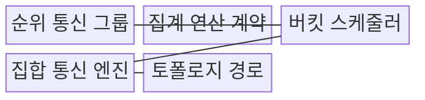
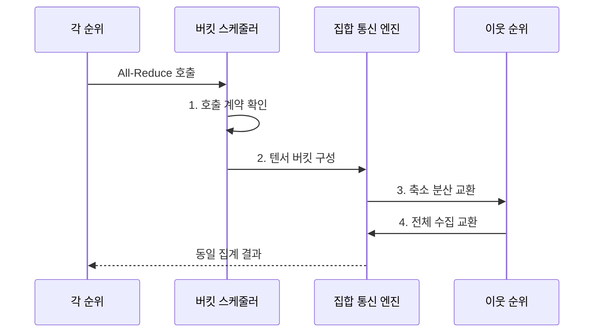

---
sidebar:
  order: 106
  label: "106. 집합 통신 All-Reduce (All-Reduce Collective Communication)"
  badge:
    text: "기출 • 50%"
    variant: note
title: "집합 통신 All-Reduce (All-Reduce Collective Communication)"
date: "2026-08-03T08:48:47+09:00"
tags: ["notes-network"]
weight: 106
extra:
  question_no: "106"
  source_status: "기출"
  source_history: "138회"
  priority: 50
  priority_note: "설명•설계형: 123•138회 All-Reduce 연계"
---

## Ⅰ. 개요

핵심 용어

- **축소 후 동일 결과로 전체 배포**: All-Reduce는 각 그래픽처리장치(Graphics Processing Unit, GPU) 순위의 같은 위치 값을 합산•최댓값 등으로 축소한 뒤 동일한 전체 결과를 각 순위에 배포한다.
- **전체 축소(All-Reduce)**: 모든 통신 순위의 값을 하나의 연산으로 축소하고 그 동일한 결과를 다시 모든 순위에 배포하는 집합 통신이다.

- 정의/개념: 모든 순위의 값을 **축소 후 동일 결과로 전체 배포**
- 배경/필요성: 중앙 서버의 **대규모 기울기 집계 병목**

#### 한줄 요약

- 각 GPU가 계산한 기울기를 모두 합치고 똑같은 합계를 다시 나눠 줘 다음 학습 단계를 같은 값으로 시작하게 한다.

## Ⅱ. 특징

핵심 용어

- **지연 순위**: 지연 순위는 계산이나 통신 완료가 가장 늦어 동기식 All-Reduce에 참여한 모든 그래픽처리장치(Graphics Processing Unit, GPU)의 다음 단계를 기다리게 한다.
- **축소 분산(Reduce-Scatter)**: 입력을 조각별로 축소해 각 순위가 서로 다른 완성 조각 하나씩을 보유하게 하는 연산이다.
- **전체 수집(All-Gather)**: 각 순위가 보유한 조각을 서로 교환해 모든 순위가 전체 결과를 갖게 하는 연산이다.

- **축소 분산•전체 수집** 기반 집계•배포
- 자료 크기•토폴로지에 따른 **링•트리•계층형 선택**
- **지연 순위•호출 계약 불일치** 에 따른 전체 완료 지연•중단

#### 한줄 요약

- 한 GPU가 늦거나 다른 순서로 통신을 호출하면 나머지 GPU도 다음 계산을 시작하지 못한다.

## Ⅲ. 구조 및 구성요소

핵심 용어

- **집계 연산 계약**: 집계 연산 계약은 모든 그래픽처리장치(Graphics Processing Unit, GPU) 순위가 동일한 통신 그룹•텐서 형상•자료형•연산과 호출 순서를 사용하도록 정한다.
- **버킷 스케줄러(Bucket Scheduler)**: 여러 작은 텐서를 묶고 계산 완료 순서에 맞춰 통신을 시작하는 구성요소이다.
- **순위(Rank)**: 집합 통신 그룹 안에서 각 프로세스나 GPU를 구분하는 번호이다.

| 구성요소 | 책임 |
|:---|:---|
| 순위 통신 그룹 | **참여 프로세스•GPU 범위 정의** |
| 집계 연산 계약 | **형상•자료형•연산 일치** |
| 버킷 스케줄러 | **텐서 묶음•계산 통신 중첩** |
| 집합 통신 엔진 | **링•트리•계층 알고리즘 실행** |
| 토폴로지 경로 | **NVIDIA NVLink•원격 직접 메모리 접근(Remote Direct Memory Access, RDMA) 링크 제공** |

#### 한줄 요약

- 같은 그룹의 GPU가 동일한 자료 형식과 연산을 약속하면 스케줄러가 텐서를 묶고 통신 엔진이 실제 링크에 맞는 경로를 선택한다.

## Ⅳ. 흐름도

핵심 용어

- **3. 축소 분산 교환**: 참여 그래픽처리장치(Graphics Processing Unit, GPU) 순위는 입력을 조각내 이웃과 순환•계층 교환하며 각 조각의 축소 결과를 서로 다르게 보유한다.
- **1. 호출 계약 확인**: 통신 그룹•텐서 형상•자료형•연산•호출 순서가 모든 순위에서 일치하는지 검사하는 단계이다.
- **2. 텐서 버킷 구성**: 작은 텐서를 경로와 자료 크기에 맞춰 전송 단위로 묶는 단계이다.
- **4. 전체 수집 교환**: 각 순위가 완성한 집계 조각을 교환해 동일한 전체 결과를 만드는 단계이다.

**동작 원리**

1. **호출 계약 확인**: 그룹•형상•자료형•연산 대조
2. **텐서 버킷 구성**: 자료를 경로•크기에 맞게 묶음
3. **축소 분산 교환**: 조각별 축소 결과를 분산 보유
4. **전체 수집 교환**: 집계 조각을 모든 순위가 교환
#### 한줄 요약

- 큰 배열을 조각내 서로 더한 뒤 각자 완성한 조각을 다시 모두 교환해 모든 GPU가 같은 전체 결과를 갖는다.

## Ⅴ. 종류 및 비교

핵심 용어

- **계층형**: 계층형 All-Reduce는 서버 내부의 빠른 링크로 먼저 집계한 뒤 서버별 결과만 느린 외부망에서 교환한다.
- **링 All-Reduce(Ring All-Reduce)**: 순위를 고리로 연결해 조각을 이웃에 순환 전송하며 링크 대역폭을 고르게 사용하는 방식이다.
- **트리 All-Reduce(Tree All-Reduce)**: 트리의 상향 경로로 값을 축소하고 하향 경로로 결과를 배포하는 방식이다.

| All-Reduce 알고리즘 | 링 | 트리 | 계층형 |
|:---|:---|:---|:---|
| 적용 기준 | 큰 텐서•균일 링크의 **대역폭 우선** | 작은 텐서•다수 순위의 **지연 우선** | 내부•외부 링크의 **성능 차이가 큰 환경** |
| 핵심 특징 | **이웃 순환•대역폭 균등** | **상향 집계•하향 배포** | **내부 집계 후 외부 교환** |
| 한계 | **느린 링크의 전체 링 제한** | **상위 링크 집중•트리 불균형** | **계층 경계•순위 배치 오류** |

#### 한줄 요약

- 큰 자료는 링, 짧은 응답 단계는 트리, 서버 안과 밖의 링크 차이가 크면 계층형을 사용한다.

## Ⅵ. 실무 고려사항 및 대책

핵심 용어

- **호출 순서•형상 불일치**: 호출 순서•형상 불일치는 그래픽처리장치(Graphics Processing Unit, GPU) 순위별 집합 연산 계약이 달라 서로 다른 통신을 기다리거나 잘못된 결과를 만드는 문제다.
- **교착(Deadlock)**: 순위별 호출 순서가 달라 서로 다른 집합 연산 완료를 무한히 기다리는 상태이다.
- **계층형 축소(Hierarchical Reduction)**: 서버 내부에서 먼저 축소한 뒤 서버별 결과만 외부망에서 교환해 저속 구간의 통신량을 줄이는 방식이다.

| 문제 | 대책 | 효과 |
|:---|:---|:---|
| 느린 순위의 **전체 지연** | **순위별 완료시간•링크 감시** | **병목 순위 식별** |
| **내부•외부 링크 성능 차이** | **계층형 축소•외부 교환** | **저속망 통신량 감소** |
| **호출 순서•형상 불일치** | **집합 연산 계약 사전 검증** | **교착•결과 오류 방지** |

#### 한줄 요약

- 서버 내부는 NVIDIA NVLink로 먼저 집계하고 서버별 결과만 원격 직접 메모리 접근(Remote Direct Memory Access, RDMA) 망에서 교환해 느린 외부 링크의 통신량을 줄인다.

## Ⅶ. 결론

핵심 용어

- **링**: 링 All-Reduce는 큰 텐서를 이웃 순위에 순환 전송해 균일 링크의 대역폭을 고르게 사용하는 알고리즘이다.
- **최느린 순위 병목(Straggler Bottleneck)**: 가장 늦은 순위의 완료 시간이 동기식 집합 통신 전체 완료 시간을 결정하는 현상이다.

- 큰 텐서•균일 링크는 **링**, 작은 텐서•저지연은 **트리** 선택

#### 한줄 요약

- All-Reduce는 단일 링크 속도보다 가장 느린 순위와 내부•외부 경로를 함께 보고 전체 완료 시간을 줄여야 한다.
