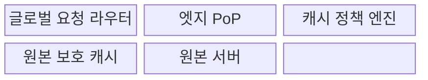
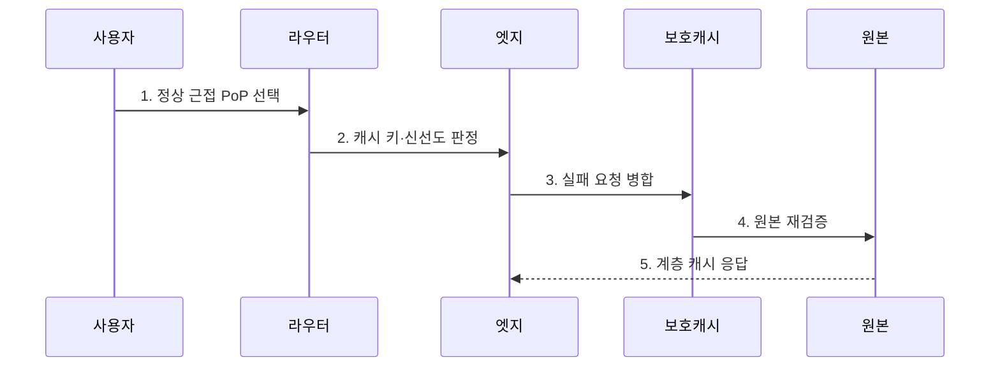

---
sidebar:
  order: 107
  label: "107. 글로벌 CDN 아키텍처 (Global CDN Architecture)"
  badge:
    text: "미출제 · 50%"
    variant: note
title: "글로벌 CDN 아키텍처 (Global CDN Architecture)"
date: "2026-07-30T18:30:00+09:00"
tags: ["notes-network"]
weight: 107
extra:
  question_no: "107"
  source_status: "미출제"
  source_history: ""
  priority: 50
  priority_note: "설계형: CDN Cache·Shield·Origin 보호"
---

## 미리 알고가기

- **콘텐츠 전송망(Content Delivery Network, CDN)**: 여러 지역의 엣지 거점이 원본 콘텐츠를 캐시·전달해 사용자 지연과 원본 부하를 줄이는 분산 체계다.
- **전송 계층 보안(Transport Layer Security, TLS)**: 사용자와 엣지 거점 사이의 서버 인증과 통신 암호화를 제공한다.
- **도메인 이름 시스템(Domain Name System, DNS)**: 사용자에게 정상 근접 거점의 주소를 반환한다.
- **엣지 접속 거점(Edge Point of Presence, Edge PoP)**: 사용자와 가까운 위치에서 TLS·보안·캐시·전달을 수행하는 지역 서버 거점이다.
- **애니캐스트(Anycast)**: 여러 거점이 같은 주소를 광고하고 네트워크 경로가 가까운 정상 거점으로 사용자를 보내는 방식이다.
- **캐시 키(Cache Key)**: 주소·질의·헤더 등으로 저장 객체와 사용자 변형을 구분하는 식별값이다.
- **생존 시간(Time To Live, TTL)**: 캐시가 원본 재확인 없이 객체를 재사용할 수 있는 시간이다.
- **캐시 적중·실패(Cache Hit·Miss)**: 요청 객체를 엣지에서 바로 찾은 상태와 찾지 못해 상위로 요청해야 하는 상태다.
- **원본 보호 캐시(Origin Shield)**: 여러 엣지의 캐시 실패 요청을 한곳에서 모아 중복 원본 요청을 줄이는 상위 캐시다.
- **캐시 무효화(Purge)**: TTL 만료 전 특정 객체를 삭제하거나 재검증 대상으로 바꾸는 조치다.
- **오래된 응답(Stale Response)**: 원본 장애 때 정책에 따라 만료된 캐시 객체를 제한적으로 제공하는 응답이다.
- **IETF RFC 9111(STD 98)**: HTTP 캐시와 동작 제어 헤더를 규정한 인터넷 표준이다.

## Ⅰ. 개요

- 정의/개념: 근접 엣지가 콘텐츠를 캐시·전달하는 분산망
- 배경/필요성: **원거리 지연·트래픽 집중·원본 장애** 완화

### 쉽게 이해하기 (학습용)

- 전 세계 사용자가 본사 서버만 찾지 않고 가까운 지역 거점에서 최신 콘텐츠를 받아 더 빠르고 안정적으로 이용한다.

## Ⅱ. 특징

- 근접 거점 기반 **전송 지연·원본 부하 감소**
- 분산 캐시 기반 **장애·대량 요청 완충**
- 키·TTL 기반 **신선도·사용자 격리**

### 쉽게 이해하기 (학습용)

- 캐시를 많이 하는 것보다 다른 사용자의 개인 화면을 섞지 않고 새 버전을 제때 바꾸는 것이 중요하다.

## Ⅲ. 구조 및 구성요소

| 구성요소 | 책임 |
|:---|:---|
| 글로벌 요청 라우터 | DNS·애니캐스트로 정상 PoP 선택 |
| 엣지 PoP | TLS·보안·캐시·콘텐츠 전달 |
| 캐시 정책 엔진 | 키·TTL·우회·신선도 규칙 결정 |
| 원본 보호 캐시 | 엣지 실패 요청 병합·상위 캐시 |
| 원본 서버 | 정본 콘텐츠와 재검증 정보 제공 |

> 요약: 엣지·보호 캐시가 원본 요청을 계층 완충

### 쉽게 이해하기 (학습용)

- 라우터가 가까운 엣지로 보내고 그곳에 없으면 보호 캐시가 여러 요청을 합쳐 원본에서 한 번만 가져온다.

## Ⅳ. 흐름도

**동작 원리**

- **1. 정상 근접 PoP 선택**: 위치·지연·거점 상태로 연결
- **2. 캐시 키·신선도 판정**: 변형·TTL·저장 가능성을 확인
- **3. 실패 요청 병합**: 같은 객체의 원본 요청을 하나로 묶음
- **4. 원본 재검증**: 변경 여부 확인 후 최신 객체 획득
- **5. 계층 캐시 응답**: 보호·엣지 캐시에 저장 후 전달
> 요약: 근접 적중 우선, 실패는 계층 병합·재검증

### 쉽게 이해하기 (학습용)

- 가까운 엣지에 최신 객체가 있으면 바로 주고 없으면 같은 요청을 합쳐 원본에서 가져온 뒤 저장해 전달한다.

## Ⅴ. 종류 및 비교

| 콘텐츠 전달 방식 | 글로벌 CDN | 지역 캐시 | 원본 직접 제공 |
|:---|:---|:---|:---|
| 적용 기준 | 전 세계 사용자·대량 콘텐츠·공격 완충 | 제한 지역·내부망의 반복 자료 | 소규모·개인화·캐시 불가 서비스 |
| 핵심 특징 | **다지역 라우팅·계층 캐시** | **단일 지역 반복 요청 캐시** | **모든 요청의 원본 처리** |
| 한계 | 키·TTL·무효화·거점 정책 복잡 | 지역 장애·원본 보호 범위 제한 | 장거리 지연·원본 병목·노출 |

> 요약: 사용자 분포·캐시 가능성·원본 부하로 선택

### 쉽게 이해하기 (학습용)

- 세계 사용자는 글로벌 CDN, 한 지역 반복 요청은 지역 캐시, 사용자마다 달라 저장할 수 없으면 원본 제공을 고려한다.

## Ⅵ. 실무 고려사항 및 대책

| 고려사항 | 대책 | 효과 |
|:---|:---|:---|
| 개인 응답의 공유 캐시 노출 | **캐시 키·비저장 정책 검증** | 사용자 정보 격리 |
| 배포 뒤 구버전 지속 | **해시 주소·선택 무효화** | 신선도·장기 캐시 양립 |
| 원본 장애의 요청 폭주 | **보호 캐시·요청 병합** | 원본 가용성 보호 |

### 쉽게 이해하기 (학습용)

- RFC 9111 캐시 지시자를 적용하고 내용 해시 주소와 보호 캐시로 신선도와 원본 보호를 함께 확보한다.

## Ⅶ. 결론

- **사용자 분포·변경성·원본 부하**로 CDN 계층 결정

### 쉽게 이해하기 (학습용)

- CDN은 적중률만 높이지 말고 정확한 사용자 변형과 최신 버전을 제공하면서 원본 요청을 얼마나 줄이는지로 설계해야 한다.
