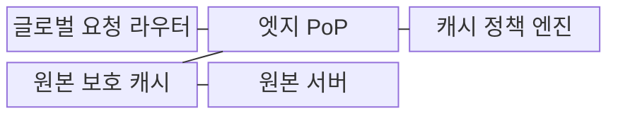
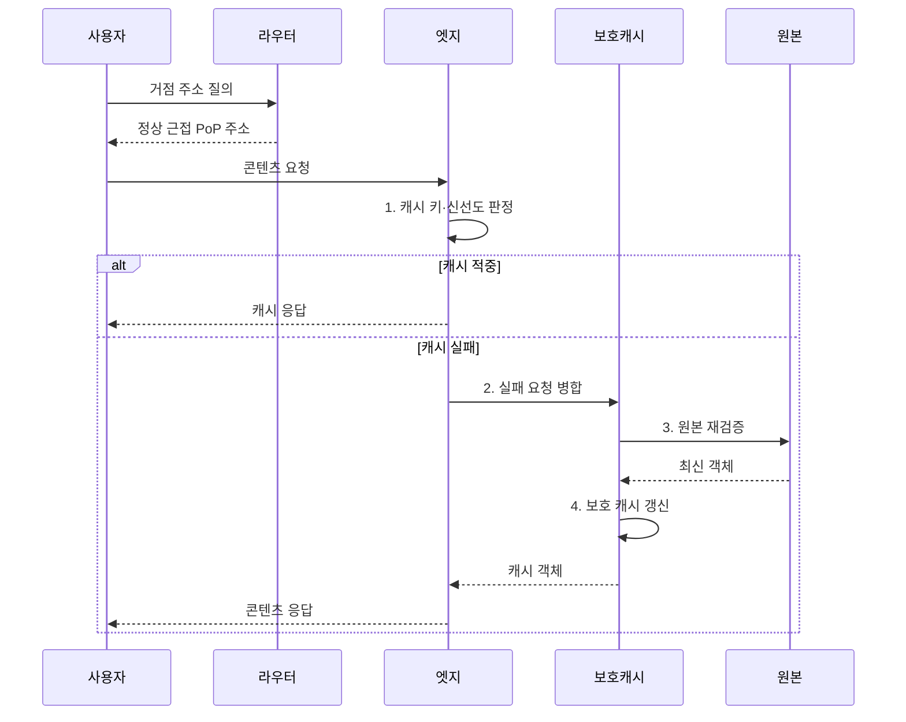

---
sidebar:
  order: 107
  label: "107. 글로벌 CDN 아키텍처 (Global CDN Architecture)"
  badge:
    text: "미출제 · 50%"
    variant: note
title: "글로벌 CDN 아키텍처 (Global CDN Architecture)"
date: "2026-08-02T12:00:00+09:00"
tags: ["notes-network"]
weight: 107
extra:
  question_no: "107"
  source_status: "미출제"
  source_history: ""
  priority: 50
  priority_note: "설계형: CDN Cache·Shield·Origin 보호"
---

## Ⅰ. 개요

핵심 용어

- **분산 콘텐츠 전송망**: 글로벌 콘텐츠 전송망(Content Delivery Network, CDN)은 여러 지역의 엣지 거점이 원본 콘텐츠를 캐시·전달해 원거리 지연과 원본 집중을 줄이는 분산 전송망이다.
- **엣지 거점(Edge Point of Presence)**: 사용자와 가까운 지역에서 콘텐츠 캐시·보안·전송을 수행하는 CDN 접점이다.

- 정의/개념: 여러 지역의 근접 엣지가 원본 콘텐츠를 캐시·전달하는 **글로벌 CDN 기반 분산 콘텐츠 전송망**
- 배경/필요성: 원본 직접 제공은 **원거리 지연·트래픽 집중** 유발

#### 한줄 요약

- 전 세계 사용자가 본사 서버만 찾지 않고 가까운 지역 거점에서 최신 콘텐츠를 받아 더 빠르고 안정적으로 이용한다.

## Ⅱ. 특징

핵심 용어

- **캐시 적중·실패**: 캐시 적중은 콘텐츠 전송망(Content Delivery Network, CDN) 엣지가 객체를 즉시 제공하는 상태이고 실패는 보호 캐시나 원본에 상위 요청해야 하는 상태다. 객체의 생존 시간(Time to Live, TTL)으로 신선도를 판정한다.
- **캐시 키(Cache Key)**: 요청 가운데 같은 캐시 객체를 구분하도록 선택한 주소·헤더·질의값 등의 조합이다.

- 근접 거점 기반 **전송 지연·원본 부하 감소**
- 분산 캐시 기반 **장애·대량 요청 완충**
- **캐시 적중·실패**와 키·TTL 기반 신선도·사용자 격리

#### 한줄 요약

- 캐시를 많이 하는 것보다 다른 사용자의 개인 화면을 섞지 않고 새 버전을 제때 바꾸는 것이 중요하다.

## Ⅲ. 구조 및 구성요소

핵심 용어

- **원본 보호 캐시**: 원본 보호 캐시는 여러 서비스 거점(Point of Presence, PoP)에서 발생한 같은 객체의 실패 요청을 병합해 원본의 중복 처리와 폭주를 줄인다.
- **전송 기반 기술**: 도메인 이름 시스템(Domain Name System, DNS)은 거점을 선택하고 전송 계층 보안(Transport Layer Security, TLS)은 구간을 보호하며 생존 시간(Time to Live, TTL)은 캐시 신선도를 제한한다.
- **애니캐스트(Anycast)**: 여러 거점이 같은 네트워크 주소를 알리고 라우팅상 가까운 정상 거점으로 요청을 보내는 방식이다.

| 구성요소 | 책임 |
|:---|:---|
| 글로벌 요청 라우터 | **DNS·애니캐스트**로 정상 PoP 선택 |
| 엣지 PoP | **TLS·보안·캐시·콘텐츠** 전달 |
| 캐시 정책 엔진 | **캐시 키·TTL**과 저장 제외·신선도 규칙 결정 |
| 원본 보호 캐시 | **실패 요청 병합·상위 캐시** 제공 |
| 원본 서버 | **정본 콘텐츠·재검증 정보** 제공 |

#### 한줄 요약

- 라우터가 가까운 엣지로 보내고 그곳에 없으면 보호 캐시가 여러 요청을 합쳐 원본에서 한 번만 가져온다.

## Ⅳ. 흐름도

핵심 용어

- **2. 실패 요청 병합**: 보호 캐시는 같은 객체를 동시에 요구하는 여러 서비스 거점(Point of Presence, PoP)의 요청을 하나의 원본 재검증으로 합친다. 객체의 생존 시간(Time to Live, TTL)이 끝나면 재검증한다.
- **1. 캐시 키·신선도 판정**: 요청의 변형 조건과 TTL 및 저장 가능성을 검사하는 단계이다.
- **3. 원본 재검증**: 조건부 요청으로 객체 변경 여부를 확인하고 필요하면 최신 객체를 받는 단계이다.
- **4. 보호 캐시 갱신**: 재검증한 최신 객체를 상위 캐시에 저장해 여러 엣지에 제공하는 단계이다.

**동작 원리**

1. **캐시 키·신선도 판정**: 변형·TTL·저장 가능성 확인
2. **실패 요청 병합**: 같은 객체의 원본 요청을 하나로 묶음
3. **원본 재검증**: 변경 여부 확인 후 최신 객체 획득
4. **보호 캐시 갱신**: 최신 객체를 상위 캐시에 저장
#### 한줄 요약

- 가까운 엣지에 최신 객체가 있으면 바로 주고 없으면 같은 요청을 합쳐 원본에서 가져온 뒤 저장해 전달한다.

## Ⅴ. 종류 및 비교

핵심 용어

- **글로벌 CDN**: 글로벌 콘텐츠 전송망(Content Delivery Network, CDN)은 전 세계 사용자와 대량 콘텐츠에 다지역 라우팅·계층 캐시·공격 완충을 제공하며 생존 시간(Time to Live, TTL)으로 객체 신선도를 관리한다.
- **지역 캐시(Regional Cache)**: 제한된 지역이나 내부망의 반복 요청을 단일 지역에서 캐시하는 전달 방식이다.
- **원본 직접 제공(Direct Origin Delivery)**: 엣지 캐시 없이 모든 요청을 원본 서버가 직접 처리하는 방식이다.

| 콘텐츠 전달 방식 | 글로벌 CDN | 지역 캐시 | 원본 직접 제공 |
|:---|:---|:---|:---|
| 적용 기준 | 전 세계 사용자·**대량 콘텐츠·공격 완충** | 제한 지역·내부망의 **반복 자료** | **소규모·개인화·캐시 불가** 서비스 |
| 핵심 특징 | **다지역 라우팅·계층 캐시** | **단일 지역 반복 요청 캐시** | **모든 요청의 원본 처리** |
| 한계 | **키·TTL·무효화 정책 복잡성** | **지역 장애·원본 보호 범위 제한** | **장거리 지연·원본 병목·노출** |

#### 한줄 요약

- 세계 사용자는 글로벌 CDN, 한 지역 반복 요청은 지역 캐시, 사용자마다 달라 저장할 수 없으면 원본 제공을 고려한다.

## Ⅵ. 실무 고려사항 및 대책

핵심 용어

- **공유 캐시 노출**: 공유 캐시 노출은 사용자별 개인 응답을 같은 캐시 키로 저장해 다른 사용자에게 전달하는 정보 유출 문제다. 의견 요청 문서(Request for Comments, RFC) 9111의 캐시 규칙으로 저장 가능성을 검증한다.
- **선택 무효화(Selective Invalidation)**: 변경된 객체의 캐시만 지정해 만료 전에 제거하는 갱신 방식이다.
- **오래된 응답 제공(Serve Stale)**: 원본 장애 시 제한된 시간 동안 만료된 캐시 객체를 제공해 연속성을 유지하는 방식이다.

| 문제 | 대책 | 효과 |
|:---|:---|:---|
| 개인 응답의 **공유 캐시 노출** | **RFC 9111·비저장 정책 검증** | **사용자 정보 격리** |
| 배포 뒤 **구버전 지속** | **해시 주소·선택 무효화** | **신선도·장기 캐시 양립** |
| 원본 장애의 **요청 폭주** | **보호 캐시·요청 병합** | **원본 가용성 보호** |
| 원본 장애 시 **캐시 만료** | 제한 시간의 **오래된 응답** 제공 | **서비스 연속성** 확보 |

#### 한줄 요약

- RFC 9111 캐시 지시자를 적용하고 내용 해시 주소와 보호 캐시로 신선도와 원본 보호를 함께 확보한다.

## Ⅶ. 결론

핵심 용어

- **원본 제공**: 원본 제공은 요청마다 내용이 달라 콘텐츠 전송망(Content Delivery Network, CDN)에 안전하게 캐시할 수 없는 소규모·개인화 서비스에 적합하다.
- **원본 보호(Origin Protection)**: 보호 캐시·요청 병합·접근 제한으로 원본의 부하와 외부 노출을 줄이는 설계 원칙이다.

- 글로벌 사용자·원본 부하가 크면 **CDN**, 캐시 불가는 **원본 제공** 선택

#### 한줄 요약

- CDN은 적중률만 높이지 말고 정확한 사용자 변형과 최신 버전을 제공하면서 원본 요청을 얼마나 줄이는지로 설계해야 한다.
