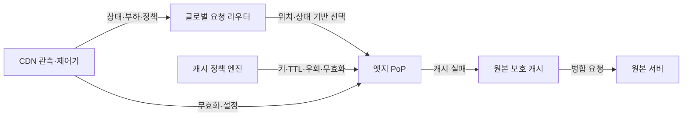
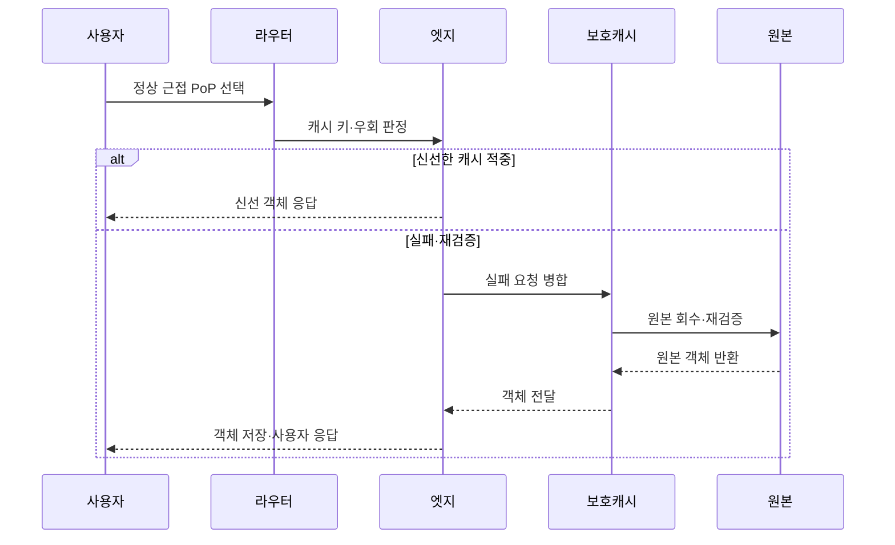

---
sidebar:
  order: 107
  label: "107. 글로벌 CDN 아키텍처 (Global CDN Architecture)"
  badge:
    text: "미출제 · 50%"
    variant: note
title: "글로벌 CDN 아키텍처 (Global CDN Architecture)"
date: "2026-07-25T00:45:00+09:00"
tags: ["notes-network"]
weight: 107
extra:
  question_no: "107"
  source_status: "미출제"
  source_history: ""
  priority: 50
  priority_note: "설계형: CDN Cache·Shield·Origin 보호"
---

## 미리 알고가기

- **콘텐츠 전송망(Content Delivery Network, CDN)**: 여러 지역의 엣지 거점이 원본 콘텐츠를 캐시·전달해 사용자 지연과 원본 부하를 줄이는 분산 체계다.
- **전송 계층 보안(Transport Layer Security, TLS)**: ‘티엘에스’로 읽고 세 영문 단어의 머리글자를 딴 표기이며 사용자와 엣지 거점 사이의 서버 인증과 통신 암호화를 제공한다.
- **도메인 이름 시스템(Domain Name System, DNS)**: ‘디엔에스’로 읽고 세 영문 단어의 머리글자를 딴 표기이며 사용자에게 정상 근접 거점의 주소를 반환한다.
- **엣지 접속 거점(Edge Point of Presence, Edge PoP)**: 사용자와 가까운 위치에서 TLS·보안·캐시·전달을 수행하는 지역 서버 거점이다.
- **애니캐스트(Anycast)**: 여러 거점이 같은 주소를 광고하고 네트워크 경로가 가까운 정상 거점으로 사용자를 보내는 방식이다.
- **캐시 키(Cache Key)**: 주소·질의·헤더 등으로 저장 객체와 사용자 변형을 구분하는 식별값이다.
- **생존 시간(Time To Live, TTL)**: 캐시가 원본 재확인 없이 객체를 재사용할 수 있는 시간이다.
- **캐시 적중·실패(Cache Hit·Miss)**: 요청 객체를 엣지에서 바로 찾은 상태와 찾지 못해 상위로 요청해야 하는 상태다.
- **원본 보호 캐시(Origin Shield)**: 여러 엣지의 캐시 실패 요청을 한곳에서 모아 중복 원본 요청을 줄이는 상위 캐시다.
- **캐시 무효화(Purge)**: TTL 만료 전 특정 객체를 삭제하거나 재검증 대상으로 바꾸는 조치다.
- **오래된 응답(Stale Response)**: 원본 장애 때 정책에 따라 만료된 캐시 객체를 제한적으로 제공하는 응답이다.

## Ⅰ. 개요

- **정의/개념**: 근접 엣지가 콘텐츠를 캐시·전달하는 분산망
- **배경/필요성**: 원거리 지연·트래픽 집중·원본 장애 완화

### 쉽게 이해하기 (학습용)

- 전 세계 사용자가 본사 서버만 찾지 않고 가까운 지역 거점에서 최신 콘텐츠를 받아 더 빠르고 안정적으로 이용한다.

## Ⅱ. 특징

- 근접 거점 캐시로 전송 거리·원본 송신량 감소한다.
- 분산 거점이 장애·대량 요청의 완충 역할을 한다.
- 키·TTL이 콘텐츠 신선도와 사용자 격리를 결정한다.
- 잘못된 키·무효화 지연은 정보 노출·구버전 유발한다.

### 쉽게 이해하기 (학습용)

- 캐시를 많이 하는 것보다 다른 사용자의 개인 화면을 섞지 않고 새 버전을 제때 바꾸는 것이 중요하다.

## Ⅲ. 아키텍처 및 구성요소

| 설계 요소 | 설명 |
|:---|:---|
| 글로벌 요청 라우터 | DNS·애니캐스트로 정상 PoP 선택 |
| 엣지 PoP | TLS·보안·캐시·콘텐츠 전달 |
| 캐시 정책 엔진 | 키·TTL·우회·신선도 규칙 결정 |
| 원본 보호 캐시 | 엣지 실패 요청 병합·상위 캐시 |
| 원본 서버 | 정본 콘텐츠와 재검증 정보 제공 |
| CDN 관측·제어기 | 거점·적중·지연·원본 부하 관리 |

> 요약: 엣지·보호 캐시가 원본 요청을 계층 완충

### 쉽게 이해하기 (학습용)

- 라우터가 가까운 엣지로 보내고 그곳에 없으면 보호 캐시가 여러 요청을 합쳐 원본에서 한 번만 가져온다.

## Ⅳ. 원리 및 절차 흐름도

| 절차 | 설명 |
|:---|:---|
| 정상 근접 PoP 선택 | 위치·지연·거점 상태로 연결 |
| 캐시 키·우회 판정 | 사용자 변형과 저장 가능성 확인 |
| 신선 객체 응답 | TTL 안의 객체를 즉시 제공 |
| 실패 요청 병합 | 같은 객체의 원본 요청을 하나로 묶음 |
| 원본 회수·재검증 | 변경 여부 확인 후 최신 객체 획득 |
| 원본 객체 반환 | 보호 캐시가 최신 객체를 수신 |
| 객체 전달 | 보호 캐시가 엣지에 객체 전달 |
| 객체 저장·사용자 응답 | 정책에 맞춰 캐시 후 응답 |

> 요약: 근접 적중 우선, 실패는 계층 병합·재검증

### 쉽게 이해하기 (학습용)

- 가까운 엣지에 최신 객체가 있으면 바로 주고 없으면 같은 요청을 합쳐 원본에서 가져온 뒤 저장해 전달한다.

## Ⅴ. 종류 및 비교

| 판단 기준 | 글로벌 CDN | 지역 캐시 | 원본 직접 제공 |
|:---|:---|:---|:---|
| 핵심 특징 | 다지역 라우팅·계층 캐시·원본 보호 | 한 지역의 반복 요청을 캐시 | 모든 요청을 원본이 직접 처리 |
| 적용 기준 | 전 세계 사용자·대량 콘텐츠·공격 완충 | 제한 지역·내부망의 반복 자료 | 소규모·개인화·캐시 불가 서비스 |
| 주요 위험 | 키·TTL·무효화·거점 정책 복잡 | 지역 장애·원본 보호 범위 제한 | 장거리 지연·원본 병목·노출 |

> 요약: 사용자 분포·캐시 가능성·원본 부하로 선택

### 쉽게 이해하기 (학습용)

- 세계 사용자는 글로벌 CDN, 한 지역 반복 요청은 지역 캐시, 사용자마다 달라 저장할 수 없으면 원본 제공을 고려한다.

## Ⅵ. 실무 사례

1. 정적 파일은 내용 해시 주소와 긴 TTL 적용
2. 인증 응답은 개인 키 분리 또는 캐시 우회

### 쉽게 이해하기 (학습용)

- 파일 내용이 바뀌면 주소도 바뀌게 만들면 긴 TTL을 써도 새 버전이 별도 객체로 즉시 배포된다.
- 로그인한 사용자의 응답은 다른 사람과 섞이지 않게 사용자별 키를 쓰거나 아예 캐시하지 않는다.

## Ⅶ. 결론

- 사용자 분포·캐시 키·신선도로 CDN 계층 결정

### 쉽게 이해하기 (학습용)

- CDN은 적중률만 높이지 말고 정확한 사용자 변형과 최신 버전을 제공하면서 원본 요청을 얼마나 줄이는지로 설계해야 한다.
