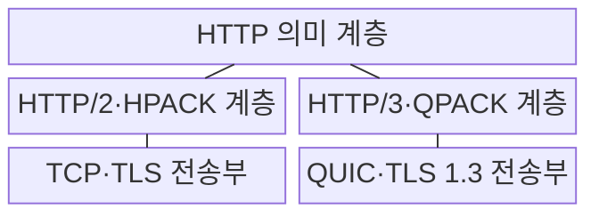
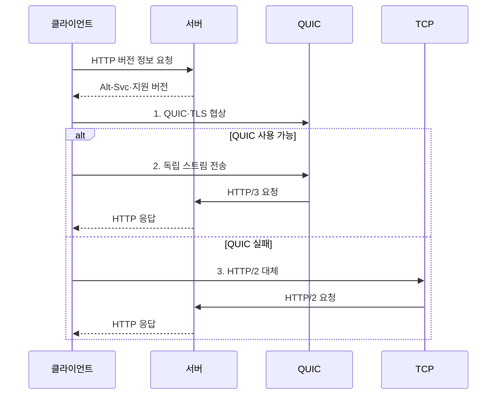

---
sidebar:
  order: 108
  label: "108. HTTP/2·HTTP/3 비교 (HTTP/2 HTTP/3 Comparison)"
  badge:
    text: "미출제 · 50%"
    variant: note
title: "HTTP/2·HTTP/3 비교 (HTTP/2 HTTP/3 Comparison)"
date: "2026-07-31T02:13:00+09:00"
tags: ["notes-network"]
weight: 108
extra:
  question_no: "108"
  source_status: "미출제"
  source_history: ""
  priority: 50
  priority_note: "비교형: HTTP/2·HTTP/3 선택 조건"
---

## 미리 알고가기

- **하이퍼텍스트 전송 프로토콜 버전 2(Hypertext Transfer Protocol Version 2, HTTP/2)**: 하나의 TCP 연결에서 여러 HTTP 스트림을 이진 프레임으로 다중화한다.
- **하이퍼텍스트 전송 프로토콜 버전 3(Hypertext Transfer Protocol Version 3, HTTP/3)**: QUIC의 독립 스트림에서 HTTP 프레임을 전달한다.
- **전송 제어 프로토콜(Transmission Control Protocol, TCP)**: HTTP/2 연결의 순서·손실 복구를 담당한다.
- **사용자 데이터그램 프로토콜(User Datagram Protocol, UDP)**: QUIC 패킷을 전달하는 비연결형 전송 프로토콜이다.
- **전송 계층 보안(Transport Layer Security, TLS)**: HTTP 연결의 서버 인증과 통신 암호화를 제공한다.
- **다중화(Multiplexing)**: 하나의 연결에서 여러 요청·응답 스트림의 프레임을 번갈아 동시에 전달하는 방식이다.
- **선두 차단(Head-of-Line Blocking)**: 앞선 자료의 손실·지연 때문에 뒤의 독립 자료도 처리를 기다리는 현상이다.
- **QUIC**: UDP 위에 TLS 1.3·독립 스트림·손실 복구·연결 이동을 통합한 전송 프로토콜이다.
- **HPACK·QPACK**: 반복되는 HTTP 헤더를 표와 참조값으로 바꿔 전송량을 줄이는 압축 방식이다.
- **연결 이동(Connection Migration)**: 인터넷 프로토콜 주소가 바뀌어도 연결 식별자로 QUIC 세션을 이어 가는 기능이다.
- **제로 왕복 시간(Zero Round-Trip Time, 0-RTT)**: 이전 연결 정보로 왕복 협상 전에 응용 데이터를 보내지만 재전송 공격 위험이 있다.
- **대체 서비스(Alternative Service, Alt-Svc)**: 서버가 같은 자원을 제공하는 HTTP/3 주소와 포트를 클라이언트에 알리는 정보다.
- **IETF RFC 9113**: HTTP/2의 이진 프레임과 스트림 다중화를 규정한 표준 문서다.
- **IETF RFC 9114**: QUIC 위의 HTTP/3 매핑과 제어 스트림을 규정한 표준 문서다.

> **키워드:** HTTP/2·HTTP/3 비교 (HTTP/2 HTTP/3 Comparison)

## Ⅰ. 개요

- 정의/개념: HTTP 의미를 **TCP·QUIC 스트림으로 다중화하는 표준**
- 배경/필요성: TCP 손실의 **스트림 간 선두 차단** 완화

### 쉽게 이해하기 (학습용)

- HTTP/2는 여러 요청이 한 TCP 복구를 함께 기다리지만 HTTP/3는 손실된 QUIC 스트림만 복구해 나머지를 진행시킨다.

## Ⅱ. 특징

- 공통 HTTP 의미와 **TCP·QUIC 전송 계층 차이**
- **Alt-Svc** 발견과 스트림 손실 격리·연결 이동
- UDP 차단·0-RTT의 **운영·보안 제약**

### 쉽게 이해하기 (학습용)

- 이동과 손실이 잦으면 HTTP/3 이점이 커지지만 UDP가 막힌 환경에서는 HTTP/2로 안전하게 돌아갈 수 있어야 한다.

## Ⅲ. 구조 및 구성요소

| 구성요소 | 책임 |
|:---|:---|
| HTTP 의미 계층 | **메서드·상태·필드 의미** 유지 |
| HTTP/2·HPACK 계층 | TCP 스트림의 **프레임·헤더 압축** |
| TCP·TLS 전송부 | HTTP/2의 **신뢰 전송·보안** 제공 |
| HTTP/3·QPACK 계층 | QUIC 스트림의 **프레임·헤더 압축** |
| QUIC·TLS 1.3 전송부 | HTTP/3의 **스트림·복구·보안** 제공 |

> 요약: HTTP 의미는 같고 전송·압축 계층이 다름

### 쉽게 이해하기 (학습용)

- 요청의 뜻은 같지만 HTTP/2는 TCP와 HPACK, HTTP/3는 QUIC과 QPACK을 사용해 스트림을 전달한다.

## Ⅳ. 흐름도

**동작 원리**

1. **QUIC·TLS 협상**: UDP 연결·암호·연결 ID 생성
2. **독립 스트림 전송**: 요청별 QUIC 스트림으로 전달
3. **HTTP/2 대체**: QUIC 실패 시 TCP 연결로 전환
> 요약: HTTP/3 우선 협상 후 실패 시 HTTP/2 전환

### 쉽게 이해하기 (학습용)

- 먼저 QUIC으로 연결해 독립 스트림을 쓰고 UDP가 막히거나 실패하면 TCP 기반 HTTP/2로 자동 전환한다.

## Ⅴ. 종류 및 비교

| HTTP 버전 | HTTP/2 | HTTP/3 |
|:---|:---|:---|
| 적용 기준 | **저손실 고정망·기존 TCP 장비** 활용 | 손실·이동이 잦고 **UDP 사용 가능** |
| 핵심 특징 | **RFC 9113 TCP·HPACK** | **RFC 9114 QUIC·QPACK** |
| 한계 | TCP 손실의 **전체 스트림 지연** | **UDP 차단·0-RTT 재전송·관측 제약** |

> 요약: 손실·이동성·UDP 통과로 버전 선택

### 쉽게 이해하기 (학습용)

- 안정된 고정망과 기존 장비 활용은 HTTP/2, 손실과 주소 변경이 잦은 이동망은 HTTP/3가 유리하다.

## Ⅵ. 실무 고려사항 및 대책

| 고려사항 | 대책 | 효과 |
|:---|:---|:---|
| 기업망의 **UDP 차단** | **HTTP/2 자동 대체 경로** | **연결 성공률 유지** |
| **0-RTT 요청 재전송** | **멱등 요청만 조기 전송** | **중복 처리 위험 감소** |
| 암호화 전송의 **관측 저하** | **종단 지표·대체 사유 수집** | **장애 원인 식별** |

### 쉽게 이해하기 (학습용)

- 일부 사용자부터 HTTP/3를 적용하고 지연·손실·HTTP/2 대체 비율을 검증한 뒤 범위를 확대한다.

## Ⅶ. 결론

- 저손실·UDP 차단 환경은 **HTTP/2**, 손실·이동 환경은 **HTTP/3** 선택

### 쉽게 이해하기 (학습용)

- HTTP/3 도입은 사용률보다 사용자 지연이 줄고 실패 때 HTTP/2로 돌아가며 보안 관측이 유지되는지로 판단해야 한다.
