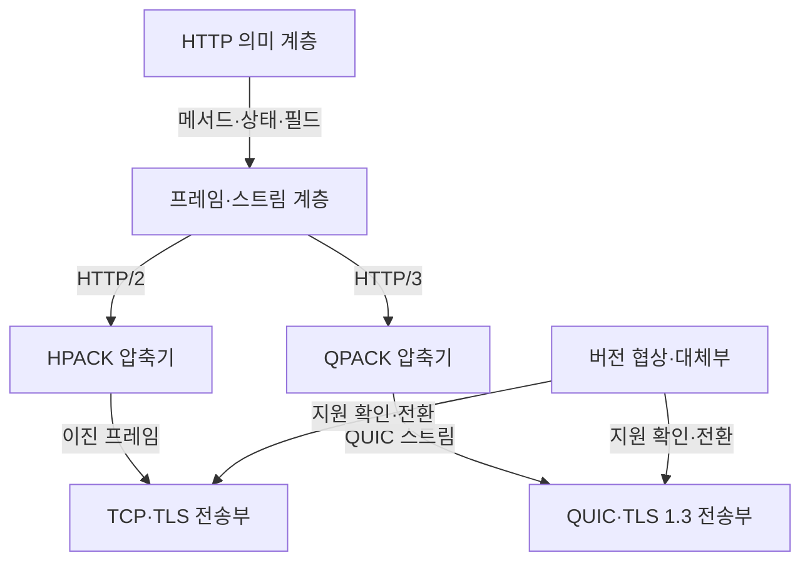
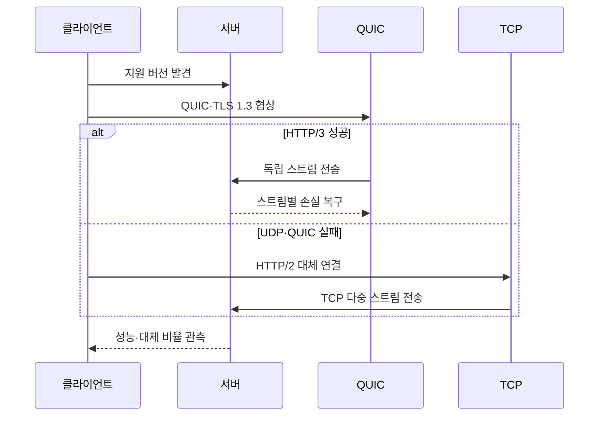

---
sidebar:
  order: 108
  label: "108. HTTP/2·HTTP/3 비교 (HTTP/2 HTTP/3 Comparison)"
  badge:
    text: "미출제 · 50%"
    variant: note
title: "HTTP/2·HTTP/3 비교 (HTTP/2 HTTP/3 Comparison)"
date: "2026-07-25T00:45:00+09:00"
tags: ["notes-network"]
weight: 108
extra:
  question_no: "108"
  source_status: "미출제"
  source_history: ""
  priority: 50
  priority_note: "비교형: HTTP/2·HTTP/3 선택 조건"
---

## 미리 알고가기

- **하이퍼텍스트 전송 프로토콜 버전 2(Hypertext Transfer Protocol Version 2, HTTP/2)**: ‘에이치티티피 투’로 읽고 프로토콜 약어와 버전 숫자를 빗금으로 이은 표기이며 하나의 TCP 연결에서 여러 HTTP 스트림을 이진 프레임으로 다중화한다.
- **하이퍼텍스트 전송 프로토콜 버전 3(Hypertext Transfer Protocol Version 3, HTTP/3)**: ‘에이치티티피 쓰리’로 읽고 프로토콜 약어와 버전 숫자를 빗금으로 이은 표기이며 QUIC의 독립 스트림에서 HTTP 프레임을 전달한다.
- **전송 제어 프로토콜(Transmission Control Protocol, TCP)**: ‘티시피’로 읽고 세 영문 단어의 머리글자를 딴 표기이며 HTTP/2 연결의 순서·손실 복구를 담당한다.
- **사용자 데이터그램 프로토콜(User Datagram Protocol, UDP)**: ‘유디피’로 읽고 세 영문 단어의 머리글자를 딴 표기이며 QUIC 패킷을 전달하는 비연결형 전송 프로토콜이다.
- **전송 계층 보안(Transport Layer Security, TLS)**: ‘티엘에스’로 읽고 세 영문 단어의 머리글자를 딴 표기이며 HTTP 연결의 서버 인증과 통신 암호화를 제공한다.
- **다중화(Multiplexing)**: 하나의 연결에서 여러 요청·응답 스트림의 프레임을 번갈아 동시에 전달하는 방식이다.
- **선두 차단(Head-of-Line Blocking)**: 앞선 자료의 손실·지연 때문에 뒤의 독립 자료도 처리를 기다리는 현상이다.
- **QUIC**: ‘퀵’으로 읽는 공식 프로토콜 이름으로 약어 확장을 만들지 않으며 UDP 위에 TLS 1.3·독립 스트림·손실 복구·연결 이동을 통합한다.
- **HPACK·QPACK**: 각각 ‘에이치팩·큐팩’으로 읽는 공식 압축 방식 이름으로 약어 확장을 만들지 않으며 반복되는 HTTP 헤더를 표와 참조값으로 바꿔 전송량을 줄인다.
- **연결 이동(Connection Migration)**: 인터넷 프로토콜 주소가 바뀌어도 연결 식별자로 QUIC 세션을 이어 가는 기능이다.
- **제로 왕복 시간(Zero Round-Trip Time, 0-RTT)**: ‘제로 알티티’로 읽고 숫자 0과 왕복 시간 약어를 붙임표로 이은 표기이며 이전 연결 정보로 왕복 협상 전에 응용 데이터를 보내지만 재전송 공격 위험이 있다.
- **대체 서비스(Alternative Service, Alt-Svc)**: 서버가 같은 자원을 제공하는 HTTP/3 주소와 포트를 클라이언트에 알리는 정보다.

## Ⅰ. 개요

- 정의/개념: HTTP/2는 TCP, HTTP/3는 QUIC 다중화
- **배경/필요성**: TCP 손실의 스트림 간 선두 차단 완화

### 쉽게 이해하기 (학습용)

- HTTP/2는 여러 요청이 한 TCP 복구를 함께 기다리지만 HTTP/3는 손실된 QUIC 스트림만 복구해 나머지를 진행시킨다.

## Ⅱ. 특징

- HTTP 의미는 같고 전송·손실 복구 단위가 다르다.
- HTTP/3는 스트림 손실 격리·연결 이동 지원한다.
- 안정된 저손실망에서는 성능 차이가 작을 수 있다.
- UDP 차단·0-RTT 재전송·관측 한계가 도입 제약이 된다.

### 쉽게 이해하기 (학습용)

- 이동과 손실이 잦으면 HTTP/3 이점이 커지지만 UDP가 막힌 환경에서는 HTTP/2로 안전하게 돌아갈 수 있어야 한다.

## Ⅲ. 아키텍처 및 구성요소

| 설계 요소 | 설명 |
|:---|:---|
| HTTP 의미 계층 | 메서드·상태·필드 의미를 유지 |
| 프레임·스트림 계층 | 요청·응답을 독립 스트림으로 표현 |
| HPACK 압축기 | HTTP/2 헤더 중복을 압축 |
| QPACK 압축기 | HTTP/3 독립 스트림용 헤더 압축 |
| TCP·TLS 전송부 | HTTP/2의 신뢰 전송·보안 제공 |
| QUIC·TLS 1.3 전송부 | HTTP/3의 스트림·복구·보안 제공 |
| 버전 협상·대체부 | HTTP/3 발견과 HTTP/2 전환 |

> 요약: HTTP 의미는 같고 전송·압축 계층이 다름

### 쉽게 이해하기 (학습용)

- 요청의 뜻은 같지만 HTTP/2는 TCP와 HPACK, HTTP/3는 QUIC과 QPACK을 사용해 스트림을 전달한다.

## Ⅳ. 원리 및 절차 흐름도

| 절차 | 설명 |
|:---|:---|
| 지원 버전 발견 | 협상·Alt-Svc로 HTTP/3 확인 |
| QUIC·TLS 1.3 협상 | UDP 연결·암호·연결 ID 생성 |
| 독립 스트림 전송 | 요청별 QUIC 스트림으로 전달 |
| 스트림별 손실 복구 | 손실 스트림만 재전송 대기 |
| HTTP/2 대체 연결 | QUIC 실패 시 TCP로 전환 |
| TCP 다중 스트림 전송 | 한 TCP 연결에 프레임 다중화 |
| 성능·대체 비율 관측 | 지연·손실·전환 원인을 확인 |

> 요약: HTTP/3 우선 협상 후 실패 시 HTTP/2 전환

### 쉽게 이해하기 (학습용)

- 먼저 QUIC으로 연결해 독립 스트림을 쓰고 UDP가 막히거나 실패하면 TCP 기반 HTTP/2로 자동 전환한다.

## Ⅴ. 종류 및 비교

| 판단 기준 | HTTP/2 | HTTP/3 |
|:---|:---|:---|
| 핵심 특징 | TCP 다중화·HPACK 헤더 압축 | QUIC 독립 스트림·QPACK 압축 |
| 적용 기준 | 저손실 고정망·기존 TCP 장비 활용 | 손실·이동이 잦고 UDP 사용 가능 |
| 주요 위험 | TCP 손실의 전체 스트림 지연 | UDP 차단·0-RTT 재전송·관측 제약 |

> 요약: 손실·이동성·UDP 통과로 버전 선택

### 쉽게 이해하기 (학습용)

- 안정된 고정망과 기존 장비 활용은 HTTP/2, 손실과 주소 변경이 잦은 이동망은 HTTP/3가 유리하다.

## Ⅵ. 실무 사례

1. 콘텐츠 전송망의 **HTTP/3 단계적 전환**

### 쉽게 이해하기 (학습용)

- 일부 지역과 사용자부터 HTTP/3를 적용해 지연·손실·HTTP/2 폴백 비율을 비교한 뒤 적용 범위를 확대한다.

## Ⅶ. 결론

- 손실·이동성·UDP 접근·대체율로 HTTP/3 결정

### 쉽게 이해하기 (학습용)

- HTTP/3 도입은 사용률보다 사용자 지연이 줄고 실패 때 HTTP/2로 돌아가며 보안 관측이 유지되는지로 판단해야 한다.
