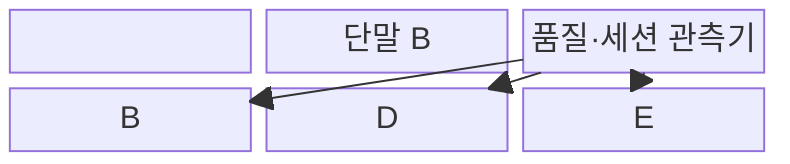
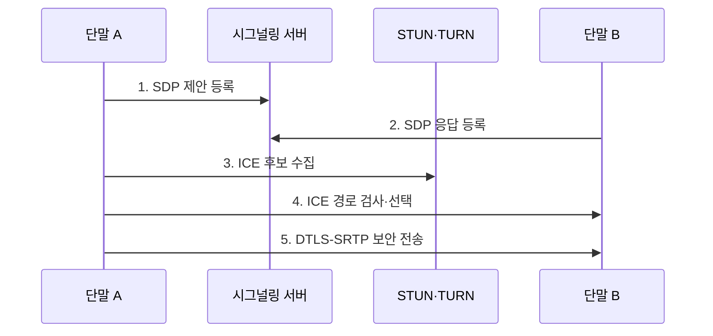

---
sidebar:
  order: 109
  label: "109. WebRTC (WebRTC)"
  badge:
    text: "기출 · 30%"
    variant: note
title: "WebRTC (WebRTC)"
date: "2026-07-31T11:07:52+09:00"
tags: ["notes-network"]
weight: 109
extra:
  question_no: "109"
  source_status: "기출"
  source_history: "122회"
  priority: 30
  priority_note: "설계형: 122회 비대면 WebRTC 구성"
---

## 미리 알고가기

- **웹 실시간 통신(Web Real-Time Communication, WebRTC)**: 브라우저가 음성·영상·자료를 실시간으로 암호화해 교환하는 기술이다.
- **네트워크 주소 변환(Network Address Translation, NAT)**: 내부 주소·포트를 외부 주소·포트로 바꿔 직접 경로 탐색이 필요하게 한다.
- **사용자 데이터그램 프로토콜(User Datagram Protocol, UDP)**: 지연에 민감한 WebRTC 미디어 패킷의 기본 전송을 담당한다.
- **데이터그램 전송 계층 보안(Datagram Transport Layer Security, DTLS)**: WebRTC 단말을 인증하고 SRTP용 키를 합의한다.
- **단말 간 직접 통신(Peer-to-Peer, P2P)**: 중앙 미디어 서버 없이 단말끼리 스트림을 교환한다.
- **세션 기술서 프로토콜(Session Description Protocol, SDP)**: 코덱·전송 방향·미디어 조건을 제안·응답으로 표현한다.
- **상호 연결 설정(Interactive Connectivity Establishment, ICE)**: 후보 주소 쌍의 연결성을 검사해 경로를 선택한다.
- **NAT 세션 통과 유틸리티(Session Traversal Utilities for NAT, STUN)**: NAT 밖에서 보이는 공인 주소·포트를 제공한다.
- **NAT 중계 통과(Traversal Using Relays around NAT, TURN)**: 직접 연결 실패 시 미디어·자료를 중계한다.
- **보안 실시간 전송 프로토콜(Secure Real-time Transport Protocol, SRTP)**: 미디어를 암호화하고 무결성을 검증한다.
- **선택 전달 장치(Selective Forwarding Unit, SFU)**: 미디어를 합성하지 않고 수신자별로 선택 전달한다.
- **다지점 제어 장치(Multipoint Control Unit, MCU)**: 미디어를 서버에서 디코딩·합성·재인코딩한다.
- **지터(Jitter)**: 미디어 패킷의 도착 간격이 일정하지 않게 변하는 정도다.
- **W3C WebRTC Recommendation**: 브라우저 실시간 통신의 객체와 응용 인터페이스를 규정한 웹 표준이다.
- **IETF RFC 8445**: STUN·TURN 후보의 연결성 검사와 선택 절차를 규정한 ICE 표준 문서다.

> **키워드:** WebRTC (WebRTC)

## Ⅰ. 개요

- 정의/개념: 브라우저 간 **실시간 음성·영상·자료**를 암호화해 교환하는 통신 기술
- 배경/필요성: 플러그인·NAT의 **배포·직접 경로 제약**

### 쉽게 이해하기 (학습용)

- 두 브라우저가 서로 통하는 직접 길을 찾고 막히면 중계 서버를 사용해 암호화된 통화를 시작한다.

## Ⅱ. 특징

- 응용 시그널링 기반 **SDP·ICE 교환**
- ICE·STUN·TURN 기반 **직접·중계 경로 선택**
- DTLS-SRTP 기반 **키 합의·미디어 암호화**

### 쉽게 이해하기 (학습용)

- 통화 조건을 알려 주는 길과 실제 영상이 흐르는 길이 다르며 영상 경로는 직접 연결을 먼저 찾는다.

## Ⅲ. 구조 및 구성요소

| 구성요소 | 책임 |
|:---|:---|
| 단말 A | **SDP 제안·미디어 송신** |
| 시그널링 서버 | **SDP·ICE 후보 전달** |
| 단말 B | **SDP 응답·미디어 수신** |
| STUN·TURN 서버 | **공인 주소 탐색·중계 제공** |
| SFU·MCU 서버 | **선택 전달·미디어 합성** |
| 품질·세션 관측기 | **손실·지터·중계 비율 수집** |

> 요약: 시그널링은 조건, ICE는 실제 경로 결정

### 쉽게 이해하기 (학습용)

- 시그널링 서버가 통화 조건과 후보를 교환하고 STUN·TURN이 연결을 도우며 선택된 경로에서 단말끼리 미디어를 보낸다.

## Ⅳ. 흐름도

**동작 원리**

- **1. SDP 제안 등록**: 단말 A의 코덱·전송 방향 조건 등록
- **2. SDP 응답 등록**: 단말 B의 수락 조건 등록
- **3. ICE 후보 수집**: 호스트·공인·중계 주소 확보
- **4. ICE 경로 검사·선택**: 후보 쌍 연결성 검사 후 왕복 경로 선택
- **5. DTLS-SRTP 보안 전송**: 상대 인증·키 합의 후 미디어 암호화
> 요약: SDP 협상·ICE 경로 선택 후 보안 전송

### 쉽게 이해하기 (학습용)

- 통화 형식을 합의하고 직접 주소와 중계 주소를 시험해 실제로 되는 길을 선택한 뒤 암호키를 만들고 미디어를 보낸다.

## Ⅴ. 종류 및 비교

| WebRTC 다자 구조 | P2P 메시 | SFU | MCU |
|:---|:---|:---|:---|
| 적용 기준 | **1:1·소수 참여자** | **일반 다자 회의** | **합성 화면·코덱 변환** |
| 핵심 특징 | **모든 스트림 직접 교환** | **수신자별 선택 전달** | **미디어 합성·코덱 변환** |
| 한계 | 참여자 증가 시 **대역폭 폭증** | **서버 송신량·경로** 집중 | 높은 **서버 연산·추가 지연** |

> 요약: 참여자 수·합성 필요·서버 자원으로 선택

### 쉽게 이해하기 (학습용)

- 소규모는 직접 연결, 일반 다자 회의는 SFU 전달, 합성 화면과 형식 변환이 필요하면 MCU를 사용한다.

## Ⅵ. 실무 고려사항 및 대책

| 고려사항 | 대책 | 효과 |
|:---|:---|:---|
| 기업망의 **직접 UDP 차단** | **RFC 8445 ICE·TURN 대체** | **연결 성공률** 확보 |
| 다자 통화의 **단말 대역폭** | **참여 규모별 SFU·MCU 선택** | **품질·서버비 균형** |
| 브라우저 **구현 간 차이** | **W3C WebRTC 상호운용 시험** | **단말 호환성** 확보 |

### 쉽게 이해하기 (학습용)

- 직접 경로와 TURN 대체 성공률을 측정하고 참여 규모에 맞는 미디어 서버 구조를 선택해야 한다.

## Ⅶ. 결론

- 소수 직접 연결은 **P2P**, 일반 다자는 **SFU**, 합성·변환은 MCU 선택

### 쉽게 이해하기 (학습용)

- WebRTC 품질은 영상이 보이는지뿐 아니라 직접·중계 경로 성공률과 다자 구조의 단말·서버 부담으로 판단해야 한다.
