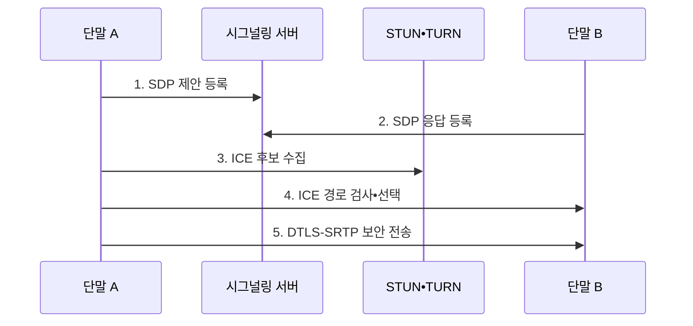

---
sidebar:
  order: 109
  label: "109. WebRTC (WebRTC)"
  badge:
    text: "기출 • 30%"
    variant: note
title: "WebRTC (WebRTC)"
date: "2026-08-05T08:45:00+09:00"
tags: ["notes-network"]
weight: 109
extra:
  question_no: "109"
  source_status: "기출"
  source_history: "122회"
  priority: 30
  priority_note: "설계형: 122회 비대면 WebRTC 구성"
---

## Ⅰ. 개요

<details>
<summary>핵심 용어</summary>

- **웹 실시간 통신(Web Real-Time Communication, WebRTC)**: 브라우저가 플러그인 없이 실시간 음성•영상•자료를 암호화해 직접 또는 중계 경로로 교환한다.
- **네트워크 주소 변환(Network Address Translation, NAT)**: 내부 주소를 외부 통신 주소로 변환하는 기능이다.

</details>

- 정의/개념: 브라우저 간 **실시간 음성•영상•자료**를 암호화해 교환하는 통신 기술
- 배경/필요성: 플러그인•NAT의 **배포•직접 경로 제약**

#### 한줄 요약

- 두 브라우저가 서로 통하는 직접 길을 찾고 막히면 중계 서버를 사용해 암호화된 통화를 시작한다.

## Ⅱ. 특징

<details>
<summary>핵심 용어</summary>

- **상호 연결 설정(Interactive Connectivity Establishment, ICE)**: 후보 쌍의 연결성을 검사해 실제 경로를 선택하는 절차
- **NAT 세션 탐색 유틸리티(Session Traversal Utilities for NAT, STUN)**: NAT 밖에서 보이는 공인 주소를 확인하는 프로토콜
- **NAT 릴레이 통과(Traversal Using Relays around NAT, TURN)**: 직접 연결 실패 시 중계 경로를 제공하는 프로토콜
- **세션 기술 프로토콜(Session Description Protocol, SDP)**: 코덱•주소•전송 방향을 기술하는 형식
- **데이터그램 전송 계층 보안(Datagram Transport Layer Security, DTLS)**: 데이터그램 구간에서 인증과 키 합의를 제공하는 보안 프로토콜
- **보안 실시간 전송 프로토콜(Secure Real-time Transport Protocol, SRTP)**: 실시간 미디어를 암호화•인증하는 프로토콜

</details>

- 응용 시그널링 기반 **SDP•ICE 교환**
- ICE•STUN•TURN 기반 **직접•중계 경로 선택**
- DTLS-SRTP 기반 **키 합의•미디어 암호화**

#### 한줄 요약

- 통화 조건을 알려 주는 길과 실제 영상이 흐르는 길이 다르며 영상 경로는 직접 연결을 먼저 찾는다.

## Ⅲ. 구조 및 구성요소

<details>
<summary>핵심 용어</summary>

- **단말 A**: SDP 제안과 미디어 송신을 수행하는 종단
- **시그널링 서버**: SDP와 ICE 후보를 상대 단말에 전달하는 서버
- **단말 B**: SDP 응답과 미디어 수신을 수행하는 종단
- **STUN•TURN 서버**: 공인 주소 탐색과 중계 경로를 제공하는 서버
- **SFU•MCU 서버**: 선택 전달이나 미디어 합성을 수행하는 서버
- **품질•세션 관측기**: 손실•지터•중계 비율을 수집하는 구성요소

</details>

```text
 [단말 A] -- [시그널링 서버] -- [단말 B]
      |                                |
      +------ [STUN•TURN 서버] --------+
      |                                |
      +------- [SFU•MCU 서버] ---------+
                  \      |      /
                [품질•세션 관측기]
```

선의 의미: 단말 A와 단말 B 사이에 시그널링, STUN•TURN, SFU•MCU라는 서로 다른 연결 경로가 놓이고, 품질•세션 관측기가 세 서버 영역을 공통 관측하는 정적 WebRTC 구조이다.

| 구성요소 | 책임 |
|:---|:---|
| 단말 A | **SDP 제안•미디어 송신** |
| 시그널링 서버 | **SDP•ICE 후보 전달** |
| 단말 B | **SDP 응답•미디어 수신** |
| STUN•TURN 서버 | **공인 주소 탐색•중계 제공** |
| SFU•MCU 서버 | **선택 전달•미디어 합성** |
| 품질•세션 관측기 | **손실•지터•중계 비율 수집** |

> 요약: 시그널링은 조건, ICE는 실제 경로 결정

#### 한줄 요약

- 시그널링 서버가 통화 조건과 후보를 교환하고 STUN•TURN이 연결을 도우며 선택된 경로에서 단말끼리 미디어를 보낸다.

## Ⅳ. 흐름도

<details>
<summary>핵심 용어</summary>

- **ICE 경로 검사•선택**: 호스트•공인•중계 후보 쌍을 검사해 최적 경로를 선택하는 절차

</details>



**동작 원리**

1. **SDP 제안 등록**: 단말 A의 코덱•전송 방향 조건 등록
2. **SDP 응답 등록**: 단말 B의 수락 조건 등록
3. **ICE 후보 수집**: 호스트•공인•중계 주소 확보
4. **ICE 경로 검사•선택**: 후보 쌍 연결성 검사 후 왕복 경로 선택
5. **DTLS-SRTP 보안 전송**: 상대 인증•키 합의 후 미디어 암호화
> 요약: SDP 협상•ICE 경로 선택 후 보안 전송

#### 한줄 요약

- 통화 형식을 합의하고 직접 주소와 중계 주소를 시험해 실제로 되는 길을 선택한 뒤 암호키를 만들고 미디어를 보낸다.

## Ⅴ. 종류 및 비교

<details>
<summary>핵심 용어</summary>

- **선택 전달 장치(Selective Forwarding Unit, SFU)**: 미디어를 합성하지 않고 수신자별로 선택 전달하는 서버
- **개인 간 통신(Peer-to-Peer, P2P)**: 중앙 미디어 서버 없이 참가자끼리 스트림을 교환하는 방식
- **다중점 제어 장치(Multipoint Control Unit, MCU)**: 미디어를 합성•변환해 참가자에게 전달하는 서버

</details>

| WebRTC 다자 구조 | P2P 메시 | SFU | MCU |
|:---|:---|:---|:---|
| 적용 기준 | **1:1•소수 참여자** | **일반 다자 회의** | **합성 화면•코덱 변환** |
| 핵심 특징 | **모든 스트림 직접 교환** | **수신자별 선택 전달** | **미디어 합성•코덱 변환** |
| 한계 | 참여자 증가 시 **대역폭 폭증** | **서버 송신량•경로** 집중 | 높은 **서버 연산•추가 지연** |

> 요약: 참여자 수•합성 필요•서버 자원으로 선택

#### 한줄 요약

- 소규모는 직접 연결, 일반 다자 회의는 SFU 전달, 합성 화면과 형식 변환이 필요하면 MCU를 사용한다.

## Ⅵ. 실무 고려사항 및 대책

<details>
<summary>핵심 용어</summary>

- **사용자 데이터그램 프로토콜(User Datagram Protocol, UDP)**: 비연결형 데이터그램을 전달하는 전송 프로토콜
- **직접 UDP 차단**: 방화벽이나 NAT 정책이 단말 간 미디어 경로를 막는 문제
- **의견 요청 문서(Request for Comments, RFC)**: 인터넷 기술 규격을 공개하는 문서 체계
- **월드 와이드 웹 컨소시엄(World Wide Web Consortium, W3C)**: 웹 기술 표준을 개발하는 국제 공동체

</details>

| 문제 | 대책 | 효과 |
|:---|:---|:---|
| 기업망의 **직접 UDP 차단** | **RFC 8445 ICE•TURN 대체** | **연결 성공률** 확보 |
| 다자 통화의 **단말 대역폭** | **참여 규모별 SFU•MCU 선택** | **품질•서버비 균형** |
| 브라우저 **구현 간 차이** | **W3C WebRTC 상호운용 시험** | **단말 호환성** 확보 |

#### 한줄 요약

- 직접 경로와 TURN 대체 성공률을 측정하고 참여 규모에 맞는 미디어 서버 구조를 선택해야 한다.

## Ⅶ. 결론

- 소수 직접 연결은 **P2P**, 일반 다자는 **SFU**, 합성•변환은 MCU 선택

#### 한줄 요약

- WebRTC 품질은 영상이 보이는지뿐 아니라 직접•중계 경로 성공률과 다자 구조의 단말•서버 부담으로 판단해야 한다.
